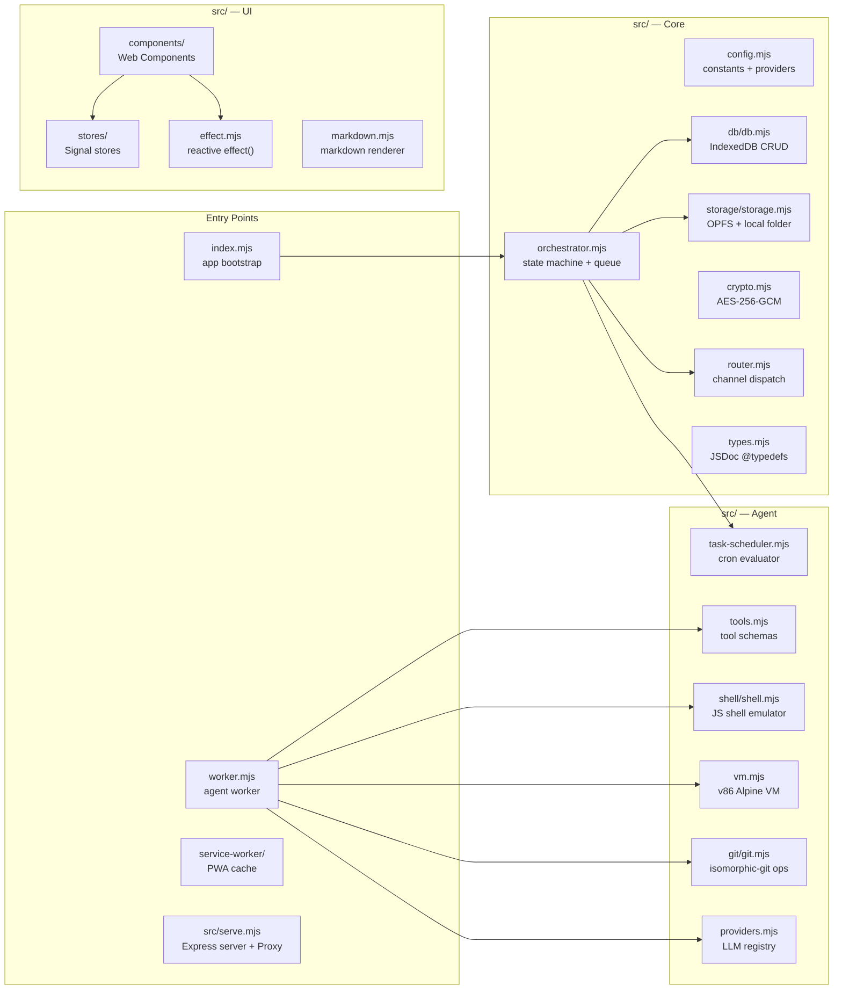

# AGENTS.md — ShadowClaw

> Guidance for AI coding agents (Antigravity, Claude, Codex, etc.) working in this repo.

## Project Snapshot

ShadowClaw is a browser-native AI assistant written in **vanilla ES modules** (`.mjs`).
There is **no build step** for the app itself — the browser runs the source files directly
via an importmap. TypeScript is used only for type-checking JSDoc annotations
(`tsc --noEmit`).

**Stack:** HTML + Vanilla JS (ESM) · Web Components · TC39 Signals · IndexedDB · OPFS ·
Web Workers · Service Worker (Workbox PWA) · Express dev server · Jest + Playwright tests

## Codebase Map



## Conventions

### File Naming

- All source files use `.mjs` (ES modules). No `.ts`, `.tsx`, or `.js`.
- Tests live **next to** their source file: `src/shell/shell.mjs` → `src/shell/shell.test.mjs`.
- End-to-end tests live in `e2e/` and use Playwright with fixtures + Page Objects.
- Components are in `src/components/shadow-claw*.mjs`.

### Types

Types are declared with **JSDoc `@typedef`** in `src/types.mjs` and imported with
`import './types.mjs'`. TypeScript checks JSDoc via `tsconfig.json` (`checkJs: true`).
Never introduce `.ts` files — keep everything in `.mjs`.

### Signals / Reactivity

UI state lives in `src/stores/`. Each store exports a reactive object backed by
[TC39 Signals](https://github.com/tc39/proposal-signals) via `signal-polyfill`.

```js
// Reading reactive state
import { orchestratorStore } from "./stores/orchestrator.mjs";
const messages = orchestratorStore.messages; // triggers effect tracking

// Reacting to state changes
import { effect } from "./effect.mjs";
effect(() => {
  console.log(orchestratorStore.state); // re-runs on every state change
});
```

### Web Components

UI is built with native Custom Elements. The main component is `<shadow-claw>` defined
in `src/components/shadow-claw.mjs`. Page components include `<shadow-claw-chat>`,
`<shadow-claw-files>`, and `<shadow-claw-tasks>`. Shared components include
`<shadow-claw-page-header>` (reusable mobile-first header), `<shadow-claw-file-viewer>`
(file viewer and editor with Highlight.js syntax highlighting), `<shadow-claw-pdf-viewer>`
(PDF preview), `<shadow-claw-terminal>` (interactive WebVM terminal), and `<shadow-claw-toast>`
(notification system). The file viewer and terminal components are driven by their respective
stores (`fileViewerStore`). The terminal component talks to the orchestrator's terminal bridge
methods — it does **not** access `vm.mjs` directly. Components use Shadow DOM and direct
`innerHTML` for rendering; reactive re-renders are driven by `effect()` callbacks in `setupEffects()`.

### Imports

External libraries are loaded via **importmap** in `index.html`. Never `npm install`
a frontend runtime library — add it to the importmap instead:

```html
"jszip": "https://cdn.jsdelivr.net/npm/jszip@3.10.1/+esm"
```

Node-only packages (Express, Jest, Workbox CLI) belong in `devDependencies`.

### Worker ↔ Main Thread Protocol

`worker.mjs` communicates via `postMessage`. Message shapes are typed in `src/types.mjs`:

| Direction     | Type                  | Payload                               |
| ------------- | --------------------- | ------------------------------------- |
| main → worker | `invoke`              | `InvokePayload`                       |
| main → worker | `compact`             | `CompactPayload`                      |
| main → worker | `cancel`              | `{ groupId }` (aborts in-flight task) |
| main → worker | `vm-terminal-open`    | `{}` (opens interactive terminal)     |
| main → worker | `vm-terminal-input`   | `{ data: string }` (stdin bytes)      |
| main → worker | `vm-terminal-close`   | `{}` (detaches terminal session)      |
| worker → main | `response`            | `ResponsePayload`                     |
| worker → main | `error`               | `ErrorPayload`                        |
| worker → main | `typing`              | `TypingPayload`                       |
| worker → main | `tool-activity`       | `ToolActivityPayload`                 |
| worker → main | `thinking-log`        | `ThinkingLogEntry`                    |
| worker → main | `compact-done`        | `CompactDonePayload`                  |
| worker → main | `open-file`           | `OpenFilePayload`                     |
| worker → main | `vm-status`           | `VMStatus`                            |
| worker → main | `vm-terminal-opened`  | `{}`                                  |
| worker → main | `vm-terminal-output`  | `{ data: string }` (stdout bytes)     |
| worker → main | `vm-terminal-closed`  | `{}`                                  |
| worker → main | `vm-terminal-error`   | `{ message: string }`                 |

### IndexedDB

All DB access goes through `src/db/db.mjs`. Never call `indexedDB` directly elsewhere.
Call `openDatabase()` once at startup (done in `index.mjs`).

### Storage

All file I/O goes through `src/storage/`. The group workspace root is:
`shadowclaw/<groupId>/workspace/`. `MEMORY.md` lives at the workspace root and is loaded
as system context on every agent invocation.

### WebVM Assets

`src/vm.mjs` expects v86 files under `/assets/v86/` (for example
`/assets/v86/libv86.mjs`, `/assets/v86/v86.wasm`, and firmware/rootfs files).
`worker.mjs` eagerly boots the VM on startup using the persisted `CONFIG_KEYS.VM_BOOT_MODE`
preference. The VM is **worker-owned** — the only non-test runtime imports of `vm.mjs` are
`src/worker/handleMessage.mjs` and `src/worker/executeTool.mjs`. The UI terminal component
(`<shadow-claw-terminal>`) talks to the orchestrator's terminal bridge, never directly to `vm.mjs`.

### WebVM Exclusivity Guard

`vm.mjs` serializes access between interactive terminal sessions and `bash` tool execution via
an `activeUsage` lock (`'command' | 'terminal' | null`). If the terminal owns the VM, `bash`
tool calls receive a clear busy error rather than corrupting the serial stream. Mode changes
explicitly close any active terminal session and notify the UI before rebooting.

### Request Cancellation

Cancellation is handled via `AbortController`. When the main thread sends a `cancel` message
(or a new `invoke`/`compact` for the same `groupId`), the worker:

1.  Calls `controller.abort()` on the in-flight task's controller.
2.  The `fetch()` call to the LLM provider (which received the `signal`) throws an `AbortError`.
3.  The worker catches this, cleans up its state, and becomes ready for the next task.
4.  The orchestrator tracks these tasks via `orchestratorStore.stopCurrentRequest()`.

### Config Keys

All config keys are constants in `src/config.mjs` under `CONFIG_KEYS`. Use those
constants — never hard-code string keys:

```js
import { CONFIG_KEYS } from "./config.mjs";
await getConfig(CONFIG_KEYS.API_KEY);
```

## Running & Testing

```bash
npm start             # Express server (port 8888 by default)
npm test              # Jest — runs *.test.mjs files
npm run e2e           # Playwright E2E suite (tests in e2e/)
npm run e2e:install   # Install Playwright browsers
npm run tsc           # Type-check only (no output files)
npm run build         # tsc + Workbox service worker generation
npm run format        # Prettier
```

Tests use `jest-environment-jsdom`. Mock `indexedDB`, `navigator.storage`, and
`FileSystemDirectoryHandle` as needed (see existing test files for patterns).

Playwright E2E tests use `playwright.config.mjs` with a managed `npm start` web server
and write artifacts under `e2e-results/`.

## Common Tasks

### Add a new LLM provider

Edit `src/config.mjs` — add an entry to `PROVIDERS`. The provider needs:
`id`, `name`, `baseUrl`, `format` (`"openai"` or `"anthropic"`), `apiKeyHeader`,
optional `apiKeyHeaderFormat`, `headers`, and `defaultModel`.

### Add a new tool

1. Add the tool schema to `TOOL_DEFINITIONS` in `src/tools.mjs`.
2. Add the execution branch in `executeTool()` in `src/worker/executeTool.mjs`.
3. Add the tool to the tool table in `README.md`.

### Add a new git operation

1. Add the function to `src/git/git.mjs` (uses `_git` global + LightningFS).
2. Add a tool schema in `src/tools.mjs` (prefix: `git_`).
3. Add execution branch in `src/worker/executeTool.mjs` (lazy `import()`).
4. Git credentials: stored encrypted via `CONFIG_KEYS.GIT_TOKEN` (same crypto vault as API keys).
5. Repos live in LightningFS under `/git/<repo-name>/` but are **automatically synced** to the OPFS workspace under `repos/<repo-name>/` during tools like `git_clone` and `git_checkout`.
6. Use the `git_sync` tool to manually push/pull files between the LightningFS git database and the OPFS workspace (useful if you bypass standard automatic syncs).
   - `.git` directories are skipped by default, but can be synced using the `include_git` parameter.

### Add a new page / UI section

1. Create `src/components/shadow-claw-<name>.mjs` as a Custom Element.
2. Import it in `src/components/shadow-claw.mjs`.
3. Add a nav item and `data-page-id` section in the main component template.
4. Consider using `<shadow-claw-page-header>` for consistent mobile-first headers.

### Modify the system prompt

The system prompt is built in `Orchestrator.invokeAgent()` in `src/orchestrator.mjs`.
It concatenates the base prompt with `MEMORY.md` content.

## What to Avoid

- **Do not** add a frontend framework (React, Vue, Svelte, etc.).
- **Do not** add `.ts` source files — use JSDoc in `.mjs`.
- **Do not** add runtime npm dependencies for frontend code — use importmap CDN URLs.
- **Do not** call `indexedDB` or `navigator.storage.getDirectory()` directly — use `src/db/db.mjs` and `src/storage/storage.mjs`.
- **Do not** `postMessage` to the worker with ad-hoc shapes — use the typed protocol above.
- **Do not** store API keys in plaintext — always go through `src/crypto.mjs`.
