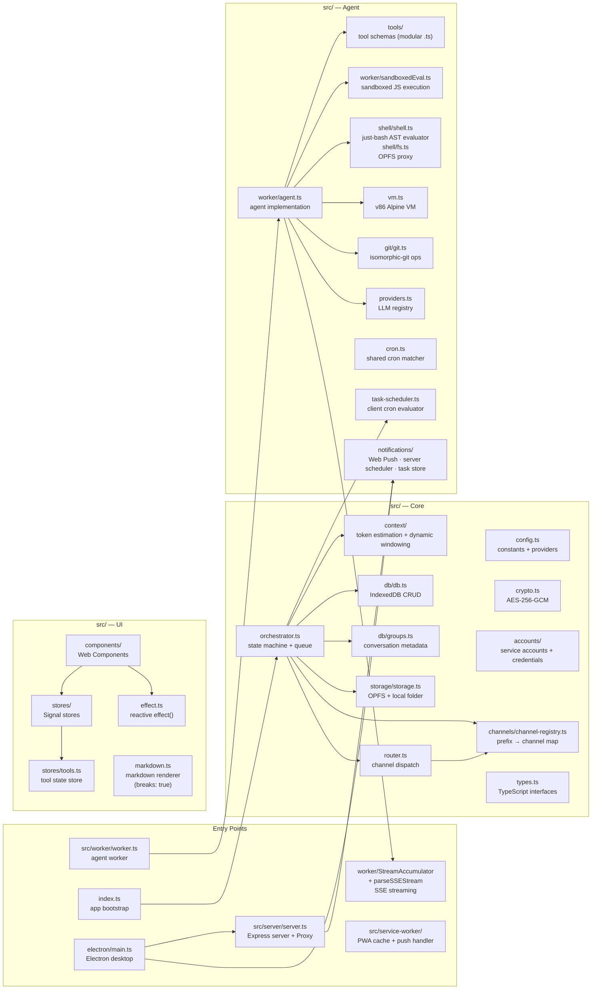

# AGENTS.md — ShadowClaw

> Guidance for AI coding agents (Antigravity, Claude, Codex, etc.) working in this repo.
> **Documentation:** For detailed architecture docs, subsystem deep-dives, step-by-step
> guides, and architecture decision records, see [`docs/`](docs/README.md).

## Project Snapshot

ShadowClaw is a browser-native AI assistant written in **TypeScript** (`.ts`).
The project uses a **Rollup build pipeline** to bundle the application.

**Stack:** HTML + TypeScript / ESM · Web Components · TC39 Signals · IndexedDB · OPFS ·
Web Workers · Service Worker (Workbox PWA · Web Push) · Express dev server · Electron desktop ·
AWS Bedrock · Jest + Playwright tests

## Codebase Map



## Conventions

### Test Driven Development

Tests are the source of truth for expected behavior. Before implementing a new feature or fixing a bug, first write a failing test that captures the desired behavior. Then implement the feature or fix the bug until the test passes. This ensures that all code is covered by tests and that features work as intended.

### File Naming

- Source files use `.ts` (TypeScript).
- Tests live **next to** their source file: `src/orchestrator.ts` → `src/orchestrator.test.ts`.
- End-to-end tests live in `e2e/` and use Playwright with fixtures + Page Objects. Extensions are `.ts`.
- Components are in `src/components/shadow-claw-*/shadow-claw-*.ts` (each in its own subdirectory with co-located `.html` and `.css` files).

### Types

Types are declared in `src/types.ts` as explicit TypeScript interfaces and types.
The codebase uses a fully-typed TypeScript architecture.

### Signals / Reactivity

UI state lives in `src/stores/`. Each store exports a reactive object backed by
[TC39 Signals](https://github.com/tc39/proposal-signals) via `signal-polyfill`.

```ts
// Reading reactive state
import { orchestratorStore } from "./stores/orchestrator.js";
const messages = orchestratorStore.messages; // triggers effect tracking

// Reacting to state changes
import { effect } from "./effect.js";
effect(() => {
  console.log(orchestratorStore.state); // re-runs on every state change
});
```

### Web Components

UI is built with native Custom Elements. The main component is `<shadow-claw>` defined
in `src/components/shadow-claw/shadow-claw.ts`. Page components include `<shadow-claw-chat>`,
`<shadow-claw-files>`, `<shadow-claw-tasks>`, and `<shadow-claw-conversations>`
(sidebar conversation list with create/rename/delete/switch/clone/reorder). Shared components include
`<shadow-claw-page-header>` (reusable mobile-first header), `<shadow-claw-file-viewer>`
(file viewer and editor with Highlight.js syntax highlighting), `<shadow-claw-pdf-viewer>`
(PDF preview), `<shadow-claw-terminal>` (interactive WebVM terminal), and `<shadow-claw-toast>`
(notification system), and `<shadow-claw-settings-notifications>` (push notification
management). The file viewer and terminal components are driven by their respective
stores (`fileViewerStore`). The terminal component talks to the orchestrator's terminal bridge
methods — it does **not** access `vm.ts` directly. Components use Shadow DOM and direct
`innerHTML` for rendering; reactive re-renders are driven by `effect()` callbacks in `setupEffects()`.

The file viewer supports MIME-aware previews for PDFs and common image/audio/video formats,
defaults preview mode for previewable types, and revokes object URLs when previews are replaced
or closed. The editor uses `highlighted-code` (a `<textarea>` with a syntax-highlighting
overlay); an explicit `caret-color !important` overrides the library's inline style
so the text cursor remains visible over the overlay in both light and dark mode.

The chat component (`<shadow-claw-chat>`) uses **smart auto-scroll**: it tracks
whether the user is near the bottom of the message container and only auto-scrolls
when they are. When the user scrolls up to read earlier messages, DOM rebuilds
restore the scroll position relative to the bottom so the viewport stays put.
Sending a new message resets auto-scroll so the user sees their own message and
the response. A `ResizeObserver` on the messages container re-scrolls to the
bottom when sibling elements (activity log, context-usage bar, token-usage)
appear or resize and shrink the container — without this, the last message
would slide below the viewport.

The **markdown renderer** (`src/markdown.ts`) is configured with `breaks: true`,
so single newlines in LLM responses render as `<br>` tags. Double newlines produce
separate `<p>` paragraphs as usual.

### Imports

External libraries are locally bundled using **Rollup** and `npm install`. Node-only packages (Express, Jest, Workbox CLI, Electron) belong in `devDependencies`.

### Worker ↔ Main Thread Protocol

`src/worker/worker.ts` communicates via `postMessage`. Message shapes are typed in `src/types.ts`:

| Direction     | Type                    | Payload                                                                                          |
| ------------- | ----------------------- | ------------------------------------------------------------------------------------------------ |
| main → worker | invoke                  | InvokePayload                                                                                    |
| main → worker | compact                 | CompactPayload                                                                                   |
| main → worker | cancel                  | { groupId } (aborts in-flight task)                                                              |
| main → worker | set-storage             | { storageHandle }                                                                                |
| main → worker | set-vm-mode             | { mode?, bootHost?, networkRelayUrl? }                                                           |
| main → worker | vm-terminal-open        | { groupId?: string } (opens terminal for group workspace)                                        |
| main → worker | vm-terminal-input       | { data: string } (stdin bytes)                                                                   |
| main → worker | vm-terminal-close       | { groupId?: string } (detaches terminal session)                                                 |
| main → worker | vm-workspace-sync       | { groupId?: string } (request 9p workspace sync)                                                 |
| main → worker | vm-workspace-flush      | { groupId?: string } (request immediate 9p VM → host flush)                                      |
| worker → main | response                | ResponsePayload                                                                                  |
| worker → main | intermediate-response   | { groupId, text } (text emitted before tool calls)                                               |
| worker → main | streaming-start         | { groupId } (SSE stream beginning)                                                               |
| worker → main | streaming-chunk         | { groupId, text } (incremental text)                                                             |
| worker → main | streaming-end           | { groupId } (stream paused for tool calls)                                                       |
| worker → main | streaming-done          | { groupId, text } (final streamed text)                                                          |
| worker → main | streaming-error         | { groupId, error } (stream failed)                                                               |
| worker → main | error                   | ErrorPayload                                                                                     |
| worker → main | typing                  | { groupId, typing } (scoped to conversation)                                                     |
| worker → main | tool-activity           | { groupId, tool, status } (scoped to conversation)                                               |
| worker → main | model-download-progress | ModelDownloadProgressPayload                                                                     |
| worker → main | thinking-log            | ThinkingLogEntry                                                                                 |
| worker → main | compact-done            | CompactDonePayload                                                                               |
| worker → main | open-file               | OpenFilePayload                                                                                  |
| worker → main | vm-status               | VMStatus                                                                                         |
| worker → main | vm-terminal-opened      | { ok: true }                                                                                     |
| worker → main | vm-terminal-output      | { chunk: string } (stdout bytes)                                                                 |
| worker → main | vm-terminal-closed      | { ok: true }                                                                                     |
| worker → main | vm-terminal-error       | { error: string }                                                                                |
| worker → main | vm-workspace-synced     | { groupId: string }                                                                              |
| worker → main | show-toast              | { message: string, type?: 'info' \\\| 'success' \\\| 'warning' \\\| 'error', duration?: number } |
| worker → main | send-notification       | { title: string, body: string, groupId: string } (OS-level Web Push via broadcast)               |
| main → main   | context-usage           | ContextUsage (token budget stats emitted by orchestrator)                                        |

When `prompt_api` provider is active, orchestration can emit `model-download-progress`
from the main-thread Prompt API path (not only from worker runtime). Keep payload shape
aligned with `ModelDownloadProgressPayload` in `src/types.ts`.

### IndexedDB

All DB access goes through `src/db/db.ts`. Never call `indexedDB` directly elsewhere.
Call `openDatabase()` once at startup (done in `index.ts`).

### Storage

All file I/O goes through `src/storage/`. The group workspace root is:
`shadowclaw/<groupId>/workspace/`. `MEMORY.md` lives at the workspace root and is loaded
as system context on every agent invocation.

Cross-browser writes must go through `src/storage/writeFileHandle.ts`:

- Use `writeFileHandle()` for normal writes (`createWritable` or `createSyncAccessHandle`).
- Use `writeOpfsPathViaWorker()` when OPFS writes need worker-side sync handles (for example Safari main-thread limitations).
- Do not add ad-hoc direct `createWritable()` calls in feature code paths.

### WebVM Assets

`src/vm.ts` resolves assets from `/assets/v86.ext2/` and `/assets/v86.9pfs/` by default,
with optional host override from `CONFIG_KEYS.VM_BOOT_HOST`.
When unset, the worker seeds VM boot host from `DEFAULT_VM_BOOT_HOST` `http://localhost:8888`.
`src/worker/worker.ts` eagerly boots the VM on startup using persisted preferences (`CONFIG_KEYS.VM_BOOT_MODE`,
`CONFIG_KEYS.VM_NETWORK_RELAY_URL`, and `CONFIG_KEYS.VM_BOOT_HOST`).
The VM is **worker-owned** — the only non-test runtime imports of `vm.ts` are
`src/worker/handleMessage.ts` and `src/worker/executeTool.ts`. The UI terminal component
(`<shadow-claw-terminal>`) talks to the orchestrator's terminal bridge, never directly to `vm.ts`.

### WebVM Exclusivity Guard

`vm.ts` coordinates access between interactive terminal sessions and `bash` tool execution via
an `activeUsage` lock (`'command' | 'terminal' | null`). When a command runs during an active
terminal session, terminal output is temporarily suspended, command execution completes, and
terminal streaming resumes. Mode changes still close active terminal sessions and notify the UI
before rebooting.

### Request Cancellation

Cancellation is handled via `AbortController`. When the main thread sends a `cancel` message
(or a new `invoke`/`compact` for the same `groupId`), the worker:

1. Calls `controller.abort()` on the in-flight task's controller.
2. The `fetch()` call to the LLM provider (which received the `signal`) throws an `AbortError`.
3. The worker catches this, cleans up its state, and becomes ready for the next task.
4. The orchestrator tracks these tasks via `orchestratorStore.stopCurrentRequest()`.

Prompt API invocation/compaction uses per-group `AbortController` instances in
`Orchestrator.promptControllers`; cancellation must abort and clear controller state.

### Prompt API Provider

`PROVIDERS.prompt_api` is a keyless provider backed by browser Prompt API (`LanguageModel`).

- It uses provider `format: "prompt_api"`.
- `requiresApiKey: false` controls config gating and settings UX.
- Invocation and compaction are routed through `src/prompt-api-provider.ts`.
- Chat model download progress is surfaced to UI through `model-download-progress` events.
- Tool calls use a JSON envelope (`{"type":"tool_use","tool_calls":[...]}`) parsed
  by `parseStructured()`. When `responseConstraint` (JSON schema) is passed to
  `promptStreaming()`, Gemini Nano may stall and produce incomplete JSON. In that
  case the provider automatically retries **without** the constraint so the model
  can freely generate the tool-call JSON from prompt instructions alone.

When adding or changing providers in `src/config.ts`, include `requiresApiKey`
explicitly so settings/orchestrator behavior stays consistent.

### WebMCP Tool Registration

`src/webmcp.ts` bridges `TOOL_DEFINITIONS` into browser WebMCP (`navigator.modelContext`).

- Use `isWebMcpSupported()` for feature detection.
- Use `registerWebMcpTools()` during orchestrator init.
- Use `unregisterWebMcpTools()` during shutdown.
- Registered tools include explicit annotations:
  - `readOnlyHint: false`
  - `untrustedContentHint: true` for tool output that may contain user-supplied or external content.
- Registration uses `AbortController` signals with `registerTool(...)`; shutdown aborts those signals and also calls legacy `unregisterTool` when present.
- Route side-effect worker messages via `setPostHandler()` when executing tools
  outside worker context.
- **Testing:** In Google Chrome, use the [Model Context Tool Inspector](https://chromewebstore.google.com/detail/model-context-tool-inspec/gbpdfapgefenggkahomfgkhfehlcenpd) extension to test WebMCP integration.

### Streaming Responses

LLM responses can be streamed token-by-token via SSE when the provider supports it.
Streaming is controlled by three gates that must all be true:

1. **Global toggle** — `CONFIG_KEYS.STREAMING_ENABLED` (persisted in IndexedDB, default `true`).
2. **Provider opt-in** — `supportsStreaming: true` in the provider config (`src/config.ts`).
3. **Format check** — provider format must be `"openai"` or `"anthropic"` (not `"prompt_api"`).

When streaming is active the worker sends `streaming-start`, throttled
`streaming-chunk` messages (50 ms interval), and either `streaming-done`
(final text) or `streaming-end` (tool calls follow). The orchestrator store
accumulates chunks into `orchestratorStore.streamingText`, and the chat
component renders a live-updating amber bubble with a blinking cursor.
The streaming bubble is only shown when `streamingText` is a non-empty
string — an empty string (set by `streaming-start`) does not render a
bubble, preventing a brief flash when tool-only responses arrive.

All streaming events carry a `groupId`. The store only processes events
whose `groupId` matches the active conversation — chunks arriving for a
background conversation are silently dropped. Switching conversations clears
the streaming bubble; the response continues in the background and is
persisted to IndexedDB, so it appears when the user switches back.

When the LLM returns text alongside tool calls (e.g. "Let me check that
for you."), an `intermediate-response` message is posted **before**
`streaming-end`. The orchestrator persists this text to IndexedDB and
emits it as a permanent chat bubble so it is not lost when the streaming
bubble is cleared for tool execution.

**Key files:**

| File                                                  | Role                                                                                |
| ----------------------------------------------------- | ----------------------------------------------------------------------------------- |
| `src/worker/agent.ts`                                 | Core agent logic — manages tool loop, history, and streaming updates                |
| `src/worker/StreamAccumulator.ts`                     | Accumulates OpenAI / Anthropic SSE chunks into a unified response                   |
| `src/worker/parseSSEStream.ts`                        | Async generator that yields parsed JSON from an SSE `ReadableStream`                |
| `src/worker/handleInvoke.ts`                          | `callWithStreaming()` — sends `stream: true`, wires callbacks, throttles UI updates |
| `src/stores/orchestrator.ts`                          | Listens for streaming events, manages `_streamingText` signal                       |
| `src/components/shadow-claw-chat/shadow-claw-chat.ts` | Renders streaming bubble via `effect()` on `streamingText`                          |
| `src/server/proxy.ts`                                 | Server-side SSE pass-through for Bedrock and Copilot Azure                          |

**Important:** The Express dev server uses `compression()` middleware.
SSE responses (`Content-Type: text/event-stream`) are excluded from
compression so that chunks flush to the browser in real time. If you add
new proxy routes that stream SSE, verify they are not buffered by
compression — see the filter in `src/server/server.ts`.

### Channel Registry

`src/channels/channel-registry.ts` provides a generic `ChannelRegistry` that maps
groupId prefixes to `Channel` implementations. The router delegates all channel
lookup to the registry — it has no knowledge of specific channels.

```js
import { ChannelRegistry } from "./channels/channel-registry.js";
const registry = new ChannelRegistry();
registry.register("br:", browserChat, "Browser");
// Any Channel implementation can be registered with a unique prefix:
// registry.register("ext:", externalChannel, "External");
```

To add a new channel:

1. Create `src/channels/<name>.ts` implementing the `Channel` type.
2. Register it in `orchestrator.ts` with a unique prefix.
3. The router, conversation badges, and group creation automatically support it.

### Multi-Conversation Support

Conversation (group) metadata is stored in IndexedDB via `src/db/groups.ts`.
Each conversation has a `groupId` (prefixed by channel type), a `name`, and
a `createdAt` timestamp. The `OrchestratorStore` exposes CRUD operations:
`loadGroups`, `createConversation`, `renameConversation`, `deleteConversation`,
`switchConversation` (which persists the selection via `LAST_ACTIVE_GROUP`),
`cloneConversation` (duplicates metadata + messages + tasks + `MEMORY.md`), and
`reorderConversations` (persists a custom sort order).

On first launch (empty DB), `listGroups()` creates and **persists** a default
"Main" conversation (`DEFAULT_GROUP_ID`). This ensures the default group
survives subsequent DB reads and is not lost when new conversations are created.
`listGroups()` returns groups in their **persisted array order** — it does not
re-sort by `createdAt`. This means custom reorder from drag-and-drop survives
reloads and `loadGroups()` calls.

**Conversation isolation:** All per-conversation UI state in the store —
`streamingText`, `isTyping`, `toolActivity`, `activityLog`, and `messages` — is
scoped to the active `groupId`. Event handlers (including `thinking-log` and
`context-compacted`) compare each event's `groupId` against `_activeGroupId`
and discard mismatches. `setActiveGroup()` resets all transient state when
switching conversations, so background work never bleeds into the current view.
`loadHistory()` also guards against stale async results: if the active group
changes while the IndexedDB query is in-flight, the returned messages are
discarded instead of overwriting the new conversation's view.

**Unread indicators:** When a message arrives for a non-active conversation,
the store adds the `groupId` to `_unreadGroupIds` (a `Signal.State<Set<string>>`).
The conversations sidebar applies an `unread` CSS class that triggers a pulsing
highlight animation. Switching to a conversation clears its unread flag.

The `<shadow-claw-conversations>` component renders the sidebar conversation
list and wires user actions to the store. It supports **accessible drag-and-drop
reordering** (mouse, keyboard, and touch) with ARIA live-region announcements,
a **clone** button to duplicate conversations, and a **resizable list** with a
drag handle at the bottom — the list fills all available sidebar space by default,
and the user can drag the handle to resize. Double-clicking the handle resets
to auto-fill. The resize preference is persisted via `CONFIG_KEYS.CONVERSATIONS_HEIGHT`
in IndexedDB. The list is scrollable via `overflow-y: auto`.

### Config Keys

All config keys are constants in `src/config.ts` under `CONFIG_KEYS`. Use those
constants — never hard-code string keys:

```js
import { CONFIG_KEYS } from "./config.js";
await getConfig(CONFIG_KEYS.API_KEY);
```

Build metadata also writes the deployed Git revision into `<meta name="revision">` in
`index.html`; Settings reads this value at runtime.

### Agent Iteration Limit

The agent tool-use loop in `src/worker/handleInvoke.ts` caps iterations at
`DEFAULT_MAX_ITERATIONS` (50). Users can override this via **Settings → Max Iterations**
(stored under `CONFIG_KEYS.MAX_ITERATIONS`). The orchestrator loads the persisted
value at init and passes it to the worker in every `invoke` payload. Valid range: 1–200.

### Dynamic Context Management

Instead of a fixed message window, the orchestrator uses **token-budget-aware
dynamic context windowing**. Three modules in `src/context/` handle this:

| File                                 | Role                                                                                  |
| ------------------------------------ | ------------------------------------------------------------------------------------- |
| `src/context/estimateTokens.ts`      | Lightweight token estimation (~4 chars/token heuristic)                               |
| `src/context/truncateToolOutput.ts`  | Smart truncation of large tool outputs at line boundaries (default 25 K chars)        |
| `src/context/buildDynamicContext.ts` | Walks messages newest-to-oldest within a token budget, returns `DynamicContextResult` |

**How it works:**

1. The orchestrator builds the system prompt first and estimates its token cost.
2. It fetches the last 200 messages and calls `buildDynamicContext()` with:
   `availableBudget = contextLimit − systemPromptTokens − maxOutputTokens`.
3. Messages are walked from newest to oldest; large tool outputs are truncated.
4. The result includes `estimatedTokens`, `contextLimit`, `usagePercent`, and `truncatedCount`.
5. A `context-usage` event is emitted so the UI can render a live progress bar.
6. If `usagePercent > 80 %` and messages were truncated, auto-compaction triggers.

The `ContextUsage` interface is defined in `src/types.ts`. The orchestrator store
exposes it via `orchestratorStore.contextUsage`, and the chat component renders a
color-coded progress bar (green → amber → red).

### Tool Profiles

Tool profiles allow per-provider/model tool customization and system prompt overrides.
Managed via `CONFIG_KEYS.TOOL_PROFILES` and `CONFIG_KEYS.ACTIVE_TOOL_PROFILE`.
The `ToolProfile` interface is in `src/types.ts`; each profile specifies
`enabledToolNames`, optional `customTools`, and an optional `systemPromptOverride`.

When a user manually toggles individual tools (via `setToolEnabled` or
`setAllEnabled`), the active profile is automatically deactivated so the
manual selection takes effect without restriction. The user can re-activate
a profile from the dropdown or save their current selection as a new profile.

The orchestrator passes `toolsStore.enabledTools` directly to the provider —
there is no additional tool filtering. The Nano built-in profile already
constrains its tool set to a small-model-safe subset; manual selections
are trusted as-is.

### Electron Desktop App

ShadowClaw ships as an **Electron** desktop application. The Electron entry point
is `electron/main.ts`; it spins up the same Express server + proxy routes in-process
and loads the app in a `BrowserWindow`.

- `electron/main.ts` — Main process: Express server, window management, power-save blocker.
- `electron/preload.cjs` — Sandboxed preload.
- `package.json` `"main"` points to `electron/main.ts`.
- Build with `electron-builder`: `npm run electron:build` (Windows / macOS).
- Output goes to `dist-electron/` (git-ignored).

Do **not** import Electron modules from browser-side code. The Electron app
loads the same compiled TypeScript bundle served over `http://127.0.0.1:<port>`.

### AWS Bedrock Proxy

`src/server/proxy.ts` provides server-side Bedrock endpoints (`/bedrock-proxy/models`
and `/bedrock-proxy/invoke`) that use AWS SSO credentials to call Bedrock.
The `bedrock_proxy` provider in `src/config.ts` is keyless (`requiresApiKey: false`)
and routes through the local proxy. Environment variables:

- `BEDROCK_REGION` — AWS region
- `BEDROCK_PROFILE` — SSO profile

Model IDs are auto-mapped to cross-region inference profile IDs.

## Running & Testing

```bash
npm start             # Express server (port 8888 by default)
npm test              # Jest — runs *.test.ts files
npm run e2e           # Playwright E2E suite (tests in e2e/)
npm run e2e:install   # Install Playwright browsers
npm run tsc           # Type-check only
npm run build         # Bundle application via Rollup + generate service worker
npm run format        # Prettier
npm run electron      # Launch Electron desktop app
npm run electron:build      # Build Electron distributable
npm run electron:build:win  # Build Electron for Windows
npm run electron:build:mac  # Build Electron for macOS
```

Tests use `jest-environment-jsdom`. Mock `indexedDB`, `navigator.storage`, and
`FileSystemDirectoryHandle` as needed (see existing test files for patterns).

Playwright E2E tests use `playwright.config.ts` with a managed `npm start` web server
and write artifacts under `e2e-results/`. Worker parallelism is configured per
environment (CI: 2, local: 4). E2E coverage includes conversation CRUD,
settings persistence, streaming chat (mock SSE provider), and task CRUD.

## Common Tasks

### Add a new LLM provider

Edit `src/config.ts` — add an entry to `PROVIDERS`. The provider needs:
`id`, `name`, `baseUrl`, `format` (`"openai"` or `"anthropic"` or `"prompt_api"`),
`apiKeyHeader`, optional `apiKeyHeaderFormat`, `headers`, `defaultModel`,
`requiresApiKey`, `supportsStreaming` (boolean), and optional `models` or `modelsUrl`.

If the provider needs a server-side proxy (like Bedrock or Copilot Azure),
add the proxy route in `src/server/proxy.ts` → `registerProxyRoutes()` and point
the provider's `baseUrl` to the local proxy URL.

### Add a new tool

1. Create a new file in `src/tools/` (or add to an existing group file like `git.ts`, `tasks.ts`).
2. Export the tool schema as a named constant with a `ToolDefinition` type from `src/tools/types.ts`.
3. Import and add it to the `TOOL_DEFINITIONS` array in `src/tools/index.ts`.
4. Add the execution branch in `executeTool()` in `src/worker/executeTool.ts`.
5. Add the tool to the tool table in `README.md`.
6. Update `AGENTS.md` if the tool changes workflow guidance (e.g. conflict resolution).

### Add a new git operation

1. Add the function to `src/git/git.ts` (uses `_git` global + LightningFS).
2. Add a tool schema in `src/tools/git.ts` (prefix: `git_`).
3. Add execution branch in `src/worker/executeTool.ts` (lazy `import()`).
4. Git credentials: stored encrypted via `CONFIG_KEYS.GIT_TOKEN` (same crypto vault as API keys).
5. Repos live in LightningFS under `/git/<repo-name>/` but are **automatically synced** to the OPFS workspace under `repos/<repo-name>/` during tools like `git_clone` and `git_checkout`.
6. Use the `git_sync` tool to manually push/pull files between the LightningFS git database and the OPFS workspace (useful if you bypass standard automatic syncs).
   - `.git` directories are skipped by default, but can be synced using the `include_git` parameter.
7. Use `git_delete_repo` to wipe a corrupted or stale repo from LightningFS. This cleans the internal git database — workspace files under `repos/` are NOT affected. `git_clone` also auto-wipes and retries when it detects stale state, but the explicit tool is available as a fallback.

### Git merge conflict resolution

When `git_merge` encounters conflicts, the tool returns a **structured conflict
report** that includes:

- A list of all conflicted files.
- Inline conflict regions showing both sides (`ours` vs `theirs`) with line numbers.
- Step-by-step resolution instructions.

This eliminates the need to `grep` for conflict markers — all the information is
in the single tool response.

**Merge workflow:**

1. Use `git_checkout` to switch to the feature branch, then `git_pull` to get latest.
2. Use `git_merge` to merge `main` (or the target branch) into the feature branch.
   - If the merge succeeds cleanly, the working tree is updated automatically.
   - If conflicts occur, the conflicted files are synced to the OPFS workspace
     with standard `<<<<<<<` / `=======` / `>>>>>>>` markers, and the conflict
     report is returned inline.
3. For each conflicted file:
   - Use `read_file` to see the full file content with conflict markers.
   - Decide the correct resolution (keep ours, keep theirs, or combine both).
   - Use `write_file` to overwrite the file with the **complete resolved content**
     (no conflict markers remaining).
4. After all files are resolved, `git_add` each file, then `git_commit`.
5. Use `git_push` to push the result back.

**Important:** Always use `read_file` + `write_file` for conflict resolution.
Do **not** use `bash`, `sed`, or `awk` — these are fragile with conflict markers
and waste iterations. `patch_file` can work for simple single-conflict files but
`write_file` is safer since conflict markers can cause unique-match failures.

**Alternative — rebase onto main:**

1. `git_checkout` main, `git_pull` to get latest.
2. `git_branch` a new branch from main.
3. Apply changes via `write_file` or `patch_file`, `git_commit`.
4. `git_push` with `remote_ref` to push the new local branch to the original
   remote branch name (e.g. push local `feature-rebased` to remote `feature/retry-logic`).

Use `git_reset` to move a branch pointer to a different commit (like `git reset --hard`).
`git_log` returns **full 40-character SHAs** suitable for GitHub API calls.

### Add or update a shell command

1. Since we use `just-bash` for shell evaluation, most standard POSIX commands are inherently supported.
2. If you need to extend or intercept a command, adjust the execution context inside `src/shell/shell.ts` or the filesystem hooks in `src/shell/fs.ts`.

### JS Shell Capabilities & Limitations

When WebVM is unavailable, the `bash` tool falls back to a lightweight JavaScript
shell emulator powered by [`just-bash`](https://github.com/vercel-labs/just-bash).
Agents should understand what works and what doesn't to avoid wasting iterations on failed commands.

**Supported commands:**
`just-bash` supports common POSIX shell built-ins such as `echo`, `cat`, `ls`, `cd`, `pwd`, `mkdir`, `rm`, `cp`, `mv`, `grep`, `awk`, `sed`, `head`, `tail`, `touch`, `env`, `export`, and more.

**Operators:** `|` `>` `>>` `&&` `||` `;` `\n` `$()` `` ` ` `` `$VAR` `"interpolation"` `# comments`. It features real AST POSIX parsing, loops (`for`, `while`), string manipulations, and conditional statements.

**Key capabilities:**

- `grep -r` — Recursive directory search.
- `sed -i` — In-place file editing. Reads the file, applies expressions, writes the result back.
- File redirects: `cmd > file`, `cmd >> file` write output to workspace files.
- `find` — Recursive file search.
- `jq` — Rich JSON processing (if supported by the command environment or explicitly aliased).
- Variable expansion: `$VAR` and `${VAR}` are expanded safely outside single quotes.

**What does NOT work (use dedicated tools instead):**

- `apt`, `npm`, `pip`, `curl`, `wget` — No network or package management.
- `git` — Use the `git_*` tools instead.
- `find -exec` — Use `find ... | xargs` or the `javascript` tool.
- Any command not in the supported list — the shell returns "command not found".

### Add a new page / UI section

1. Create a directory `src/components/shadow-claw-<name>/` containing `shadow-claw-<name>.ts`, `shadow-claw-<name>.html`, and `shadow-claw-<name>.css`.
2. Import it in `src/components/shadow-claw/shadow-claw.ts`.
3. Add a nav item and `data-page-id` section in the main component template.
4. Consider using `<shadow-claw-page-header>` for consistent mobile-first headers.

### Web Push Notifications

ShadowClaw supports OS-level Web Push notifications via the `send_notification` tool.
The feature is built on the standard Push API and uses VAPID keys for authentication.

**Architecture:**

| File                                                                                      | Role                                                                        |
| ----------------------------------------------------------------------------------------- | --------------------------------------------------------------------------- |
| `src/notifications/push-client.ts`                                                        | Client-side subscription management (subscribe/unsubscribe/status)          |
| `src/notifications/push-routes.ts`                                                        | Express routes: VAPID key endpoint, subscribe, unsubscribe, send, broadcast |
| `src/notifications/push-store.ts`                                                         | SQLite-backed store for VAPID keys and push subscriptions (`node:sqlite`)   |
| `src/service-worker/push-handler.ts`                                                      | Service worker `push` and `notificationclick` event handlers                |
| `src/components/shadow-claw-settings-notifications/shadow-claw-settings-notifications.ts` | Settings UI panel for push notification management                          |

**How it works:**

1. The user enables push notifications in **Settings → Push Notifications**.
2. The browser requests notification permission and creates a `PushSubscription`.
3. The subscription is sent to the server's `/push/subscribe` endpoint.
4. The server stores it in a SQLite database (`push-subscriptions.db`, git-ignored).
5. When the agent calls `send_notification`, the orchestrator POSTs to `/push/broadcast`.
6. The server sends the notification via `web-push` to all stored subscriptions.
7. The service worker's push handler displays the OS notification.

VAPID keys are auto-generated on first use and persisted in the SQLite store.
Expired or invalid subscriptions are automatically cleaned up on `410`/`404` responses.

The push routes are registered in both `src/server/server.ts` (dev server) and
`electron/main.ts` (desktop app). The workbox config excludes `/push/` and
`/schedule/` paths from service worker caching.

### Server-Side Task Scheduling

Scheduled tasks are persisted to a **server-side SQLite database**
(`scheduled-tasks.db`, git-ignored) so they fire even when no browser tab
is open. The client-side `TaskScheduler` remains as a fallback, but the
server is the primary trigger.

**Architecture:**

| File                                         | Role                                                                        |
| -------------------------------------------- | --------------------------------------------------------------------------- |
| `src/cron.ts`                                | Shared 5-field cron expression matcher (extracted from `task-scheduler.ts`) |
| `src/notifications/task-schedule-store.ts`   | SQLite CRUD for scheduled tasks (`node:sqlite`)                             |
| `src/notifications/task-schedule-routes.ts`  | Express REST routes: upsert, list, get, delete, enable/disable              |
| `src/notifications/task-scheduler-server.ts` | Node.js `setInterval` scheduler — checks cron every 60 s, sends push        |

**How it works:**

1. When the orchestrator creates/updates a task, it **awaits** `_syncTaskToServer()`
   (`POST /schedule/tasks`). The server must respond with HTTP 2xx before the
   task is considered synced. If the server rejects or is unreachable, the task
   is still saved locally (client-side scheduler fallback) and a warning toast
   is shown.
2. When the orchestrator deletes a task, it **awaits** `_deleteTaskFromServer()`
   (`DELETE /schedule/tasks/:id`). The task is only removed from IndexedDB and
   the UI **after** the server confirms with HTTP 200. If the server fails, the
   task stays in view and the user sees an error toast.
3. `ServerTaskScheduler` ticks every 60 seconds, evaluates cron expressions
   via `matchesCron()`, and calls `broadcastPush()` with a
   `{ type: "scheduled-task" }` payload.
4. The service worker receives the push, relays a `scheduled-task-trigger`
   message to all open client windows, and shows an OS notification.
5. The orchestrator's `_setupPushTaskListener()` picks up the trigger and
   invokes the agent with the task prompt (or evaluates it as a script).

The schedule routes and server scheduler are initialised in both
`src/server/server.ts` and `electron/main.ts` (full parity).

### Scheduler Recursion Guard

When a task is triggered — either by a push notification (server-side scheduler)
or by the client-side `TaskScheduler` — the orchestrator adds the `groupId` to
`_schedulerTriggeredGroups`. While the group is in this set, the following worker
messages are **blocked** with a warning toast:

- **`task-created`** — prevents scheduled tasks from creating new tasks.
- **`update-task`** — prevents scheduled tasks from modifying existing tasks.
- **`delete-task`** — prevents scheduled tasks from deleting tasks.
- **`send-notification`** — prevents infinite push → task → push loops.

The guard is cleared in a `finally` block when the invocation ends, ensuring
cleanup even if the task errors. Both the client-side scheduler callback and the
push task listener add/remove from the same `_schedulerTriggeredGroups` set.

### No-Subscriber Safeguards for Scheduled Tasks

Scheduled tasks depend on push notifications to reach the client when no
browser tab is open. Three safeguards prevent silent failures when no push
subscribers exist:

1. **`broadcastPush()`** returns `{ noSubscribers: true }` when the
   subscriber list is empty, so callers can distinguish "no audience" from
   "all sent successfully."
2. **`ServerTaskScheduler`** logs a `console.warn` when a task fires but
   broadcast finds no subscribers — visible in server logs.
3. **Orchestrator `_syncTaskToServer()`** checks the browser's
   `PushManager.getSubscription()` when a task is created or updated. If
   the user has no active push subscription, a one-time warning toast is
   shown: _"Push notifications are not enabled. Scheduled tasks will only
   run while the app is open."_ The warning is deduplicated per session
   via `_pushSubscriptionWarned`.

### Modify the system prompt

The system prompt is assembled by `buildSystemPrompt()` (exported from
`src/orchestrator.ts`). It concatenates the base prompt, tool usage strategy,
git conflict resolution guidance, and `MEMORY.md` content.

The **tool usage strategy** section steers the agent toward the right tool for
each job — `read_file` for reading (supports `paths` array to batch-read multiple
files in one call), `patch_file` for targeted edits in large
files, `write_file` for full-file writes, `javascript` for computation
(code **must** use `return` to produce output — bare expressions yield nothing),
`git_diff` for reviewing uncommitted changes (returns unified-style content
diffs, not just filenames), and `fetch_url` with `use_git_auth: true` for any
request to a Git hosting service (without it, many servers return a login page
that confuses the agent).
Keep this section up to date when adding new tools so the agent actually uses
them instead of falling back to fragile `bash`/`sed` workarounds.

## What to Avoid

- **Do not** add a frontend framework (React, Vue, Svelte, etc.).
- **Do not** add importmap CDN URLs — install frontend runtime libraries via npm.
- **Do not** call `indexedDB` or `navigator.storage.getDirectory()` directly — use `src/db/db.ts` and `src/storage/storage.ts`.
- **Do not** `postMessage` to the worker with ad-hoc shapes — use the typed protocol above.
- **Do not** store API keys in plaintext — always go through `src/crypto.ts`.
- **Do not** import Electron modules from browser-side `.ts` files — Electron is desktop-only.
- **Do not** commit `dist-electron/` build outputs — they are git-ignored.
- **Do not** commit `push-subscriptions.db` — it is git-ignored (generated at runtime).
- **Do not** commit `scheduled-tasks.db` — it is git-ignored (generated at runtime).
