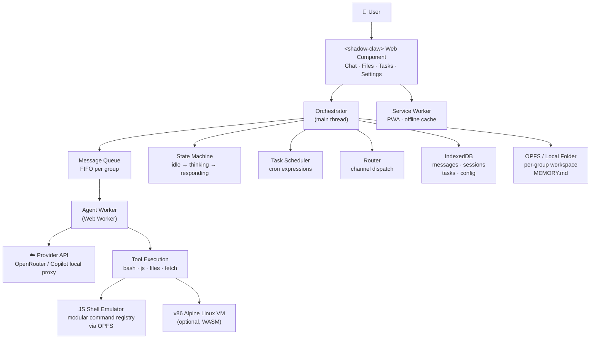
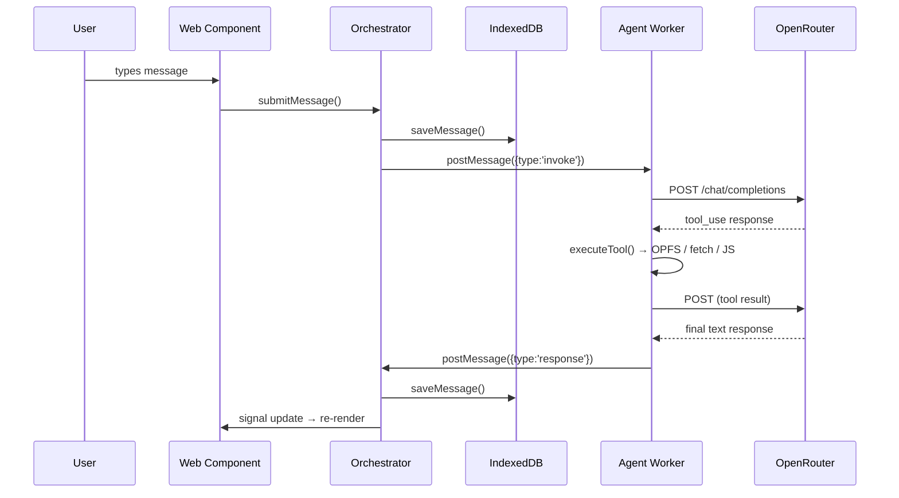
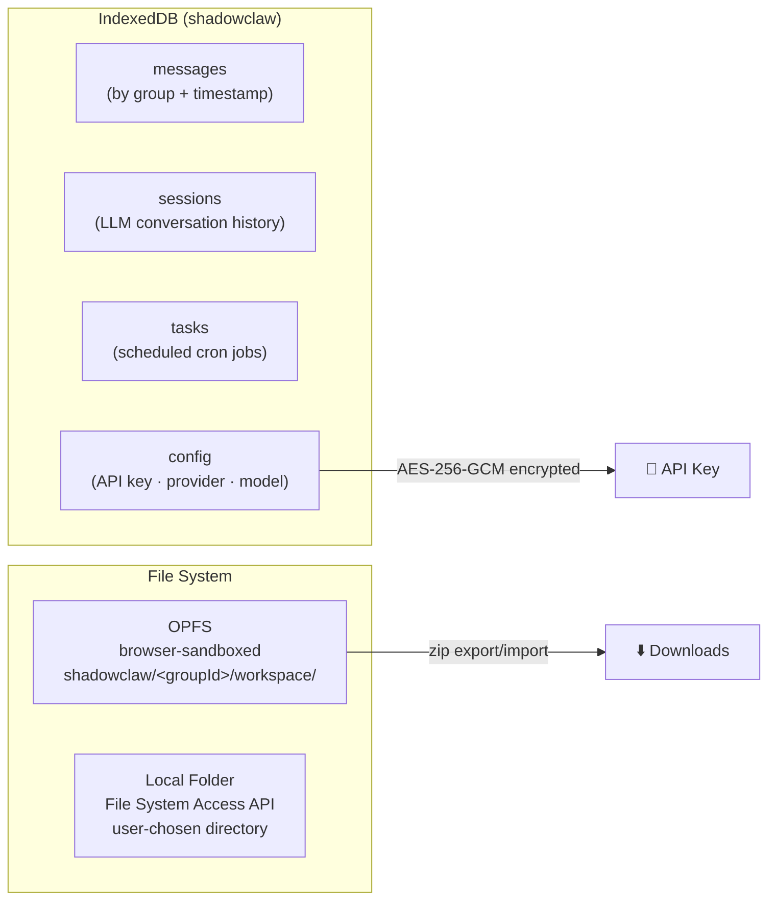

# 🦞 [ShadowClaw](https://xt-ml.github.io/shadow-claw/)

[](https://deepwiki.com/xt-ml/shadow-claw)

Browser-native personal AI assistant.

## Quick Start

```bash
npm install
npm start        # Express server → http://localhost:8888
```

Open Settings, select a provider, then paste your API key and start chatting.
`OpenRouter` is the default provider, and `Copilot Azure OpenAI (Local Proxy)`
is also available for local Azure proxy workflows.

`Web Prompt API (Experimental)` is also available as a keyless provider when
the browser exposes the Prompt API (`LanguageModel`).

## Architecture



### Message Flow



## Key Files

| File                                 | Purpose                                                            |
| ------------------------------------ | ------------------------------------------------------------------ |
| `index.mjs`                          | App entry — opens IndexedDB, boots orchestrator, registers SW      |
| `worker.mjs`                         | Agent Web Worker — owns the LLM tool-use loop                      |
| `src/orchestrator.mjs`               | State machine, message queue, agent invocation, task scheduling    |
| `src/worker/executeTool.mjs`         | Tool execution logic for the agent worker                          |
| `src/tools.mjs`                      | Tool schema definitions sent to the LLM                            |
| `src/shell/shell.mjs`                | Pure-JS bash-like shell emulator (OPFS filesystem)                 |
| `src/shell/commands/registry.mjs`    | Shell command registry that maps command names to handlers         |
| `src/shell/commands/*.mjs`           | Individual command implementations (awk, jq, grep, tar, etc.)      |
| `src/vm.mjs`                         | v86 Alpine Linux VM for `bash` tool execution + terminal bridge     |
| `src/db/db.mjs`                      | IndexedDB layer — messages, sessions, tasks, config                |
| `src/storage/storage.mjs`            | OPFS + Local Folder file storage, zip export/import                |
| `src/storage/writeFileHandle.mjs`    | Cross-browser file writes (stream, legacy, sync-handle, worker path fallback) |
| `src/storage/readGroupFileBytes.mjs` | Reads raw file bytes (used for binary previews like PDFs)          |
| `src/crypto.mjs`                     | AES-256-GCM encryption for API keys at rest                        |
| `src/git/git.mjs`                    | Isomorphic-git integration and version control operations          |
| `src/git/sync.mjs`                   | Synchronization between LightningFS and OPFS                       |
| `src/audio.mjs`                      | AudioContext management and notifications                          |
| `src/providers.mjs`                  | LLM provider adapters and request/response format conversion        |
| `src/prompt-api-provider.mjs`        | Prompt API provider runtime (keyless local model + tool-use loop)   |
| `src/router.mjs`                     | Routes inbound messages to channels                                |
| `src/channels/browser-chat.mjs`      | Browser chat channel implementation                                |
| `src/task-scheduler.mjs`             | Cron expression parser and task runner                             |
| `src/config.mjs`                     | All constants, provider definitions, and config keys               |
| `src/types.mjs`                      | JSDoc `@typedef` declarations (full type contract)                 |
| `src/effect.mjs`                     | Lightweight `effect()` using TC39 Signal Polyfill                  |
| `src/serve.mjs`                      | Express dev/prod server + Git/LLM CORS proxy                       |
| `src/webmcp.mjs`                     | WebMCP bridge for registering ShadowClaw tools with browser APIs   |
| `src/stores/`                        | Reactive signal-based UI state (orchestrator, file-viewer, theme)  |
| `service-worker/`                    | Workbox-generated PWA service worker                               |
| `src/worker/handleMessage.mjs`       | Worker message dispatcher — handles terminal RPC and VM lifecycle  |
| `src/components/`                    | Web Components — `<shadow-claw>` (main), `<shadow-claw-toast>`,    |
|                                      | `<shadow-claw-files>`, `<shadow-claw-tasks>`, `<shadow-claw-chat>` |
|                                      | (with "Stop Chat" support), `<shadow-claw-page-header>`,           |
|                                      | `<shadow-claw-pdf-viewer>`, `<shadow-claw-file-viewer>`,           |
|                                      | `<shadow-claw-terminal>` (interactive WebVM terminal)              |

## Tools Available to the Agent

| Tool                                                         | What it does                                                     |
| ------------------------------------------------------------ | ---------------------------------------------------------------- |
| `bash`                                                       | Shell commands prefer worker-owned WebVM, with JS shell fallback |
| `javascript`                                                 | Run JS in an isolated `Function` scope — no DOM, no network      |
| `read_file` / `write_file` / `list_files`                    | OPFS workspace file I/O                                          |
| `open_file`                                                  | Opens a workspace file directly in the UI file viewer dialog     |
| `fetch_url`                                                  | HTTP requests via browser `fetch()` — CORS applies               |
| `update_memory`                                              | Write to `MEMORY.md` — loaded as system context every invocation |
| `create_task` / `list_tasks` / `update_task` / `delete_task` | Scheduled task management (can be JS scripts)                    |
| `enable_task` / `disable_task`                               | Toggle task execution                                            |
| `clear_chat`                                                 | Clears the chat history and starts a new session                 |
| `git_*` (`git_clone`, `git_commit`, `git_push`, etc.)        | Isomorphic-git version control operations mapped to OPFS         |

When the browser WebMCP API is available (`navigator.modelContext`), these
tools can also be registered through `src/webmcp.mjs` so browser-side model
contexts can invoke the same tool surface.

## Prompt API Provider (Experimental)

ShadowClaw supports a browser-native keyless provider with
`PROVIDERS.prompt_api`.

- The provider uses `LanguageModel` (Prompt API) and does not require an API key.
- Settings disables API key entry for this provider and saves provider-only config.
- During model download, chat renders a progress card with percentage updates.
- Compaction and regular invoke flows run through `src/prompt-api-provider.mjs`.
- Prompt sessions are warmed/cached and cloned when supported for faster reuse.
- If Prompt API is unavailable, the app returns a user-visible provider error and stays responsive.

This is experimental browser functionality and may require feature flags in
supported Chromium builds.

## WebMCP Integration

On startup, the orchestrator checks `navigator.modelContext` support and
registers all ShadowClaw tools through `registerWebMcpTools()`.

- Registrations use `TOOL_DEFINITIONS` and delegate execution to `executeTool()`.
- Tool side effects (`show-toast`, `open-file`, task updates) are bridged through
  `setPostHandler()` so they are handled by the same orchestrator pathways.
- `shutdown()` unregisters tools via `unregisterWebMcpTools()`.

## Storage



Write paths are centralized through `src/storage/writeFileHandle.mjs`:

- `writeFileHandle()` supports `createWritable()`, legacy `createWriteable()`, and `createSyncAccessHandle()`.
- `writeOpfsPathViaWorker()` is the Safari-friendly fallback for OPFS writes when main-thread handles are not writable.
- `writeGroupFile`, `uploadGroupFile`, and ZIP restore flows all use this shared layer.

## WebVM (`bash` Backend)

`bash` tool calls prefer the worker-owned WebVM.

- If `VM_BOOT_MODE` is `disabled`, commands run in the JavaScript Bash Emulator.
- If WebVM is enabled but unavailable or still booting, the current command
  falls back to the JavaScript Bash Emulator, a warning toast is shown, and the
  next command attempts WebVM again.

`worker.mjs` eagerly boots WebVM on startup using persisted VM settings:

1. `CONFIG_KEYS.VM_BOOT_MODE` (`disabled` | `auto` | `ext2` | `9p`)
2. `CONFIG_KEYS.VM_BASH_TIMEOUT_SEC` (default timeout for `bash` tool calls)
3. `CONFIG_KEYS.VM_BOOT_HOST` (optional HTTP(S) host override for VM assets)
4. `CONFIG_KEYS.VM_NETWORK_RELAY_URL` (ws/wss relay for VM networking)

When no VM boot host has been configured yet, startup defaults to
`DEFAULT_VM_BOOT_HOST` 'http://localhost:8888'.

The `<shadow-claw-terminal>` component uses orchestrator terminal bridge APIs.
Interactive terminal sessions and tool-driven `bash` execution are coordinated in
`vm.mjs` so command execution can temporarily suspend terminal output and then resume
cleanly. In 9p mode, terminal and command activity sync `/workspace` changes back to
OPFS so the Files view stays up to date.

The Files page also exposes manual sync controls when VM mode is `9p`:

- `Host -> VM`: requests `vm-workspace-sync` (push host workspace into VM `/workspace`)
- `VM -> Host`: requests `vm-workspace-flush` (pull VM `/workspace` changes back to host)

Terminal-driven 9p auto-sync only flushes when workspace-affecting commands complete,
and ignores idle background write events.

VM assets are expected under `/assets/v86.ext2/` and `/assets/v86.9pfs/`.

Serve these files (under `/assets/v86.ext2/`) to enable ext2 boot:

  | File                          | Description                  |
  | ----------------------------- | ---------------------------- |
  | `alpine-rootfs.ext2`          | Alpine Linux root filesystem |
  | `bzImage`                     | Linux kernel                 |
  | `initrd`                      | Initial RAM disk             |
  | `v86.wasm`                    | v86 WebAssembly binary       |
  | `libv86.mjs`                  | v86 JavaScript glue          |
  | `seabios.bin` / `vgabios.bin` | Firmware                     |

## Reactive UI

Vanilla Web Components + **TC39 Signals** (via `signal-polyfill`). A small `effect()`
helper re-runs DOM updates whenever signals change. No virtual DOM, no framework.

The file viewer now loads text, PDF, and browser-previewable binary files with MIME-aware
preview defaults, and revokes temporary object URLs on close/swap to avoid leaks.

The chat UI also tracks model download progress state from
`model-download-progress` events and shows/hides the progress bar automatically.

Notification chimes are now gated behind an explicit user gesture unlock to avoid
autoplay policy violations in browsers.

## Dev Server CLI and CORS Modes

`src/serve.mjs` supports host and CORS configuration via CLI and environment variables.

```bash
npm start -- 8888 --host 0.0.0.0 --cors-mode private
npm start -- --cors-mode all --cors-allow-origin https://example.com
node src/serve.mjs --help
```

- Host resolution order: CLI (`--host/--ip/--bind-ip`) -> env -> default.
- CORS modes: `localhost` (default), `private`, `all`.
- Explicit allowlist is supported by repeated `--cors-allow-origin` and
  `SHADOWCLAW_CORS_ALLOWED_ORIGINS`.
- Request logs include origin/client/preflight diagnostics to simplify proxy/CORS troubleshooting.

## Build Metadata

Build-time metadata stamps the current Git revision into `<meta name="revision">` in
`index.html`. The Settings panel reads and displays this value as `Deployed revision:`.

## Comparison with NanoClaw

| Feature              | NanoClaw                 | ShadowClaw             |
| -------------------- | ------------------------ | ---------------------- |
| Runtime              | Node.js process          | Browser tab            |
| Agent sandbox        | Docker / Apple Container | Web Worker + WebVM     |
| Database             | SQLite (better-sqlite3)  | IndexedDB              |
| Files                | Filesystem               | OPFS + Local Folder    |
| Primary channel      | WhatsApp                 | In-browser chat        |
| LLM API              | Anthropic SDK            | OpenRouter + optional Copilot Azure local proxy |
| Background tasks     | launchd service          | Service Worker (PWA)   |
| Build step           | Required                 | None (pure ESM)        |
| Runtime dependencies | ~50 npm packages         | 0                      |

## Development

```bash
npm start          # Express server
npm test           # Jest (*.test.mjs files live next to source)
npm run e2e        # Playwright E2E tests (e2e/*.test.mjs)
npm run e2e:install # Install Playwright browser binaries
npm run tsc        # TypeScript type-check (JSDoc, --noEmit)
npm run build      # Type-check + generate service worker
npm run format     # Prettier
```

## License

AGPLv3. Core logic derived from [openbrowserclaw](https://github.com/sachaa/openbrowserclaw) (MIT).
