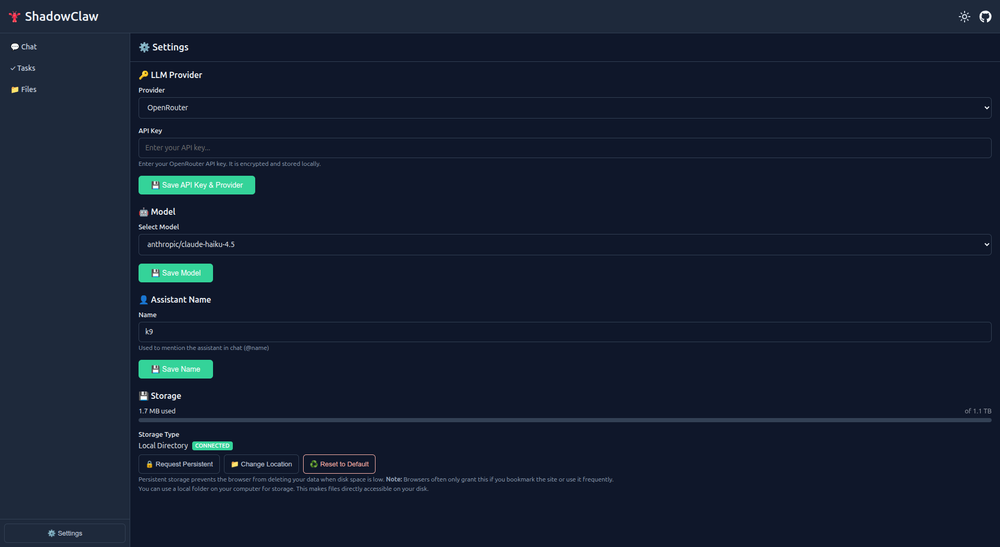
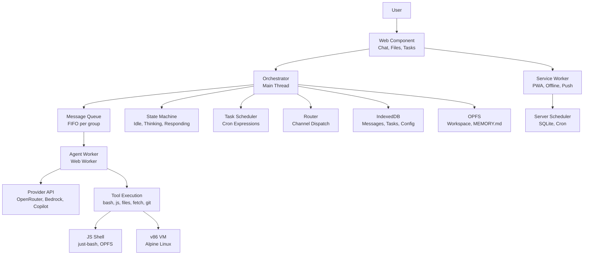
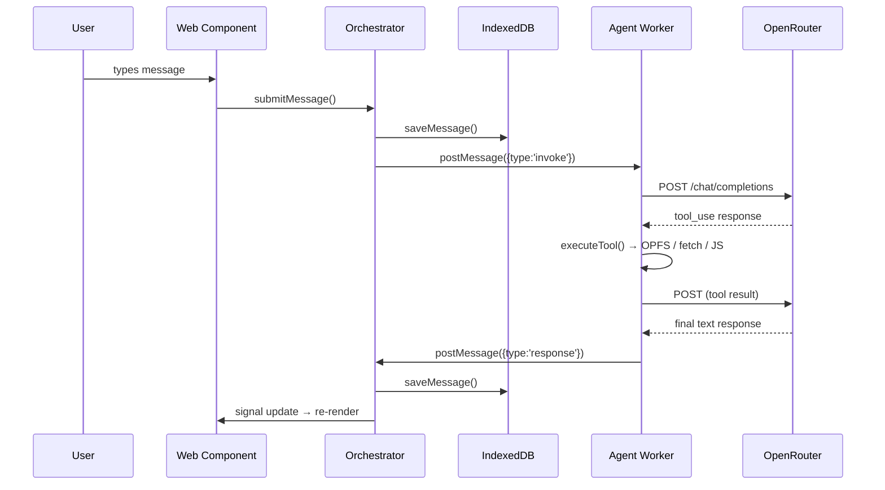
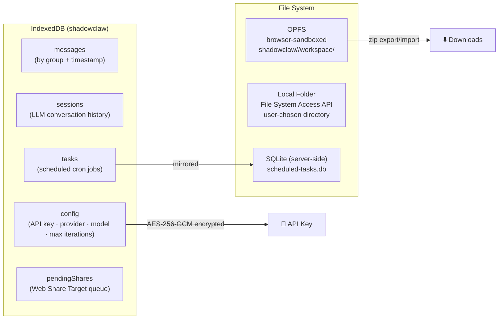

# 🦞 [ShadowClaw](https://xt-ml.github.io/shadow-claw/)

[](https://deepwiki.com/xt-ml/shadow-claw)

Browser-native personal AI assistant.



## Quick Start

```bash
npm install
npm start        # Express server → http://localhost:8888
```

`npm start` performs a full Rollup build and then serves `dist/server.js`.

Open Settings, select a provider, and start chatting.

For local inference, ShadowClaw offers multiple options:

- **Transformers.js (Browser)**: Runs models entirely in the browser using a background Web Worker. Model artifacts are cached in the browser's Cache API. Optimized for small, instruction-tuned ONNX models. Supports CPU and WebGPU backends with automatic dtype selection.
- **Transformers.js (Local Proxy)**: Runs larger local models server-side via Node.js proxy. Model artifacts are cached server-side.
- **Llamafile (Local Proxy)**: Runs `.llamafile` binaries server-side.
- **Gemini**: Supports robust streaming and tool execution via secure server-side proxy routes.
- **Vertex AI**: Enterprise-grade Google Gemini models via Google Cloud Vertex AI proxy.

Local proxy cache paths:

- `assets/cache/transformers.js` for Transformers.js proxy metadata/artifacts
- `assets/cache/llamafile` for CLI `.llamafile` binaries

### Electron Desktop App

```bash
npm run electron              # Launch desktop app
npm run electron:build        # Build distributable
npm run electron:build:win    # Build for Windows (NSIS + MSI + ZIP)
npm run electron:build:mac    # Build for macOS (ZIP)
```

The Electron app runs the same Express server + proxy in-process, so all
providers (including the Bedrock, Copilot, and Transformers.js local proxy)
work identically.
A power-save blocker keeps the machine awake so scheduled tasks fire on
time.

## Messaging Channels

ShadowClaw supports three channel prefixes out of the box:

- `br:` — in-browser chat conversations
- `tg:` — Telegram Bot API conversations
- `im:` — iMessage conversations via a bridge service

The browser chat and iMessage channels auto-trigger the agent on inbound
messages. Telegram conversations require the assistant mention trigger unless
the message is one of the built-in helper commands.

**For detailed setup instructions, see [docs/guides/configuring-messaging-channels.md](docs/guides/configuring-messaging-channels.md)** — includes step-by-step Telegram bot creation, iMessage bridge contract, and troubleshooting.

**Architecture:** See [docs/subsystems/channels.md](docs/subsystems/channels.md) for the channel registry, plugin pattern, and how to add custom channels.

## Architecture



### Message Flow



## Multi-Conversation Support

Users can maintain multiple independent conversations, each with its own
chat history, file workspace, scheduled tasks, and `MEMORY.md`. Conversations
are managed through a sidebar component (`<shadow-claw-conversations>`) with
create, rename, delete, switch, clone, and reorder actions. The last-active conversation is
persisted and restored on reload. On first launch, a default "Main"
conversation is automatically created and persisted to IndexedDB.

Conversation state is fully isolated: streaming text, typing indicators,
tool activity, activity log, and messages are scoped to the active conversation's
`groupId`. Switching conversations clears transient UI state for the previous
view, and events arriving for a background conversation (including thinking-log
entries and context-compacted reloads) are silently ignored. Async history
loads guard against stale results when the user switches mid-query.

The conversation list supports **accessible drag-and-drop reordering** (mouse,
keyboard, and touch) with ARIA live-region announcements. Custom reorder is
persisted and survives page reloads. A **clone** button duplicates a
conversation's metadata, full message history, scheduled tasks, and `MEMORY.md`. The list is **resizable** via
a drag handle at the bottom and fills all available sidebar space by default;
double-clicking the handle resets to auto-fill. The resize preference is persisted.
Conversations with **unread messages** display a pulsing highlight animation;
the indicator clears when the conversation is selected.

The channel system is built on a generic **ChannelRegistry** that maps groupId
prefixes to channel implementations. Built-in registrations include `br:`
(Browser), `tg:` (Telegram), and `im:` (iMessage bridge). New external channels
can be added by implementing the `Channel` interface and registering with a
unique prefix — the router, conversation badges, and group creation
automatically support them.

## Key Files

| File                                 | Purpose                                                                                               |
| ------------------------------------ | ----------------------------------------------------------------------------------------------------- |
| `src/index.ts`                       | App entry — opens IndexedDB, boots orchestrator, registers SW                                         |
| `src/worker/worker.ts`               | Agent Web Worker entry — dispatches messages to the worker agent                                      |
| `src/orchestrator.ts`                | State machine, message queue, agent invocation, task scheduling                                       |
| `src/worker/agent.ts`                | Agent implementation — orchestrates the LLM tool-use loop and message stream                          |
| `src/worker/handleInvoke.ts`         | Implements `callWithStreaming` and core agent invocation logic                                        |
| `src/worker/executeTool.ts`          | Tool execution logic for the agent worker                                                             |
| `src/worker/handleMessage.ts`        | Worker message dispatcher — handles terminal RPC and VM lifecycle                                     |
| `src/types.ts`                       | TypeScript interfaces and types (full type contract)                                                  |
| `src/config.ts`                      | All constants, provider definitions, and config keys                                                  |
| `rollup.config.mjs`                  | Bundles browser app, workers, service worker, server, and Electron entries                            |
| `src/server/`                        | Express server package — modular routes, middleware, and proxy services.                              |
| `src/shell/shell.ts`                 | Runs `just-bash` AST-based shell evaluation engine bridging OPFS storage                              |
| `electron/main.ts`                   | Electron main process: Express server, window, power-save blocker                                     |
| `src/service-worker/`                | Service worker source (.ts). Bundled via Rollup and Workbox.                                          |
| `src/stores/`                        | Reactive signal-based UI state: orchestrator, tools, file-viewer, theme                               |
| `src/components/`                    | Web Components — `<shadow-claw>` (main), `<shadow-claw-chat>`, etc.                                   |
| `src/storage/storage.ts`             | OPFS + Local Folder file storage, zip export/import                                                   |
| `src/db/db.ts`                       | IndexedDB layer — messages, sessions, tasks, config                                                   |
| `src/git/git.ts`                     | Isomorphic-git integration and version control operations                                             |
| `src/share-target/pending-shares.ts` | Client-side module to consume pending Web Share Target payloads from IndexedDB                        |
| `src/service-worker/share-target.ts` | Service worker fetch handler — intercepts `POST /share/share-target.html`, stores payloads, redirects |
| `src/storage/writeGroupFileBytes.ts` | Write raw binary (`Uint8Array`) to a group workspace file with OPFS worker fallback                   |
| `src/storage/renameGroupEntry.ts`    | Rename (copy-and-delete) files or directories in the group workspace                                  |
| `src/chat-template-sanitizer.ts`     | Utility to strip control tokens and structural markers from local model output                        |
| `src/notifications/`                 | Web Push + server-side task scheduling (SQLite)                                                       |

## Storage



ShadowClaw prioritizes security for your API keys and environment:

- **Encrypted-at-Rest**: API keys are stored encrypted in IndexedDB using AES-256-GCM.
- **Private Fields**: The `Orchestrator` uses TC39 private fields (`#encryptedApiKey`) to prevent leakage via debuggers or console inspection.
- **Transient Usage**: Plaintext keys are only held in memory for 30 seconds during active requests before being cleared.
- **Environment Locking**: Critical browser APIs (`window.fetch`, `window.crypto.subtle`) are locked in production to prevent malicious interception.

Write paths are centralized through `src/storage/writeFileHandle.ts`:

- `writeFileHandle()` supports `createWritable()`, and `createSyncAccessHandle()`.
- `writeOpfsPathViaWorker()` is the Safari-friendly fallback for OPFS writes when main-thread handles are not writable.
- `writeGroupFile`, `uploadGroupFile`, and ZIP restore flows all use this shared layer.
- `writeGroupFileBytes()` (`src/storage/writeGroupFileBytes.ts`) writes raw binary content (`Uint8Array`) and applies the same OPFS worker fallback path for Safari compatibility.
- `renameGroupEntry()` (`src/storage/renameGroupEntry.ts`) handles file and directory renames within a group's workspace using a recursive copy-and-delete strategy.

## WebVM (`bash` Backend)

`bash` tool calls prefer the worker-owned WebVM.

- If `VM_BOOT_MODE` is `disabled`, commands run in the JavaScript Bash Emulator.
- If WebVM is enabled but unavailable or still booting, the current command
  falls back to the JavaScript Bash Emulator, a warning toast is shown, and the
  next command attempts WebVM again.

`src/worker/worker.ts` eagerly boots WebVM on startup using persisted VM settings:

1. `CONFIG_KEYS.VM_BOOT_MODE` (`disabled` | `auto` | `ext2` | `9p`)
2. `CONFIG_KEYS.VM_BASH_TIMEOUT_SEC` (default timeout for `bash` tool calls)
3. `CONFIG_KEYS.VM_BOOT_HOST` (optional HTTP(S) host override for VM assets)
4. `CONFIG_KEYS.VM_NETWORK_RELAY_URL` (ws/wss relay for VM networking)

When no VM boot host has been configured yet, startup defaults to
`DEFAULT_VM_BOOT_HOST` `http://localhost:8888`.

The `<shadow-claw-terminal>` component uses orchestrator terminal bridge APIs.
Interactive terminal sessions and tool-driven `bash` execution are coordinated in
`vm.ts` so command execution can temporarily suspend terminal output and then resume
cleanly. In 9p mode, terminal and command activity sync `/workspace` changes back to
OPFS so the Files view stays up to date.

The Files page also exposes manual sync controls when VM mode is `9p`:

- `Host -> VM`: requests `vm-workspace-sync` (push host workspace into VM `/workspace`)
- `VM -> Host`: requests `vm-workspace-flush` (pull VM `/workspace` changes back to host)

Terminal-driven 9p auto-sync only flushes when workspace-affecting commands complete,
and ignores idle background write events.

### VM Assets

VM assets are expected under `/assets/v86.ext2/` and `/assets/v86.9pfs/`.

Serve these files (under `/assets/v86.ext2/`) to enable ext2 boot:

| File                          | Description                  |
| ----------------------------- | ---------------------------- |
| `alpine-rootfs.ext2`          | Alpine Linux root filesystem |
| `bzImage`                     | Linux kernel                 |
| `initrd`                      | Initial RAM disk             |
| `v86.wasm`                    | v86 WebAssembly binary       |
| `libv86.mjs`                  | v86 JavaScript glue          |
| `seabios.bin` / `vgabios.bin` | Firmware                     |

## Tools Available to the Agent

| Tool                                                             | What it does                                                                           |
| ---------------------------------------------------------------- | -------------------------------------------------------------------------------------- |
| `javascript`                                                     | Run JS in a sandboxed strict-mode Worker — no DOM, network, `eval`, or `Function`.     |
|                                                                  | Code **must** use `return` to produce output                                           |
| `read_file` / `write_file` / `patch_file` / `list_files`         | OPFS workspace file I/O — `read_file` supports a `paths` array to batch-read multiple  |
|                                                                  | files in one call; `patch_file` for targeted search-and-replace edits in large files   |
|                                                                  | (preferred over bash/sed)                                                              |
| `attach_file_to_chat`                                            | Validates a workspace file path and returns exact markdown snippet for chat attachment |
|                                                                  | delivery (including inline image rendering support)                                    |
| `open_file`                                                      | Opens a workspace file directly in the UI file viewer dialog                           |
| `fetch_url`                                                      | HTTP requests via browser `fetch()` — CORS applies; `use_git_auth: true` auto-injects  |
|                                                                  | saved Git credentials; `use_account_auth: true` auto-injects service account PATs      |
|                                                                  | (auth format and host mapping auto-detected); response headers are returned.           |
| `update_memory`                                                  | Write to `MEMORY.md` — loaded as system context every invocation                       |
| `create_task` / `list_tasks` / `update_task` / `delete_task`     | Scheduled task management (standard agent prompts)                                     |
| `enable_task` / `disable_task`                                   | Toggle task execution                                                                  |
| `clear_chat`                                                     | Clears the chat history and starts a new session                                       |
| `git_*` (`git_clone`, `git_merge`, `git_push`, `git_diff`, etc.) | Isomorphic-git version control: clone (auto-wipes stale state), branch, merge (with    |
|                                                                  | inline conflict reports), diff (unified-style content diffs), reset, push (with        |
|                                                                  | `remote_ref`), pull, delete repo                                                       |
| `show_toast`                                                     | Agent-triggered UI toast notifications                                                 |
| `send_notification`                                              | OS-level Web Push notification (works even when app is in background)                  |
| `bash`                                                           | Shell commands prefer worker-owned WebVM, falling back to `just-bash` AST emulator.    |
|                                                                  | Supports POSIX standards, loops, redirects, string manipulations, and commands like    |
|                                                                  | `grep`, `sed`, `awk`, `cat`, etc., fully synced to OPFS workspace storage.             |
| `remote_mcp_*`                                                   | Remote MCP integration tools (`remote_mcp_list_tools`, `remote_mcp_call_tool`) to      |
|                                                                  | dynamically discover and execute tools from configured external MCP servers.           |

When the browser WebMCP API is available (`navigator.modelContext`), these
tools can also be registered through `src/webmcp.ts` so browser-side model
contexts can invoke the same tool surface.

## Model Registry & Attachment Capabilities

ShadowClaw includes a dynamic **Model Registry** (`src/model-registry.ts`) that
fetches and caches model metadata (context window, tool support, input/output
modalities) from provider APIs.

The **Attachment Capabilities** system (`src/attachment-capabilities.ts`) uses
this metadata to determine how to deliver files to the agent:

- **Native Delivery**: If the model supports the specific input modality (image,
  audio, video, PDF), the attachment is sent as a native content block.
- **Fallback Delivery**: If native support is missing or unknown, ShadowClaw
  automatically converts the attachment into a markdown-optimized text
  representation (e.g., OCR-style layout for PDFs, MIME-aware descriptions).

This allows ShadowClaw to operate as an **agent-driven assistant** where the
assistant can reason about its own capabilities and the best way to process
user-supplied files.

## Prompt API Provider (Experimental)

ShadowClaw supports a browser-native keyless provider with
`PROVIDERS.prompt_api`.

- The provider uses `LanguageModel` (Prompt API) and does not require an API key.
- Settings disables API key entry for this provider and saves provider-only config.
- During model download, chat renders a progress card with percentage updates.
- Compaction and regular invoke flows run through `src/prompt-api-provider.ts`.
- Prompt sessions are warmed/cached and cloned when supported for faster reuse.
- When `responseConstraint` causes the model to stall on incomplete JSON, the
  provider retries without the constraint automatically.
- If Prompt API is unavailable, the app returns a user-visible provider error and stays responsive.

This is experimental browser functionality and may require feature flags in
supported Chromium builds.

## WebMCP Integration

On startup, the orchestrator checks `navigator.modelContext` support and
registers all ShadowClaw tools through `registerWebMcpTools()`.

- Registrations use `TOOL_DEFINITIONS` and delegate execution to `executeTool()`.
- Each registered tool includes explicit WebMCP annotations:
  - `readOnlyHint: false`
  - `untrustedContentHint: true` (tool output may include untrusted/user or external content)
- Registrations use `AbortController` signals passed to `registerTool(...)` so tools can be cleanly detached in API versions that removed direct unregister calls.
- Tool side effects (`show-toast`, `open-file`, task updates) are bridged through
  `setPostHandler()` so they are handled by the same orchestrator pathways.
- `shutdown()` calls `unregisterWebMcpTools()`, which aborts registration signals and also attempts legacy `unregisterTool` when available.
- **Testing:** In Google Chrome, use the [Model Context Tool Inspector](https://chromewebstore.google.com/detail/model-context-tool-inspec/gbpdfapgefenggkahomfgkhfehlcenpd) extension to test WebMCP integration.

## Remote MCP Connections

ShadowClaw supports connecting to external Model Context Protocol (MCP) servers using streamable HTTP transports with session-based JSON-RPC exchanges.

- Configure connections in **Settings → Remote MCP**.
- Supports Bearer, Basic, and custom Header authentication via the credential store.
- **OAuth-backed connections**: Automatically handles silent token refreshes and provides UI flows for full re-authorization when credentials expire or are revoked.
- The agent can discover and invoke remote tools using the `remote_mcp_list_tools` and `remote_mcp_call_tool` built-in tools.
- Connections can be referenced by either connection ID or human-readable label.
- **Automatic Reconnection**: The orchestrator tracks connection health and transparently retries tool calls after silent OAuth refreshes or session invalidation.
- Connections are persisted securely in IndexedDB.

**For detailed architecture and integration patterns, see [docs/subsystems/remote-mcp.md](docs/subsystems/remote-mcp.md)** — covers transport protocols, authentication, tool discovery, and troubleshooting.

## Web Share Target

ShadowClaw registers as a PWA share target so the OS can send files, URLs, and
text directly to the app from any native share sheet.

- `manifest.json` declares a `share_target` entry that accepts `POST /share/share-target.html`
  with `multipart/form-data` — fields `title`, `text`, `url`, and one or more `file`
  attachments (any MIME type).
- `share/share-target.html` is a real static landing page inside app scope
  that boots `<shadow-claw>` and receives share-target navigations.
- The service worker (`src/service-worker/share-target.ts`) intercepts the POST,
  reads the form data, persists each item as a `PendingShareRecord` in the
  `pendingShares` IndexedDB object store, then issues a `303` redirect to `/?share-target=1`.
- On startup, `<shadow-claw>` calls `consumePendingShares()` (from
  `src/share-target/pending-shares.ts`) and processes every queued record:
  - Binary files are written to the group workspace via `writeGroupFileBytes()`.
  - Text/URL payloads are written as Markdown `.md` files via `writeGroupFile()`.
  - The app creates or reuses a **dated** conversation (`Shared Files YYYY-MM-DD`),
    switches to it, navigates to the Files view, and auto-opens the first imported file.
  - A success toast summarises the import; the `?share-target` query param is
    cleaned from the URL via `history.replaceState()`.

The **file viewer** also supports **outbound sharing** via the Web Share API:
a `↗ Share` button appears in the modal header when `navigator.share` is
available and the file is shareable (`navigator.canShare()` check for binary
files). Text files are shared as `title` + `text`; binary files are wrapped
in a `File` object and passed in the `files` array.

## AWS Bedrock Proxy

The Express server (and Electron in-process server) exposes server-side
Bedrock endpoints that use AWS SSO credentials:

- `GET /bedrock-proxy/models` — Lists active Anthropic foundation models.
- `POST /bedrock-proxy/invoke` — Forwards Anthropic-format requests to Bedrock.
  When `stream: true` is set in the request body, the proxy uses
  `InvokeModelWithResponseStream` and pipes SSE chunks back in real time.

Environment variables:

| Variable          | Default    |
| ----------------- | ---------- |
| `BEDROCK_REGION`  | (required) |
| `BEDROCK_PROFILE` | (required) |

Model IDs are auto-mapped to cross-region inference profile IDs
(e.g. `anthropic.claude-sonnet-4-6-v1:0` → `us.anthropic.claude-sonnet-4-6-v1:0`).

## Streaming Responses

LLM responses stream token-by-token when three conditions are met:

1. The global streaming toggle is enabled (Settings → LLM, on by default).
2. The active provider declares `supportsStreaming: true`.
3. The provider format is `"openai"` or `"anthropic"`.

The worker sends `streaming-start`, `streaming-chunk` (throttled at 50 ms),
and `streaming-done` / `streaming-end` messages. The chat component renders
an amber streaming bubble with a blinking cursor that updates in real time.
The bubble only appears when the streaming text is non-empty — an empty string
(set by `streaming-start`) is suppressed to avoid a brief flash on tool-only
responses. All streaming events include a `groupId`; the store only processes
events for the active conversation, so switching away hides the stream without
cancelling it.

When the LLM returns text alongside tool calls, an `intermediate-response`
message persists the text as a permanent chat bubble before the streaming
bubble is cleared for tool execution.

Bedrock and Copilot Azure proxy routes support SSE pass-through; the Express
dev server's `compression()` middleware explicitly skips `text/event-stream`
responses so chunks flush immediately.

## Agent Iteration Limit

The agent tool-use loop caps at `DEFAULT_MAX_ITERATIONS` (50) by default.
Users can override this via **Settings → Max Iterations** (stored under
`CONFIG_KEYS.MAX_ITERATIONS`, valid range 1–200). The orchestrator loads
the persisted value at init and passes it to the worker in every `invoke` payload.

### Dynamic Context & Auto-Compaction

Instead of a fixed message window, the orchestrator uses **token-budget-aware
dynamic context windowing**. On each invocation the system prompt is built first
and its token cost estimated, then the last 200 messages are walked newest-to-oldest
within the remaining budget (`contextLimit − systemPromptTokens − maxOutputTokens`).
Large tool outputs are truncated at line boundaries (default 25 K chars).

A `context-usage` event emits `ContextUsage` stats so the chat UI can render a
color-coded progress bar (green → amber → red). When usage exceeds 80 % and
messages have been truncated, auto-compaction triggers automatically.

## LLM Providers & Rate Limiting

ShadowClaw supports multiple provider formats (OpenAI, Anthropic, Prompt API)
and handles network-bound tool calls with robust error handling.

### Provider Help & UX

When provider requests fail due to common configuration issues (missing/invalid
API keys, rate limits, or network connectivity), ShadowClaw detects the failure
mode and displays a **contextual help dialog** with step-by-step resolution
instructions and direct links to provider settings.

### Adaptive Rate Limiting

The agent worker includes an **adaptive rate limiter** that prevents 429 errors
by tracking provider-specific limits.

- **Header Parsing**: Automatically extracts `x-ratelimit-limit`, `x-ratelimit-remaining`,
  and `x-ratelimit-reset` from provider responses.
- **Retry-After Support**: Respects `retry-after` headers with sub-second precision.
- **Manual Overrides**: Configurable calls-per-minute limits for providers that don't
  emit limit headers.
- **Backoff & Jitter**: Integrated retry logic with exponential backoff for transient failures.

### Prompt API & Nano Optimization

The **Prompt API** (`window.LanguageModel`) provides zero-cost, browser-native
inference via Gemini Nano. To maximize performance on constrained local models,
ShadowClaw uses a **Nano Optimized** tool profile that minimizes system prompt
overhead and concentrates on core file/shell capabilities.

## Tool Profiles & Fine-Grained Tool Management

Tool profiles allow per-provider/model customization of which tools are
available and optional system prompt overrides. Managed through Settings
via `CONFIG_KEYS.TOOL_PROFILES` and `CONFIG_KEYS.ACTIVE_TOOL_PROFILE`.

Each `ToolProfile` specifies:

- `enabledToolNames` — Which tools the LLM sees.
- `customTools` — Cloned/modified tool definitions.
- `systemPromptOverride` — Optional prompt replacement.

Agents can also dynamically manage their own capability surface:

- **Profiles**: Activate predefined sets of tools (e.g., `git-ops`, `minimal`, `full`)
  tailored for specific tasks or model constraints.
- **Fine-grained Control**: Enable or disable individual tools on-the-fly to optimize
  the context window.
- **Auto-Activation**: Saved profiles can be linked to specific models (e.g., Gemini
  Nano automatically activates the `Nano Optimized` profile).

## Reactive UI

Web Components + **TC39 Signals** (via `signal-polyfill`). A small `effect()`
helper re-runs DOM updates whenever signals change. Components inherit from
`ShadowClawElement`, providing a declarative template-based rendering system.

The base element now includes cleanup lifecycle helpers (`addCleanup` and
automatic disposal in `disconnectedCallback`) so signal effects, observers,
and event subscriptions are consistently released when components unmount.

The UI is organized into modular components and dedicated stores:

- **Settings**: Refactored into specialized cards (`shadow-claw-card`) for
  LLM, Accounts, Git, and MCP configuration.
- **Common primitives**: Reusable components such as
  `shadow-claw-page-header`, `shadow-claw-empty-state`,
  `shadow-claw-card`, and `shadow-claw-actions` reduce
  duplicated markup and behavior across pages.
- **Chat**: Smart auto-scroll with ResizeObserver integration, streaming bubble support, mobile-friendly touch resizing, and responsive activity log toggles.
- **File Viewer**: MIME-aware previews for PDF, binary, and text content with syntax highlighting. A `↗ Share` button in the modal header triggers the Web Share API for shareable files; the button is hidden when `navigator.share` is unavailable or `navigator.canShare()` returns false.
- **Terminal**: Interactive Xterm.js terminal with WebVM bridge.

Recommended component organization:

- Keep shared UI primitives in `src/components/common/`.
- Group settings feature components under `src/components/settings/` for
  discoverability (for example `settings/shadow-claw-llm/`).
- Migrate incrementally as components are touched, rather than a single large
  rename/refactor.

Notification chimes are now gated behind an explicit user gesture unlock to avoid
autoplay policy violations in browsers.

## Push Notifications & Server-Side Task Scheduling

Web Push notifications are supported via the `send_notification` tool using the
standard Push API with VAPID authentication. The settings panel
(**Settings → Push Notifications**) manages subscription lifecycle.

Scheduled tasks are persisted to a **server-side SQLite database**
(`scheduled-tasks.db`) so they fire even when no browser tab is open.
`ServerTaskScheduler` ticks every 60 seconds, evaluates cron expressions, and
sends push notifications to all clients. The service worker relays the trigger
to open windows, which invoke the agent with the task prompt.

A **recursion guard** prevents infinite push → task → push loops: if a
push-triggered task calls `send_notification`, the orchestrator shows a warning
toast instead of broadcasting.

Both the Express dev server and the Electron desktop app initialise the full
push + scheduling infrastructure identically.

## Dev Server CLI and CORS Modes

`src/server/server.ts` supports flexible host, port, and CORS configuration via CLI and environment variables.

**For detailed setup, troubleshooting, and production deployment patterns, see [docs/guides/server-development-configuration.md](docs/guides/server-development-configuration.md)** — includes common scenarios (LAN access, mobile testing, Docker, reverse proxy), environment variables, and diagnostics.

Quick reference:

```bash
npm start -- 8888 --host 0.0.0.0 --cors-mode private
npm start -- --cors-mode all --cors-allow-origin https://example.com
node dist/server.js --help
```

- Host resolution order: CLI (`--host/--ip/--bind-ip`) → env → default.
- CORS modes: `localhost` (default), `private`, `all`.
- Explicit allowlist is supported by repeated `--cors-allow-origin` and `SHADOWCLAW_CORS_ALLOWED_ORIGINS`.

## Build Metadata

Build-time metadata stamps the current Git revision into `<meta name="revision">` in
`index.html`. The Settings panel reads and displays this value as `Deployed revision:`.

## Documentation

Architecture docs, subsystem guides, and decision records live in [`docs/`](docs/README.md):

- **[Architecture](docs/README.md#architecture)** — Orchestrator, worker protocol, storage, context, streaming
- **[Subsystems](docs/README.md#subsystems)** — Shell, VM, git, channels, tools, providers, notifications, Electron, reactive UI, crypto
- **[Guides](docs/README.md#guides)** — Adding providers, tools, shell commands, pages, channels
- **[Decisions](docs/README.md#decisions)** — ADRs for bundled architecture, TypeScript, Signals, worker-owned VM, IndexedDB

Agent-specific conventions and guardrails: [`AGENTS.md`](AGENTS.md)
E2E test architecture: [`e2e/README.md`](e2e/README.md)

## Development

```bash
npm start                   # Express server
npm test                    # Jest (*.test.ts files live next to source)
npm run e2e                 # Playwright E2E tests (e2e/*.test.ts)
npm run e2e:install         # Install Playwright browser binaries
npm run tsc                 # TypeScript type-check
npm run build               # Bundle application via Rollup + generate service worker
npm run format              # Prettier
npm run electron            # Launch Electron desktop app
npm run electron:build      # Build Electron distributable
npm run electron:build:win  # Build Electron for Windows
npm run electron:build:mac  # Build Electron for macOS
```

## License

AGPLv3. Core logic derived from [openbrowserclaw](https://github.com/sachaa/openbrowserclaw) (MIT).
