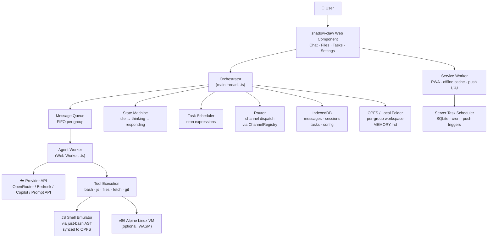
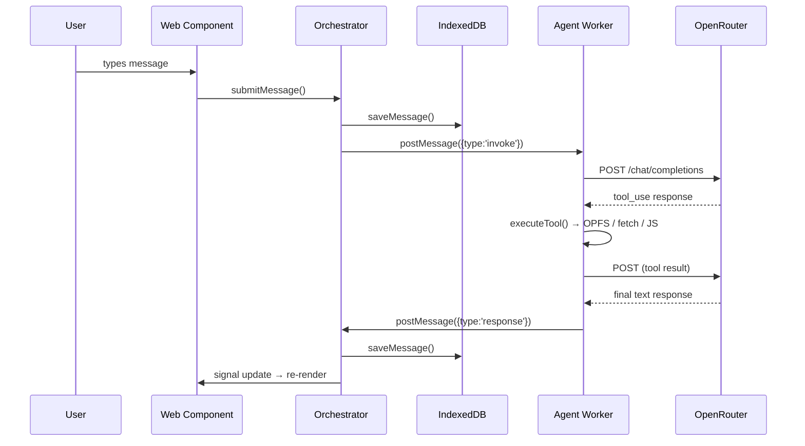
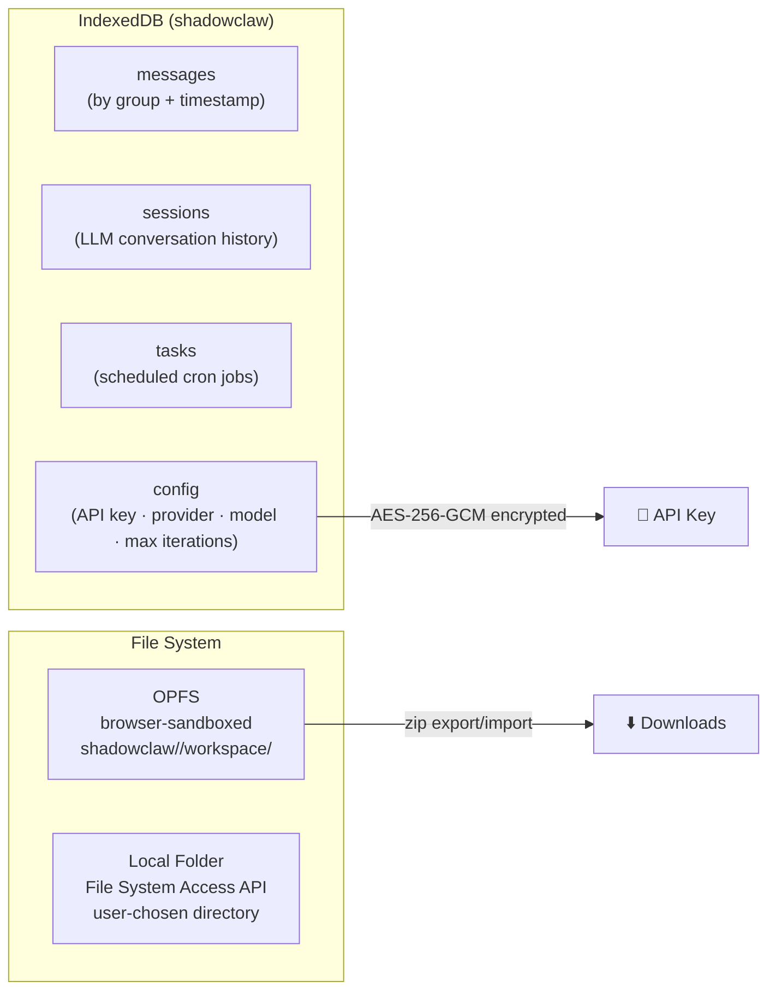

# 🦞 [ShadowClaw](https://xt-ml.github.io/shadow-claw/)

[](https://deepwiki.com/xt-ml/shadow-claw)

Browser-native personal AI assistant.


## Quick Start

```bash
npm install
npm start        # Express server → http://localhost:8888
```

Open Settings, select a provider, and start chatting.

### Electron Desktop App

```bash
npm run electron              # Launch desktop app
npm run electron:build        # Build distributable
npm run electron:build:win    # Build for Windows (NSIS + MSI + ZIP)
npm run electron:build:mac    # Build for macOS (ZIP)
```

The Electron app runs the same Express server + proxy in-process, so all
providers (including the Bedrock and Copilot proxies) work identically.
A power-save blocker keeps the machine awake so scheduled tasks fire on
time.

## Messaging Channels

ShadowClaw supports three channel prefixes out of the box:

- `br:` — in-browser chat conversations
- `tg:` — Telegram Bot API conversations
- `im:` — iMessage conversations via a bridge service

The browser chat and iMessage channels auto-trigger the agent on inbound
messages. Telegram conversations require the assistant mention trigger unless
the message is one of the built-in helper commands.

### Telegram Setup

1. Create a bot with `@BotFather`.
2. Open Settings → Messaging Channels.
3. Paste the bot token into `Telegram Bot Token`.
4. Send `/chatid` to your bot from each chat you want to authorize.
5. Paste those chat IDs into `Telegram Allowed Chat IDs` and save.

Notes:

- Telegram messages from non-authorized chats are ignored.
- `/chatid` and `/ping` always work, even before a chat is authorized.
- The integration uses the Bot API directly from the browser over HTTPS.

### iMessage Setup

ShadowClaw does not talk to iMessage directly. It expects an HTTP bridge that
exposes browser-safe endpoints.

Required settings:

1. Open Settings → Messaging Channels.
2. Set `iMessage Bridge URL` to your bridge base URL.
3. If required by your bridge, set `iMessage Bridge API Key`.
4. Optionally restrict allowed conversations with `iMessage Allowed Chat IDs`.

Expected bridge contract:

- `GET /messages?cursor=...&timeout=...` returns JSON with `messages` and an
  optional `nextCursor`.
- `POST /messages/send` accepts JSON `{ chatId, text }`.
- `POST /messages/typing` accepts JSON `{ chatId, typing: true }`.
- When an API key is configured, ShadowClaw sends both `Authorization: Bearer`
  and `X-API-Key` headers.
- The bridge must allow CORS from the ShadowClaw origin.

iMessage inbound payloads should include a stable message id or guid, a
conversation id, sender information, and text content. Attachment-only messages
are ignored by the channel.

## Architecture



### Message Flow



## Multi-Conversation Support

Users can maintain multiple independent conversations, each with its own
chat history, file workspace, scheduled tasks, and `MEMORY.md`. Conversations
are managed through a sidebar component (`<shadow-claw-conversations>`) with
create, rename, delete, switch, clone, and reorder actions. The last-active conversation is
persisted and restored on reload. On first launch, a default "Main"
conversation is automatically created and persisted to IndexedDB.

Conversation state is fully isolated: streaming text, typing indicators,
tool activity, activity log, and messages are scoped to the active conversation's
`groupId`. Switching conversations clears transient UI state for the previous
view, and events arriving for a background conversation (including thinking-log
entries and context-compacted reloads) are silently ignored. Async history
loads guard against stale results when the user switches mid-query.

The conversation list supports **accessible drag-and-drop reordering** (mouse,
keyboard, and touch) with ARIA live-region announcements. Custom reorder is
persisted and survives page reloads. A **clone** button duplicates a
conversation's metadata, full message history, scheduled tasks, and `MEMORY.md`. The list is **resizable** via
a drag handle at the bottom and fills all available sidebar space by default;
double-clicking the handle resets to auto-fill. The resize preference is persisted.
Conversations with **unread messages** display a pulsing highlight animation;
the indicator clears when the conversation is selected.

The channel system is built on a generic **ChannelRegistry** that maps groupId
prefixes to channel implementations. Built-in registrations include `br:`
(Browser), `tg:` (Telegram), and `im:` (iMessage bridge). New external channels
can be added by implementing the `Channel` interface and registering with a
unique prefix — the router, conversation badges, and group creation
automatically support them.

## Key Files

| File                          | Purpose                                                                      |
| ----------------------------- | ---------------------------------------------------------------------------- |
| `src/index.ts`                | App entry — opens IndexedDB, boots orchestrator, registers SW                |
| `src/worker/worker.ts`        | Agent Web Worker entry — dispatches messages to the worker agent             |
| `src/orchestrator.ts`         | State machine, message queue, agent invocation, task scheduling              |
| `src/worker/agent.ts`         | Agent implementation — orchestrates the LLM tool-use loop and message stream |
| `src/worker/handleInvoke.ts`  | Implements `callWithStreaming` and core agent invocation logic               |
| `src/worker/executeTool.ts`   | Tool execution logic for the agent worker                                    |
| `src/worker/handleMessage.ts` | Worker message dispatcher — handles terminal RPC and VM lifecycle            |
| `src/types.ts`                | TypeScript interfaces and types (full type contract)                         |
| `src/config.ts`               | All constants, provider definitions, and config keys                         |
| `src/server/server.ts`        | Express dev/prod server source. Compiles to `dist/server.js`.                |
| `src/shell/shell.ts`          | Runs `just-bash` AST-based shell evaluation engine bridging OPFS storage     |
| `electron/main.ts`            | Electron main process: Express server, window, power-save blocker            |
| `src/service-worker/`         | Service worker source (.ts). Bundled via Rollup and Workbox.                 |
| `src/stores/`                 | Reactive signal-based UI state: orchestrator, tools, file-viewer, theme      |
| `src/components/`             | Web Components — `<shadow-claw>` (main), `<shadow-claw-chat>`, etc.          |
| `src/storage/storage.ts`      | OPFS + Local Folder file storage, zip export/import                          |
| `src/db/db.ts`                | IndexedDB layer — messages, sessions, tasks, config                          |
| `src/git/git.ts`              | Isomorphic-git integration and version control operations                    |
| `src/notifications/`          | Web Push + server-side task scheduling (SQLite)                              |

## Tools Available to the Agent

| Tool                                                             | What it does                                                                          |
| ---------------------------------------------------------------- | ------------------------------------------------------------------------------------- |
| `javascript`                                                     | Run JS in a sandboxed strict-mode Worker — no DOM, network, `eval`, or `Function`.    |
|                                                                  | Code **must** use `return` to produce output                                          |
| `read_file` / `write_file` / `patch_file` / `list_files`         | OPFS workspace file I/O — `read_file` supports a `paths` array to batch-read multiple |
|                                                                  | files in one call; `patch_file` for targeted search-and-replace edits in large files  |
|                                                                  | (preferred over bash/sed)                                                             |
| `open_file`                                                      | Opens a workspace file directly in the UI file viewer dialog                          |
| `fetch_url`                                                      | HTTP requests via browser `fetch()` — CORS applies; `use_git_auth: true` auto-injects |
|                                                                  | saved Git credentials (auth format auto-detected per host); login-page responses from |
|                                                                  | Git hosts are detected and flagged; response headers are captured and returned.       |
| `update_memory`                                                  | Write to `MEMORY.md` — loaded as system context every invocation                      |
| `create_task` / `list_tasks` / `update_task` / `delete_task`     | Scheduled task management (can be JS scripts)                                         |
| `enable_task` / `disable_task`                                   | Toggle task execution                                                                 |
| `clear_chat`                                                     | Clears the chat history and starts a new session                                      |
| `git_*` (`git_clone`, `git_merge`, `git_push`, `git_diff`, etc.) | Isomorphic-git version control: clone (auto-wipes stale state), branch, merge (with   |
|                                                                  | inline conflict reports), diff (unified-style content diffs), reset, push (with       |
|                                                                  | `remote_ref`), pull, delete repo                                                      |
| `show_toast`                                                     | Agent-triggered UI toast notifications                                                |
| `send_notification`                                              | OS-level Web Push notification (works even when app is in background)                 |
| `bash`                                                           | Shell commands prefer worker-owned WebVM, falling back to `just-bash` AST emulator.   |
|                                                                  | Supports POSIX standards, loops, redirects, string manipulations, and commands like   |
|                                                                  | `grep`, `sed`, `awk`, `cat`, etc., fully synced to OPFS workspace storage.            |
| `remote_mcp_*`                                                   | Remote MCP integration tools (`remote_mcp_list_tools`, `remote_mcp_call_tool`) to     |
|                                                                  | dynamically discover and execute tools from configured external MCP servers.          |

When the browser WebMCP API is available (`navigator.modelContext`), these
tools can also be registered through `src/webmcp.ts` so browser-side model
contexts can invoke the same tool surface.

## Prompt API Provider (Experimental)

ShadowClaw supports a browser-native keyless provider with
`PROVIDERS.prompt_api`.

- The provider uses `LanguageModel` (Prompt API) and does not require an API key.
- Settings disables API key entry for this provider and saves provider-only config.
- During model download, chat renders a progress card with percentage updates.
- Compaction and regular invoke flows run through `src/prompt-api-provider.ts`.
- Prompt sessions are warmed/cached and cloned when supported for faster reuse.
- When `responseConstraint` causes the model to stall on incomplete JSON, the
  provider retries without the constraint automatically.
- If Prompt API is unavailable, the app returns a user-visible provider error and stays responsive.

This is experimental browser functionality and may require feature flags in
supported Chromium builds.

## WebMCP Integration

On startup, the orchestrator checks `navigator.modelContext` support and
registers all ShadowClaw tools through `registerWebMcpTools()`.

- Registrations use `TOOL_DEFINITIONS` and delegate execution to `executeTool()`.
- Each registered tool includes explicit WebMCP annotations:
  - `readOnlyHint: false`
  - `untrustedContentHint: true` (tool output may include untrusted/user or external content)
- Registrations use `AbortController` signals passed to `registerTool(...)` so tools can be cleanly detached in API versions that removed direct unregister calls.
- Tool side effects (`show-toast`, `open-file`, task updates) are bridged through
  `setPostHandler()` so they are handled by the same orchestrator pathways.
- `shutdown()` calls `unregisterWebMcpTools()`, which aborts registration signals and also attempts legacy `unregisterTool` when available.
- **Testing:** In Google Chrome, use the [Model Context Tool Inspector](https://chromewebstore.google.com/detail/model-context-tool-inspec/gbpdfapgefenggkahomfgkhfehlcenpd) extension to test WebMCP integration.

## Remote MCP Connections

ShadowClaw supports connecting to external Model Context Protocol (MCP) servers using SSE (Server-Sent Events) transports.

- Configure connections in **Settings → Remote MCP**.
- Supports Bearer, Basic, and custom Header authentication via the credential store.
- The agent can discover and invoke remote tools using the `remote_mcp_list_tools` and `remote_mcp_call_tool` built-in tools.
- Connections are persisted securely in IndexedDB.

## AWS Bedrock Proxy

The Express server (and Electron in-process server) exposes server-side
Bedrock endpoints that use AWS SSO credentials:

- `GET /bedrock-proxy/models` — Lists active Anthropic foundation models.
- `POST /bedrock-proxy/invoke` — Forwards Anthropic-format requests to Bedrock.
  When `stream: true` is set in the request body, the proxy uses
  `InvokeModelWithResponseStream` and pipes SSE chunks back in real time.

Environment variables:

| Variable          | Default    |
| ----------------- | ---------- |
| `BEDROCK_REGION`  | (required) |
| `BEDROCK_PROFILE` | (required) |

Model IDs are auto-mapped to cross-region inference profile IDs
(e.g. `anthropic.claude-sonnet-4-6-v1:0` → `us.anthropic.claude-sonnet-4-6-v1:0`).

## Tool Profiles

Tool profiles allow per-provider/model customization of which tools are
available and optional system prompt overrides. Managed through Settings
via `CONFIG_KEYS.TOOL_PROFILES` and `CONFIG_KEYS.ACTIVE_TOOL_PROFILE`.

Each `ToolProfile` specifies:

- `enabledToolNames` — Which tools the LLM sees.
- `customTools` — Cloned/modified tool definitions.
- `systemPromptOverride` — Optional prompt replacement.

## Streaming Responses

LLM responses stream token-by-token when three conditions are met:

1. The global streaming toggle is enabled (Settings → LLM, on by default).
2. The active provider declares `supportsStreaming: true`.
3. The provider format is `"openai"` or `"anthropic"`.

The worker sends `streaming-start`, `streaming-chunk` (throttled at 50 ms),
and `streaming-done` / `streaming-end` messages. The chat component renders
an amber streaming bubble with a blinking cursor that updates in real time.
The bubble only appears when the streaming text is non-empty — an empty string
(set by `streaming-start`) is suppressed to avoid a brief flash on tool-only
responses. All streaming events include a `groupId`; the store only processes
events for the active conversation, so switching away hides the stream without
cancelling it.

When the LLM returns text alongside tool calls, an `intermediate-response`
message persists the text as a permanent chat bubble before the streaming
bubble is cleared for tool execution.

Bedrock and Copilot Azure proxy routes support SSE pass-through; the Express
dev server's `compression()` middleware explicitly skips `text/event-stream`
responses so chunks flush immediately.

## Agent Iteration Limit

The agent tool-use loop caps at `DEFAULT_MAX_ITERATIONS` (50) by default.
Users can override this via **Settings → Max Iterations** (stored under
`CONFIG_KEYS.MAX_ITERATIONS`, valid range 1–200). The orchestrator loads
the persisted value at init and passes it to the worker in every `invoke` payload.

## Dynamic Context Management

Instead of a fixed message window, the orchestrator uses **token-budget-aware
dynamic context windowing**. On each invocation the system prompt is built first
and its token cost estimated, then the last 200 messages are walked newest-to-oldest
within the remaining budget (`contextLimit − systemPromptTokens − maxOutputTokens`).
Large tool outputs are truncated at line boundaries (default 25 K chars).

A `context-usage` event emits `ContextUsage` stats so the chat UI can render a
color-coded progress bar (green → amber → red). When usage exceeds 80 % and
messages have been truncated, auto-compaction triggers automatically.

## Storage



Write paths are centralized through `src/storage/writeFileHandle.ts`:

- `writeFileHandle()` supports `createWritable()`, and `createSyncAccessHandle()`.
- `writeOpfsPathViaWorker()` is the Safari-friendly fallback for OPFS writes when main-thread handles are not writable.
- `writeGroupFile`, `uploadGroupFile`, and ZIP restore flows all use this shared layer.

## WebVM (`bash` Backend)

`bash` tool calls prefer the worker-owned WebVM.

- If `VM_BOOT_MODE` is `disabled`, commands run in the JavaScript Bash Emulator.
- If WebVM is enabled but unavailable or still booting, the current command
  falls back to the JavaScript Bash Emulator, a warning toast is shown, and the
  next command attempts WebVM again.

`src/worker/worker.ts` eagerly boots WebVM on startup using persisted VM settings:

1. `CONFIG_KEYS.VM_BOOT_MODE` (`disabled` | `auto` | `ext2` | `9p`)
2. `CONFIG_KEYS.VM_BASH_TIMEOUT_SEC` (default timeout for `bash` tool calls)
3. `CONFIG_KEYS.VM_BOOT_HOST` (optional HTTP(S) host override for VM assets)
4. `CONFIG_KEYS.VM_NETWORK_RELAY_URL` (ws/wss relay for VM networking)

When no VM boot host has been configured yet, startup defaults to
`DEFAULT_VM_BOOT_HOST` `http://localhost:8888`.

The `<shadow-claw-terminal>` component uses orchestrator terminal bridge APIs.
Interactive terminal sessions and tool-driven `bash` execution are coordinated in
`vm.ts` so command execution can temporarily suspend terminal output and then resume
cleanly. In 9p mode, terminal and command activity sync `/workspace` changes back to
OPFS so the Files view stays up to date.

The Files page also exposes manual sync controls when VM mode is `9p`:

- `Host -> VM`: requests `vm-workspace-sync` (push host workspace into VM `/workspace`)
- `VM -> Host`: requests `vm-workspace-flush` (pull VM `/workspace` changes back to host)

Terminal-driven 9p auto-sync only flushes when workspace-affecting commands complete,
and ignores idle background write events.

VM assets are expected under `/assets/v86.ext2/` and `/assets/v86.9pfs/`.

Serve these files (under `/assets/v86.ext2/`) to enable ext2 boot:

| File                          | Description                  |
| ----------------------------- | ---------------------------- |
| `alpine-rootfs.ext2`          | Alpine Linux root filesystem |
| `bzImage`                     | Linux kernel                 |
| `initrd`                      | Initial RAM disk             |
| `v86.wasm`                    | v86 WebAssembly binary       |
| `libv86.mjs`                  | v86 JavaScript glue          |
| `seabios.bin` / `vgabios.bin` | Firmware                     |

## Reactive UI

Web Components + **TC39 Signals** (via `signal-polyfill`). A small `effect()`
helper re-runs DOM updates whenever signals change. No virtual DOM, no framework.

The file viewer now loads text, PDF, and browser-previewable binary files with MIME-aware
preview defaults, and revokes temporary object URLs on close/swap to avoid leaks. The
built-in code editor uses `highlighted-code` with an explicit `caret-color !important`
that overrides the library's inline style so the text cursor stays visible over the
syntax-highlighting overlay in both light and dark mode.

The chat UI also tracks model download progress state from
`model-download-progress` events and shows/hides the progress bar automatically.

Notification chimes are now gated behind an explicit user gesture unlock to avoid
autoplay policy violations in browsers.

## Push Notifications & Server-Side Task Scheduling

Web Push notifications are supported via the `send_notification` tool using the
standard Push API with VAPID authentication. The settings panel
(**Settings → Push Notifications**) manages subscription lifecycle.

Scheduled tasks are persisted to a **server-side SQLite database**
(`scheduled-tasks.db`) so they fire even when no browser tab is open.
`ServerTaskScheduler` ticks every 60 seconds, evaluates cron expressions, and
sends push notifications to all clients. The service worker relays the trigger
to open windows, which invoke the agent with the task prompt.

A **recursion guard** prevents infinite push → task → push loops: if a
push-triggered task calls `send_notification`, the orchestrator shows a warning
toast instead of broadcasting.

Both the Express dev server and the Electron desktop app initialise the full
push + scheduling infrastructure identically.

## Dev Server CLI and CORS Modes

`src/server/server.ts` supports host and CORS configuration via CLI and environment variables.

```bash
npm start -- 8888 --host 0.0.0.0 --cors-mode private
npm start -- --cors-mode all --cors-allow-origin https://example.com
node dist/server.js --help
```

- Host resolution order: CLI (`--host/--ip/--bind-ip`) -> env -> default.
- CORS modes: `localhost` (default), `private`, `all`.
- Explicit allowlist is supported by repeated `--cors-allow-origin` and
  `SHADOWCLAW_CORS_ALLOWED_ORIGINS`.
- Request logs include origin/client/preflight diagnostics to simplify proxy/CORS troubleshooting.

## Build Metadata

Build-time metadata stamps the current Git revision into `<meta name="revision">` in
`index.html`. The Settings panel reads and displays this value as `Deployed revision:`.

## Documentation

Architecture docs, subsystem guides, and decision records live in [`docs/`](docs/README.md):

- **[Architecture](docs/README.md#architecture)** — Orchestrator, worker protocol, storage, context, streaming
- **[Subsystems](docs/README.md#subsystems)** — Shell, VM, git, channels, tools, providers, notifications, Electron, reactive UI, crypto
- **[Guides](docs/README.md#guides)** — Adding providers, tools, shell commands, pages, channels
- **[Decisions](docs/README.md#decisions)** — ADRs for bundled architecture, TypeScript, Signals, worker-owned VM, IndexedDB

Agent-specific conventions and guardrails: [`AGENTS.md`](AGENTS.md)
E2E test architecture: [`e2e/README.md`](e2e/README.md)

## Development

```bash
npm start                   # Express server
npm test                    # Jest (*.test.ts files live next to source)
npm run e2e                 # Playwright E2E tests (e2e/*.test.ts)
npm run e2e:install         # Install Playwright browser binaries
npm run tsc                 # TypeScript type-check
npm run build               # Bundle application via Rollup + generate service worker
npm run format              # Prettier
npm run electron            # Launch Electron desktop app
npm run electron:build      # Build Electron distributable
npm run electron:build:win  # Build Electron for Windows
npm run electron:build:mac  # Build Electron for macOS
```

## License

AGPLv3. Core logic derived from [openbrowserclaw](https://github.com/sachaa/openbrowserclaw) (MIT).
