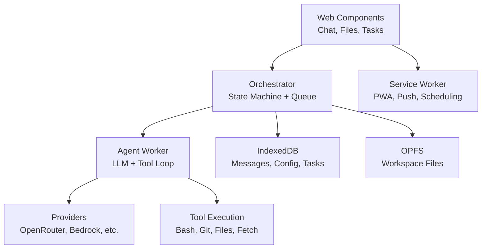

# 🦞 [ShadowClaw](https://xt-ml.github.io/shadow-claw/)

[](https://deepwiki.com/xt-ml/shadow-claw)

A browser-native, fully-featured AI assistant. TypeScript + Web Components + IndexedDB + OPFS.

[](https://xt-ml.github.io/shadow-claw/)

## Quick Start

```bash
npm install && npm start  # Express server → http://localhost:8888
```

Open Settings, select a provider (or use browser Prompt API), and start chatting.

**Desktop:** `npm run electron` or `npm run electron:build` for distributable.

## What is ShadowClaw?

A fully-functional agent runtime that runs entirely in the browser—no AI processing on a server. Built with TypeScript, it provides:

- **Multi-model support**: OpenRouter, Anthropic, Google Gemini, AWS Bedrock, Ollama, Llamafile, Transformers.js, and browser-native Prompt API
- **Web Components UI**: Native Custom Elements + TC39 Signals for reactive updates
- **Persistent storage**: IndexedDB for messages/config, OPFS for files
- **Agent tools**: File I/O, shell (with optional WebVM), Git, HTTP, JavaScript execution
- **Multi-conversation support**: Each conversation has isolated chat history, file workspace, and scheduled tasks
- **Messaging channels**: Browser chat, PeerJS, Telegram Bot API, iMessage bridge (configurable)
- **PWA + offline**: Service Worker, Web Push notifications, scheduled task execution even when closed
- **Desktop app**: Electron wrapper with full parity to the web version

## Key Features

- **Streaming responses** — Token-by-token text updates with live chat bubble
- **Dynamic context windowing** — Token-aware message history (not fixed-size window)
- **Tool profiles** — Per-model/provider tool customization and system prompt overrides
- **Model registry** — Dynamic metadata fetch (context window, modality support)
- **Attachment capabilities** — Native multimodal delivery with automatic text fallback
- **Remote MCP** — Discover and execute tools from external MCP servers
- **A2UI interactive surfaces** — Render responsive UI components (Text, Button, TextField, Row/Column layouts) from agents via PeerJS WebRTC with two-way data binding
- **Email integration** — IMAP/SMTP support with encrypted credentials
- **Web Share Target** — Receive files/URLs directly from OS share sheet
- **Scheduled tasks** — Cron expressions with server-side persistence and Web Push
- **Git integration** — Clone, branch, merge (with conflict reports), push/pull
- **File viewer** — Syntax highlighting (locally bundled CSS, no CDN), PDF preview, media playback, Web Share, native/fallback fullscreen, and relative image workspace resolving; iframe sandbox hardened (no `allow-same-origin`)
- **Files browser** — Clipboard-driven Cut/Copy/Paste actions, hidden Paste button when empty, folder self-paste protection, inter-group transfers, and conflict resolution (rename/overwrite)

## Architecture

ShadowClaw follows a **worker-isolated runtime** pattern:



**Key design principles:**

- **Agent in Web Worker** — LLM calls, tool execution, and WebVM all run off-main-thread to keep UI responsive
- **Message-based protocol** — Strict `postMessage` boundaries between main thread and worker
- **Reactive signals** — TC39 Signals (via `signal-polyfill`) drive all UI updates
- **Storage isolation** — Each conversation gets a workspace (`shadowclaw/<groupId>/workspace/`); shared config in IndexedDB

**Full architecture docs**: See [Architecture](docs/README.md#architecture) for orchestrator state machine, worker protocol, storage system, context management, and streaming.

## Multi-Conversation Support

Each conversation has:

- Independent chat history
- Isolated file workspace
- Scheduled tasks
- Editable `MEMORY.md` (loaded as system context)
- Optional per-conversation tool tagging
- Accessible sidebar with drag-and-drop reordering and clone support
- Unread indicators with pulsing highlights

Last-active conversation persists across reloads. On first launch, a default "Main" conversation is auto-created.

**Full guide**: [docs/architecture/orchestrator.md](docs/architecture/orchestrator.md)

## Providers & Models

ShadowClaw supports multiple LLM providers with a unified adapter pattern:

| Category           | Examples                                                             | Notes                              |
| ------------------ | -------------------------------------------------------------------- | ---------------------------------- |
| **Cloud**          | OpenRouter, OpenAI, Anthropic, Google Gemini, AWS Bedrock, Vertex AI | API key required                   |
| **GitHub/Copilot** | GitHub Models, Copilot Azure                                         | Server-side proxy                  |
| **Local**          | Ollama, Llamafile, Transformers.js                                   | Runs on local server or in-browser |
| **Browser**        | Prompt API (`window.LanguageModel`), LiteRT                          | Experimental, keyless, Gemini Nano |

**Features:**

- Streaming responses (OpenAI + Anthropic formats)
- Adaptive rate limiting with `retry-after` support
- Dynamic model registry with capability metadata (context, modalities, tool support)
- Multi-format support (OpenAI, Anthropic, Prompt API)
- Provider-specific error handling with help dialogs
- Prompt API session retry loop — automatically retries `LanguageModel.create()` while the model is still downloading, with availability rechecks between attempts

**Setup & details**: [docs/guides/adding-a-provider.md](docs/guides/adding-a-provider.md) | [docs/subsystems/providers.md](docs/subsystems/providers.md)

## Agent Tools

The agent has access to **30+ tools** including:

| Category    | Tools                                                                                                |
| ----------- | ---------------------------------------------------------------------------------------------------- |
| **Files**   | `read_file`, `write_file`, `patch_file`, `list_files`, `open_file`, `attach_file_to_chat`            |
| **Shell**   | `bash` (WebVM or just-bash emulator)                                                                 |
| **Git**     | `git_clone`, `git_merge`, `git_push`, `git_diff`, `git_reset`, etc.                                  |
| **Web**     | `fetch_url` (with optional Git or service account auth)                                              |
| **Compute** | `javascript` (sandboxed)                                                                             |
| **Tasks**   | `create_task`, `list_tasks`, `update_task`, `delete_task`, `enable_task`, `disable_task`, `run_task` |
| **UI**      | `show_toast`, `send_notification`, `clear_chat`                                                      |
| **Context** | `update_memory` (edits `MEMORY.md`)                                                                  |
| **Remote**  | `remote_mcp_list_tools`, `remote_mcp_call_tool` (external MCP servers)                               |
| **Email**   | `manage_email`, `email_read_messages`, `email_send_message`                                          |

### Testing WebMCP Integration

**WebMCP integration**: When `document.modelContext` is available (with `navigator.modelContext` fallback), tools are also registered through the browser's Model Context Protocol (`@mcp-b/webmcp-polyfill` v3).

```ts
// get available tools
var tools = await document.modelContext.getTools();

// format the tool list
var formattedToolsJSON = JSON.stringify(
  tools.map(
    ({ annotations, description, inputSchema, name, origin, title }) => ({
      annotations,
      description,
      inputSchema,
      name,
      origin,
      title,
    }),
  ),
  null,
  2,
);

// list available tools
console.log(formattedToolsJSON);

// get the toast tool
var [toastTool] = tools.filter((v) => v.description.includes("Show a toast"));

// run the toast tool
await document.modelContext.executeTool(
  toastTool,
  '{ "message": "Hello from 🦞 Shadow Claw!"}',
);
```

**Full reference**: [docs/subsystems/tools.md](docs/subsystems/tools.md)

## Conversations & Messaging Channels

ShadowClaw supports **four messaging channels** by default:

- `br:` — In-browser chat
- `im:` — iMessage bridge
- `peer:` — PeerJS WebRTC
- `tg:` — Telegram Bot API

Each channel creates isolated conversations with their own message history and workspace.

**Setup & architecture**: [docs/guides/configuring-messaging-channels.md](docs/guides/configuring-messaging-channels.md) (setup) | [docs/subsystems/channels.md](docs/subsystems/channels.md) (architecture + custom channels)

## Pages System

ShadowClaw includes a **Pages sidebar** for organizing and viewing workspace content.

- **Render markdown & HTML** — Save any markdown or HTML file as a page for structured preview
- **Workspace-relative links** — Links and images in pages resolve relative to the workspace
- **Page sidebar** — Persistent list of saved pages with optional toggle to hide the entire sidebar
- **Default page** — Configurable starting page shown on app launch
- **Navigation** — Click to view any saved page; page state persists across sessions

Pages complement the **main group MEMORY** (auto-created as `MEMORY.md` on first setup) which serves as a workspace-scoped system context for the agent.

## WebVM (Optional Alpine Linux)

For advanced `bash` operations, ShadowClaw includes an optional **WebVM** (`v86` Alpine Linux) that runs in the Web Worker.

- **Boot modes**: `auto` (9p, lighter weight), `ext2` (full filesystem), or `disabled` (fallback to JavaScript shell)
- **Coordination**: Terminal sessions and tool execution share exclusive access with graceful handoffs
- **Workspace sync**: 9p mode syncs VM `/workspace` changes back to OPFS so Files view stays in sync
- **Interactive terminal**: Full shell access via `<shadow-claw-terminal>` component

**Full guide**: [docs/subsystems/vm.md](docs/subsystems/vm.md)

## Storage & Security

ShadowClaw uses **IndexedDB** for structured data (messages, config, tasks) and **OPFS** for files.

**Security:**

- **AES-256-GCM encryption** for API keys at rest
- **TC39 private fields** to prevent accidental leakage via console
- **30-second key expiry** for plaintext operations
- **No plaintext secrets on disk** — encrypted before storage
- **Trusted Types enforcement** — idempotent `"default"` policy (`src/security/default-trusted-types-policy.ts`) registered at boot via `theme-init.ts`; `getPolicy()` fallback prevents duplicate-creation errors on module reload

**File I/O:**

- **OPFS** — browser-sandboxed storage (`shadowclaw/<groupId>/workspace/`)
- **Local Folder** — user-selected directory via File System Access API
- **Centralized write paths** — cross-browser fallback for Safari compatibility
- **Zip export/import** — for conversation backup/restore
- **Copy/move safety** — folder copy/move operations prevent pasting a folder into itself or one of its descendants, and support inter-group operations with conflict resolution

**Full details**: [docs/architecture/storage.md](docs/architecture/storage.md) | [docs/subsystems/crypto.md](docs/subsystems/crypto.md)

## Scheduled Tasks & Web Push

ShadowClaw supports **cron-based scheduled tasks** with Web Push notifications. Tasks fire even when the app is closed.

- Task expressions use standard **5-field cron syntax**
- **Task sequences** — Execute a single text prompt, or sequentially run a list of agent tools
- **Server-side persistence** — SQLite database ensures reliable firing
- **Web Push integration** — OS-level notifications when tasks trigger
- **Recursion guard** — prevents infinite task → notification → task loops
- **Client/Server parity** — Express dev server and Electron both support full scheduling

**Setup & architecture**: [docs/subsystems/notifications.md](docs/subsystems/notifications.md)

## Advanced Features

### Remote MCP Integration

Connect external **Model Context Protocol (MCP) servers** to extend agent capabilities dynamically. Tools from remote servers are discovered and executed transparently.

- Bearer, Basic, and custom header authentication
- OAuth token refresh support
- Automatic reconnection on failure

**Full guide**: [docs/subsystems/remote-mcp.md](docs/subsystems/remote-mcp.md)

### Protocol-Agnostic Integrations

Email (IMAP/SMTP), RSS, webhooks, and other integrations via a **plugin architecture**.

- Encrypted credential storage
- Typed action dispatch
- Configurable plugin catalog

**Full guide**: [docs/guides/protocol-agnostic-integrations.md](docs/guides/protocol-agnostic-integrations.md)

### Web Share Target

Receive files, URLs, and text directly from your OS share sheet into ShadowClaw.

- Supported on all PWA-capable browsers and Android
- Files are persisted to workspace
- Auto-opens dated conversation with imported files

**Full details**: [manifest.json](manifest.json) | [src/service-worker/share-target.ts](src/service-worker/share-target.ts)

### Tool Profiles & Customization

Create model-specific or task-specific tool profiles to optimize the context window.

- Enable/disable individual tools
- Override system prompt per profile
- Auto-activate profiles by model
- Save custom selections
- **Shared internet access control** — Toggles public internet access (`fetch` and shell networking) globally for the `bash` and `javascript` tools

**Full guide**: [docs/subsystems/tools.md](docs/subsystems/tools.md#tool-profiles)

### Attachment Capabilities

Native multimodal delivery with automatic text fallback.

- Model registry fetches capability metadata dynamically
- Attachments sent as native content blocks when supported
- Automatic fallback to OCR/markdown for unsupported formats

**Full details**: [docs/subsystems/attachment-capabilities.md](docs/subsystems/attachment-capabilities.md)

### Dynamic Context & Auto-Compaction

Instead of fixed-size message windows, context is **token-aware and adaptive**.

- System prompt + max output tokens budgeted first
- Messages walked newest-to-oldest within budget
- Large outputs truncated at line boundaries
- UI progress bar tracks context usage
- Auto-compaction triggers at 80% usage

**Full details**: [docs/architecture/context-management.md](docs/architecture/context-management.md)

## Documentation

Architecture docs, subsystem guides, and decision records live in [`docs/`](docs/README.md):

- **[Architecture](docs/README.md#architecture)** — Orchestrator, worker protocol, storage, context, streaming
- **[Subsystems](docs/README.md#subsystems)** — Shell, VM, git, channels, tools, providers, notifications, Electron, reactive UI, crypto
- **[Guides](docs/README.md#guides)** — Adding providers, tools, shell commands, pages, channels
- **[Decisions](docs/README.md#decisions)** — ADRs for bundled architecture, TypeScript, Signals, worker-owned VM, IndexedDB

Agent-specific conventions and guardrails: [`AGENTS.md`](AGENTS.md)

E2E test architecture: [`e2e/README.md`](e2e/README.md)

## Development

```bash
npm start                    # Express server
npm test                     # Jest (*.test.ts files live next to source)
npm run e2e                  # Playwright E2E tests (e2e/*.test.ts)
npm run e2e:install          # Install Playwright browser binaries
npm run tsc                  # TypeScript type-check
npm run build                # Bundle application via Rollup + generate service worker
npm run build:service-worker # Generate the Workbox service worker
npm run build:prod           # Production bundle build
npm run format               # Prettier
npm run electron             # Launch Electron desktop app
npm run electron:build       # Build Electron distributable
npm run electron:build:win   # Build Electron for Windows
npm run electron:build:mac   # Build Electron for macOS
```

## License

AGPLv3. Core logic derived from [openbrowserclaw](https://github.com/sachaa/openbrowserclaw) (MIT).
