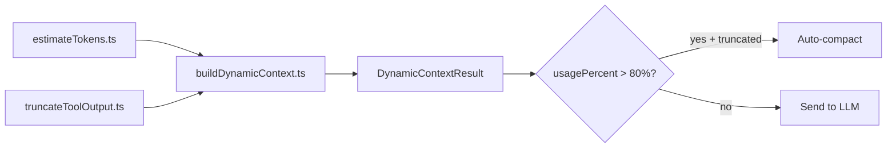
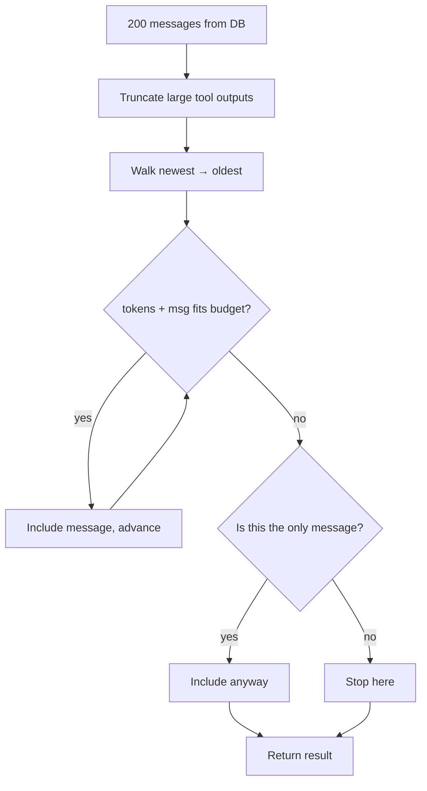

# Context Management

> Dynamic token-budget-aware context windowing replaces fixed message counts,
> ensuring the LLM always gets the most relevant recent context within its token limit.

**Source:** `src/context/`

## Overview

Instead of sending a fixed number of recent messages, the orchestrator estimates token costs and builds the context window dynamically. Three modules work together:



## Token Estimation

**File:** `src/context/estimateTokens.ts`

Lightweight heuristic: **~4 characters per token** (avoids shipping a full tokenizer).

```ts
const CHARS_PER_TOKEN = 4;
const MESSAGE_OVERHEAD_TOKENS = 4; // role, formatting

export function estimateTokens(text: string): number {
  return Math.ceil(text.length / CHARS_PER_TOKEN);
}

export function estimateMessageTokens(message: StoredMessage): number {
  let contentTokens = 0;

  if (typeof message.content === "string") {
    contentTokens = estimateTokens(message.content);
  } else if (Array.isArray(message.content)) {
    for (const block of message.content) {
      if (block.type === "text") contentTokens += estimateTokens(block.text);
      else if (block.type === "tool_use") {
        contentTokens += estimateTokens(block.name);
        contentTokens += estimateTokens(JSON.stringify(block.input));
      } else if (block.type === "tool_result") {
        contentTokens += estimateTokens(
          typeof block.content === "string"
            ? block.content
            : JSON.stringify(block.content),
        );
      }
    }
  }

  return contentTokens + MESSAGE_OVERHEAD_TOKENS;
}
```

## Output Truncation

**File:** `src/context/truncateToolOutput.ts`

Truncates large tool outputs at **line boundaries** (not mid-line):

```ts
const TOOL_OUTPUT_MAX_CHARS = 25_000; // ~6K tokens

export function truncateToolOutput(
  content: string,
  maxChars = TOOL_OUTPUT_MAX_CHARS,
): string {
  if (content.length <= maxChars) return content;

  const slice = content.slice(0, maxChars);
  const lastNewline = slice.lastIndexOf("\n");

  // Prefer clean line boundary if it's past 50% of budget
  const cutPoint = lastNewline > maxChars * 0.5 ? lastNewline : maxChars;
  const kept = content.slice(0, cutPoint);
  const truncated = content.length - cutPoint;

  return `${kept}\n[...truncated ${truncated} chars]`;
}
```

**Why 25K chars?** A single tool output (e.g., reading a large file or `git_diff`) could consume the entire context window. The 25K limit (~6K tokens) ensures no single tool result dominates the budget while preserving enough content to be useful.

## Dynamic Context Building

**File:** `src/context/buildDynamicContext.ts`

### Algorithm

1. **Calculate available budget:**
   ```text
   availableBudget = contextLimit − systemPromptTokens − maxOutputTokens
   ```
2. **Pre-truncate** all messages with large tool outputs
3. **Walk newest-to-oldest**, accumulating token estimates:
   - Always include the most recent message (even if it exceeds budget)
   - Stop when the next message would exceed remaining budget
4. **Return** the kept messages plus usage stats



### Result shape

```ts
interface DynamicContextResult {
  messages: StoredMessage[]; // Messages that fit in the budget (newest preserved)
  estimatedTokens: number; // Total tokens used by kept messages
  truncatedCount: number; // Number of older messages dropped
  contextLimit: number; // Model's context window size
  usagePercent: number; // 0–100 (rounded to 1 decimal)
}
```

## Auto-Compaction

The orchestrator monitors `usagePercent` from `buildDynamicContext()`:

| Condition                                                               | Action                                  |
| ----------------------------------------------------------------------- | --------------------------------------- |
| `usagePercent > 80%` AND messages were truncated AND >10 total messages | Queue compaction via `queueMicrotask()` |
| `usagePercent ≤ 80%`                                                    | Normal operation                        |

Compaction summarizes the conversation into a single message, freeing token budget for future messages while preserving important context.

## UI Integration

The orchestrator emits a `context-usage` event with `ContextUsage` data:

```ts
interface ContextUsage {
  estimatedTokens: number;
  contextLimit: number;
  usagePercent: number;
  truncatedCount: number;
  systemPromptTokens: number;
  maxOutputTokens: number;
}
```

The chat component renders a color-coded progress bar:

| Usage   | Color | Meaning                  |
| ------- | ----- | ------------------------ |
| 0–60%   | Green | Plenty of room           |
| 60–80%  | Amber | Getting full             |
| 80–100% | Red   | Auto-compaction imminent |

## Context Limits by Model

Context limits are resolved per model family via `getContextLimit(model)` in `src/providers.ts`:

| Model Pattern                     | Context Limit    |
| --------------------------------- | ---------------- |
| `claude` (all)                    | 200,000 tokens   |
| `gemini-1.5-pro`, `gemini-2`      | 1,048,576 tokens |
| `gemini` (other)                  | 32,768 tokens    |
| `gpt-4o`, `o1`, `o3`, `o4`        | 128,000 tokens   |
| `gpt-4-turbo`                     | 128,000 tokens   |
| `gpt-4`                           | 8,192 tokens     |
| `gpt-3.5-turbo`                   | 16,385 tokens    |
| `llama-3.1-405b`                  | 131,072 tokens   |
| `llama`                           | 131,072 tokens   |
| `amazon.nova`                     | 300,000 tokens   |
| `mistral-large`, `command-r-plus` | 128,000 tokens   |
| `phi-4`, `gemini-nano`            | 4,096 tokens     |
| Default fallback                  | 4,096 tokens     |
