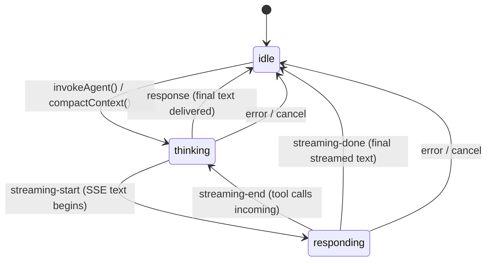
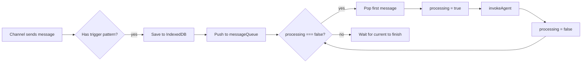
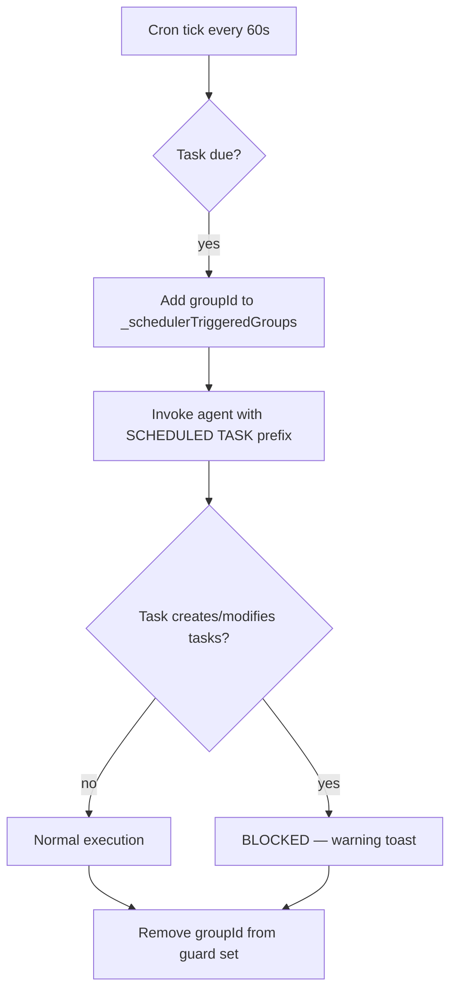

# Orchestrator & State Machine

> The orchestrator is the brain of ShadowClaw's main thread — a state machine
> that coordinates conversations, the agent worker, task scheduling, and UI updates.

**Source:** `src/orchestrator.ts` · `src/stores/orchestrator.ts`

## State Machine

The orchestrator maintains three states:



| State        | Meaning                                                 |
| ------------ | ------------------------------------------------------- |
| `idle`       | No invocation in progress; ready for new requests       |
| `thinking`   | Agent is processing (LLM calls or tool execution)       |
| `responding` | Streaming LLM response in flight (text chunks arriving) |

## Message Queue

The orchestrator maintains a **FIFO queue** for inbound messages:



## Invoke Flow

`invokeAgent(db, groupId, triggerContent)` is the main entry point for agent invocation:

1. **Set state to `thinking`**, emit typing event
2. **Load group memory** — read `MEMORY.md` from the group's OPFS workspace
3. **Build system prompt** via `buildSystemPrompt(assistantName, memory, activeTools)`
4. **Build dynamic context** — fetch last 200 messages, call `buildDynamicContext()` with:
   ```text
   availableBudget = contextLimit − systemPromptTokens − maxOutputTokens
   ```
5. **Emit `context-usage` event** for UI progress bar
6. **Auto-compact check** — if `usagePercent > 80%` AND messages were truncated AND >10 messages total: queue compaction via `queueMicrotask()`
7. **Route to provider:**
   - **Prompt API:** Route through `invokeWithPromptApi()` (main thread, no worker)
   - **All others:** Send `invoke` message to worker

### Worker invoke payload

```ts
{
  type: "invoke",
  payload: {
    groupId,         // Conversation ID (e.g., "br:main")
    messages,        // Dynamically windowed message array
    systemPrompt,    // Full system instructions + memory
    apiKey,          // Provider API key (decrypted)
    model,           // Selected model ID
    maxTokens,       // Output token limit
    maxIterations,   // Tool-use loop limit (user-configurable, 1–200)
    provider,        // Provider config object
    storageHandle,   // Optional OPFS directory handle
    enabledTools,    // Array of ToolDefinition objects
    streaming,       // Boolean: enable SSE streaming?
    isScheduledTask, // Boolean: recursion guard flag
  }
}
```

## Compact Flow

Context compaction summarizes the conversation to free token budget:

1. Check API key availability
2. Check state is `idle` (no concurrent invocations)
3. Load memory and active tools
4. Build context (same as invoke)
5. Route to Prompt API or worker `compact` message
6. Worker generates summary → sends `compact-done`
7. `handleCompactDone()`: clear all messages, save summary as new message, set state `idle`

## System Prompt Assembly

`buildSystemPrompt(assistantName, memory, tools)` concatenates:

1. **Identity** — "You are [assistantName], a personal AI assistant..."
2. **Tool list** — Tool names + brief descriptions
3. **Guidelines** — Conciseness, proactive tool use, memory updates, task scheduling
4. **Tool usage strategy:**
   - Prefer `read_file` over bash for reading (supports `paths` array for batch reads)
   - Use `patch_file` for targeted edits (safer than sed)
   - Use `javascript` for computations (must use `return`)
   - Git merge instructions (read_file + write_file, never bash/sed)
   - `fetch_url` with `use_git_auth: true` for Git hosts
5. **Shell fallback tips** — grep -r, sed -i, find (no -exec), jq
6. **Memory section** — Contents of `MEMORY.md` (if it exists)
7. **System prompt override** — From active tool profile (if set)

## Worker Message Handling

The orchestrator dispatches all worker messages through `handleWorkerMessage(db, msg)`:

| Message Type              | Action                                                          |
| ------------------------- | --------------------------------------------------------------- |
| `response`                | Persist to DB, emit to router, set state `idle`                 |
| `streaming-start`         | Set state `responding`, emit event                              |
| `streaming-chunk`         | Forward to UI (store accumulates chunks)                        |
| `intermediate-response`   | Persist text as permanent bubble (before tool calls)            |
| `streaming-end`           | Set state `thinking` (tool calls coming)                        |
| `streaming-done`          | Emit event, set state `idle`                                    |
| `streaming-error`         | Emit error event                                                |
| `error`                   | Deliver error response prefixed with "⚠️ Error:"; may emit `provider-help` for provider-specific remediation |
| `typing`                  | Emit typing event to router                                     |
| `tool-activity`           | Emit event; trigger `file-change` on write_file/bash completion |
| `task-created`            | Check recursion guard → sync to server → save to DB             |
| `update-task`             | Check recursion guard → sync to server → update DB              |
| `delete-task`             | Check recursion guard → delete from server → delete from DB     |
| `token-usage`             | Emit for UI stats                                               |
| `thinking-log`            | Emit for debug sidebar                                          |
| `compact-done`            | Clear messages, save summary, set state `idle`                  |
| `model-download-progress` | Emit for Prompt API download UI                                 |
| `vm-status`               | Update `vmStatus`, emit event                                   |
| `vm-terminal-*`           | Forward to terminal component via events                        |
| `vm-workspace-synced`     | Emit `file-change` event                                        |
| `open-file`               | Emit for file viewer                                            |
| `show-toast`              | Call `showToast()` helper                                       |
| `send-notification`       | Check recursion guard → POST `/push/broadcast`                  |

## EventBus

Simple event emitter for orchestrator-to-UI communication:

| Event                                    | When emitted                    |
| ---------------------------------------- | ------------------------------- |
| `ready`                                  | Orchestrator initialized        |
| `state-change`                           | State transitioned              |
| `message`                                | New message received/created    |
| `typing`                                 | Typing indicator toggled        |
| `tool-activity`                          | Tool execution started/finished |
| `context-usage`                          | Token budget stats updated      |
| `streaming-start/chunk/end/done`         | SSE lifecycle events            |
| `vm-status`                              | VM status changed               |
| `vm-terminal-opened/closed/output/error` | Terminal session events         |
| `file-change`                            | Workspace file system changed   |
| `context-compacted`                      | Context summarized              |
| `task-change`                            | Task created/updated/deleted    |
| `model-download-progress`                | Prompt API model downloading    |
| `provider-help`                          | Provider-specific setup/help dialog hint (e.g., local runtimes) |

## Conversation Isolation

All per-conversation state is scoped to `groupId`:

- Messages, streaming text, typing indicator, tool activity, activity log
- Unread indicators via `_unreadGroupIds` Set
- Context usage stats

**Switching conversations** (`setActiveGroup(groupId)`):

- Resets all transient state (streaming, typing, activity)
- Loads message history for new group asynchronously
- Guards against stale async results — if active group changes mid-query, returned messages are discarded

## Scheduler Integration

The orchestrator creates a `TaskScheduler` instance at `init()`:



**Recursion guard:** When a scheduled task runs, the orchestrator blocks:

- `task-created`, `update-task`, `delete-task` — prevents task cascade
- `send-notification` — prevents infinite push → task → push loops

Both client-side scheduler and server-side push triggers use the same guard set.

## Terminal Bridge

The orchestrator provides wrapper methods for VM terminal communication:

| Method                            | Worker Message       |
| --------------------------------- | -------------------- |
| `openTerminalSession(groupId)`    | `vm-terminal-open`   |
| `sendTerminalInput(data)`         | `vm-terminal-input`  |
| `closeTerminalSession(groupId)`   | `vm-terminal-close`  |
| `syncTerminalWorkspace(groupId)`  | `vm-workspace-sync`  |
| `flushTerminalWorkspace(groupId)` | `vm-workspace-flush` |

## Public API

Key methods exposed by the Orchestrator class:

| Method                              | Purpose                                                            |
| ----------------------------------- | ------------------------------------------------------------------ |
| `init()`                            | Initialize: open DB, load config, set up channels, start scheduler |
| `submitMessage(text, groupId?)`     | Post browser chat message                                          |
| `invokeAgent(db, groupId, content)` | Trigger agent invocation                                           |
| `compactContext(db, groupId?)`      | Summarize conversation context                                     |
| `stopCurrentRequest(groupId?)`      | Abort in-flight agent request                                      |
| `setProvider(db, providerId)`       | Switch LLM provider                                                |
| `setModel(db, model)`               | Switch model (auto-activates matching tool profile)                |
| `setMaxIterations(db, value)`       | Set tool-use loop limit (1–200)                                    |
| `setStreamingEnabled(db, enabled)`  | Toggle SSE streaming                                               |
| `setVMBootMode(db, mode)`           | Change VM mode                                                     |
| `newSession(db, groupId?)`          | Clear message history                                              |
| `shutdown()`                        | Stop scheduler, terminate worker, cleanup                          |
