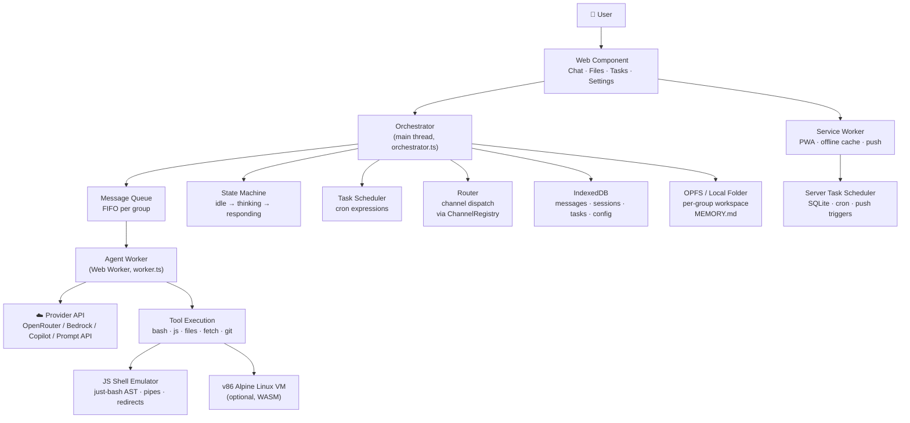
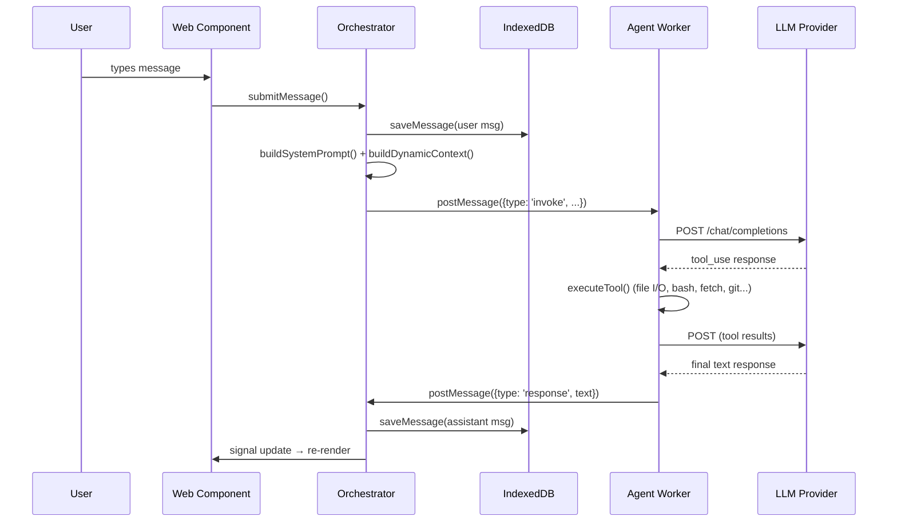
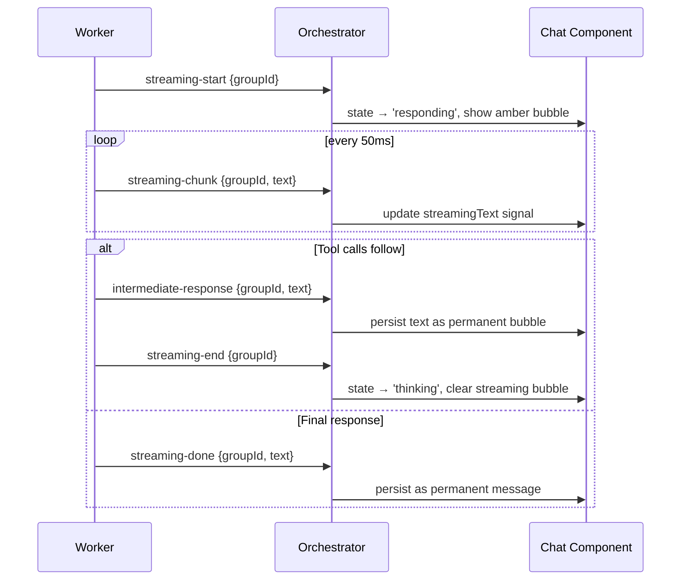

# System Overview

> High-level architecture, data flow, and design philosophy of ShadowClaw.

**Source:** `src/index.ts` · `src/worker/worker.ts` · `src/server/server.ts` · `electron/main.ts`

## What is ShadowClaw?

ShadowClaw is a **browser-native AI assistant** — a fully functional agent runtime that runs entirely in the browser with zero server-side AI logic. It's built with TypeScript and bundled with Rollup.

**Stack at a glance:**

| Layer         | Technology                                                          |
| ------------- | ------------------------------------------------------------------- |
| Language      | TypeScript (`.ts`) — all source files                               |
| Build         | Rollup (frontend, worker, service workers, server, Electron)        |
| UI            | Native Web Components + Shadow DOM                                  |
| Reactivity    | TC39 Signals via `signal-polyfill`                                  |
| State         | IndexedDB (messages, config, tasks, sessions)                       |
| Files         | OPFS + File System Access API                                       |
| Agent Runtime | Web Worker (`src/worker/worker.ts` → `dist/public/agent.worker.js`) |
| Shell         | `just-bash` POSIX emulator + optional WebVM (v86)                   |
| Git           | isomorphic-git + LightningFS (in-browser)                           |
| PWA           | Service Worker (Workbox) + Web Push                                 |
| Server        | Express (`src/server/server.ts` → `dist/server.js`)                 |
| Desktop       | Electron (`electron/main.ts` → `dist/electron/main.cjs`)            |
| Testing       | Jest (unit, `*.test.ts`) + Playwright (E2E, `e2e/*.test.ts`)        |

## Architecture Diagram



## Design Philosophy

### 1. Browser-native first

Everything runs in the browser. The Express server exists only for:

- CORS proxying (Bedrock, Copilot Azure, Git)
- Web Push notification delivery
- Server-side task scheduling (fires when no tab is open)
- Static file serving

Basic chat (direct API calls to OpenRouter) works without the server.

### 2. TypeScript everywhere, Rollup for bundling

The entire codebase is TypeScript. Rollup produces six distinct bundles:

| Bundle                     | Input                                | Output                                       | Purpose                |
| -------------------------- | ------------------------------------ | -------------------------------------------- | ---------------------- |
| Frontend                   | `src/index.ts`                       | `dist/public/index.js`                       | App bootstrap + all UI |
| Agent Worker               | `src/worker/worker.ts`               | `dist/public/agent.worker.js`                | Tool-use loop + VM     |
| Service Worker init        | `src/service-worker/init.ts`         | `dist/public/service-worker/init.js`         | PWA cache registration |
| Service Worker push        | `src/service-worker/push-handler.ts` | `dist/public/service-worker/push-handler.js` | Push event handler     |
| Service Worker fetch proxy | `src/service-worker/fetch-proxy.ts`  | `dist/public/service-worker/fetch-proxy.js`  | Fetch interception     |
| Server                     | `src/server/server.ts`               | `dist/server.js`                             | Express server         |
| Electron                   | `electron/main.ts`                   | `dist/electron/main.cjs`                     | Desktop app entry      |

External dependencies are installed via `npm install` and bundled by Rollup — no CDN importmaps.

### 3. Worker-isolated agent

The LLM tool-use loop runs in a dedicated Web Worker. This means:

- The UI thread never blocks during LLM calls or tool execution
- The VM (v86) runs in the worker, fully isolated from the UI
- Cancellation is clean — abort the worker's `AbortController`

### 4. Co-located component assets

Web Components now live in their own subdirectories with co-located `.html` templates and `.css` stylesheets:

```text
src/components/shadow-claw-chat/
├── shadow-claw-chat.ts     # Component logic
├── shadow-claw-chat.html   # Shadow DOM template (fetched at runtime)
└── shadow-claw-chat.css    # Shadow DOM styles (adopted at runtime)
```

The `ShadowClawElement` base class (`src/components/shadow-claw-element.ts`) handles fetching and attaching templates and stylesheets via `fetch()` + `adoptedStyleSheets`.

### 5. Conversation isolation

Every conversation (group) has its own:

- Message history (IndexedDB)
- File workspace (OPFS: `shadowclaw/<groupId>/workspace/`)
- Persistent memory (`MEMORY.md` at workspace root)
- Scheduled tasks
- Streaming state, typing indicators, tool activity

Switching conversations fully resets transient UI state. Background conversations continue processing and persist results to IndexedDB.

## Data Flow

### Message lifecycle



### Streaming flow

When streaming is enabled, the worker sends incremental chunks:



## Entry Points

| File                                 | Thread  | Role                                                                          |
| ------------------------------------ | ------- | ----------------------------------------------------------------------------- |
| `src/index.ts`                       | Main    | App bootstrap — opens IndexedDB, boots orchestrator, registers service worker |
| `src/worker/worker.ts`               | Worker  | Agent worker — owns LLM tool-use loop, VM, tool execution                     |
| `src/server/server.ts`               | Node.js | Express dev/prod server — proxy, push, scheduling, static files               |
| `electron/main.ts`                   | Node.js | Electron main process — same Express server in-process                        |
| `src/service-worker/init.ts`         | SW      | Service worker bootstrap — Workbox cache registration                         |
| `src/service-worker/push-handler.ts` | SW      | Web Push event handler                                                        |
| `src/service-worker/fetch-proxy.ts`  | SW      | Fetch interception                                                            |

## Key Directories

| Directory                  | Contents                                                                        |
| -------------------------- | ------------------------------------------------------------------------------- |
| `src/`                     | All application source code                                                     |
| `src/components/`          | Web Components (`<shadow-claw-*>`), each in its own subdirectory                |
| `src/components/common/`   | Reusable shared components (`empty-state`, `card`, `actions`) |
| `src/components/settings/` | Recommended home for settings feature components (incremental migration)        |
| `src/stores/`              | Reactive signal-based state stores                                              |
| `src/tools/`               | Agent tool definitions (modular `.ts` files)                                    |
| `src/worker/`              | Worker internals (invoke handler, tool executor, stream parser, retry logic)    |
| `src/shell/`               | JS shell emulator + OPFS bridge                                                 |
| `src/context/`             | Token estimation, dynamic windowing, output truncation                          |
| `src/channels/`            | Channel registry + browser chat channel                                         |
| `src/db/`                  | IndexedDB layer (granular modules for each DB operation)                        |
| `src/storage/`             | OPFS + File System Access API abstractions                                      |
| `src/git/`                 | isomorphic-git operations + OPFS sync                                           |
| `src/notifications/`       | Web Push + server-side SQLite task scheduling                                   |
| `src/server/`              | Express server + proxy routes                                                   |
| `src/service-worker/`      | Service worker modules                                                          |
| `electron/`                | Electron desktop app entry point                                                |
| `e2e/`                     | Playwright E2E tests (Page Object Model pattern)                                |
