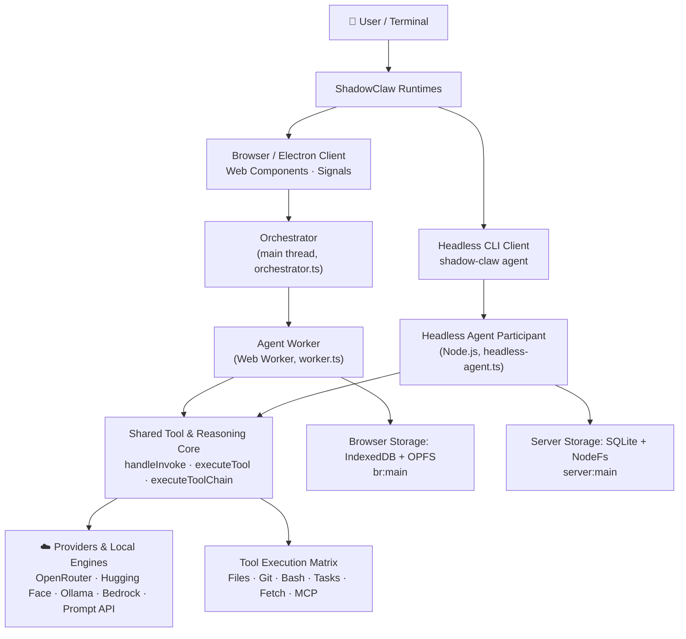
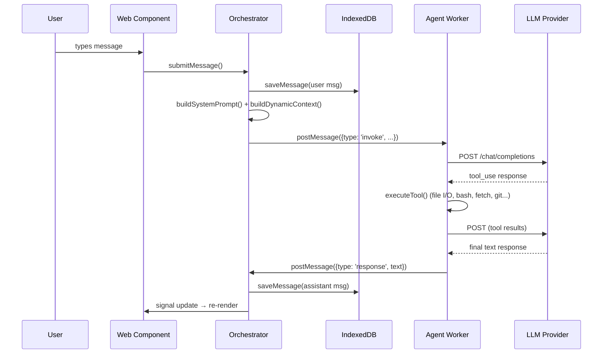
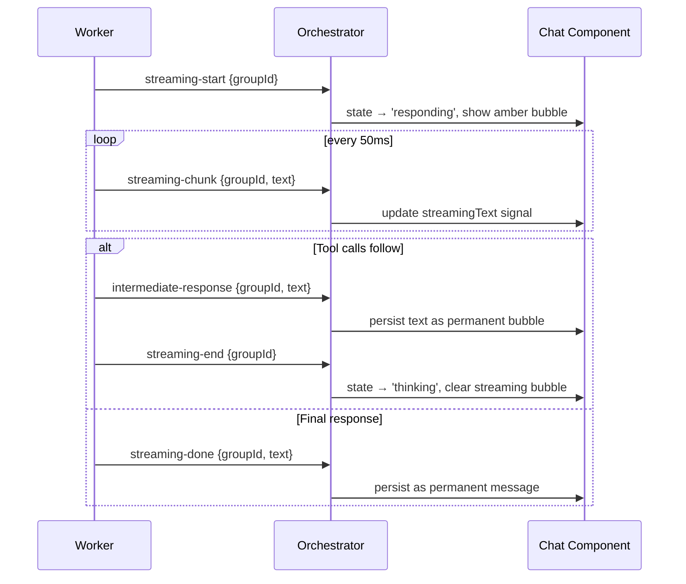

# System Overview

> High-level architecture, data flow, and design philosophy of ShadowClaw.

**Source:** `src/core/index.ts` · `src/worker/worker.ts` · `src/server/server.ts` · `electron/main.ts`

## What is ShadowClaw?

ShadowClaw is a **dual-runtime AI assistant** combining a rich, interactive frontend client with a first-class, host-native server-side agent participant:

1. **Interactive Frontend Client (Browser & Electron)**: Runs the complete orchestration state machine, context management, and tool-use loop off the main thread in a dedicated Web Worker, with UI reactivity powered by native Web Components and TC39 Signals, and sandboxed storage across OPFS and IndexedDB.
2. **Headless Server-Side Client (`shadow-claw agent`)**: Runs the exact same reasoning loop, declarative skills, and tool chain pipelines natively on Node.js—backed by SQLite (`node:sqlite`), native filesystem handles (`NodeFsDirectoryHandle`), and direct host OS shell execution (`node:child_process`).

Inference routes across in-browser models (Prompt API with polyfill fallbacks, LiteRT WebGPU), local servers (Ollama, Llamafile, Transformers.js with automatic Hugging Face downloading), and cloud providers (defaulting to OpenRouter with `openrouter/free`).

**Stack at a glance:**

| Layer         | Technology                                                                                                 |
| ------------- | ---------------------------------------------------------------------------------------------------------- |
| Language      | TypeScript (`.ts`) — all source files                                                                      |
| Build         | Rolldown (frontend, worker, service workers, server, headless agent, Electron)                             |
| UI            | Native Web Components + Shadow DOM                                                                         |
| Reactivity    | TC39 Signals via `signal-polyfill`                                                                         |
| State         | IndexedDB (browser) / SQLite via `node:sqlite` (headless CLI)                                              |
| Files         | OPFS (browser) / `NodeFsDirectoryHandle` via `node:fs` (headless CLI)                                      |
| Agent Runtime | Web Worker (`dist/public/agent.worker.js`) / Node.js headless agent participant (`dist/headless-agent.js`) |
| Shell         | `just-bash` POSIX emulator + WebVM (v86) in browser; native `node:child_process` in headless CLI           |
| Git           | isomorphic-git + native filesystem handles                                                                 |
| PWA           | Service Worker (Workbox) + Web Push                                                                        |
| Server        | Express (`src/server/` package)                                                                            |
| Desktop       | Electron (`electron/main.ts` → `dist/electron/main.cjs`)                                                   |
| Testing       | Jest (unit, `*.test.ts`, headless tests) + Playwright (E2E, `e2e/*.test.ts`)                               |

## Architecture Diagram


```mermaid
graph TD
  User["👤 User / Terminal"] --> Runtimes["ShadowClaw Runtimes"]
  Runtimes --> UI["Browser / Electron Client<br>Web Components · Signals"]
  Runtimes --> CLI["Headless CLI Client<br>shadow-claw agent"]

  UI --> Orchestrator["Orchestrator<br>(main thread, orchestrator.ts)"]
  Orchestrator --> Worker["Agent Worker<br>(Web Worker, worker.ts)"]

  CLI --> HeadlessAgent["Headless Agent Participant<br>(Node.js, headless-agent.ts)"]

  Worker --> CoreEngine["Shared Tool & Reasoning Core<br>handleInvoke · executeTool · executeToolChain"]
  HeadlessAgent --> CoreEngine

  CoreEngine --> Providers["☁️ Providers & Local Engines<br>OpenRouter · Hugging Face · Ollama · Bedrock · Prompt API"]
  CoreEngine --> Tools["Tool Execution Matrix<br>Files · Git · Bash · Tasks · Fetch · MCP"]

  Worker --> BrowserStorage["Browser Storage: IndexedDB + OPFS<br>br:main"]
  HeadlessAgent --> ServerStorage["Server Storage: SQLite + NodeFs<br>server:main"]
```

## Design Philosophy

### 1. Dual runtime with browser-native frontend excellence

The frontend UI and client-side agent runtime are built on browser-native technology (Web Components, TC39 Signals, Web Workers, OPFS, IndexedDB). In parallel, the headless agent participant (`shadow-claw agent`) extends the same core prompt assembly, skill parsing, and tool dispatch natively to Node.js, SQLite, and real host filesystems. The Express server provides a suite of backend services including:

- CORS proxying for LLM providers (Bedrock, Vertex AI, Gemini, etc.)
- Web Push notification delivery and VAPID management
- Server-side task scheduling (SQLite-backed, fires when no tab is open)
- Static file serving and SPA routing
- Transformers.js and Llamafile local model runtimes with on-demand Hugging Face model downloading

### 2. TypeScript everywhere, Rolldown for bundling

The entire codebase is TypeScript. Rolldown produces modular bundles for the frontend, worker, service worker, server, and Electron.

In production builds (`npm run build:prod`), critical assets (`index.css`, `theme-init.js`, and `service-worker/init.js`) are inlined directly into `index.html` alongside pre-rendered Declarative Shadow DOM (DSD) shells, eliminating render-blocking network requests. Production assets are further minified using `htmlnano` and `cssnano`. Service worker initialization is deferred (10-second idle delay) to prioritize immediate user interactivity.

### 3. Worker-isolated agent

The LLM tool-use loop runs in a dedicated Web Worker. This means:

- The UI thread never blocks during LLM calls or tool execution
- Default provider (`prompt_api`) executes browser-native inference with transparent CPU/WASM fallback
- The VM (v86) runs in the worker, fully isolated from the UI
- Cancellation is clean — abort the worker's `AbortController`

### 4. Co-located component assets

Web Components now live in their own subdirectories with co-located `.html` templates and `.css` stylesheets:

```text
src/components/shadow-claw-chat/
├── shadow-claw-chat.ts     # Component logic
├── utils/                  # Extracted helper utilities
├── shadow-claw-chat.html   # Shadow DOM template (fetched at runtime)
└── shadow-claw-chat.css    # Shadow DOM styles (adopted at runtime)
```

The `ShadowClawElement` base class (`src/components/shadow-claw-element.ts`) handles fetching and attaching templates and stylesheets via `fetch()` + `adoptedStyleSheets`. Dedicated views such as `<shadow-claw-tools>` manage granular tool configurations and execution boundaries.

### 5. Conversation isolation

Every conversation (group) has its own:

- Message history (IndexedDB)
- File workspace (OPFS: `shadowclaw/<groupId>/workspace/`)
- Persistent memory (`MEMORY.md` at workspace root)
- Scheduled tasks
- Optional pinned provider/model and max output token override
- Streaming state, typing indicators, tool activity

Switching conversations fully resets transient UI state. Background conversations continue processing and persist results to IndexedDB.

## Data Flow

### Message lifecycle


```mermaid
sequenceDiagram
  participant U as User
  participant UI as Web Component
  participant O as Orchestrator
  participant IDB as IndexedDB
  participant W as Agent Worker
  participant LLM as LLM Provider

  U->>UI: types message
  UI->>O: submitMessage()
  O->>IDB: saveMessage(user msg)
  O->>O: buildSystemPrompt() + buildDynamicContext()
  O->>W: postMessage({type: 'invoke', ...})
  W->>LLM: POST /chat/completions
  LLM-->>W: tool_use response
  W->>W: executeTool() (file I/O, bash, fetch, git...)
  W->>LLM: POST (tool results)
  LLM-->>W: final text response
  W->>O: postMessage({type: 'response', text})
  O->>IDB: saveMessage(assistant msg)
  O->>UI: signal update → re-render
```

### Streaming flow

When streaming is enabled, the worker sends incremental chunks:


```mermaid
sequenceDiagram
  participant W as Worker
  participant O as Orchestrator
  participant UI as Chat Component

  W->>O: streaming-start {groupId}
  O->>UI: state → 'responding', show amber bubble
  loop every 50ms
    W->>O: streaming-chunk {groupId, text}
    O->>UI: update streamingText signal
  end
  alt Tool calls follow
    W->>O: intermediate-response {groupId, text}
    O->>UI: persist text as permanent bubble
    W->>O: streaming-end {groupId}
    O->>UI: state → 'thinking', clear streaming bubble
  else Final response
    W->>O: streaming-done {groupId, text}
    O->>UI: persist as permanent message
  end
```

## Entry Points

| File                                 | Thread  | Role                                                                           |
| ------------------------------------ | ------- | ------------------------------------------------------------------------------ |
| `src/core/index.ts`                  | Main    | App bootstrap — opens IndexedDB, boots orchestrator, registers service worker  |
| `src/worker/worker.ts`               | Worker  | Agent worker — owns LLM tool-use loop, VM, tool execution                      |
| `src/server/server.ts`               | Node.js | Express dev/prod server — proxy, push, scheduling, control plane, static files |
| `electron/main.ts`                   | Node.js | Electron main process — same Express server in-process                         |
| `src/service-worker/init.ts`         | SW      | Service worker bootstrap — Workbox cache registration                          |
| `src/service-worker/push-handler.ts` | SW      | Web Push event handler                                                         |
| `src/service-worker/fetch-proxy.ts`  | SW      | Fetch interception                                                             |

## Key Directories

| Directory                       | Contents                                                                     |
| ------------------------------- | ---------------------------------------------------------------------------- |
| `bin/`                          | CLI entry points (`bin/cli.mjs`), build pipeline (`bin/build/`), and scripts |
| `pages/`                        | Static site pages and routes (for in-repo deployment)                        |
| `src/`                          | All application source code                                                  |
| `src/components/`               | Web Components (`<shadow-claw-*>`), each in its own subdirectory             |
| `src/components/common/`        | Reusable shared components (`empty-state`, `card`, `actions`)                |
| `src/components/settings/`      | Recommended home for settings feature components (incremental migration)     |
| `src/context/`                  | Token estimation, dynamic windowing, output truncation                       |
| `src/db/`                       | IndexedDB layer (granular modules for each DB operation)                     |
| `src/server/`                   | Express server, control plane, proxy routes, WebRTC, and backup APIs         |
| `src/service-worker/`           | Service worker modules                                                       |
| `src/shell/`                    | JS shell emulator + OPFS bridge                                              |
| `src/storage/`                  | OPFS + File System Access API abstractions                                   |
| `src/stores/`                   | Reactive signal-based state stores                                           |
| `src/subsystems/channels/`      | Channel registry + browser chat channel                                      |
| `src/subsystems/git/`           | isomorphic-git operations + OPFS sync                                        |
| `src/subsystems/notifications/` | Web Push + server-side SQLite task scheduling                                |
| `src/subsystems/tools/`         | Agent tool definitions (modular `.ts` files)                                 |
| `src/worker/tools/`             | Agent tool execution handlers                                                |
| `src/worker/`                   | Worker internals (invoke handler, tool executor, stream parser, retry logic) |
| `electron/`                     | Electron desktop app entry point                                             |
| `e2e/`                          | Playwright E2E tests (Page Object Model pattern)                             |

## Source directory categories

- `src/core/` contains the application bootstrap, orchestrator brain, and main routing wiring.
- `src/config/` contains configuration keys, provider settings, auth integration settings, and feature flags.
- `src/content/` contains content sanitization, markdown rendering, attachment handling, and message parsing.
- `src/security/` contains cryptography, credential helpers, and trusted types wrappers.
- `src/subsystems/` contains full integrations and cross-cutting feature bundles such as `git`, `mcp`, `providers`, `notifications`, and `channels`.
- `src/ui/` contains page-level UI glue and view scaffolding that is not a standalone Web Component.
- `src/utils/` contains generic utilities and reusable helpers used across the application.

Stable root directories also include `src/components/`, `src/stores/`, `src/worker/`, `src/shell/`, `src/storage/`, `src/server/`, `src/service-worker/`, and `electron/`.
