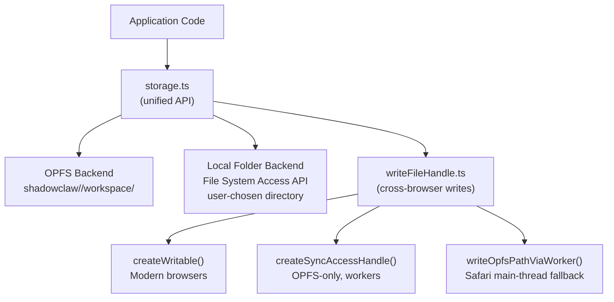

# Storage System

> ShadowClaw's file I/O layer supports two backends — OPFS (Origin Private File System)
> and user-selected local directories — with cross-browser write fallbacks.

**Source:** `src/storage/`

## Architecture



## Storage Root Resolution

The storage root is resolved lazily:

1. Check `CONFIG_KEYS.STORAGE_HANDLE` — user-selected directory via `showDirectoryPicker()`
2. If no local handle: fall back to OPFS root at `/shadowclaw/`
3. Maintain a cached `explicitRoot` handle (invalidated on stale errors)
4. Probe handle access with `probeHandleAccess()` — uses capability checks since Electron/browsers may misreport `queryPermission`

## Group Workspace Structure

Each conversation has an isolated workspace:

```text
[storage-root]/
└── groups/
    └── [groupId]/
        └── workspace/
            ├── MEMORY.md           # Persistent agent memory (auto-loaded per invocation)
            ├── user-files/         # Files created by user or agent
            └── repos/              # Git repos (auto-synced from LightningFS)
                └── my-repo/
                    ├── src/
                    └── ...
```

**Path normalization** (`src/storage/parsePath.ts`):

- Strips leading `/workspace/` and `/` characters
- Splits on `/`, filters empty segments
- Returns `{ dirs: string[], filename: string }` for nested directory traversal

**GroupId sanitization:**

- Colons (`:` in `br:main`) are replaced with dashes for filesystem compatibility

## Write Path Selection

`src/storage/writeFileHandle.ts` provides cross-browser file writing with fallback mechanisms:

### 1. `createWritable()` (Standard)

Modern File System Access API. Works on main thread and workers in most browsers.

```ts
const writable = await fileHandle.createWritable();
await writable.write(content);
await writable.close();
```

### 2. `createSyncAccessHandle()` (OPFS-only)

Synchronous writes in workers. Atomic file replacement:

```ts
const syncHandle = await fileHandle.createSyncAccessHandle();
syncHandle.truncate(0);
syncHandle.write(bytes, { at: 0 });
syncHandle.flush();
syncHandle.close();
```

Only available for OPFS handles in workers; not on main thread (Safari limitation).

### 3. Worker Fallback (`writeOpfsPathViaWorker.ts`)

When OPFS main-thread writes fail (`"Writable file streams are not supported"`):

1. Spawn an inline Web Worker
2. Worker navigates OPFS path independently (handles aren't structured-cloneable in Safari)
3. Worker performs sync write
4. Posts success/error back

## Read Paths

`src/storage/readGroupFile.ts` uses a layered approach:

1. **OPFS worker path** — `createSyncAccessHandle()` for guaranteed fresh reads
2. **File System Access API path** — `getFile()` + `file.text()` fallback
3. **Fresh handles** — Re-acquires handles from parent directory to force Chrome filesystem re-stat (Chrome caches file references and may return stale data)

## Write Flow

`writeGroupFile(db, groupId, path, content)` in `src/storage/writeGroupFile.ts`:

1. Navigate to target directory (create nested dirs on-the-fly)
2. Get or create file handle
3. Call `writeFileHandle(handle, content)`
4. **Two-attempt retry** — on first `InvalidStateError` (stale handle), re-acquire handle and retry
5. On failure (OPFS only) — retry via worker: `writeOpfsPathViaWorker(pathSegments, content)`

## File Operations

| Operation   | Function                 | Notes                                                 |
| ----------- | ------------------------ | ----------------------------------------------------- |
| Read file   | `readGroupFile()`        | Sync handle preferred for freshness                   |
| Read bytes  | `readGroupFileBytes()`   | Raw `Uint8Array` for binary files (PDFs, images)      |
| Write file  | `writeGroupFile()`       | Auto-creates directories, two-attempt retry           |
| List files  | `listGroupFiles()`       | Returns `name` (files) or `name/` (directories)       |
| Delete file | `deleteGroupFile()`      | `dir.removeEntry(filename)`                           |
| Delete dir  | `deleteGroupDirectory()` | Recursive removal                                     |
| Delete all  | `deleteAllGroupFiles()`  | Complete workspace wipe (for restore ops)             |
| Upload file | `uploadGroupFile()`      | Accepts `File` from `<input>`, reads as text or bytes |
| File exists | `groupFileExists()`      | Non-throwing existence check                          |

## Zip Export/Import

### Export (`downloadAllGroupFilesAsZip.ts`)


Uses the `jszip` library. `addDirToZip.ts` recursively walks directories and adds both files and empty directory markers.

A per-directory variant (`downloadGroupDirectoryAsZip.ts`) is available for exporting a subtree without the full workspace.

### Import (`restoreAllGroupFilesFromZip.ts`)

1. Delete all existing files in workspace
2. Extract zip entries
3. Create nested directories on-the-fly
4. Write each file via `writeFileHandle()`

## Storage Status

| Function                     | Purpose                                                 |
| ---------------------------- | ------------------------------------------------------- |
| `getStorageEstimate()`       | Query `navigator.storage.estimate()` (quota info)       |
| `isPersistent()`             | Check `navigator.storage.persisted()`                   |
| `requestPersistentStorage()` | Call `navigator.storage.persist()` (user opt-in)        |
| `requestStorageAccess()`     | `document.requestStorageAccess()` (cross-origin iframe) |
| `selectStorageDirectory()`   | Open `showDirectoryPicker()` and persist handle         |

## Stale Handle Workaround

Chrome's File System Access API can cache file references and return stale metadata. The storage layer works around this by:

1. **Re-acquiring handles** from parent directories before reads
2. **Probing** handles with `probeHandleAccess()` instead of trusting `queryPermission`
3. **Two-attempt retries** on `InvalidStateError` during writes
4. **Fresh `getFile()` calls** rather than reusing cached File objects
