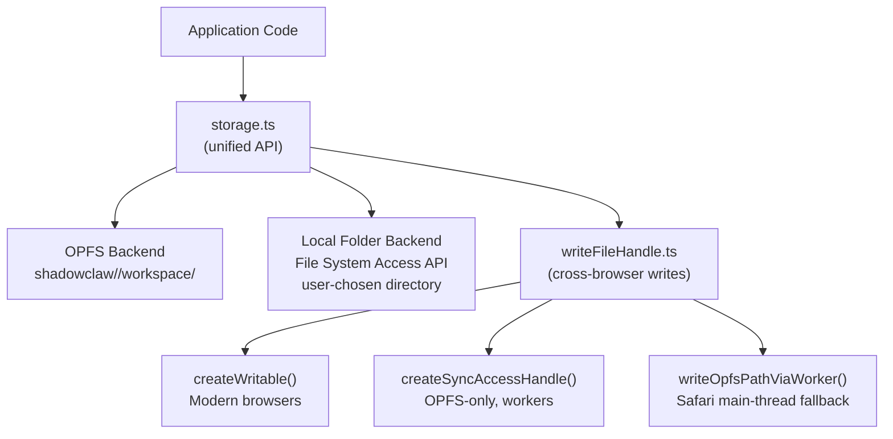

# Storage System

> ShadowClaw's file I/O layer supports two backends — OPFS (Origin Private File System)
> and user-selected local directories — with cross-browser write fallbacks.

**Source:** `src/storage/`

## Architecture


```mermaid
graph TD
  App[Application Code] --> StorageAPI["storage.ts<br>(unified API)"]
  StorageAPI --> OPFS["OPFS Backend<br>shadowclaw/<groupId>/workspace/"]
  StorageAPI --> LocalFS["Local Folder Backend<br>File System Access API<br>user-chosen directory"]
  StorageAPI --> WritePath["writeFileHandle.ts<br>(cross-browser writes)"]
  WritePath --> Standard["createWritable()<br>Modern browsers"]
  WritePath --> Sync["createSyncAccessHandle()<br>OPFS-only, workers"]
  WritePath --> WorkerFB["writeOpfsPathViaWorker()<br>Safari main-thread fallback"]
```

## Storage Root Resolution

The storage root is resolved lazily:

1. Check `CONFIG_KEYS.STORAGE_HANDLE` — user-selected directory via `showDirectoryPicker()`
2. If no local handle: fall back to OPFS root at `/shadowclaw/` via `navigator.storage.getDirectory()`
3. If OPFS is restricted or throws a `SecurityError` (e.g. Firefox Private Browsing mode), transparently fall back to an in-memory `FileSystemDirectoryHandle` implementation (`src/storage/memoryStorage.ts`), keeping the application functional and notifying the user.
4. Maintain a cached `explicitRoot` handle (invalidated on stale errors)
5. Probe handle access with `probeHandleAccess()` — uses capability checks since Electron/browsers may misreport `queryPermission`

## Group Workspace Structure

Each conversation has an isolated workspace:

```text
[storage-root]/
└── groups/
    └── [groupId]/
        └── workspace/
            ├── MEMORY.md           # Persistent agent memory (auto-loaded per invocation)
            ├── user-files/         # Files created by user or agent
            └── repos/              # Git repos (stored directly in OPFS git namespace)
                └── my-repo/
                    ├── src/
                    └── ...
```

**Path normalization** (`src/storage/parsePath.ts`):

- Strips leading `/workspace/` and `/` characters
- Splits on `/`, filters empty segments
- Returns `{ dirs: string[], filename: string }` for nested directory traversal

**GroupId sanitization:**

- Colons (`:` in `br:main`) are replaced with dashes for filesystem compatibility

## Write Path Selection

`src/storage/writeFileHandle.ts` provides cross-browser file writing with fallback mechanisms:

### 1. `createWritable()` (Standard)

Modern File System Access API. Works on main thread and workers in most browsers.

```ts
const writable = await fileHandle.createWritable();
await writable.write(content);
await writable.close();
```

### 2. `createSyncAccessHandle()` (OPFS-only)

Synchronous writes in workers. Atomic file replacement:

```ts
const syncHandle = await fileHandle.createSyncAccessHandle();
syncHandle.truncate(0);
syncHandle.write(bytes, { at: 0 });
syncHandle.flush();
syncHandle.close();
```

Only available for OPFS handles in workers; not on main thread (Safari limitation).

### 3. Worker Fallback (via `writeFileHandle.ts`)

When OPFS main-thread writes fail (`"Writable file streams are not supported"`):

1. Spawn an inline Web Worker
2. Worker navigates OPFS path independently (handles aren't structured-cloneable in Safari)
3. Worker performs sync write
4. Posts success/error back

This fallback is applied to both single-file writes/copies and recursive directory copy paths (`copyGroupEntry` and `copyGroupDirectory`) to prevent errors on Safari/iPad when writing or copying inside folders. If a folder copy operation fails midway, the partially created target directory is cleaned up recursively to avoid blocking subsequent retries with "Target already exists" errors.

## Read Paths

`src/storage/readGroupFile.ts` uses a layered approach:

1. **OPFS worker path** — `createSyncAccessHandle()` for guaranteed fresh reads
2. **File System Access API path** — `getFile()` + `file.text()` fallback
3. **Fresh handles** — Re-acquires handles from parent directory to force Chrome filesystem re-stat (Chrome caches file references and may return stale data)

## Write Flow

`writeGroupFile(db, groupId, path, content)` in `src/storage/writeGroupFile.ts`:

1. Navigate to target directory (create nested dirs on-the-fly)
2. Get or create file handle
3. Call `writeFileHandle(handle, content)`
4. **Two-attempt retry** — on first `InvalidStateError` (stale handle), re-acquire handle and retry
5. On failure (OPFS only) — retry via worker: `writeOpfsPathViaWorker(pathSegments, content)`

## Directory Creation Flow

`createGroupDirectory(db, groupId, dirPath)` in `src/storage/createGroupDirectory.ts`:

1. Normalize path separators and trim leading/trailing workspace markers
2. Reject empty paths early
3. Create nested directory handles with `{ create: true }`
4. **Two-attempt retry** — on first stale-handle error, invalidate cached storage root and retry

## File Operations

| Operation   | Function                 | Notes                                                                                              |
| ----------- | ------------------------ | -------------------------------------------------------------------------------------------------- |
| Read file   | `readGroupFile()`        | Sync handle preferred for freshness                                                                |
| Read bytes  | `readGroupFileBytes()`   | Raw `Uint8Array` for binary files (PDFs, images)                                                   |
| Create dir  | `createGroupDirectory()` | Creates nested directories with stale-handle retry (surfaced to agent via `create_directory` tool) |
| Write file  | `writeGroupFile()`       | Auto-creates directories, two-attempt retry (surfaced to agent via `write_file` tool)              |
| List files  | `listGroupFiles()`       | Returns `name` (files) or `name/` (directories) (surfaced to agent via `list_files` tool)          |
| Copy entry  | `copyGroupEntry()`       | Copies files or folders; supports inter-group copy (surfaced to agent via `copy_file` tool)        |
| Move entry  | `moveGroupEntry()`       | Copy-then-delete move; supports inter-group move (surfaced to agent via `move_file` tool)          |
| Delete file | `deleteGroupFile()`      | Deletes file from workspace (surfaced to agent via `delete_file` tool)                             |
| Delete dir  | `deleteGroupDirectory()` | Recursive directory removal (surfaced to agent via `delete_file` tool)                             |
| Delete all  | `deleteAllGroupFiles()`  | Complete workspace wipe (for restore ops)                                                          |
| Upload file | `uploadGroupFile()`      | Accepts `File` from `<input>`, reads as text or bytes                                              |
| File exists | `groupFileExists()`      | Non-throwing existence check                                                                       |
| Seed site   | `seedStaticMainSite()`   | Seeds static pages from manifest into main group workspace, skipping suppressed pages              |
| Suppress    | `suppressPage()`         | Records page in `SUPPRESSED_PAGES_LIST` to prevent auto-re-seeding upon deletion                   |

## Zip Export/Import

### Export (`downloadAllGroupFilesAsZip.ts`)


```mermaid
flowchart LR
  A[Group workspace] --> B[Recursive directory walk]
  B --> C[addDirToZip]
  C --> D[JSZip → Blob]
  D --> E["Download via <a href=blob>"]
```

Uses the `jszip` library. `addDirToZip.ts` recursively walks directories and adds both files and empty directory markers.

A per-directory variant (`downloadGroupDirectoryAsZip.ts`) is available for exporting a subtree without the full workspace.

### Import (`restoreAllGroupFilesFromZip.ts`)

1. Delete all existing files in workspace
2. Extract zip entries
3. Create nested directories on-the-fly
4. Write each file via `writeFileHandle()`

## Storage Status

| Function                     | Purpose                                                 |
| ---------------------------- | ------------------------------------------------------- |
| `getStorageEstimate()`       | Query `navigator.storage.estimate()` (quota info)       |
| `isPersistent()`             | Check `navigator.storage.persisted()`                   |
| `requestPersistentStorage()` | Call `navigator.storage.persist()` (user opt-in)        |
| `requestStorageAccess()`     | `document.requestStorageAccess()` (cross-origin iframe) |
| `selectStorageDirectory()`   | Open `showDirectoryPicker()` and persist handle         |
| `getApiKeyForRequest()`      | Decrypt and return transient API key (30s cache)        |

## API Key Protection

ShadowClaw implements a multi-layered security strategy for sensitive API keys:

- **Encrypted-at-Rest**: Keys are stored in IndexedDB encrypted with AES-256-GCM.
- **Private Fields**: The `Orchestrator` uses TC39 private fields (`#encryptedApiKey`) to ensure keys are inaccessible from the console or debugger.
- **Transient Cache**: Decrypted keys are stored in a short-lived memory cache (`#apiKeyCache`) with a 30-second TTL. They are never persisted in plaintext.
- **Environment Hardening**: In production, `window.fetch` and `window.crypto.subtle` are locked to prevent monkey-patching and interception.

## Stale Handle Workaround

Chrome's File System Access API can cache file references and return stale metadata. The storage layer works around this by:

1. **Re-acquiring handles** from parent directories before reads
2. **Probing** handles with `probeHandleAccess()` instead of trusting `queryPermission`
3. **Two-attempt retries** on `InvalidStateError` during writes
4. **Fresh `getFile()` calls** rather than reusing cached File objects

## Browser Model Caching (`CacheStorage`)

ShadowClaw utilizes the browser's `CacheStorage` API for local model weight storage and chunked resumable downloads (`src/subsystems/providers/utils/`):

- **Cache Partitions**:
  - `shadow-claw-browser-models`: Caches ONNX weights, tokenizers, and configuration files for `prompt_api` and `transformers_js_browser`.
  - `shadow-claw-litertlm-models`: Caches LiteRT-LM binary models for `litert_lm_browser`.
- **Chunked Resumable Streaming**: Downloads large model files in chunks, persisting intermediate progress into partial metadata (`readPartialMeta` / `writePartialMeta`). If a download is interrupted, it resumes using HTTP `Range` requests without restarting from 0%.
- **Single Source of Truth**: Transformers.js native browser caching (`env.useBrowserCache`) is disabled to prevent duplicate storage overhead. Fetch requests for models are routed directly through `createModelCacheFetch`.
- **Service Worker Bypass**: The Service Worker excludes model binary URLs (`*.onnx`, `*.onnx_data`, `huggingface.co`, `hf.co`, `hf-mirror.com`, `litertlm`) from Workbox runtime caching, delegating model storage entirely to `CacheStorage`.

## Per-Deployment Storage Namespacing & Migration

To prevent storage state leakage when multiple instances are deployed under subpaths of a single domain (e.g. GitHub Pages project sites like `username.github.io/shadow-claw-deploy-1`), ShadowClaw dynamically namespaces IndexedDB, OPFS root directories, and `localStorage` storage keys.

1. **Namespace Resolution (`getDeploymentNamespace()`):**
   Derived automatically from subpath routing (`getAppBasePath()`) or explicit overrides (`window.__SHADOWCLAW_DEPLOY_ID__` / `process.env.SHADOWCLAW_DEPLOY_ID`).
2. **IndexedDB Scope (`getDbName()`):**
   Computes database names as `shadowclaw-${namespace}` (falling back to legacy `"shadowclaw"` when unnamespaced).
3. **OPFS Root Directory Scope (`getOpfsRootName()`):**
   Computes OPFS root directory handles as `shadow-claw-opfs-${namespace}` (falling back to `"shadowclaw"` when unnamespaced).
4. **Automated Legacy Migration (`migrateLegacyDatabase.ts` & `migrateLegacyOpfs.ts`):**
   When booting a namespaced deployment for the first time, ShadowClaw checks if data was previously stored under `"shadowclaw"`.
   - **IndexedDB**: Copies all object stores into the new namespaced database in a single non-destructive pass, setting `DB_MIGRATED_FROM_LEGACY`.
   - **OPFS**: Recursively copies all legacy workspace directories and files from `"shadowclaw"` into `"shadowclaw-${namespace}"` (with Safari worker write fallback), setting `OPFS_MIGRATED_FROM_LEGACY`.
   The legacy storage is left intact as a fallback seed.
5. **Namespaced `localStorage` (`namespacedStorage.ts`):**
   Key pattern `shadowclaw:${namespace}:${key}` with automatic one-time copy-on-read from legacy unprefixed keys.
