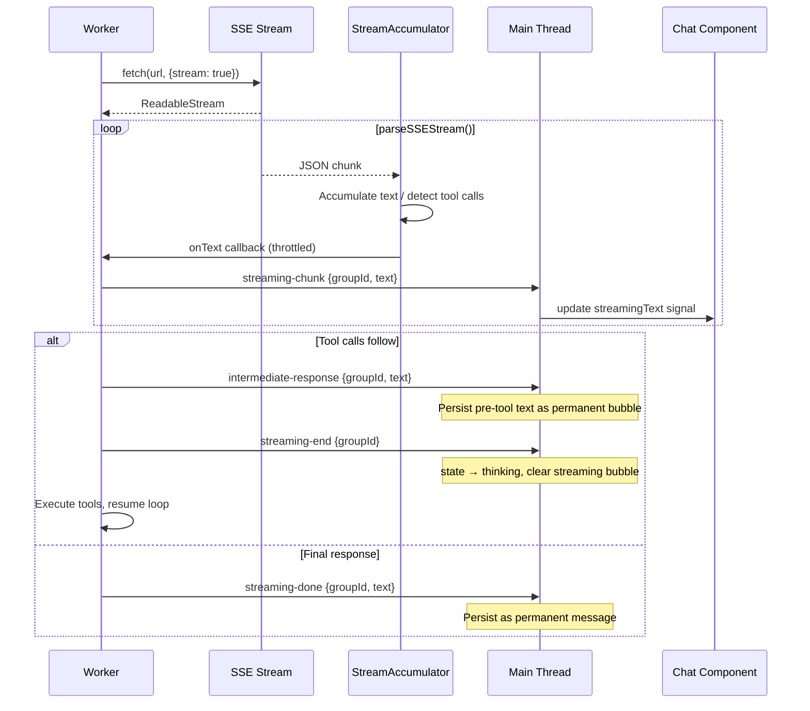

# Streaming

> ShadowClaw streams LLM responses token-by-token via Server-Sent Events (SSE)
> when the provider supports it, rendering a live-updating chat bubble.

**Source:** `src/worker/StreamAccumulator.ts` · `src/worker/parseSSEStream.ts` · `src/worker/handleInvoke.ts` · `src/stores/orchestrator.ts` · `src/server/proxy.ts`

## Three Gates

Streaming is controlled by three conditions that must all be true:

| Gate            | Check                                            | Source             |
| --------------- | ------------------------------------------------ | ------------------ |
| Global toggle   | `CONFIG_KEYS.STREAMING_ENABLED` (default `true`) | Settings → LLM     |
| Provider opt-in | `supportsStreaming: true` in provider config     | `src/config.ts`    |
| Format check    | Provider format is `"openai"` or `"anthropic"`   | Not `"prompt_api"` |

## End-to-End Flow



## SSE Parser

**File:** `src/worker/parseSSEStream.ts`

Async generator that reads a `ReadableStream<Uint8Array>` and yields parsed JSON objects:

```ts
for await (const chunk of parseSSEStream(response.body, abortSignal)) {
  // chunk is a parsed JSON object from an SSE `data:` line
}
```

Handles:

- Standard SSE format: `data: {JSON}\n\n`
- Multiple events per chunk
- `[DONE]` sentinel
- Abort signal interruption
- Comment lines (starting with `:`)

## Stream Accumulator

**File:** `src/worker/StreamAccumulator.ts`

Accumulates text and tool-use events from parsed SSE chunks into a unified response.

```ts
const accumulator = new StreamAccumulator(format, {
  onText: (text) => { /* incremental text arrived */ },
  onToolStart: (name) => { /* tool call started building */ },
  onUsage: (usage) => { /* token usage stats arrived */ },
});

for await (const chunk of parseSSEStream(...)) {
  accumulator.push(chunk);
}

const result = accumulator.finalize();
// { content: ContentBlock[], stop_reason, usage? }
```

**Supported formats:**

- `"openai"` — OpenAI `chat.completions` SSE format (delta-based)
- `"anthropic"` — Anthropic streaming message format (event-typed)

## Throttling

Text chunks from SSE arrive rapidly. The worker buffers them and flushes to the main thread every **50ms**:

1. Buffer incoming text from `onText` callbacks
2. Check elapsed time since last flush
3. If ≥50ms: post `streaming-chunk` with accumulated buffer, reset buffer
4. After stream ends: final flush to catch remaining text

This ensures the UI stays responsive during heavy token delivery without generating thousands of `postMessage` calls.

## UI Rendering

### Streaming bubble

The orchestrator store maintains `_streamingText`:

- `null` — no streaming in progress
- `""` (empty string) — streaming started but no text yet (**does not render a bubble**)
- Non-empty string — accumulating text, renders amber bubble with blinking cursor

This distinction prevents a brief flash when tool-only responses arrive (the LLM returns tool calls without any preceding text).

### Conversation scoping

All streaming events carry a `groupId`. The store only processes events whose `groupId` matches the active conversation:

- **Active conversation:** Updates `streamingText` signal → UI re-renders
- **Background conversation:** Events silently dropped
- **Switch away:** Streaming bubble cleared; response continues in background
- **Switch back:** Response already persisted to IndexedDB, appears in history

## Intermediate Responses

When the LLM returns text alongside tool calls (e.g., "Let me check that for you."), the worker sends an `intermediate-response` message **before** `streaming-end`:

1. Worker extracts text content from response
2. Posts `intermediate-response` with the text
3. Orchestrator persists this as a permanent chat bubble
4. Posts `streaming-end` — streaming bubble cleared
5. Tool execution begins

Without this, the pre-tool text would be lost when the streaming bubble clears.

## Proxy SSE Passthrough

The Express dev server (`src/server/server.ts`) uses `compression()` middleware. SSE responses (`Content-Type: text/event-stream`) are **excluded from compression** so that chunks flush to the browser in real time.

Both Bedrock and Copilot Azure proxy routes support SSE passthrough (`src/server/proxy.ts`). If you add new proxy routes that stream SSE, verify they are not buffered by compression — see the filter in `src/server/server.ts`.
