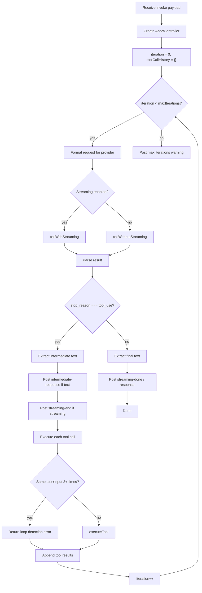
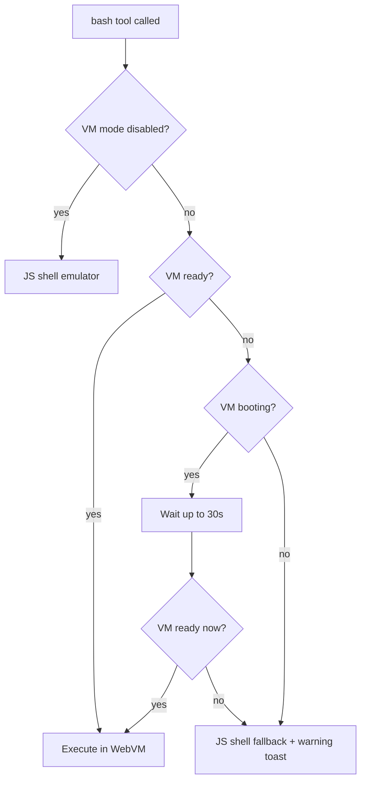

# Worker Protocol

> The agent worker runs in a dedicated Web Worker thread, owning the LLM tool-use loop,
> tool execution, streaming, and the WebVM. All communication is message-based.

**Source:** `src/worker/worker.ts` · `src/worker/handleMessage.ts` · `src/worker/handleInvoke.ts` · `src/worker/executeTool.ts`

## Message Protocol

All communication uses `postMessage()` with typed payloads defined in `src/types.ts`.

### Main → Worker

| Type                 | Payload                                  | Purpose                                  |
| -------------------- | ---------------------------------------- | ---------------------------------------- |
| `invoke`             | `InvokePayload`                          | Start agent invocation (LLM + tool loop) |
| `compact`            | `CompactPayload`                         | Summarize conversation context           |
| `cancel`             | `{ groupId }`                            | Abort in-flight task                     |
| `set-storage`        | `{ storageHandle }`                      | Set OPFS root directory handle           |
| `set-vm-mode`        | `{ mode?, bootHost?, networkRelayUrl? }` | Change VM configuration                  |
| `vm-terminal-open`   | `{ groupId?: string }`                   | Open interactive terminal session        |
| `vm-terminal-input`  | `{ data: string }`                       | Send stdin bytes to terminal             |
| `vm-terminal-close`  | `{ groupId?: string }`                   | Close terminal session                   |
| `vm-workspace-sync`  | `{ groupId?: string }`                   | Push host workspace into VM              |
| `vm-workspace-flush` | `{ groupId?: string }`                   | Pull VM workspace back to host           |

### Worker → Main

| Type                      | Payload                         | Purpose                           |
| ------------------------- | ------------------------------- | --------------------------------- |
| `response`                | `{ groupId, text }`             | Final text response               |
| `intermediate-response`   | `{ groupId, text }`             | Text emitted before tool calls    |
| `streaming-start`         | `{ groupId }`                   | SSE stream beginning              |
| `streaming-chunk`         | `{ groupId, text }`             | Incremental text (throttled 50ms) |
| `streaming-end`           | `{ groupId }`                   | Stream paused for tool calls      |
| `streaming-done`          | `{ groupId, text }`             | Final streamed text               |
| `streaming-error`         | `{ groupId, error }`            | Stream failed                     |
| `error`                   | `{ groupId, error }`            | Error payload                     |
| `typing`                  | `{ groupId, typing }`           | Typing indicator                  |
| `tool-activity`           | `{ groupId, tool, status }`     | Tool execution status             |
| `token-usage`             | per payload                     | Token consumption stats           |
| `thinking-log`            | `ThinkingLogEntry`              | Debug/reasoning log               |
| `compact-done`            | `{ groupId, summary }`          | Compaction complete               |
| `model-download-progress` | `ModelDownloadProgressPayload`  | Prompt API download               |
| `vm-status`               | `VMStatus`                      | VM ready/booting/error            |
| `vm-terminal-opened`      | `{ ok: true }`                  | Terminal session ready            |
| `vm-terminal-output`      | `{ chunk: string }`             | Terminal stdout bytes             |
| `vm-terminal-closed`      | `{ ok: true }`                  | Terminal session closed           |
| `vm-terminal-error`       | `{ error: string }`             | Terminal error                    |
| `vm-workspace-synced`     | `{ groupId }`                   | Workspace sync complete           |
| `show-toast`              | `{ message, type?, duration? }` | UI toast notification             |
| `send-notification`       | `{ title, body, groupId }`      | OS-level push notification        |
| `open-file`               | `{ groupId, path }`             | Open file in UI viewer            |
| `task-created`            | `{ task }`                      | New task created by agent         |
| `update-task`             | `{ task }`                      | Task updated by agent             |
| `delete-task`             | `{ id, groupId }`               | Task deleted by agent             |

## Worker Startup

When the worker initializes (`src/worker/worker.ts`):

1. Import message handler from `src/worker/handleMessage.ts`
2. Subscribe to VM status changes → forward as `vm-status` messages
3. **Eager VM boot** — if persisted mode is `ext2` or `9p`:
   - Load boot host, network relay URL from config
   - Start boot (non-blocking)
4. Expose toast helpers on `globalThis` (for `javascript` tool sandbox):
   - `showToast(message, type?, duration?)`
   - `showSuccess()`, `showError()`, `showWarning()`, `showInfo()`
5. Attach `self.onmessage = handleMessage`

## Tool-Use Loop

The core agent loop in `src/worker/handleInvoke.ts`:



### Loop detection

The worker tracks tool call signatures (name + JSON input). If the same signature appears 3+ times, the call is blocked with:

```
SYSTEM ERROR: Tool called 3+ times with same input. Rigid loop detected.
```

### Iteration limit

- Default: `DEFAULT_MAX_ITERATIONS` (50)
- User-configurable via **Settings → Max Iterations** (1–200)
- Orchestrator passes the value in every invoke payload

## Non-Streaming Calls

`callWithoutStreaming()` in `src/worker/withRetry.ts`:

1. `fetch()` with abort signal
2. **Retry logic** via `withRetry()`: up to 3 attempts, exponential backoff (base 2s, cap 30s, jitter)
   - Retries on: HTTP 5xx, 429 (rate limit), network errors
   - Does NOT retry on: 4xx client errors
3. Parse response via `parseResponse(provider, rawResult)`
4. Return normalized result: `{ content: ContentBlock[], stop_reason, usage? }`

## Streaming Calls

`callWithStreaming()` in `src/worker/handleInvoke.ts`:

1. Add `stream: true` to request body
2. Add `stream_options: { include_usage: true }` for OpenAI format
3. `fetch()` — **no retry** (SSE streams cannot be replayed)
4. Create `StreamAccumulator` with callbacks
5. Pipe response through `parseSSEStream()` async generator
6. Accumulator processes each SSE event:
   - `onText(text)` — throttled to 50ms, posts `streaming-chunk`
   - `onToolStart(name)` — posts `tool-activity`
   - `onUsage(usage)` — posts `token-usage`
7. Flush remaining buffered text after stream ends
8. Return `accumulator.finalize()` — normalized result

## Cancellation

Cancellation flows through `AbortController`:

1. Main thread sends `cancel` message (or a new `invoke` for the same `groupId`)
2. Worker calls `controller.abort()` on the in-flight task's controller
3. `fetch()` throws `AbortError`
4. Worker catches, cleans up state, becomes ready for next task
5. Orchestrator tracks via `orchestratorStore.stopCurrentRequest()`

Each `groupId` has its own `AbortController` in `inFlightControllers` Map. Starting a new invocation for the same group automatically aborts the previous one.

## Tool Execution Dispatch

`executeTool(db, name, input, groupId, options)` in `src/worker/executeTool.ts` is the single dispatcher for all tools.

### File tools

- `read_file` — Supports single `path` or `paths` array for batch reads (parallel `Promise.all`)
- `write_file` — Creates intermediate directories automatically
- `patch_file` — In-place string replacement (safer than sed for targeted edits)
- `list_files` — Returns directory listing with `/` suffix for directories
- `open_file` — Posts `open-file` message to main thread for UI viewer

### Execution tools

- `bash` — Prefers WebVM, falls back to JS shell (see [WebVM](../subsystems/vm.md) and [Shell](../subsystems/shell.md))
- `javascript` — Sandboxed strict-mode via `sandboxedEval()`. Code **must use `return`**. No DOM, network, `eval`, or `Function`.

### Web tools

- `fetch_url` — HTTP requests with git auth injection, 3-attempt retry, HTML stripping, 100KB truncation, git host login page detection

### Git tools

All git tools use lazy `import()` to load `src/git/git.ts` only when needed.

### Recursion guard

When `isScheduledTask === true`, these tools are blocked:

- `create_task`, `update_task`, `delete_task`, `enable_task`, `disable_task`
- `send_notification`

### Bash tool selection


