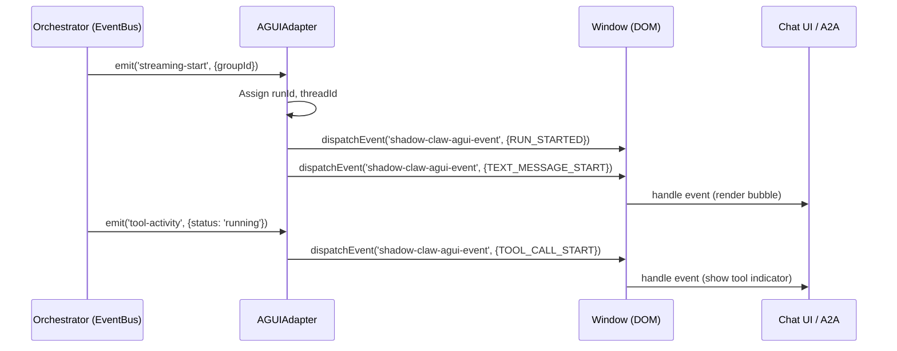

# AGUI Events & Adapter

> The AG-UI Event Adapter translates orchestrator lifecycle and streaming events into standardized AG-UI protocol events for UI visibility.

**Source:** `src/ui/agui-adapter.ts` · `src/subsystems/channels/peer-protocol.ts`

## Overview

ShadowClaw uses the [AG-UI Protocol](https://docs.ag-ui.com/concepts/events) to standardize how the UI understands agent lifecycles, tool usage, and text streaming.

Rather than tightly coupling the UI to the internal [Worker Protocol](../architecture/worker-protocol.md) or specific channel implementations, `AGUIAdapter` sits between the orchestrator's `EventBus` and the browser `window`, dispatching standard DOM `CustomEvent`s.

This ensures that whether a response originates from a local agent, a remote peer, or an external system, the UI can render rich streaming states (like "Agent is thinking" or "Tool is running").

## Event Translation Lifecycle

When an LLM streams a response, events bubble up from the [StreamAccumulator](../architecture/streaming.md) through the orchestrator to the `AGUIAdapter`.

| Internal Event (EventBus)                   | AG-UI Event Emitted (`shadow-claw-agui-event`)   | Purpose                                                            |
| ------------------------------------------- | ------------------------------------------------ | ------------------------------------------------------------------ |
| `streaming-start`                           | `RUN_STARTED`   `TEXT_MESSAGE_START`          | Indicates the agent has begun its response cycle.                  |
| `streaming-chunk`                           | `TEXT_MESSAGE_CONTENT`                           | Delivers incremental text tokens to the UI.                        |
| `tool-activity`   _(status: running)_    | `TOOL_CALL_START`                                | Notifies the UI that the agent invoked a tool.                     |
| `tool-activity`   _(status: done/error)_ | `TOOL_CALL_END`                                  | Notifies the UI that tool execution completed.                     |
| `streaming-end`                             | `TEXT_MESSAGE_END`                               | Closes the open text message (often to transition to a tool call). |
| `streaming-done`                            | `TEXT_MESSAGE_END` (if open)   `RUN_FINISHED` | Finalizes the run. The agent has fully completed its turn.         |
| `streaming-error`                           | `TEXT_MESSAGE_END` (if open)   `RUN_ERROR`    | Aborts the run due to an exception.                                |

## Data Flow

## Independence from PeerJS

While AG-UI events are defined as part of the [A2A Protocol](../decisions/peer-protocol-a2a-agui.md) for peer-to-peer communication, ShadowClaw's implementation of the adapter is entirely independent of the network transport.

`AGUIAdapter` attaches strictly to the local orchestrator and broadcasts to `window`. This allows both the local browser UI and the PeerJS channel router to consume the exact same standardized events without cross-dependencies.

## See Also

- [Streaming Architecture](../architecture/streaming.md) — Details on how SSE text chunks are accumulated.
- [Worker Protocol](../architecture/worker-protocol.md) — Details on how tools and text cross the Web Worker boundary.
- [A2UI Interactive Surfaces](./a2ui.md) — (Note: A2UI is for rendering interactive components, whereas AG-UI is for lifecycle and streaming visibility).
