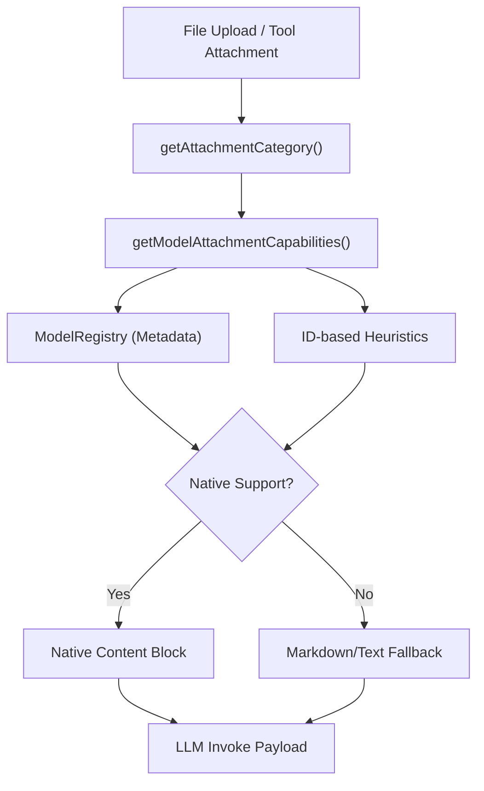

# Attachment Capabilities

> MIME-aware attachment handling and modality detection for native vs fallback delivery.

**Source:** `src/attachment-capabilities.ts` · `src/message-attachments.ts`

## Overview

ShadowClaw treats attachments as first-class citizens in the agent loop. Instead of simply attaching files, the system analyzes both the file type and the model's capabilities to determine the most effective delivery method.

This enables ShadowClaw to function as an **agent-driven framework** where the model's native multimodal strengths are prioritized, while ensuring robust operation on text-only models through automated fallbacks.

## Attachment Categories

Attachments are mapped to one of six categories based on MIME type and file extension:

| Category   | Examples                                      |
| ---------- | --------------------------------------------- |
| `text`     | `.ts`, `.js`, `.json`, `.md`, `.txt`, `.xml`  |
| `image`    | `image/png`, `image/jpeg`, `image/webp`       |
| `audio`    | `audio/mpeg`, `audio/wav`, `audio/ogg`        |
| `video`    | `video/mp4`, `video/webm`                     |
| `document` | `application/pdf`                             |
| `file`     | Generic binary fallback (e.g., `.zip`, `.gz`) |

## Capability Resolution

Model capabilities are resolved via a two-stage process:

1.  **Metadata Lookup**: The `ModelRegistry` is checked for dynamic metadata (e.g., `supportsImageInput`) fetched from provider APIs (OpenRouter, etc.).
2.  **Heuristic Fallback**: If metadata is missing or incomplete, heuristic patterns are matched against the model ID (e.g., `gpt-4o`, `claude-3-5`, `gemini`).

### Native Support Detection

- **Images**: GPT-4o, Claude 3, Gemini, LLaVA, etc.
- **Audio/Video**: Omni models or models with "audio"/"video" in their IDs.
- **PDFs**: Specifically tracked for Claude 3.5 Sonnet, 3.7, and the Claude 4 family, which support native PDF content blocks via Anthropic's API.

## Delivery Methods

### 1. Native Delivery

If a model is detected to support a specific modality, the attachment is delivered using the provider's native block format (e.g., `image` or `document` blocks in Anthropic; base64 data URLs in OpenAI).

### 2. Fallback Delivery

If a model does not support the modality (or is unknown), ShadowClaw performs a "markdown-optimized" conversion:

- **PDFs**: Extracted as text or OCR-style representation (if tools are available).
- **Images/Media**: Delivered as a text description or link, encouraging the agent to use tools (like `read_file` or specialized analysis tools) to process the content if needed.
- **General Files**: Provided as a file path reference, allowing the agent to decide if it needs to `read_file` (if text-based) or use `bash` to inspect the binary.

## Architecture

