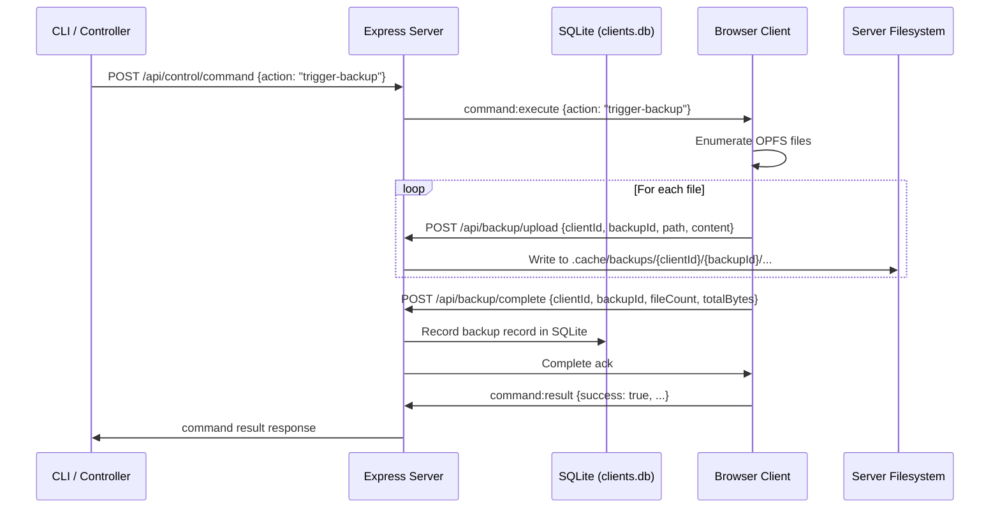

# File Backup Subsystem

> Automated and remote workspace backups from connected browser/Electron clients to server filesystem storage.

**Source:** `src/server/routes/backup.ts` · `src/server/client-registry.ts` · `src/core/backup-controller.ts` · `bin/commands/backup.mjs`

---

## Overview

ShadowClaw enables connected clients (especially mobile Safari and iPad browsers) to back up their OPFS/local workspace files directly to the server filesystem without requiring manual file export or zip downloads.

---

## Architecture & Data Flow

---

## REST Endpoints

All endpoints require control token authentication via `x-control-token` header, query parameter `?token=...`, or Bearer auth.

| Endpoint               | Method | Description                                                     |
| :--------------------- | :----- | :-------------------------------------------------------------- |
| `/api/backup/upload`   | POST   | Upload a file chunk or content into a backup snapshot directory |
| `/api/backup/complete` | POST   | Finalize backup, update SQLite metadata, and return summary     |
| `/api/backup/list`     | GET    | List available backups, optionally filtered by `?clientId=...`  |
| `/api/backup/:id`      | DELETE | Delete backup snapshot files from disk and remove SQLite record |

---

## Directory Traversal Guard

All incoming upload paths are normalized and validated against path traversal attacks. Any paths attempting to escape the client snapshot directory are rejected with HTTP 400.
