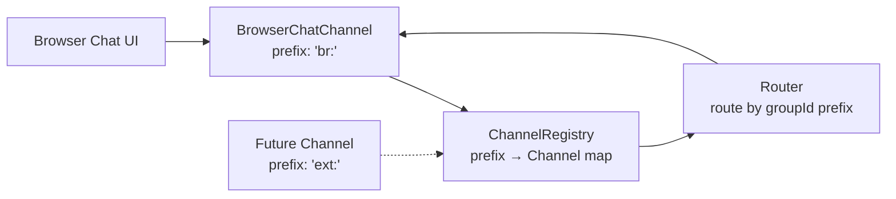
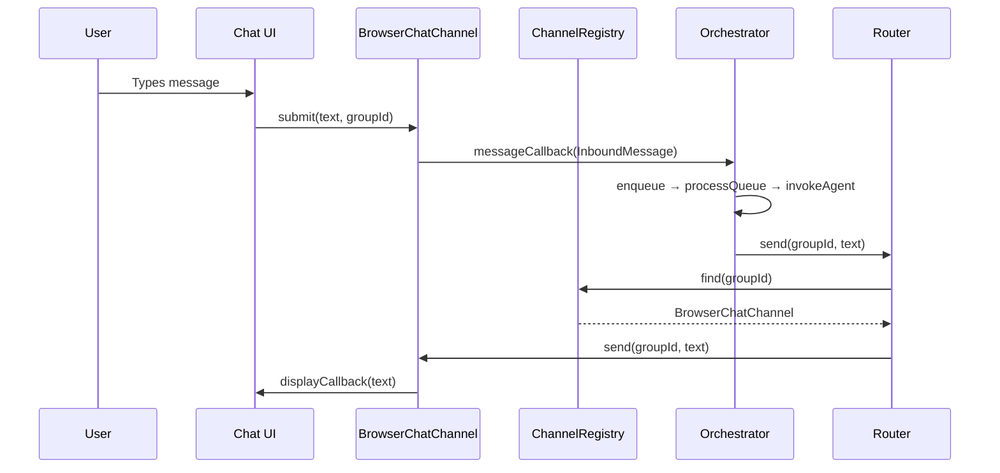

# Channel System

> A pluggable registry pattern that maps conversation group IDs to channel
> implementations, enabling multi-channel support.

**Source:** `src/channels/channel-registry.ts` · `src/channels/browser-chat.ts` · `src/channels/telegram.ts` · `src/channels/imessage.ts` · `src/router.ts`

## Built-in Channels

| Channel  | Type       | Prefix | Source                      | Purpose                          |
| -------- | ---------- | ------ | --------------------------- | -------------------------------- |
| Browser  | `browser`  | `br:`  | `src/channels/browser-chat` | In-browser chat UI               |
| Telegram | `telegram` | `tg:`  | `src/channels/telegram.ts`  | Telegram Bot API integration     |
| iMessage | `imessage` | `im:`  | `src/channels/imessage.ts`  | iMessage bridge via HTTP service |

## Architecture



## Channel Registry

**File:** `src/channels/channel-registry.ts`

The `ChannelRegistry` maps groupId prefixes to `Channel` implementations.

**API:**

| Method                             | Purpose                                                           |
| ---------------------------------- | ----------------------------------------------------------------- |
| `register(prefix, channel, badge)` | Register a channel with a unique prefix and UI badge label        |
| `find(groupId)`                    | Find the channel owning a groupId (longest-prefix-first matching) |
| `get(prefix)`                      | Get a channel by exact prefix                                     |
| `getBadge(groupId)`                | Get the UI badge label for a groupId                              |
| `prefixes()`                       | List all registered prefixes                                      |
| `startAll()` / `stopAll()`         | Lifecycle control for all channels                                |
| `onMessage(handler)`               | Register inbound message handler on all channels                  |

**Prefix matching:** Entries are sorted by prefix length (longest-first) so that more specific prefixes match before less specific ones.

## Channel Interface

```ts
// From src/types.ts
interface Channel {
  type: string; // Fixed channel type identifier
  submit(text: string, groupId: string): void; // Called when user sends a message
  send(groupId: string, text: string): void; // Send a response to the channel's UI
  setTyping(groupId: string, typing: boolean): void;
  setActiveGroup(groupId: string): void;
  getActiveGroup(): string;
  onMessage(cb: (msg: InboundMessage) => void): void;
  onDisplay(cb: (groupId: string, text: string) => void): void;
  onTyping(cb: (groupId: string, typing: boolean) => void): void;
}
```

## Browser Chat Channel

**File:** `src/channels/browser-chat.ts` (prefix: `br:`)

The primary channel that bridges the in-browser chat UI with the orchestrator.

| Property/Method              | Purpose                                                                                  |
| ---------------------------- | ---------------------------------------------------------------------------------------- |
| `type: "browser"`            | Fixed channel type identifier                                                            |
| `submit(text, groupId)`      | Constructs `InboundMessage` with ULID, timestamp, channel type, invokes message callback |
| `send(groupId, text)`        | Sends response to UI for display                                                         |
| `setTyping(groupId, typing)` | Shows/hides typing indicator                                                             |
| `setActiveGroup(groupId)`    | Tracks which conversation is displayed                                                   |
| `getActiveGroup()`           | Returns active conversation ID                                                           |
| `onMessage(cb)`              | Register handler for user-submitted messages                                             |
| `onDisplay(cb)`              | Register handler for response display                                                    |
| `onTyping(cb)`               | Register handler for typing indicator                                                    |

## Telegram Channel

**File:** `src/channels/telegram.ts` (prefix: `tg:`)

Bridge to Telegram bots via the Bot API. Conversations are mapped to Telegram chat IDs.

- **Auto-trigger:** Agent invokes on inbound messages (unless restricted by settings).
- **Settings:** Bot token and allowed chat ID list configured in UI.
- **Built-in commands:** `/chatid` and `/ping` always available for authorization flow.

## iMessage Channel

**File:** `src/channels/imessage.ts` (prefix: `im:`)

Bridge to iMessage conversations via an HTTP relay service.

- **Bridge contract:** REST endpoints for `/messages`, `/messages/send`, `/messages/typing`.
- **Auth:** Bearer token and optional API key headers.
- **Auto-trigger:** Agent invokes on inbound messages from authorized conversations.
- **Message format:** Expects `chatId`, sender info, `text` content, and optional `guid`.

## Router

**File:** `src/router.ts`

Routes outbound messages and typing indicators to the correct channel:

```ts
send(groupId: string, text: string): void     // Route response to owning channel
setTyping(groupId: string, typing: boolean): void // Route typing status to owning channel
```

**Formatting helpers** (static methods):

- `formatOutbound(rawText)` — Strip `<internal>...</internal>` XML tags from agent output
- `formatMessagesXml(messages)` — Convert messages to XML format for agent context

## Data Flow



## Registration

Channels are registered during orchestrator initialization:

```ts
const registry = new ChannelRegistry();
registry.register("br:", browserChatChannel, "Browser");
// Future: registry.register("ext:", externalChannel, "External");
```

## Adding a New Channel

See the [Adding a Channel](../guides/adding-a-channel.md) guide.
