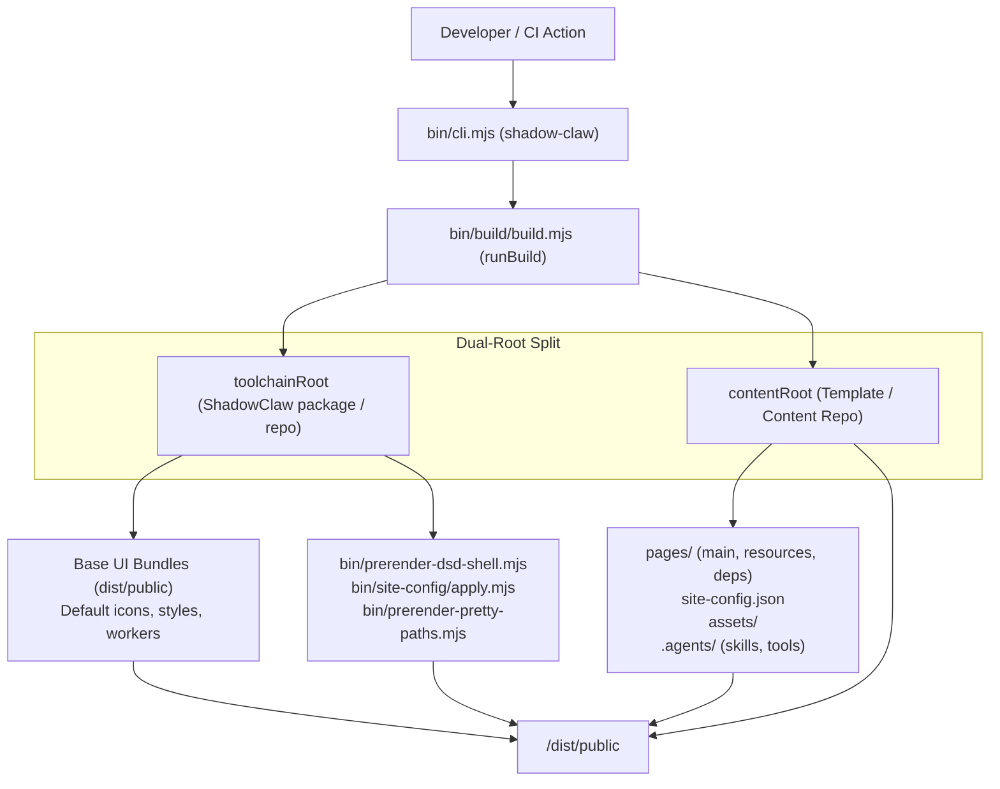

# CLI & Static Site Publishing

> Command-line interface and dual-root build engine for ShadowClaw and downstream templates.

**Source:** `bin/cli.mjs` · `bin/build/build.mjs` · `bin/site-config/apply.mjs` · `package.json`

---

## Overview

ShadowClaw provides a unified, first-class CLI tool (`shadow-claw` / `shadowclaw`) and dual-root build pipeline. This allows developers to:

1. **Develop and preview template sites locally** (`npx shadow-claw dev`) with live reload, static file serving, and backend proxy capabilities.
2. **Build standalone static distribution bundles** (`npx shadow-claw build --prod`) directly into `./dist/public` without cloning the ShadowClaw repository or copying foreign files in CI.
3. **Serve pre-built static artifacts** (`npx shadow-claw serve`).
4. **Scaffold starter templates** (`npx shadow-claw init`).

---

## Architecture & Dual-Root Path Resolution



### 1. `toolchainRoot` vs `contentRoot`

- **`toolchainRoot`**: The root directory of the installed `@xt-ml/shadow-claw` or `shadow-claw` package (or the repository checkout). Contains pre-compiled web bundles (`dist/public/index.js`, `theme-init.js`, `agent.worker.js`, etc.), build scripts (`bin/`), and default icons/styles.
- **`contentRoot`**: The consumer project root (defaults to `process.cwd()`). Contains `pages/`, `site-config.json`, `assets/`, `.agents/skills`, `.agents/tools`, and receives the final output in `dist/public`.

### 2. Execution Modes

- **In-Repo Mode (`resolve(contentRoot) === resolve(toolchainRoot)`)**:
  When invoked from inside the `xt-ml/shadow-claw` repo (e.g. `npm run build`, `npm run build:prod`, `npm run dev`), executes the exact standalone build pipeline, compiling TypeScript via Rolldown and generating in-tree `dist/public`.
- **CLI / External Consumer Mode (`resolve(contentRoot) !== resolve(toolchainRoot)`)**:
  When invoked on a template repository (e.g. `block-garden-knowledge-hub`, `pwgen-knowledge-hub`, or `shadow-claw-template`), reads base runtime bundles from `toolchainRoot/dist/public`, overlays and merges consumer files from `contentRoot`, applies site branding (`site-config/apply.mjs`), performs DSD shell and pretty path prerendering, and writes directly into `<contentRoot>/dist/public`.

---

## CLI Commands Reference

### `shadow-claw build [options]`

Builds a static site bundle into `./dist/public`.

| Option                     | Type    | Description                                                                     | Default           |
| :------------------------- | :------ | :------------------------------------------------------------------------------ | :---------------- |
| `--prod, --production`     | boolean | Build in production mode (minification, base path rewriting, revision stamping) | `false`           |
| `--origin <url>`           | string  | Canonical site origin URL (overrides `PAGES_ORIGIN`)                            | `""`              |
| `--base-path <path>`       | string  | Base path prefix (e.g. `/my-site/`, overrides `PAGES_BASE_PATH`)                | `"/shadow-claw/"` |
| `--out-dir <dir>`          | string  | Output directory relative to content root                                       | `"dist/public"`   |
| `--content-root <dir>`     | string  | Working directory containing site content                                       | `process.cwd()`   |
| `--prerender-pages <mode>` | string  | Prerender mode: `all`, `auto`, `none`                                           | `"auto"`          |
| `--copy-all-assets`        | boolean | Copy entire `assets/` directory into output                                     | `false`           |

### `shadow-claw dev [port]` / `shadow-claw run [port]`

Builds the site in development mode and starts the local server with live proxy, task scheduler, and static serving.

| Option / Argument        | Type    | Description                                                 | Default        |
| :----------------------- | :------ | :---------------------------------------------------------- | :------------- |
| `[port]` / `-p, --port`  | number  | Port to listen on                                           | `8888`         |
| `--host <host>` / `--ip` | string  | Bind host/IP                                                | `"127.0.0.1"`  |
| `--open`                 | boolean | Automatically open the default browser on start             | `false`        |
| `--cors-mode <mode>`     | string  | CORS policy: `localhost`, `private`, `all`                  | `"localhost"`  |
| `--peerjs`               | boolean | Enable built-in PeerJS signaling server                     | `false`        |
| `--allow-private-proxy`  | boolean | Allow `/proxy` endpoint to reach private/loopback addresses | `false`        |
| `--https`                | boolean | Enable opt-in HTTPS server using dev TLS certificate        | `false`        |
| `--cert <path>`          | string  | Path to custom TLS certificate (PEM)                        | `undefined`    |
| `--key <path>`           | string  | Path to custom TLS private key (PEM)                        | `undefined`    |
| `--ssl-dir <path>`       | string  | Directory for self-signed TLS certs                         | `".cache/tls"` |
| `-v, --verbose`          | boolean | Enable verbose request and proxy logging                    | `false`        |

### `shadow-claw serve [port]`

Serves an already-built `dist/public` static directory and runs the proxy server without triggering a rebuild.

### `shadow-claw init [dir]`

Scaffolds a new ShadowClaw content template in `[dir]` (or `process.cwd()`) with starter:

- `site-config.json` (declarative branding, title, and sorting configuration)
- `pages/main/index.html` (welcome home page)
- `.gitignore` (`dist/`, `.cache/`, `node_modules/`)

### `shadow-claw clients [options]`

Lists connected / registered browser and Electron clients and their capabilities (e.g. OPFS, WebMCP, push, WebRTC).

```bash
# List clients registered via HTTP / WebSocket control plane
npx shadow-claw clients

# List peers connected via WebRTC DataChannel (requires webrtc listen)
npx shadow-claw clients --transport webrtc
```

### `shadow-claw send <message> [options]`

Sends a message/prompt directly to a connected client or active orchestrator conversation.

```bash
# Send to the default/active conversation on a client via HTTP control plane
npx shadow-claw send "Hello from the CLI" --client <client-id>

# Send to a specific conversation group (e.g. main AI assistant or PeerJS channel)
npx shadow-claw send "Hello from the CLI" --client <client-id> --group "br:main"
npx shadow-claw send "Hello to peer" --client <browser-peer-id> --group "peer:<cli-peer-id>"

# Send over WebRTC DataChannel transport (routes via webrtc listen IPC or direct connection)
npx shadow-claw send "Hello from CLI" --transport webrtc --client <browser-peer-id>
```

| Option                    | Type    | Description                                                                                 | Default       |
| :------------------------ | :------ | :------------------------------------------------------------------------------------------ | :------------ |
| `--client <id>`           | string  | Target client ID or PeerJS peer ID (defaults to first available connected client)           | `""`          |
| `--group <groupId>`       | string  | Target conversation group ID (`br:main`, `peer:<peerId>`, etc.). Defaults to active group.  | Active group  |
| `--transport <transport>` | string  | Transport mechanism: `http` (Control Plane REST/WebSocket) or `webrtc` (WebRTC DataChannel) | `"http"`      |
| `--host <host>`           | string  | Control plane / signaling server host                                                       | `"127.0.0.1"` |
| `--port <port>`           | number  | Control plane / signaling server port                                                       | `8888`        |
| `--token <token>`         | string  | Control token (auto-resolved from `.cache/control-token.json` or `clients.db` if omitted)   | `""`          |
| `--https`                 | boolean | Connect to server control plane via HTTPS                                                   | `false`       |
| `-k, --insecure`          | boolean | Allow self-signed TLS certificates for local control plane connections                      | `true`        |
| `--peer-id <id>`          | string  | Custom WebRTC CLI peer ID override                                                          | `""`          |
| `--cache-dir <dir>`       | string  | Custom cache directory for token and peer ID storage                                        | `".cache"`    |

### `shadow-claw backup [trigger|list|delete] [options]`

Triggers a remote OPFS workspace backup from a connected client, lists available snapshots, or deletes backups.

```bash
# Trigger backup via HTTP control plane
npx shadow-claw backup
npx shadow-claw backup --client <client-id>

# Trigger backup via WebRTC DataChannel
npx shadow-claw backup --transport webrtc --client <browser-peer-id>

# List or delete stored snapshots on server
npx shadow-claw backup list
npx shadow-claw backup delete --backup-id <id>
```

### `shadow-claw tasks [options]`

Lists scheduled tasks configured on a connected client (with optional group filtering).

```bash
# List all tasks on default connected client
npx shadow-claw tasks

# List all tasks via HTTP control plane
npx shadow-claw tasks --client <client-id>

# Filter tasks by conversation group (e.g. main AI chat or peer channel)
npx shadow-claw tasks --client <client-id> --group "br:main"
npx shadow-claw tasks --transport webrtc --client <browser-peer-id> --group "peer:<cli-peer-id>"

# List tasks via WebRTC DataChannel
npx shadow-claw tasks --transport webrtc --client <browser-peer-id>
```

| Option                    | Type   | Description                                                             | Default       |
| :------------------------ | :----- | :---------------------------------------------------------------------- | :------------ |
| `--client <id>`           | string | Target client ID or PeerJS peer ID (defaults to first connected client) | `""`          |
| `--group <groupId>`       | string | Filter tasks by conversation group ID (`br:main`, `peer:...`, etc.)     | All groups    |
| `--transport <transport>` | string | Transport mechanism: `http` or `webrtc`                                 | `"http"`      |
| `--host <host>`           | string | Control plane / signaling server host                                   | `"127.0.0.1"` |
| `--port <port>`           | number | Control plane / signaling server port                                   | `8888`        |
| `--token <token>`         | string | Control token                                                           | `""`          |
| `--peer-id <id>`          | string | Custom WebRTC CLI peer ID override                                      | `""`          |
| `--cache-dir <dir>`       | string | Custom cache directory                                                  | `".cache"`    |

### `shadow-claw webrtc [action] [options]` / `shadow-claw peer-id [action] [options]`

Manages WebRTC CLI peer identity (`.cache/cli-peer-id`) and provides the `webrtc listen` daemon for headless DataChannel communication with browser tabs.

#### 1. Managing CLI Peer ID

```bash
# Get or create peer ID
npx shadow-claw peer-id

# Force renewal / generation of a new peer ID
npx shadow-claw peer-id --renew

# Set custom peer ID
npx shadow-claw peer-id --set my-custom-peer-id

# Print only raw ID string (for shell scripting)
npx shadow-claw peer-id -q
```

#### 2. Running WebRTC Listener (`webrtc listen`)

Registers the CLI as a live PeerJS peer on the signaling server so browser tabs can initiate direct P2P connections without requiring a control plane connection. It also launches a local Unix socket IPC bridge (`.cache/webrtc-ipc.sock`) to coordinate concurrent `send` commands without peer ID conflicts.

```bash
# Start WebRTC listener
npx shadow-claw webrtc listen

# Restrict incoming connections to specific browser peer IDs
npx shadow-claw webrtc listen --trusted-peer <browser-peer-id>
```

**Browser Setup Workflow:**

1. Run `npx shadow-claw webrtc listen` to display the CLI peer ID (e.g. `cli-01m1...`).
2. In the browser, navigate to **Settings → WebRTC/PeerJS → Trusted Peer IDs** and add the CLI's peer ID.
3. Once connected, dispatch commands with `npx shadow-claw send --transport webrtc --client <browser-peer-id> [--group <groupId>] "message"`.

---

## NPM Packaging & Prepack Lifecycle

In `package.json`:

```json
{
  "name": "shadow-claw",
  "bin": {
    "shadow-claw": "bin/cli.mjs",
    "shadowclaw": "bin/cli.mjs"
  },
  "files": ["bin", "dist", "assets", "share", "src", "README.md", "LICENSE"],
  "scripts": {
    "prepack": "npm run build:prod"
  }
}
```

- **`prepack` Hook**: Guarantees that `npm run build:prod` is executed immediately prior to `npm pack` or `npm publish`, ensuring `dist/public` contains the latest compiled production bundles.
- **`files` Whitelist**: Packages only runtime essentials (`bin/`, `dist/`, `assets/`, `share/`, `src/`) and excludes test files, `.cache/`, and electron binaries.
- **Dual Binaries**: Registers both `shadow-claw` (canonical) and `shadowclaw` (alias) so commands resolve regardless of hyphenation.
