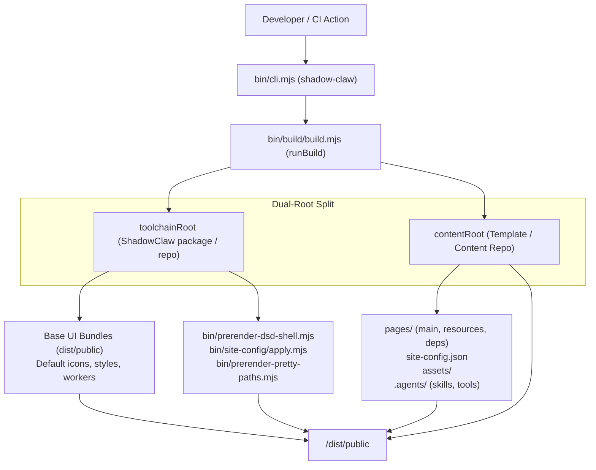

# CLI & Static Site Publishing

> Command-line interface and dual-root build engine for ShadowClaw and downstream templates.

**Source:** `bin/cli.mjs` · `bin/build/build.mjs` · `bin/site-config/apply.mjs` · `package.json`

---

## Overview

ShadowClaw provides a unified, first-class CLI tool (`shadow-claw` / `shadowclaw`) and dual-root build pipeline. This allows developers to:

1. **Develop and preview template sites locally** (`npx shadow-claw dev`) with live reload, static file serving, and backend proxy capabilities.
2. **Build standalone static distribution bundles** (`npx shadow-claw build --prod`) directly into `./dist/public` without cloning the ShadowClaw repository or copying foreign files in CI.
3. **Serve pre-built static artifacts** (`npx shadow-claw serve`).
4. **Scaffold starter templates** (`npx shadow-claw init`).

---

## Architecture & Dual-Root Path Resolution



### 1. `toolchainRoot` vs `contentRoot`

- **`toolchainRoot`**: The root directory of the installed `@xt-ml/shadow-claw` or `shadow-claw` package (or the repository checkout). Contains pre-compiled web bundles (`dist/public/index.js`, `theme-init.js`, `agent.worker.js`, etc.), build scripts (`bin/`), and default icons/styles.
- **`contentRoot`**: The consumer project root (defaults to `process.cwd()`). Contains `pages/`, `site-config.json`, `assets/`, `.agents/skills`, `.agents/tools`, and receives the final output in `dist/public`.

### 2. Execution Modes

- **In-Repo Mode (`resolve(contentRoot) === resolve(toolchainRoot)`)**:
  When invoked from inside the `xt-ml/shadow-claw` repo (e.g. `npm run build`, `npm run build:prod`, `npm run dev`), executes the exact standalone build pipeline, compiling TypeScript via Rolldown and generating in-tree `dist/public`.
- **CLI / External Consumer Mode (`resolve(contentRoot) !== resolve(toolchainRoot)`)**:
  When invoked on a template repository (e.g. `block-garden-knowledge-hub`, `pwgen-knowledge-hub`, or `shadow-claw-template`), reads base runtime bundles from `toolchainRoot/dist/public`, overlays and merges consumer files from `contentRoot`, applies site branding (`site-config/apply.mjs`), performs DSD shell and pretty path prerendering, and writes directly into `<contentRoot>/dist/public`.

---

## CLI Commands Reference

### `shadow-claw build [options]`

Builds a static site bundle into `./dist/public`.

| Option                     | Type    | Description                                                                     | Default           |
| :------------------------- | :------ | :------------------------------------------------------------------------------ | :---------------- |
| `--prod, --production`     | boolean | Build in production mode (minification, base path rewriting, revision stamping) | `false`           |
| `--origin <url>`           | string  | Canonical site origin URL (overrides `PAGES_ORIGIN`)                            | `""`              |
| `--base-path <path>`       | string  | Base path prefix (e.g. `/my-site/`, overrides `PAGES_BASE_PATH`)                | `"/shadow-claw/"` |
| `--out-dir <dir>`          | string  | Output directory relative to content root                                       | `"dist/public"`   |
| `--content-root <dir>`     | string  | Working directory containing site content                                       | `process.cwd()`   |
| `--prerender-pages <mode>` | string  | Prerender mode: `all`, `auto`, `none`                                           | `"auto"`          |
| `--copy-all-assets`        | boolean | Copy entire `assets/` directory into output                                     | `false`           |

### `shadow-claw dev [port]` / `shadow-claw run [port]`

Builds the site in development mode and starts the local server with live proxy, task scheduler, and static serving.

| Option / Argument        | Type    | Description                                                 | Default       |
| :----------------------- | :------ | :---------------------------------------------------------- | :------------ |
| `[port]` / `-p, --port`  | number  | Port to listen on                                           | `8888`        |
| `--host <host>` / `--ip` | string  | Bind host/IP                                                | `"127.0.0.1"` |
| `--open`                 | boolean | Automatically open the default browser on start             | `false`       |
| `--cors-mode <mode>`     | string  | CORS policy: `localhost`, `private`, `all`                  | `"localhost"` |
| `--peerjs`               | boolean | Enable built-in PeerJS signaling server                     | `false`       |
| `--allow-private-proxy`  | boolean | Allow `/proxy` endpoint to reach private/loopback addresses | `false`       |
| `-v, --verbose`          | boolean | Enable verbose request and proxy logging                    | `false`       |

### `shadow-claw serve [port]`

Serves an already-built `dist/public` static directory and runs the proxy server without triggering a rebuild.

### `shadow-claw init [dir]`

Scaffolds a new ShadowClaw content template in `[dir]` (or `process.cwd()`) with starter:

- `site-config.json` (declarative branding, title, and sorting configuration)
- `pages/main/index.html` (welcome home page)
- `.gitignore` (`dist/`, `.cache/`, `node_modules/`)

---

## NPM Packaging & Prepack Lifecycle

In `package.json`:

```json
{
  "name": "shadow-claw",
  "bin": {
    "shadow-claw": "bin/cli.mjs",
    "shadowclaw": "bin/cli.mjs"
  },
  "files": ["bin", "dist", "assets", "share", "src", "README.md", "LICENSE"],
  "scripts": {
    "prepack": "npm run build:prod"
  }
}
```

- **`prepack` Hook**: Guarantees that `npm run build:prod` is executed immediately prior to `npm pack` or `npm publish`, ensuring `dist/public` contains the latest compiled production bundles.
- **`files` Whitelist**: Packages only runtime essentials (`bin/`, `dist/`, `assets/`, `share/`, `src/`) and excludes test files, `.cache/`, and electron binaries.
- **Dual Binaries**: Registers both `shadow-claw` (canonical) and `shadowclaw` (alias) so commands resolve regardless of hyphenation.
