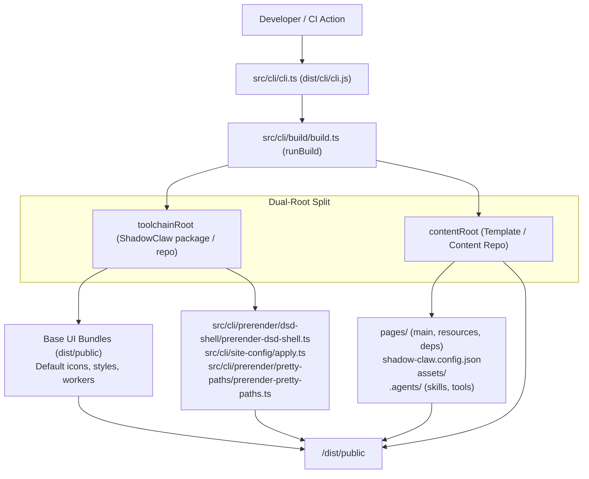

# CLI & Static Site Publishing

> Command-line interface and dual-root build engine for ShadowClaw and downstream templates.

**Source:** `src/cli/cli.ts` · `src/cli/build/build.ts` · `src/cli/site-config/apply.ts` · `package.json`

---

## Overview

ShadowClaw provides a unified, first-class CLI tool (`shadow-claw` / `shadowclaw`) and dual-root build pipeline. This allows developers to:

1. **Develop and preview template sites locally** (`npx shadow-claw dev`) with live reload, static file serving, and backend proxy capabilities.
2. **Build standalone static distribution bundles** (`npx shadow-claw build --prod`) directly into `./dist/public` without cloning the ShadowClaw repository or copying foreign files in CI.
3. **Serve pre-built static artifacts** (`npx shadow-claw serve`).
4. **Run headless backend services without UI or frontend builds** (`npx shadow-claw server` / `services` / `api`).
5. **Scaffold starter templates** (`npx shadow-claw init`).
6. **Execute headless server-side agent prompts, skills, and tools natively** (`npx shadow-claw agent`) without requiring a live browser tab, backed by SQLite, native filesystem handles, and host OS shell execution.

---

## Architecture & Dual-Root Path Resolution



### 1. `toolchainRoot` vs `contentRoot`

- **`toolchainRoot`**: The root directory of the installed `@xt-ml/shadow-claw` or `shadow-claw` package (or the repository checkout). Resolved dynamically via `getProjectRoot` (`src/cli/utils/resolve-project-root.ts`). Contains pre-compiled web bundles (`dist/public/index.js`, `theme-init.js`, `agent.worker.js`, etc.), CLI scripts (`dist/cli/` and `bin/`), and default icons/styles.
- **`contentRoot`**: The consumer project root (defaults to `process.cwd()`). Contains `pages/`, `shadow-claw.config.json` (or backward-compatible `site-config.json`), `assets/`, `.agents/skills`, `.agents/tools`, and receives the final output in `dist/public`.

### 2. Execution Modes

- **In-Repo Mode (`resolve(contentRoot) === resolve(toolchainRoot)`)**:
  When invoked from inside the `xt-ml/shadow-claw` repo (e.g. `npm run build`, `npm run build:prod`, `npm run dev`), executes the exact standalone build pipeline, compiling TypeScript via Rolldown and generating in-tree `dist/public`.
- **CLI / External Consumer Mode (`resolve(contentRoot) !== resolve(toolchainRoot)`)**:
  When invoked on a template repository (e.g. `block-garden-knowledge-hub`, `pwgen-knowledge-hub`, or `shadow-claw-template`), reads base runtime bundles from `toolchainRoot/dist/public` (excluding heavy local model cache directories to prevent disk exhaustion), overlays and merges consumer files from `contentRoot`, applies site branding (`src/cli/site-config/apply.ts`), performs DSD shell and pretty path prerendering, and writes directly into `<contentRoot>/dist/public`.

---

## CLI Commands Reference

### `shadow-claw build [options]`

Builds a static site bundle into `./dist/public`.

| Option                     | Type    | Description                                                                     | Default           |
| :------------------------- | :------ | :------------------------------------------------------------------------------ | :---------------- |
| `--prod, --production`     | boolean | Build in production mode (minification, base path rewriting, revision stamping) | `false`           |
| `--origin <url>`           | string  | Canonical site origin URL (overrides `PAGES_ORIGIN`)                            | `""`              |
| `--base-path <path>`       | string  | Base path prefix (e.g. `/my-site/`, overrides `PAGES_BASE_PATH`)                | `"/shadow-claw/"` |
| `--out-dir <dir>`          | string  | Output directory relative to content root                                       | `"dist/public"`   |
| `--content-root <dir>`     | string  | Working directory containing site content                                       | `process.cwd()`   |
| `--prerender-pages <mode>` | string  | Prerender mode: `all`, `auto`, `none`                                           | `"auto"`          |
| `--copy-all-assets`        | boolean | Copy entire `assets/` directory into output                                     | `false`           |

### `shadow-claw dev [port]` / `shadow-claw run [port]`

Builds the site in development mode and starts the local server with live proxy, task scheduler, and static serving.

| Option / Argument        | Type    | Description                                                                        | Default        |
| :----------------------- | :------ | :--------------------------------------------------------------------------------- | :------------- |
| `[port]` / `-p, --port`  | number  | Port to listen on                                                                  | `8888`         |
| `--host <host>` / `--ip` | string  | Bind host/IP                                                                       | `"127.0.0.1"`  |
| `--open`                 | boolean | Automatically open the default browser on start                                    | `false`        |
| `--cache-dir <path>`     | string  | Custom cache and database storage directory                                        | `".cache"`     |
| `--tmp, --temp`          | boolean | Store cache, token, and databases in OS temporary directory (`node:os` `tmpdir()`) | `false`        |
| `-y, --yes`              | boolean | Skip interactive cache directory prompt and accept defaults                        | `false`        |
| `--cors-mode <mode>`     | string  | CORS policy: `localhost`, `private`, `all`                                         | `"localhost"`  |
| `--peerjs`               | boolean | Enable built-in PeerJS signaling server                                            | `false`        |
| `--allow-private-proxy`  | boolean | Allow `/proxy` endpoint to reach private/loopback addresses                        | `false`        |
| `--https`                | boolean | Enable opt-in HTTPS server using dev TLS certificate                               | `false`        |
| `--cert <path>`          | string  | Path to custom TLS certificate (PEM)                                               | `undefined`    |
| `--key <path>`           | string  | Path to custom TLS private key (PEM)                                               | `undefined`    |
| `--ssl-dir <path>`       | string  | Directory for self-signed TLS certs                                                | `".cache/tls"` |
| `-v, --verbose`          | boolean | Enable verbose request and proxy logging                                           | `false`        |

> **Note on Cache Directory Prompt:** If no existing `.cache` directory or databases are found on launch, ShadowClaw prompts interactively to let you choose between the current directory (`.cache`), system temporary storage (`tmpdir()`), or a custom path. Pass `--tmp`, `-y`, `--cache-dir`, or `SHADOWCLAW_CACHE_DIR` to skip the prompt. The control plane endpoint and token are printed to the console on server start.

### `shadow-claw serve [port]`

Serves an already-built `dist/public` static directory and runs the proxy server without triggering a rebuild. Pass `--no-static` to disable static file and UI serving (services-only mode).

### `shadow-claw server [port]` / `shadow-claw services [port]` / `shadow-claw api [port]`

Starts only the backend server and services (Express API, proxy, task scheduler, Control Plane, Stateless MCP HTTP endpoint, and optional PeerJS signaling) without building or serving the frontend UI or requiring a `dist` folder.

Ideal for scenarios where ShadowClaw frontends (such as static sites on GitHub Pages, Cloudflare Pages, or remote browser tabs) connect to a local or remote headless backend node.

| Option / Argument           | Type    | Description                                                                        | Default             |
| :-------------------------- | :------ | :--------------------------------------------------------------------------------- | :------------------ |
| `[port]` / `-p, --port`     | number  | Port to listen on                                                                  | `8888`              |
| `--host <host>` / `--ip`    | string  | Bind host/IP                                                                       | `"127.0.0.1"`       |
| `--content-root <dir>`      | string  | Content root directory                                                             | `process.cwd()`     |
| `--cache-dir <path>`        | string  | Custom cache and database storage directory                                        | `".cache"`          |
| `--tmp, --temp`             | boolean | Store cache, token, and databases in OS temporary directory (`node:os` `tmpdir()`) | `false`             |
| `-y, --yes`                 | boolean | Skip interactive cache directory prompt and accept defaults                        | `false`             |
| `--database-dir <dir>`      | string  | SQLite database directory (defaults to `<cacheDir>/database`)                      | `".cache/database"` |
| `--cors-mode <mode>`        | string  | CORS policy: `localhost`, `private`, `all`                                         | `"localhost"`       |
| `--cors-allow-origin <url>` | string  | Explicit allowed origins (comma-separated)                                         | `undefined`         |
| `--control-token <token>`   | string  | Secret token for control-plane authentication                                      | Auto-generated      |
| `--peerjs`                  | boolean | Enable built-in PeerJS signaling server                                            | `false`             |
| `--a2a`                     | boolean | Enable the A2A v1.0 agent card, JSON-RPC, and SSE endpoints                        | `false`             |
| `--allow-private-proxy`     | boolean | Allow `/proxy` endpoint to reach private/loopback addresses                        | `false`             |
| `--https`                   | boolean | Enable opt-in HTTPS server using dev TLS certificate                               | `false`             |
| `--cert <path>`             | string  | Path to custom TLS certificate (PEM)                                               | `undefined`         |
| `--key <path>`              | string  | Path to custom TLS private key (PEM)                                               | `undefined`         |
| `--ssl-dir <path>`          | string  | Directory for self-signed TLS certs (defaults to `<cacheDir>/tls`)                 | `".cache/tls"`      |
| `-v, --verbose`             | boolean | Enable verbose request and proxy logging                                           | `false`             |

When `--a2a` is enabled, the server exposes `GET /.well-known/agent-card.json`,
`POST /a2a`, and `GET /a2a/tasks/:taskId`. Set `SHADOWCLAW_A2A=1` to enable the
same endpoints through the environment. Discovery is public; JSON-RPC and SSE
requests use the control token when one is configured. The native
`A2AHttpClient` can discover and call a known server, but `shadow-claw server`
does not automatically connect to or manage a peer registry.

### `shadow-claw init [dir]`

Scaffolds a new ShadowClaw content template in `[dir]` (or `process.cwd()`) with starter:

- `shadow-claw.config.json` (declarative branding, title, server, and sorting configuration)
- `pages/main/index.html` (welcome home page)
- `.gitignore` (`dist/`, `.cache/`, `node_modules/`)

### `shadow-claw agent [action] [args...] [options]`

Runs the headless CLI agent participant—executing the same tool-use loop, prompt assembly, and declarative skill pipelines as the browser, backed by Node.js, `node:sqlite`, native filesystem handles (`NodeFsDirectoryHandle`), and direct OS shell execution.

```bash
# Initialize a headless agent workspace (interactive model selection & optional prewarming)
npx shadow-claw agent init [dir]
npx shadow-claw agent init [dir] --download

# Manage local models (list, download with progress bar, set default, query remote)
npx shadow-claw agent model list
npx shadow-claw agent model download onnx-community/gemma-3-1b-it-ONNX-GQA
npx shadow-claw agent model set onnx-community/gemma-3-1b-it-ONNX-GQA
npx shadow-claw agent model remote --query gemma

# Run a one-shot agent prompt against the workspace (streams to stdout)
npx shadow-claw agent --workspace ./my-project run "what time is it"

# List discovered skills in the workspace
npx shadow-claw agent skills

# List available tools with capability tags (headless-safe vs browser-only)
npx shadow-claw agent tools

# Inspect a tool definition / schema
npx shadow-claw agent tool read_file

# Execute a tool directly with JSON arguments
npx shadow-claw agent tool read_file '{"path": "package.json"}'

# Execute a skill's tool chain pipeline directly
npx shadow-claw agent skill <name>

# Import published tools, skills, and companion scripts from an RFC v0.2.0 discovery manifest
npx shadow-claw agent import https://xt-ml.github.io/shadow-claw-agent-cli-weather/.well-known/agent-skills/index.json
npx shadow-claw agent import https://xt-ml.github.io/shadow-claw-agent-cli-weather/ --tools "get_current_weather,get_weather_forecast"
```

#### Subcommands

| Subcommand        | Arguments           | Description                                                                                                                                                                                                                                     |
| :---------------- | :------------------ | :---------------------------------------------------------------------------------------------------------------------------------------------------------------------------------------------------------------------------------------------- |
| `init`            | `[dir]`             | Initializes workspace directory with `.agents/skills`, `.agents/tools`, `database/`, and default `shadow-claw.config.json`. In interactive TTY environments, prompts for default model and offers immediate prewarm downloading (`--download`). |
| `model`, `models` | `[action] [id]`     | Inspects, queries, downloads, or configures local models (`list`, `remote`, `download`, `set`). Defaults to `list`.                                                                                                                             |
| `run`             | `<prompt>`          | Executes a one-shot agent invocation. Persists messages to SQLite, formats conversation history, runs tool loop, streams output to stdout, and exits. Accepts `-` to read the prompt from stdin, or combines `<prompt>` with piped stdin data.  |
| `skills`          | `[dir]`             | Discovers and prints all available skills in `.agents/skills/` along with user-invocable status and diagnostics.                                                                                                                                |
| `tools`           | none                | Lists all registered tools (built-in and declarative) annotated with `[headless-safe]` or `[browser-only]` capability tags.                                                                                                                     |
| `tool`            | `<name> [jsonArgs]` | When called with only `<name>`, prints the tool description and JSON Schema. When called with `[jsonArgs]`, executes the tool headlessly and prints the result. Accepts JSON arguments or plain text from stdin (auto-mapped to tool schema).   |
| `skill`           | `<name>`            | Executes a skill's declarative tool pipeline (`execution.type: "tools"`) or runs the skill body as an LLM prompt.                                                                                                                               |
| `import`          | `<url>`             | Imports tools, skills, and companion scripts from a remote RFC v0.2.0 discovery endpoint into the agent workspace. Verifies SHA-256 integrity and auto-enables imported declarative tools by default.                                           |

#### Options

| Option                               | Type    | Description                                                                          | Default                                   |
| :----------------------------------- | :------ | :----------------------------------------------------------------------------------- | :---------------------------------------- |
| `--workspace <dir>`                  | string  | Workspace directory for file I/O and configuration                                   | `".cache"`                                |
| `--database-dir <dir>`               | string  | Directory where SQLite databases (`shadow-claw.db`) are stored                       | `<workspace>/database`                    |
| `--cache-dir <dir>`                  | string  | Custom cache directory for databases, models, and logs                               | `undefined`                               |
| `--tmp, --temp`                      | boolean | Store cache, token, and databases in OS temporary directory (`tmpdir()`)             | `false`                                   |
| `-y, --yes`                          | boolean | Skip interactive prompts and accept defaults                                         | `false`                                   |
| `--group <groupId>`                  | string  | Conversation group identifier                                                        | `"server:main"`                           |
| `--provider <provider>`              | string  | LLM provider ID (`transformers_js_local`, `openrouter`, `llamafile`, `gemini`, etc.) | auto-resolved (`"transformers_js_local"`) |
| `--model <model>`                    | string  | Model identifier (e.g. `onnx-community/gemma-3-1b-it-ONNX-GQA`)                      | auto-resolved (curated local default)     |
| `--download`                         | boolean | Prewarm and download the model during agent init or before execution                 | `false`                                   |
| `--api-key <key>`                    | string  | API key for cloud providers                                                          | auto-resolved from env                    |
| `--stream` / `--no-stream`           | boolean | Stream response tokens to stdout as they arrive                                      | `true`                                    |
| `--progress` / `--no-progress`       | boolean | Show terminal progress bar during model downloads                                    | `true`                                    |
| `--system-prompt <text>`             | string  | Override system prompt with inline text                                              | `undefined`                               |
| `--system-prompt-file <file>`        | string  | Load system prompt from a text or markdown file                                      | `undefined`                               |
| `--tools <tools>`                    | string  | Comma-separated list of tools to enable or import (e.g. `bash,read_file`)            | `undefined`                               |
| `--skills <skills>`                  | string  | Comma-separated list of skills to filter or import                                   | `undefined`                               |
| `--scripts <scripts>`                | string  | Comma-separated list of companion scripts to import                                  | `undefined`                               |
| `--all`                              | boolean | Import all tools, skills, and scripts from discovery manifest                        | `false`                                   |
| `--overwrite`                        | boolean | Overwrite existing skills, tools, or scripts during import                           | `false`                                   |
| `--auto-enable` / `--no-auto-enable` | boolean | Automatically enable imported declarative tools in database                          | `true`                                    |
| `--tools-profile <name>`             | string  | Tools profile to activate (e.g. `__builtin_default`)                                 | `undefined`                               |
| `-r, --remote`, `--hf`               | boolean | List or search available models from Hugging Face `onnx-community` repository        | `false`                                   |
| `--query <query>`                    | string  | Filter remote or local models by search query                                        | `undefined`                               |
| `-v, --verbose`                      | boolean | Enable verbose tool activity and diagnostic logging                                  | `false`                                   |
| `-o, --output <file>`                | string  | Write command output to a file instead of stdout                                     | `undefined`                               |
| `-q, --quiet`                        | boolean | Suppress all non-error output                                                        | `false`                                   |

> **First-Run Cache Directory Wizard:** When running the agent without an explicit `--workspace`, `--cache-dir`, or `--tmp` in a directory where no `.cache` or database exists, ShadowClaw prompts interactively (identical to `dev` and `serve`) to let you choose between the current directory (`.cache`), system temporary storage (`tmpdir()`), or a custom path. Pass `-y`, `--yes`, `--tmp`, or `--workspace <dir>` to skip the prompt.

#### Local Model Management (`agent model`)

The `agent model` command suite provides inspection, remote searching, downloading, and configuration for local ONNX and GGUF models:

```bash
# List local cached models with context length and active default marker
npx shadow-claw agent model list

# Query Hugging Face for available onnx-community models
npx shadow-claw agent model remote --query gemma
npx shadow-claw agent model list --remote

# Download a model with interactive progress bar (stored in .cache/models/)
npx shadow-claw agent model download onnx-community/gemma-3-1b-it-ONNX-GQA

# Set the active default model in shadow-claw.config.json
npx shadow-claw agent model set onnx-community/gemma-3-1b-it-ONNX-GQA
```

#### Node-Native Offline Execution

In headless mode, model inference does not require an external browser tab or running web dev server:

- **Transformers.js Local (`node-transformers-executor.ts`)**: Runs ONNX models directly in the Node.js process using `@huggingface/transformers` (device: CPU/q4). Downloads missing files automatically on-demand with progress reporting on `stderr`.
- **Llamafile Local (`node-llamafile-executor.ts`)**: Downloads and spawns host-native Llamafile binaries on dynamic ports, verifies health, streams tokens, and terminates cleanly when finished.
- **Built-in AI Tasks (`executeNativeAiTask.ts`)**: Headless agent dispatches task-based tools (`summarize_text`, `rewrite_text`, etc.) through the node runtime.

#### Standard Input (stdin), Piping & Output Redirection

The headless agent CLI commands are designed for Unix pipeline composability, separating data output from diagnostic logging:

- **Clean Stream Separation**: Command output (agent assistant replies or tool execution results) is emitted directly to **`stdout`**, while progress logs, lifecycle banners, model metadata, and status messages go to **`stderr`**. This ensures standard stdout redirects (`>`) and pipes (`|`) receive clean data without log contamination.
- **File Output (`-o, --output <file>`)**: Writes the command output directly to a file (creating parent directories as needed) while preserving clean stdout for further piping or logging.
- **Quiet Mode (`-q, --quiet`)**: Suppresses all non-error output, lifecycle banners, and progress logging to stderr.

##### Piping into `agent tool`

When piping input into `npx shadow-claw agent tool <name>`:

1. **JSON Input**: If stdin contains valid JSON, it is parsed directly as the tool's input arguments.
2. **Plain-Text Auto-Mapping**: If stdin contains plain text, the CLI inspects the tool's schema and automatically maps the text to the tool's primary string input property, checking candidate field names in order: `text` > `prompt` > `content` > `input` > first defined string parameter.
3. **Explicit Stdin Argument (`-`)**: Passing `-` as the argument (`npx shadow-claw agent tool <name> -`) explicitly forces reading input from stdin.

```bash
# Pipe plain text — auto-mapped to the tool's schema field (text > prompt > content > input)
echo "how are you doing today" | npx shadow-claw agent tool rewrite_text

# Pipe JSON input directly
echo '{"path":"file.txt","content":"hello"}' | npx shadow-claw agent tool write_file

# Quiet mode: suppress all non-error output and save to file
npx shadow-claw agent tool read_file '{"path":"README.md"}' -q -o readme.txt

# Pipe tool output directly into another command (clean stdout)
npx shadow-claw agent tool read_file '{"path":"README.md"}' -q | wc -l
```

##### Piping into `agent run`

When piping input into `npx shadow-claw agent run`:

1. **Full Prompt from Stdin (`-`)**: Passing `-` as the prompt argument instructs the agent to use the piped stdin content as the complete prompt.
2. **Combined Prompt & Context**: Supplying both a `<prompt>` argument and piped stdin automatically concatenates them with a double newline (`<prompt>\n\n<stdin>`), allowing you to provide instructions alongside piped document content or command outputs.
3. **File Output**: Use `-o, --output <file>` to save the generated assistant response to a file while keeping stdout available.

```bash
# Combine a CLI prompt with piped document content
cat doc.txt | npx shadow-claw agent run "Summarize this" -o /tmp/out.txt

# Use "-" as the prompt argument to take stdin as the full prompt
cat prompt.txt | npx shadow-claw agent run -

# Pipe plain text into an agent prompt and redirect output to a file
echo "Summarize: ..." | npx shadow-claw agent run -o summary.txt
```

#### Process Interruption & Clean Termination

The CLI runtime installs central termination signal handlers (`SIGINT` code 130, `SIGTERM` code 143, and `exit`) via `registerTerminationCleanup` in `src/cli/cli.ts`. When an agent run or server session is interrupted (e.g. Ctrl+C), all active child processes, Llamafile daemons, and temporary descriptors are terminated cleanly without leaving orphan processes behind.

#### Credential Auto-Resolution & Exit Codes

The headless agent checks credentials in the following order:

1. CLI options (`--provider`, `--model`, `--api-key`)
2. Environment variables (`SHADOW_CLAW_PROVIDER`, `SHADOW_CLAW_MODEL`, `OPENROUTER_API_KEY`, `HUGGINGFACE_API_KEY`, `GEMINI_API_KEY`, `ANTHROPIC_API_KEY`, etc.)
3. SQLite database configuration (`CONFIG_KEYS.PROVIDER`, `CONFIG_KEYS.MODEL`)
4. Workspace configuration (`agent.defaultProvider`, `agent.defaultModel` or `settings.defaultProvider`, `settings.defaultModel` in `shadow-claw.config.json`)
5. Provider defaults (`"transformers_js_local"` with `"onnx-community/gemma-3-1b-it-ONNX-GQA"` for offline execution, or `"openrouter"` with `"openrouter/free"`)

If credentials are required but missing, or if the LLM provider returns an API error, `agent run` outputs actionable diagnostic messages to `stderr` and terminates with **exit code `1`**, ensuring scripts and CI/CD pipelines fail reliably.

### `shadow-claw clients [options]`

Lists connected / registered browser and Electron clients and their capabilities (e.g. OPFS, WebMCP, push, WebRTC).

```bash
# List clients registered via HTTP / WebSocket control plane
npx shadow-claw clients

# List peers connected via WebRTC DataChannel (requires webrtc listen)
npx shadow-claw clients --transport webrtc
```

### `shadow-claw send <message> [options]`

Sends a message/prompt directly to a connected client or active orchestrator conversation.

```bash
# Send to the default/active conversation on a client via HTTP control plane
npx shadow-claw send "Hello from the CLI" --client <client-id>

# Send to a specific conversation group (e.g. main AI assistant or PeerJS channel)
npx shadow-claw send "Hello from the CLI" --client <client-id> --group "br:main"
npx shadow-claw send "Hello to peer" --client <browser-peer-id> --group "peer:<cli-peer-id>"

# Send over WebRTC DataChannel transport (routes via webrtc listen IPC or direct connection)
npx shadow-claw send "Hello from CLI" --transport webrtc --client <browser-peer-id>

# Attach a local file to the prompt
npx shadow-claw send "Analyze this dataset" --file ./data.csv --transport webrtc --client <peer-id>
```

| Option                    | Type    | Description                                                                                 | Default       |
| :------------------------ | :------ | :------------------------------------------------------------------------------------------ | :------------ |
| `--client <id>`           | string  | Target client ID or PeerJS peer ID (defaults to first available connected client)           | `""`          |
| `--group <groupId>`       | string  | Target conversation group ID (`br:main`, `peer:<peerId>`, etc.). Defaults to active group.  | Active group  |
| `-f, --file <path>`       | string  | Attach a local file to send with the message                                                | `""`          |
| `--transport <transport>` | string  | Transport mechanism: `http` (Control Plane REST/WebSocket) or `webrtc` (WebRTC DataChannel) | `"http"`      |
| `--host <host>`           | string  | Control plane / signaling server host                                                       | `"127.0.0.1"` |
| `--port <port>`           | number  | Control plane / signaling server port                                                       | `8888`        |
| `--token <token>`         | string  | Control token (auto-resolved from `.cache/control-token.json` or `clients.db` if omitted)   | `""`          |
| `--https`                 | boolean | Connect to server control plane via HTTPS                                                   | `false`       |
| `-k, --insecure`          | boolean | Allow self-signed TLS certificates for local control plane connections                      | `true`        |
| `--peer-id <id>`          | string  | Custom WebRTC CLI peer ID override                                                          | `""`          |
| `--timeout <seconds>`     | string  | Timeout in seconds to wait for response                                                     | `"120"`       |
| `--json`                  | boolean | Output response payload as JSON                                                             | `false`       |
| `--cache-dir <dir>`       | string  | Custom cache directory for token and peer ID storage                                        | `".cache"`    |

### `shadow-claw send-file <file> [options]`

Transfers a file to a connected peer or client over WebRTC or HTTP, with optional accompanying instructions for the receiving agent.

```bash
# Transfer a file to a remote peer over WebRTC
npx shadow-claw send-file ./report.pdf --client cli-01m1...

# Transfer a file and prompt the remote agent to process it
npx shadow-claw send-file ./dataset.csv --client cli-01m1... --prompt "Summarize the top anomalies in this dataset"

# Specify custom remote file name
npx shadow-claw send-file ./temp.bin --name final-metrics.bin --client cli-01m1...
```

| Option                    | Type    | Description                                                     | Default       |
| :------------------------ | :------ | :-------------------------------------------------------------- | :------------ |
| `--client <id>`           | string  | Target client ID or PeerJS peer ID                              | First peer    |
| `--prompt <prompt>`       | string  | Accompanying prompt or instructions for the receiving agent     | `""`          |
| `--name <fileName>`       | string  | Override the remote file name                                   | File basename |
| `--group <groupId>`       | string  | Target conversation group ID (`br:main`, `peer:<peerId>`, etc.) | `""`          |
| `--transport <transport>` | string  | Transport mechanism: `webrtc` (default) or `http`               | `"webrtc"`    |
| `--timeout <seconds>`     | string  | Transfer and execution timeout in seconds                       | `"120"`       |
| `--json`                  | boolean | Output response payload as JSON                                 | `false`       |

### `shadow-claw backup [trigger|list|delete] [options]`

Triggers a remote OPFS workspace backup from a connected client, lists available snapshots, or deletes backups.

```bash
# Trigger backup via HTTP control plane
npx shadow-claw backup
npx shadow-claw backup --client <client-id>

# Trigger backup via WebRTC DataChannel
npx shadow-claw backup --transport webrtc --client <browser-peer-id>

# List or delete stored snapshots on server
npx shadow-claw backup list
npx shadow-claw backup delete --backup-id <id>
```

### `shadow-claw tasks [options]`

Lists scheduled tasks configured on a connected client (with optional group filtering).

```bash
# List all tasks on default connected client
npx shadow-claw tasks

# List all tasks via HTTP control plane
npx shadow-claw tasks --client <client-id>

# Filter tasks by conversation group (e.g. main AI chat or peer channel)
npx shadow-claw tasks --client <client-id> --group "br:main"
npx shadow-claw tasks --transport webrtc --client <browser-peer-id> --group "peer:<cli-peer-id>"

# List tasks via WebRTC DataChannel
npx shadow-claw tasks --transport webrtc --client <browser-peer-id>
```

| Option                    | Type   | Description                                                             | Default       |
| :------------------------ | :----- | :---------------------------------------------------------------------- | :------------ |
| `--client <id>`           | string | Target client ID or PeerJS peer ID (defaults to first connected client) | `""`          |
| `--group <groupId>`       | string | Filter tasks by conversation group ID (`br:main`, `peer:...`, etc.)     | All groups    |
| `--transport <transport>` | string | Transport mechanism: `http` or `webrtc`                                 | `"http"`      |
| `--host <host>`           | string | Control plane / signaling server host                                   | `"127.0.0.1"` |
| `--port <port>`           | number | Control plane / signaling server port                                   | `8888`        |
| `--token <token>`         | string | Control token                                                           | `""`          |
| `--peer-id <id>`          | string | Custom WebRTC CLI peer ID override                                      | `""`          |
| `--cache-dir <dir>`       | string | Custom cache directory                                                  | `".cache"`    |

### `shadow-claw mcp [options]`

Runs the official Stateless Model Context Protocol (2026-07-28) server via STDIO or HTTP. Exposes ShadowClaw CLI capabilities and dynamically relayed tools from connected browser clients to external agent hosts (Claude Desktop, Cursor, Goose).

```bash
# Run in STDIO mode (default, for Claude Desktop or Cursor configuration)
npx shadow-claw mcp

# Test via the official MCP Inspector over HTTPS
npx @modelcontextprotocol/inspector npx shadow-claw mcp --host exampleHostname --https

# Run in Streamable HTTP mode on port 8888
npx shadow-claw mcp --mcp-transport http --port 8888

# Connect over WebRTC DataChannel to a specific browser client
npx shadow-claw mcp --transport webrtc --client <browser-peer-id>
```

| Option                    | Type    | Description                                                          | Default       |
| :------------------------ | :------ | :------------------------------------------------------------------- | :------------ |
| `--mcp-transport <mode>`  | string  | MCP host transport: `stdio` or `http`                                | `"stdio"`     |
| `--relay-client-tools`    | boolean | Discover and relay tools from connected browser clients              | `true`        |
| `--client <id>`           | string  | Target client ID or PeerJS peer ID (defaults to first active client) | `""`          |
| `--transport <transport>` | string  | Control plane client transport: `http` or `webrtc`                   | `"http"`      |
| `--host <host>`           | string  | Control plane host                                                   | `"127.0.0.1"` |
| `--port <port>`           | number  | Control plane port or HTTP MCP port                                  | `8888`        |
| `--token <token>`         | string  | Control token                                                        | Auto-resolved |
| `--https`                 | boolean | Connect to server via HTTPS                                          | `false`       |
| `-k, --insecure`          | boolean | Allow self-signed TLS certificates                                   | `true`        |
| `--cache-dir <dir>`       | string  | Custom cache directory for control token and databases               | `""`          |

> **Client & Server Tool Naming:** Built-in server and CLI tools are exposed with the `shadowclaw_server_` prefix (e.g. `shadowclaw_server_list_clients`, `shadowclaw_server_send_message`, `shadowclaw_server_status`), while relayed client tools use `shadowclaw_client_` (e.g. `shadowclaw_client_read_file`, `shadowclaw_client_javascript`, `shadowclaw_client_list_files`). Legacy and unprefixed aliases are preserved for backward compatibility.
>
> **Control Token Auto-Discovery:** Control plane commands automatically search candidate tokens across the `--token` flag, `SHADOWCLAW_CONTROL_TOKEN`, the system temporary directory (`<tmpdir>/shadow-claw/control-token[-<port>].json`), ancestor directory trees, user config/cache directories, and SQLite database metadata. If a 401 Unauthorized response is encountered, the client automatically retries across remaining candidate tokens.

### `shadow-claw webrtc [action] [options]` / `shadow-claw peer-id [action] [options]`

Manages WebRTC CLI peer identity (`.cache/cli-peer-id`) and provides the `webrtc listen` daemon for headless DataChannel communication with browser tabs.

#### 1. Managing CLI Peer ID

```bash
# Get or create peer ID
npx shadow-claw peer-id

# Force renewal / generation of a new peer ID
npx shadow-claw peer-id --renew

# Set custom peer ID
npx shadow-claw peer-id --set my-custom-peer-id

# Print only raw ID string (for shell scripting)
npx shadow-claw peer-id -q
```

#### 2. Running WebRTC & Agent Listener (`agent listen` / `webrtc listen`)

Registers the CLI as a live PeerJS peer on the signaling server so other CLI agents and browser tabs can connect directly over WebRTC. By default, incoming prompts and transferred files trigger the headless agent orchestration loop (`runAgentRun`), allowing peer-to-peer agent prompting and data exchange.

It also launches a local Unix socket IPC bridge (`.cache/webrtc-ipc.sock`) to coordinate concurrent `send` commands without peer ID conflicts.

```bash
# Start an agent listener with default config
npx shadow-claw agent listen

# Specify model and custom workspace
npx shadow-claw agent listen --model gpt-4o-mini --workspace ./agent-workspace

# Restrict incoming connections to specific peer IDs
npx shadow-claw agent listen --trusted-peer <peer-id>

# Run as a bare DataChannel relay without invoking the LLM orchestration loop
npx shadow-claw webrtc listen --no-agent
```

**Peer-to-Peer Agent Collaboration Workflow:**

1. On Agent A, start the listener: `npx shadow-claw agent listen`. Note the displayed CLI Peer ID (`cli-01m1...`).
2. On Agent B, send prompts or files to Agent A:

   ```bash
   # Agent B prompts Agent A
   npx shadow-claw send --transport webrtc --client <peer-id-A> "Analyze recent logs"

   # Agent B sends a file with analysis instructions
   npx shadow-claw send-file ./server.log --client <peer-id-A> --prompt "Find fatal errors"
   ```

3. Inside the orchestration loop, agents can also autonomously use the `prompt_peer`, `list_peers`, and `send_file` tools to coordinate with other agents.

#### Step-by-Step: Transferring Files Between CLI Peers

This end-to-end walkthrough demonstrates how to transfer a file directly between two CLI peers over WebRTC, optionally triggering the receiving agent to process the file and return its findings.

##### 1. Start the Signaling Server

WebRTC connections require an initial signaling handshake. Start ShadowClaw's server with PeerJS enabled:

```bash
# Start server with PeerJS signaling enabled (default port: 8888)
npm start -- --peerjs
# or
npx shadow-claw start --peerjs
```

The server hosts the PeerJS signaling endpoint at `ws://127.0.0.1:8888/` (or `wss://` when TLS is enabled).

##### 2. Start Receiver Peer (Peer A)

On the receiving machine (or in a separate terminal with its own cache/workspace):

```bash
# Run listener with full agent orchestration (processes prompts on arrival)
npx shadow-claw agent listen --cache-dir .cache-peer-a --workspace ./peer-a-workspace

# Or run as a bare file receiver without LLM processing
npx shadow-claw webrtc listen --no-agent --cache-dir .cache-peer-a
```

When started, the listener displays its registration information:

```text
WebRTC CLI Peer ID : cli-01j9abc123def456
Signaling server   : ws://127.0.0.1:8888/
Trusted peers      : (any — add --trusted-peer <id> to restrict)
```

> [!NOTE]
> Transferred files are automatically saved to `<workspace>/transfers/<fileName>` (or `.cache/transfers/<fileName>`).

##### 3. Send File from Sender Peer (Peer B)

On the sending machine (or a second terminal window):

```bash
# Basic direct file transfer over WebRTC
npx shadow-claw send-file ./metrics.csv --client cli-01j9abc123def456

# Transfer on the same host using a dedicated cache directory for Peer B
npx shadow-claw send-file ./metrics.csv --client cli-01j9abc123def456 --cache-dir .cache-peer-b

# Transfer with custom remote destination filename
npx shadow-claw send-file ./metrics.csv --name q3-metrics.csv --client cli-01j9abc123def456

# Transfer with an accompanying prompt (triggers Peer A's agent to analyze the file)
npx shadow-claw send-file ./metrics.csv \
  --client cli-01j9abc123def456 \
  --prompt "Analyze this CSV for any unexpected latency spikes and summarize"
```

##### 4. Verify Transfer and Output

On Peer B (Sender):

```text
Sending "metrics.csv" (4820 bytes) to cli-01j9abc123def456...
File "metrics.csv" successfully transferred to cli-01j9abc123def456.
Remote location: /peer-a-workspace/transfers/metrics.csv

Response from cli-01j9abc123def456:
----------------------------------------
I analyzed the transferred CSV at /peer-a-workspace/transfers/metrics.csv:
1. Two latency spikes occurred between 02:14 UTC and 02:18 UTC.
2. Error rates normalized after 02:22 UTC.
----------------------------------------
```

On Peer A (Receiver):
The file is immediately present on disk:

```bash
ls -l ./peer-a-workspace/transfers/metrics.csv
```

##### 5. Autonomous Transfer Within the Agent Loop

When running an autonomous agent (`shadow-claw agent run`), agents can discover peers and initiate file transfers programmatically using built-in agent tools:

1. **`list_peers`**: Discover active peer IDs.
2. **`send_file`**: Send a workspace file with an optional prompt to another peer:
   ```json
   {
     "file_path": "reports/summary.md",
     "peer_id": "cli-01j9abc123def456",
     "prompt": "Please review this summary report."
   }
   ```
3. **`prompt_peer`**: Follow up with queries or instructions to the remote peer.

### `shadow-claw skills:index [dir]` (alias `agent-skills`)

Generates or updates the Agent Skills Discovery index (`.well-known/agent-skills/index.json`) adhering to the **[Agent Skills Discovery RFC (v0.2.0)](https://schemas.agentskills.io/discovery/0.2.0/schema.json)**.

Scans `.agents/skills/**/SKILL.md`, `.agents/tools/main/*.json`, and `.agents/scripts/main/*`, computes SHA-256 digests (`sha256:...`) and RFC 3986 relative URLs, and links skill tool execution and script dependencies.

```bash
# Generate discovery index for current repository/content root
npx shadow-claw skills:index

# Generate index for a specific directory
npx shadow-claw skills:index ./my-assistant

# Output index.json content to stdout without writing to disk
npx shadow-claw skills:index --stdout --no-write

# Specify custom output path
npx shadow-claw skills:index --out-file custom/discovery/index.json
```

| Option                  | Type    | Description                                                     | Default                      |
| :---------------------- | :------ | :-------------------------------------------------------------- | :--------------------------- |
| `--out-dir <dir>`       | string  | Output directory relative to content root                       | `".well-known/agent-skills"` |
| `--out-file <file>`     | string  | Explicit destination file path for `index.json`                 | `undefined`                  |
| `--metadata-root <dir>` | string  | Directory to read site metadata from                            | content root                 |
| `--config <file>`       | string  | Path to `shadow-claw.config.json`                               | auto-discovered              |
| `--bundled`             | boolean | Include and materialize bundled ShadowClaw skills on disk/index | `false`                      |
| `--no-bundled`          | boolean | Exclude bundled ShadowClaw skills from discovery                | `true` (default behavior)    |
| `--stdout`              | boolean | Print generated JSON directly to stdout                         | `false`                      |
| `--no-write`            | boolean | Skip writing the generated index file to disk                   | `false`                      |

> **Build Pipeline Integration:** `src/cli/build/build.ts` (invoked via `bin/build.mjs`) automatically generates `.well-known/agent-skills/index.json` during builds into `dist/public`, indexing both content skills and bundled skills (such as `skill-creator`) using the content root's site metadata, and keeps `.agents/scripts` and repository `.well-known` synchronized.

---

## NPM Packaging & Prepack Lifecycle

In `package.json`:

```json
{
  "name": "shadow-claw",
  "bin": {
    "shadow-claw": "bin/cli.mjs",
    "shadowclaw": "bin/cli.mjs"
  },
  "files": ["bin", "dist", "assets", "share", "src", "README.md", "LICENSE"],
  "scripts": {
    "prepack": "npm run build:prod"
  }
}
```

- **`prepack` Hook**: Guarantees that `npm run build:prod` is executed immediately prior to `npm pack` or `npm publish`, ensuring `dist/public` contains the latest compiled production bundles.
- **`files` Whitelist**: Packages only runtime essentials (`bin/`, `dist/`, `assets/`, `share/`, `src/`) and excludes test files, `.cache/`, and electron binaries.
- **Dual Binaries**: Registers both `shadow-claw` (canonical) and `shadowclaw` (alias) so commands resolve regardless of hyphenation.
