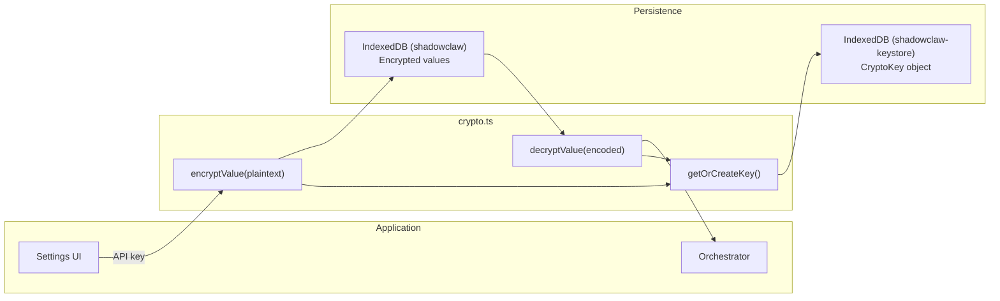

# Cryptography

> AES-256-GCM encryption for API keys and sensitive credentials using the Web Crypto API.

**Source:** `src/crypto.ts`

## Architecture



## API

| Function       | Signature                               | Purpose                                   |
| -------------- | --------------------------------------- | ----------------------------------------- |
| `encryptValue` | `(plaintext: string) → Promise<string>` | Encrypt a value, return base64 string     |
| `decryptValue` | `(encoded: string) → Promise<string>`   | Decrypt a base64 string, return plaintext |

## How It Works

### Key management

1. On first use, `getOrCreateKey()` generates an AES-256-GCM key via Web Crypto API
2. The key is stored as a **non-extractable** `CryptoKey` object in a dedicated IndexedDB database: `shadowclaw-keystore`
3. IndexedDB can store `CryptoKey` objects natively via structured clone
4. The key material can **never be read** by JavaScript — only used for encrypt/decrypt operations

### Encryption

```text
plaintext
    ↓
Generate 12-byte random IV (crypto.getRandomValues)
    ↓
AES-256-GCM encrypt (Web Crypto API)
    ↓
Prepend IV to ciphertext: [IV (12 bytes) | ciphertext]
    ↓
Base64 encode → stored in IndexedDB
```

### Decryption

```text
base64 string from IndexedDB
    ↓
Base64 decode → Uint8Array
    ↓
Split: first 12 bytes = IV, rest = ciphertext
    ↓
AES-256-GCM decrypt (Web Crypto API)
    ↓
Decode UTF-8 → plaintext
```

## Security Properties

| Property            | Detail                                                 |
| ------------------- | ------------------------------------------------------ |
| Algorithm           | AES-GCM (authenticated encryption)                     |
| Key size            | 256 bits                                               |
| IV size             | 12 bytes (96 bits), random per encryption              |
| Key extractability  | `false` — can't be exported to raw bytes               |
| Key storage         | Separate IndexedDB database (`shadowclaw-keystore`)    |
| Tampering detection | GCM authentication tag detects ciphertext modification |

## What Gets Encrypted

| Config Key              | Content                                                  |
| ----------------------- | -------------------------------------------------------- |
| `CONFIG_KEYS.API_KEY`   | LLM provider API key                                     |
| `CONFIG_KEYS.GIT_TOKEN` | Git personal access token                                |
| Provider-specific keys  | Per-provider API keys via `getProviderApiKeyConfigKey()` |

## Design Decisions

- **Separate database** — The crypto key lives in `shadowclaw-keystore`, isolated from the main `shadowclaw` database. Defense-in-depth.
- **Non-extractable key** — Even if an attacker gains JavaScript execution context, they cannot extract the raw key material.
- **Per-encryption IV** — Every `encryptValue()` call generates a fresh random IV, ensuring identical plaintexts produce different ciphertexts.
- **No plaintext storage** — API keys are always encrypted before writing to IndexedDB. `crypto.ts` is the only path for reading/writing sensitive config values.

## Settings Backup & Restore

To facilitate configuration portability while preserving security, settings export/import logic is encapsulated in `src/settings-backup.ts`:

- **Backup Encryption**: When exporting settings, standard configuration values remain in plaintext, but any encrypted keys (API keys, git tokens, etc.) are decrypted via `crypto.ts` and re-encrypted using a user-provided password.
- **Restore Decryption**: When importing settings, the module prompts for the password to decrypt the sensitive values, which are then securely re-encrypted with the local environment's browser-specific `CryptoKey` and saved back into IndexedDB.
