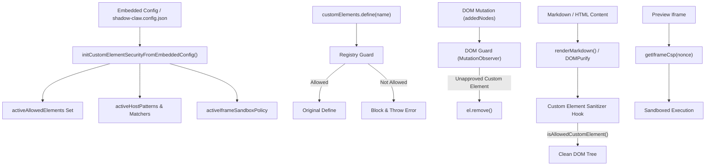

# Custom Element Security & Iframe Sandboxing

> Runtime guardrails, DOM element isolation, allowlists, and Content Security Policy for custom elements and iframe previews.

**Source:** `src/security/custom-element-security.ts` · `src/security/iframe-sanitizer.ts` · `src/security/custom-element-security.test.ts`

## Overview

ShadowClaw provides deep support for rendering user-supplied markdown, HTML, and rich interactive documents. To protect against Cross-Site Scripting (XSS), script injection, and DOM clobbering, ShadowClaw enforces a multi-layered security architecture:

1. **Custom Element Registry Guard:** Intercepts `customElements.define()` to block unauthorized custom elements from registering handlers or prototypes.
2. **Custom Element DOM Guard:** Uses a `MutationObserver` to immediately detect and strip unapproved custom elements inserted into the DOM.
3. **DOMPurify Integration:** Custom hooks in DOMPurify validate tag names against the allowed custom element set (`isAllowedCustomElement`) during HTML sanitization.
4. **Sandboxed Iframe & CSP Isolation:** Previews render inside sandboxed iframes with a strict, nonce-gated Content Security Policy (CSP) and configurable sandbox directives.
5. **Approved Script Loading:** Dynamic loading of approved custom element scripts is restricted to safe origins, same-origin paths, and validated host patterns using Trusted Types.

---

## Architecture Overview



---

## Key Components

### 1. Custom Element Validation (`isAllowedCustomElement`)

- **Built-in Permitted Elements:** Standard HTML elements (no hyphen) and built-in ShadowClaw components (`shadow-claw` and `shadow-claw-*`) are always permitted.
- **Dynamic Allowlist:** Custom elements (tags containing `-`) outside the built-in prefix must match explicitly configured allowlists populated from `shadow-claw.config.json` (or legacy `site-config.json`) or persistent IndexedDB configuration.

### 2. Registry Guard (`installCustomElementsRegistryGuard`)

Monkey-patches `customElements.define` at application boot (`src/core/index.ts` and `src/core/theme-init.ts`). If a script attempts to register an unapproved tag name, the guard throws an error and halts execution of that definition.

### 3. DOM Guard (`installCustomElementDomGuard`)

Installs a `MutationObserver` on the root DOM tree:

- Proactively sweeps and removes any existing unapproved custom elements.
- Continuously observes child list mutations and immediately strips newly injected unapproved custom elements.

### 4. DOMPurify Hooks (`ensureCustomElementSanitizerHook`)

Registers `uponSanitizeElement` and `afterSanitizeElements` hooks with DOMPurify to strip any element containing a hyphen unless approved by `isAllowedCustomElement()`.

### 5. Sandboxed Previews & CSP (`getIframeCsp`, `getIframeSandboxPolicy`)

- **Default Sandbox Policy:** `allow-modals allow-scripts allow-popups allow-popups-to-escape-sandbox`. Notably, `allow-same-origin` is omitted by default to eliminate Chrome sandbox escape warnings and enforce strict opaque-origin (`null`) isolation.
- **Single-Load Sandboxed Execution:** Custom element scripts (`customElements.scripts`) are executed exclusively inside sandboxed preview `<iframe>` instances (`iframe.srcdoc`) and are deliberately excluded from injection into the parent document shell (`index.html`). This guarantees single-load execution of custom elements and isolates element styles and scripts from the parent application shell.
- **Transparent Storage Proxy Bridge (`iframe-storage-bridge.js` & `iframe-storage-proxy.ts`):** Because browsers deny direct `IndexedDB` and `localStorage` access in `null`-origin sandboxes, ShadowClaw injects `iframe-storage-bridge.js` into preview iframes. The bridge detects storage security errors and polyfills `indexedDB` and `localStorage` by proxying CRUD operations over `postMessage` (`shadow-claw-storage-proxy`). The parent frame receives these messages and executes them via `iframe-storage-proxy.ts` against a namespaced IndexedDB key-value store (`shadow-claw-iframe-storage`), giving interactive custom elements (like 3D game engines and canvas sandboxes) full storage capabilities without granting same-origin privileges.
- **Declarative BroadcastChannel Proxy Bridge (`file-viewer-preview-bridge.js` & `iframe-broadcast-proxy.ts`):** Browser `BroadcastChannel` instances are origin-partitioned and blocked under opaque `null` origins. ShadowClaw provides a zero-config, origin-agnostic `IframeBroadcastProxy` that automatically scans enabled declarative tools for `BroadcastChannel` instantiation patterns and relays messages bi-directionally between parent/worker tools and the sandboxed iframe. An `isRelayingCommandFromParent` guard inside the iframe bridge suppresses duplicate result relay to eliminate command echo feedback loops.
- **Local Static CORS Headers:** ShadowClaw's static file middleware sets `Access-Control-Allow-Origin: *` so sandboxed opaque-origin (`null`) iframes can fetch local custom element adapter scripts and assets during development.
- **Nonce-gated CSP:** Generates strict `script-src`, `worker-src`, `connect-src`, `style-src`, and `img-src` directives dynamically incorporating active nonce tokens and approved script hosts.

### 6. Approved Script Loader (`loadApprovedCustomElementScript`)

Validates remote custom element scripts dynamically:

- Validates URL protocols (restricting to `http:`/`https:`) and validates hostnames against `activeHostMatchers`.
- Converts URLs to Trusted Types via `toTrustedScriptUrl()`.
- Custom element scripts execute exclusively inside sandboxed preview `<iframe>` environments (`iframe.srcdoc`) with `allow="fullscreen"` permissions, eliminating duplicate initialization and protecting the main application shell context.

---

## Configuration & Seeding

Configuration can be provided declaratively or loaded dynamically:

### Declarative Configuration (`shadow-claw.config.json`)

```json
{
  "customElements": {
    "allowedElements": ["my-chart", "math-formula"],
    "allowedDomains": ["cdn.jsdelivr.net", "*.cdnjs.cloudflare.com"],
    "scripts": ["https://cdn.jsdelivr.net/npm/my-chart/dist/index.js"]
  },
  "security": {
    "iframeSandbox": "allow-modals allow-scripts allow-popups",
    "allowSameOrigin": false,
    "scriptSrc": ["https://cdn.jsdelivr.net"],
    "connectSrc": ["https://api.example.com"]
  }
}
```

### IndexedDB Storage Keys

- `CONFIG_KEYS.ALLOWED_CUSTOM_ELEMENTS` (`allowed_custom_elements`): Persisted list of approved custom element tag names.
- `CONFIG_KEYS.ALLOWED_CUSTOM_ELEMENT_HOST_PATTERNS` (`allowed_custom_element_host_patterns`): Persisted list of approved host domain patterns.

---

## Related Documentation

- [System Overview](../architecture/overview.md)
- [Pages System](pages.md)
- [Trusted Types Tinyfill](trusted-types-tinyfill.md)
- [Cryptography & Secrets](crypto.md)
