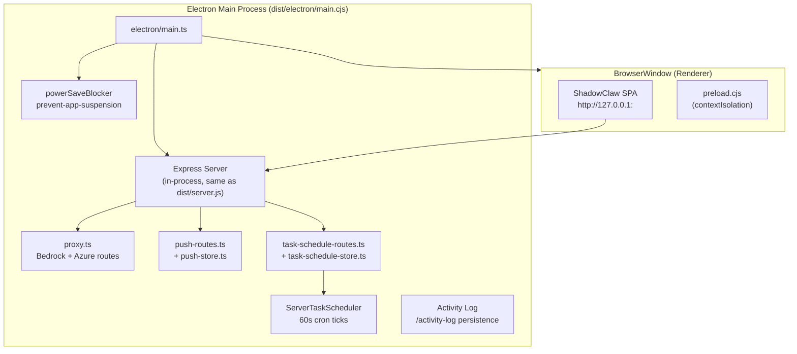

# Electron Desktop App

> Electron entry point that runs the full Express server in-process and loads
> the app in a BrowserWindow — full parity with the dev server.

**Source:** `electron/main.ts` · `electron/preload.cjs`

## Build Output

The Electron main process is compiled by Rollup from `electron/main.ts` to `dist/electron/main.cjs` (CommonJS format, since Electron requires CJS for the main process).

```bash
npm run electron              # Build + launch desktop app
npm run electron:build        # Build distributable (auto-detect OS)
npm run electron:build:win    # Build for Windows (NSIS + MSI + ZIP)
npm run electron:build:mac    # Build for macOS (ZIP)
```

Output: `dist-electron/` (git-ignored). Built with `electron-builder`.

## Architecture



## Entry Point (`electron/main.ts`)

The Electron main process:

1. **Starts Express server** — same static serving + routes as `src/server/server.ts`
2. **Registers proxy routes** — Bedrock + Azure OpenAI pass-through
3. **Applies CSP report-only middleware** — `Content-Security-Policy-Report-Only` header parity with the dev server
4. **Opens push store** — SQLite database for VAPID keys + push subscriptions
5. **Opens task store** — SQLite database for scheduled tasks
6. **Starts server scheduler** — 60-second cron ticks for scheduled tasks
7. **Registers activity log routes** — persistence under `.cache/logs`
8. **Creates BrowserWindow** — loads `http://127.0.0.1:<port>`
9. **Enables power-save blocker** — prevents OS from suspending the app

## Window Configuration

| Setting               | Value                                          |
| --------------------- | ---------------------------------------------- |
| Size                  | 1280 × 900                                     |
| Menu bar              | Hidden (`autoHideMenuBar: true`)               |
| Context isolation     | `true` (sandboxed preload)                     |
| Background throttling | `false` (agent runs in background)             |
| Theme background      | Dynamic from `nativeTheme.shouldUseDarkColors` |

`backgroundThrottling: false` ensures the renderer process isn't throttled when the window is in the background — critical for scheduled tasks and ongoing agent conversations.

## Server Parity

The Electron app runs the **exact same server stack** as `src/server/server.ts`:

| Feature               | Module                                                             |
| --------------------- | ------------------------------------------------------------------ |
| Static file serving   | `express.static()`                                                 |
| Bedrock + Azure proxy | `src/server/proxy.ts` → `registerProxyRoutes()`                    |
| CSP report-only       | `src/server/middleware/csp.ts` → `createCspReportOnlyMiddleware()` |
| Push notifications    | `src/notifications/push-routes.ts`                                 |
| Task scheduling       | `src/notifications/task-schedule-routes.ts`                        |
| Activity logging      | `src/server/routes/activity-log.ts`                                |
| Server-side scheduler | `src/notifications/task-scheduler-server.ts`                       |

Both entry points call the same functions from shared modules — no code duplication between dev server and desktop app.

## SPA Fallback

Unmatched routes serve `index.html` — standard SPA behavior:

```ts
app.get("*", (req, res) => res.sendFile("index.html"));
```

## Lifecycle Management

| Event               | Action                                     |
| ------------------- | ------------------------------------------ |
| `ready`             | Create window, start server                |
| `window-all-closed` | Quit on Windows/Linux; stay alive on macOS |
| `activate`          | Recreate window on macOS dock click        |
| `will-quit`         | Stop power blocker, close server           |

## Preload Script (`electron/preload.cjs`)

Sandboxed preload with `contextIsolation: true`. The app loads the same compiled TypeScript bundle served over HTTP — no Electron modules are imported from browser-side code.

## Important Constraints

- **Never** import Electron modules from browser-side `.ts` files
- **Never** commit `dist-electron/` build outputs
- The Electron app loads the same source as the browser — no separate build
- Both SQLite databases (`push-subscriptions.db`, `scheduled-tasks.db`) are git-ignored and generated at runtime
