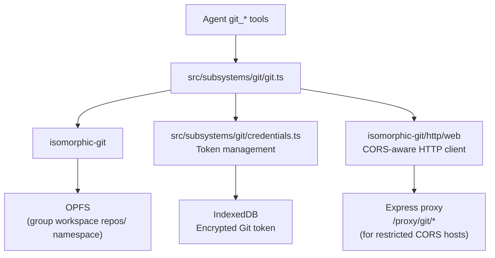

# Git Integration

> In-browser Git operations using isomorphic-git with native filesystem handles as the backend.

**Source:** `src/subsystems/git/git.ts` · `src/subsystems/git/credentials.ts`

## Architecture



## How it works

isomorphic-git writes and reads directly to/from OPFS via a hand-rolled `fs.promises`-compatible adapter (`makeOpfsFs`) defined in `src/subsystems/git/git.ts`. There is no intermediate in-memory layer — all git object storage is durably persisted in OPFS through the same filesystem root used by workspace files.

Repos are stored at `repos/<repo-name>/` inside the workspace group directory.

## Supported Git Operations

| Tool                   | Operation                                        |
| ---------------------- | ------------------------------------------------ |
| `git_clone`            | Clone a remote repository                        |
| `git_init`             | Initialize a new empty repo locally              |
| `git_checkout`         | Switch branch / tag / commit                     |
| `git_branch`           | Create a new branch                              |
| `git_delete_branch`    | Delete a local branch                            |
| `git_branches`         | List all branches                                |
| `git_status`           | Working tree status                              |
| `git_add`              | Stage files                                      |
| `git_unstage`          | Remove files from the index (inverse of git_add) |
| `git_log`              | Commit history                                   |
| `git_diff`             | Show changes (HEAD vs workdir **or** two refs)   |
| `git_show`             | Commit metadata + diff against parent            |
| `git_read_file_at_ref` | Read a file at any ref without checkout          |
| `git_commit`           | Create a commit                                  |
| `git_fetch`            | Fetch from remote without merging                |
| `git_pull`             | Fetch + merge from remote                        |
| `git_push`             | Push to remote (supports `tags: true`)           |
| `git_merge`            | Merge branch                                     |
| `git_reset`            | Reset HEAD to a ref (--hard)                     |
| `git_tag`              | Create lightweight or annotated tag              |
| `git_remote`           | List / add / remove remotes                      |
| `git_config`           | Get or set git config values (e.g. user.name)    |
| `git_list_repos`       | List cloned repos                                |
| `git_delete_repo`      | Remove a repo from OPFS git storage              |

## OPFS Filesystem Adapter

`makeOpfsFs(root: FileSystemDirectoryHandle)` in `src/subsystems/git/git.ts` returns a `{ promises }` object satisfying the subset of Node's `fs.promises` that isomorphic-git requires:

| Method      | OPFS implementation                                             |
| ----------- | --------------------------------------------------------------- |
| `readFile`  | `FileSystemFileHandle.getFile()` → `arrayBuffer()`              |
| `writeFile` | `FileSystemFileHandle.createWritable()` → `write()` / `close()` |
| `mkdir`     | `getDirectoryHandle(seg, { create: true })`                     |
| `rmdir`     | `removeEntry(name, { recursive: true })`                        |
| `readdir`   | async `for await` over `dirHandle.entries()`                    |
| `stat`      | synthesized `{ isDirectory(), isFile(), size, mtimeMs, ... }`   |
| `lstat`     | delegates to `stat` (OPFS has no symlinks)                      |
| `unlink`    | `parentDir.removeEntry(name)`                                   |
| `symlink`   | throws (unsupported)                                            |
| `readlink`  | reads file content as target string (fallback)                  |

## Workspace Layout

Repos live in the workspace `repos/` directory:

```text
repos/
└── my-project/
    ├── .git/
    │   ├── objects/
    │   ├── refs/
    │   └── HEAD
    ├── src/
    └── README.md
```

`git_list_repos` lists all immediate subdirectories of `repos/` that contain a `.git/` directory.

> Note: Because git operates directly on the shared workspace handle, the `.git/` directory is visible under `repos/<repo>/.git/`. Do not modify `.git/` directly from `bash`, `write_file`, or the File Browser unless you understand git internals, as doing so can corrupt repository metadata.

## Merge Workflow

> **Important:** Git merges in the browser require special handling.

The agent is instructed to **never** use `bash`, `sed`, or `grep` to resolve merge conflicts. The correct workflow is:

1. `read_file` on the conflicted file(s)
2. Resolve conflicts in memory
3. `write_file` the resolved content
4. `git_add` the resolved file
5. `git_commit` the merge

This is reflected in the system prompt (`src/core/orchestrator.ts` → `buildSystemPrompt`).

## Credentials

**File:** `src/subsystems/git/credentials.ts`

Git credentials are managed via the encrypted `CONFIG_KEYS.GIT_TOKEN` config key.

- `getGitCredentials(db)` — returns `{ username, password }` decoded from stored token
- Token format: `base64(username:token)` or plain token (treated as password with `"token"` username)
- Used by `http.onAuth` callback for all authenticated operations

### Auth injection for `fetch_url`

The `fetch_url` tool supports `use_git_auth: true` to inject Git credentials as an `Authorization: Basic <token>` header. This is the preferred way for the agent to access private Git host APIs (e.g., listing repos via API).

### Login page detection

`fetch_url` detects common Git host login pages (GitHub, GitLab, Bitbucket) and returns a descriptive error instead of the HTML login page content.

## HTTP Client

isomorphic-git uses the standard `isomorphic-git/http/web` HTTP client. Direct calls to GitHub/GitLab CORS-bypass via the Express proxy at `/proxy/git/*`.

The proxy is only needed when:

- The Git host doesn't support CORS for API endpoints
- Basic Auth is needed (some browsers strip `Authorization` on cross-origin requests)

## Dispatch Pattern

Git tool execution is delegated from `executeTool.ts` to `executeGitTool()` in `src/worker/tools/git.ts` via a `case`-grouped switch. The git functions themselves are statically imported from `src/subsystems/git/git.ts` at worker startup. The `GitToolDeps` interface in `src/worker/tools/git.ts` lists every git function the dispatcher requires, making it easy to inject mocks in tests.
