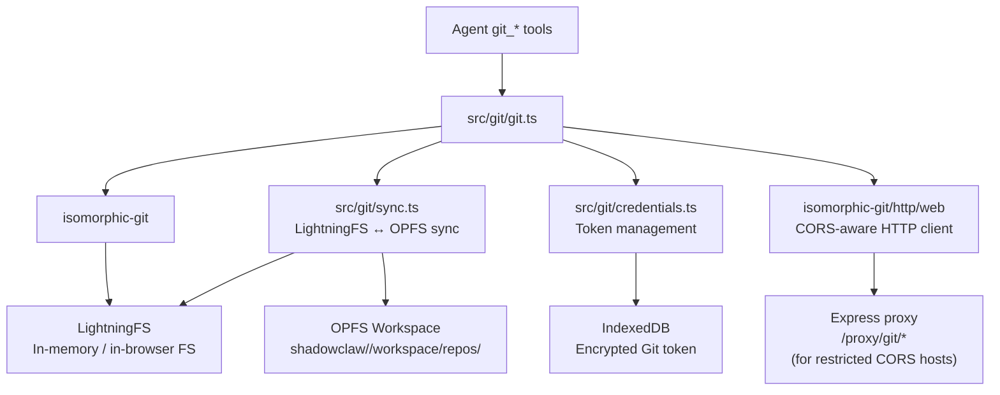

# Git Integration

> In-browser Git operations using isomorphic-git with LightningFS as the filesystem,
> synchronized to the OPFS workspace.

**Source:** `src/git/git.ts` · `src/git/sync.ts` · `src/git/credentials.ts`

## Architecture



## Supported Git Operations

| Tool                   | Operation                                        |
| ---------------------- | ------------------------------------------------ |
| `git_clone`            | Clone a remote repository                        |
| `git_init`             | Initialize a new empty repo locally              |
| `git_sync`             | Manually sync workspace ↔ LightningFS            |
| `git_checkout`         | Switch branch / tag / commit                     |
| `git_branch`           | Create a new branch                              |
| `git_delete_branch`    | Delete a local branch                            |
| `git_branches`         | List all branches                                |
| `git_status`           | Working tree status                              |
| `git_add`              | Stage files                                      |
| `git_unstage`          | Remove files from the index (inverse of git_add) |
| `git_log`              | Commit history                                   |
| `git_diff`             | Show changes (HEAD vs workdir **or** two refs)   |
| `git_show`             | Commit metadata + diff against parent            |
| `git_read_file_at_ref` | Read a file at any ref without checkout          |
| `git_commit`           | Create a commit                                  |
| `git_fetch`            | Fetch from remote without merging                |
| `git_pull`             | Fetch + merge from remote                        |
| `git_push`             | Push to remote (supports `tags: true`)           |
| `git_merge`            | Merge branch                                     |
| `git_reset`            | Reset HEAD to a ref (--hard)                     |
| `git_tag`              | Create lightweight or annotated tag              |
| `git_remote`           | List / add / remove remotes                      |
| `git_config`           | Get or set git config values (e.g. user.name)    |
| `git_list_repos`       | List cloned repos                                |
| `git_delete_repo`      | Remove a repo from workspace                     |

## LightningFS ↔ OPFS Sync

isomorphic-git requires a synchronous filesystem interface, which OPFS can't provide on the main thread. ShadowClaw solves this by:

1. **Clone operation:** isomorphic-git writes to LightningFS (in-memory)
2. **OPFS sync:** `syncLightningFsToOpfs()` mirrors the LightningFS tree to OPFS
3. **Future reads:** Files are read from OPFS directly; LightningFS is re-seeded from OPFS before git operations

The sync is directional — LightningFS → OPFS — to ensure changes are durable (OPFS survives page reload, LightningFS doesn't).

## Workspace Layout

Repos live in the group workspace at `repos/<repo-name>/`:

```text
shadowclaw/<groupId>/workspace/
└── repos/
    ├── my-project/
    │   ├── .git/
    │   ├── src/
    │   └── README.md
    └── another-repo/
        ├── .git/
        └── ...
```

`git_list_repos` lists all immediate subdirectories of `repos/` that contain a `.git` directory.

## Merge Workflow

> **Important:** Git merges in the browser require special handling.

The agent is instructed to **never** use `bash`, `sed`, or `grep` to resolve merge conflicts. The correct workflow is:

1. `read_file` on the conflicted file(s)
2. Resolve conflicts in memory
3. `write_file` the resolved content
4. `git_add` the resolved file
5. `git_commit` the merge

This is reflected in the system prompt (`src/orchestrator.ts` → `buildSystemPrompt`).

## Credentials

**File:** `src/git/credentials.ts`

Git credentials are managed via the encrypted `CONFIG_KEYS.GIT_TOKEN` config key.

- `getGitCredentials(db)` — returns `{ username, password }` decoded from stored token
- Token format: `base64(username:token)` or plain token (treated as password with `"token"` username)
- Used by `http.onAuth` callback for all authenticated operations

### Auth injection for `fetch_url`

The `fetch_url` tool supports `use_git_auth: true` to inject Git credentials as an `Authorization: Basic <token>` header. This is the preferred way for the agent to access private Git host APIs (e.g., listing repos via API).

### Login page detection

`fetch_url` detects common Git host login pages (GitHub, GitLab, Bitbucket) and returns a descriptive error instead of the HTML login page content.

## HTTP Client

isomorphic-git uses the standard `isomorphic-git/http/web` HTTP client. Direct calls to GitHub/GitLab CORS-bypass via the Express proxy at `/proxy/git/*`.

The proxy is only needed when:

- The Git host doesn't support CORS for API endpoints
- Basic Auth is needed (some browsers strip `Authorization` on cross-origin requests)

## Dispatch Pattern

Git tool execution is delegated from `executeTool.ts` to `executeGitTool()` in `src/worker/tools/git.ts` via a `case`-grouped switch. The git functions themselves are statically imported from `src/git/git.ts` at worker startup. The `GitToolDeps` interface in `src/worker/tools/git.ts` lists every git function the dispatcher requires, making it easy to inject mocks in tests.
