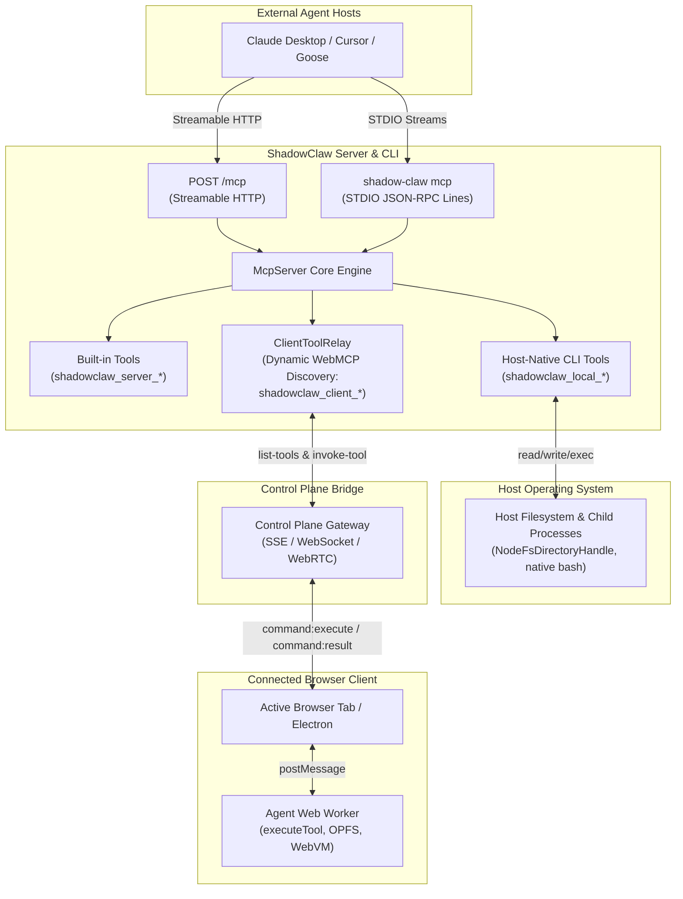

# Official Stateless MCP Server (2026-07-28)

> First-class Model Context Protocol (MCP) server exposing ShadowClaw CLI capabilities, server endpoints, and live browser WebMCP tools to external agent hosts.

**Source:** `src/server/mcp/` · `src/server/mcp/tools/built-in-tool-definitions.ts` · `src/server/mcp/tools/client-tool-names.ts` · `src/server/routes/mcp.ts` · `src/cli/commands/mcp.ts` · `src/cli/cli.ts`

---

## Overview

ShadowClaw's core orchestration and tool-use loop run client-side in the browser. To allow external AI coding agents, desktop clients, and autonomous frameworks (e.g. Claude Desktop, Cursor, Goose, Hermes) to participate in this ecosystem, ShadowClaw provides a Stateless Model Context Protocol server adhering to the **[Stateless MCP Specification (2026-07-28)](https://modelcontextprotocol.io/specification/2026-07-28)** across both the Node.js server and CLI:

1. **Query and Drive Connected Clients**: List connected browser and Electron clients, inspect active conversation state, and dispatch prompts into the orchestrator queue.
2. **Execute Host-Native CLI Agent Tools**: Directly run host-native agent tools (`read_file`, `write_file`, `bash`, `git_*`, etc.) against the local filesystem with OS-level sandbox isolation, backwards path traversal protection, and child process working directory confinement.
3. **Execute In-Browser Workspace Tools**: Dynamically discover and execute tools running inside a connected browser tab (such as `read_file`, `write_file`, `bash`, and `git_*` against OPFS and IndexedDB).
4. **Interactive Human-in-the-Loop via MRTR**: Handle interactive prompts (such as `ask_user`) using 2026-07-28 **Multi Round-Trip Requests (MRTR)** with `resultType: "input_required"`.

---

## Architecture & Data Flow



---

## Transports

### 1. STDIO Transport (`shadow-claw mcp`)

Ideal for local desktop integrations (e.g. Claude Desktop, Cursor, Goose). Messages are framed as newline-delimited JSON-RPC objects over standard input and standard output. Diagnostic logs are strictly piped to `stderr` to preserve stdout framing.

```bash
npx shadow-claw mcp [options]
```

#### CLI Options

| Flag                                 | Description                                                                            | Default                                                            |
| :----------------------------------- | :------------------------------------------------------------------------------------- | :----------------------------------------------------------------- |
| `--workspace <dir>`                  | Explicit target workspace directory for local agent file operations and bash execution | Host-agnostic sandbox directory (`<tmpdir>/shadow-claw/workspace`) |
| `--local-tools` / `--no-local-tools` | Expose host-native CLI agent tools (`read_file`, `write_file`, `bash`, `git_*`, etc.)  | `true` (enabled)                                                   |
| `--tool-prefix <prefix>`             | Prefix applied to local agent tool names (`none` for unprefixed)                       | `shadowclaw_local_`                                                |
| `--tools <list>`                     | Comma-separated list of specific tools to expose (e.g. `read_file,write_file,bash`)    | All headless-compatible tools                                      |
| `--tools-profile <name>`             | Preconfigured tool profile (`coding`, `chat`, `review`, `minimal`)                     | Auto-discovered / all                                              |
| `--group <groupId>`                  | Target conversation group for agent context                                            | `"default"`                                                        |
| `--database-dir <dir>`               | Directory for SQLite state databases                                                   | `~/.shadow-claw` or resolved root                                  |
| `--allow-internet`                   | Grant internet access permissions for shell execution                                  | Disabled by default                                                |

### 2. Streamable HTTP Transport (`POST /mcp`)

Runs as part of the Express server (available automatically during `npx shadow-claw dev`, `npx shadow-claw serve`, or headless services mode via `npx shadow-claw server` / `services` / `api`).

- **Endpoint**: `http://127.0.0.1:8888/mcp`
- **Headers**:
  - `MCP-Protocol-Version: 2026-07-28` (required)
  - `Mcp-Method: <method>` (optional routing validation)
  - `Mcp-Name: <toolName>` (optional tool name validation)
  - `x-control-token: <token>` or `Authorization: Bearer <token>`

---

## Protocol Details

### No Required Handshake & `server/discover`

The 2026-07-28 specification eliminates mandatory `initialize` / `initialized` stateful handshakes. External clients query server capabilities, protocol versions, and metadata via `server/discover`:

```json
{
  "jsonrpc": "2.0",
  "id": 1,
  "method": "server/discover"
}
```

Response:

```json
{
  "jsonrpc": "2.0",
  "id": 1,
  "result": {
    "protocolVersion": "2026-07-28",
    "supportedProtocolVersions": ["2026-07-28", "2025-11-25", "2024-11-05"],
    "capabilities": {
      "tools": { "listChanged": true },
      "extensions": { "io.modelcontextprotocol/tasks": {} }
    },
    "serverInfo": {
      "name": "shadow-claw",
      "version": "1.28.1"
    }
  }
}
```

_(Note: Legacy `initialize` handshakes from 2024-11-05 and 2025-11-25 clients remain fully supported for backward compatibility)._

### Cacheable Tool Listing (`tools/list`)

Returns tools deterministically sorted in alphabetical order, annotated with cache hints per SEP-2549:

```json
{
  "jsonrpc": "2.0",
  "id": 2,
  "result": {
    "resultType": "complete",
    "ttlMs": 5000,
    "cacheScope": "private",
    "tools": [ ... ]
  }
}
```

### Multi Round-Trip Requests (MRTR)

For interactive tools like `ask_user`, the server returns `resultType: "input_required"` with an array of `inputRequests`:

```json
{
  "jsonrpc": "2.0",
  "id": 3,
  "result": {
    "resultType": "input_required",
    "inputRequests": [
      {
        "id": "response",
        "type": "prompt",
        "message": "Proceed with Git merge?"
      }
    ]
  }
}
```

The host client fulfills the request by calling `tools/call` with `inputResponses: { "response": "yes" }`.

---

## Built-in Tools Reference

| Tool Name                             | Description                                                                                                       | Key Arguments                                                                 |
| :------------------------------------ | :---------------------------------------------------------------------------------------------------------------- | :---------------------------------------------------------------------------- |
| `shadowclaw_server_list_clients`      | List all connected browser and Electron clients, status, and active capabilities.                                 | None                                                                          |
| `shadowclaw_server_set_active_client` | Set the active default client for subsequent relayed tool executions and messages.                                | `clientId` (required)                                                         |
| `shadowclaw_server_send_message`      | Dispatch a prompt or message directly into a client's AI conversation queue.                                      | `text` (required), `clientId`, `groupId`                                      |
| `shadowclaw_server_read_state`        | Query orchestrator state (`idle`, `responding`), active conversation group, and model.                            | `clientId`                                                                    |
| `shadowclaw_server_list_tasks`        | List scheduled background tasks configured on a connected client.                                                 | `clientId`, `groupId`                                                         |
| `shadowclaw_server_manage_backup`     | Trigger, list, or delete OPFS workspace snapshots on a client.                                                    | `action` (`trigger` \| `list` \| `delete`), `clientId`, `backupId`, `groupId` |
| `shadowclaw_server_send_notification` | Broadcast an OS push notification to all subscribed devices or a specific registered client via Web Push (VAPID). | `body` (required), `title` (optional), `clientId` (optional)                  |
| `shadowclaw_server_status`            | Query Node server status, version, and connected client count.                                                    | None                                                                          |

Static schemas and metadata for built-in tools are declared in `src/server/mcp/tools/built-in-tool-definitions.ts` (`BUILTIN_TOOL_DEFINITIONS`), while client tool name parsing and prefix normalization helpers are provided by `src/server/mcp/tools/client-tool-names.ts` (`getClientRawToolName`, `toClientExposedToolName`).

---

## Tri-Tier Tool Architecture & Naming Convention

The Stateless MCP server uses a clean tri-tier hierarchy to avoid collision between server control-plane commands, host-native CLI agent tools, and dynamic in-browser tools:

1. **`shadowclaw_server_*` (Server Control Plane):** Built-in management tools for querying connected clients, inspecting orchestrator state, sending notifications, and dispatching queue messages.
2. **`shadowclaw_local_*` (Host-Native CLI Agent Tools):** Direct Node.js-driven tools running against the host machine's filesystem and child processes (e.g. `read_file`, `write_file`, `bash`, `list_files`, `git_status`, `git_diff`, etc.). Enabled by default in `mcp` mode.
3. **`shadowclaw_client_*` (In-Browser WebMCP Tools):** Dynamically discovered tools relayed through the Control Plane from connected browser tabs or Electron windows (e.g. OPFS and IndexedDB access).

---

## Host-Native CLI Agent Tools in MCP Mode

When running in STDIO mode (`shadow-claw mcp`), ShadowClaw exposes full agent development tools to any standard MCP client without requiring an active browser tab or Electron window.

### Workspace Security & Host-Agnostic Isolation

- **Explicit Workspace Requirement:** To bind local tools to a specific repository, external clients should pass `--workspace <dir>`.
- **Host-Agnostic Fallback Sandbox:** When `--workspace` is omitted, ShadowClaw **never defaults to `process.cwd()`**, preventing accidental exposure of host IDE application folders (such as Electron runtime binaries, system libraries, or crashpad handlers). Instead, it initializes a clean, isolated host-agnostic temporary workspace directory (`<tmpdir>/shadow-claw/workspace`).
- **Graceful Failure Fallback:** If creating or accessing the fallback temporary workspace fails (e.g. restricted permissions or read-only tmp), local workspace tools are automatically disabled, and the server runs in pure control-plane mode exposing only `shadowclaw_server_*` tools.
- **Strict Backwards Path Traversal Guards:** All filesystem adapters (`NodeFsDirectoryHandle`, `parsePath`, and workspace tools) enforce strict root containment. Any attempt to traverse backwards (`..`) or escape the active workspace is blocked with a `SecurityError`.
- **Bash Working Directory Isolation:** Headless native bash commands execute with their working directory strictly bound to the active workspace (`getStorageRootPath()`), preventing host process directory pollution.

### Features & Execution Model

- **Direct Host Execution:** Tools like `read_file`, `write_file`, `bash`, `patch_file`, `list_files`, `git_commit`, and declarative tools execute headlessly in Node.js using host filesystem handles and child processes.
- **Unprefixed Tool Routing Fallback:** For MCP clients that expect standard tool names (such as `read_file` or `bash`):
  - When `--tool-prefix none` is configured, tools are exposed without prefixes.
  - When external clients call unprefixed tool names (e.g. `read_file`), the server automatically routes to the host-native local agent tool if no browser client is currently connected. If a browser tab is connected, calls continue relaying to the browser for backward compatibility.
- **Stream Integrity:** Headless agent initialization executes in non-interactive mode (`quiet: true`, `yes: true`, `isTTY: false`). Standard output is strictly reserved for newline-delimited JSON-RPC framing; any diagnostics or error logs are routed to `stderr`.
- **Filtering & Profiles:** Tools can be constrained using `--tools <list>` (e.g. `--tools read_file,write_file,bash`) or preconfigured profiles via `--tools-profile <coding|chat|review|minimal>`.
- **Declarative Tools:** Custom tools defined in `.agents/tools/main/**/*.json` within the workspace are automatically discovered and exposed with the `shadowclaw_local_` prefix.

---

## Dynamic In-Browser Tool Relaying & Multi-Client Targeting

When external hosts call tools belonging to connected browser clients (e.g. `shadowclaw_client_read_file`, `shadowclaw_client_write_file`, `shadowclaw_client_bash`, `shadowclaw_client_git_*`, or interactive `shadowclaw_client_ask_user`):

### 1. Tool Naming Convention & Multi-Client Discovery

- **Naming Convention:** All live tools discovered from connected browser clients are prefixed with `shadowclaw_client_` (such as `shadowclaw_client_read_file`, `shadowclaw_client_javascript`, `shadowclaw_client_list_files`, `shadowclaw_client_open_file`, `shadowclaw_client_patch_file`). This ensures client-side WebMCP tools are immediately distinguishable from built-in CLI and server tools (`shadowclaw_server_*`) in MCP Inspector, Claude Desktop, and other MCP clients. Tool calls transparently proxy to the actual tool name on the target client (unprefixed tool names are also supported for backward compatibility).
- The MCP engine inspects all connected clients via the Control Plane (`list-tools`).
- Tools aggregate across clients; if multiple clients are connected, the tool's input schema includes an optional `clientId` parameter with an `enum` restricted to client IDs that actually support and have that tool enabled.
- Clients that disconnect are unregistered promptly, keeping tool listings and client target lists accurate.

### 2. Client Resolution & Targeting

Calls route using the following resolution precedence:

1. **Explicit `clientId`:** Resolved against full client ID, 0-based client index (`"0"`, `"1"`), ULID prefix match, or device label match (e.g. `"Pixel"`, `"Desktop"`).
2. **Active Client:** Set via `shadowclaw_server_set_active_client`. If the active client supports the tool, it receives the call.
3. **First Supporting Client:** If no explicit or active match applies, falls back to the first available client that supports the tool.

If the requested client does not support or have the tool enabled, the MCP server returns an immediate, descriptive error rejection.

### 3. Client-Side Execution Guards

When the browser tab receives an `invoke-tool` command:

- The Control Plane client validates that the tool is registered on the client and permitted within the active conversation (`group.toolTags` allowlist) or global tools configuration (`toolsStore.enabledToolNames`).
- Tools disabled in the active conversation are rejected with an explicit error.
- Permitted tools execute via WebMCP (`document.modelContext.executeTool`, passing the native tool object or testing fallback) or fall back to the Agent Web Worker via `executeTool(db, name, input, groupId, { allowedTools })`.

### 4. Interactive Human-in-the-Loop Tools (`ask_user`)

- `ask_user` tool invocations are relayed to the client with an extended execution timeout (up to 300 seconds) to permit user review and response.
- When invoked by external hosts supporting 2026-07-28 MRTR, `inputResponses` can supply the response directly to complete the call without hanging.

---

## Client Configuration Examples

### Claude Desktop (`claude_desktop_config.json`)

Exposing both server control plane tools and host-native CLI agent tools for a specific workspace:

```json
{
  "mcpServers": {
    "shadowclaw": {
      "command": "npx",
      "args": ["shadow-claw", "mcp", "--workspace", "/path/to/my-project"]
    }
  }
}
```

### Cursor (`~/.cursor/mcp.json`)

Using unprefixed tools (`read_file`, `write_file`, `bash`) for standard coding assistants:

```json
{
  "mcpServers": {
    "shadowclaw": {
      "command": "npx",
      "args": [
        "shadow-claw",
        "mcp",
        "--workspace",
        "/path/to/my-project",
        "--tool-prefix",
        "none"
      ]
    }
  }
}
```

### Goose / CLI MCP Client

```yaml
# ~/.config/goose/config.yaml
extensions:
  shadowclaw:
    enabled: true
    type: stdio
    cmd: npx
    args:
      - shadow-claw
      - mcp
      - --workspace
      - /path/to/my-project
```

---

## Testing with MCP Inspector

You can test and inspect the Stateless MCP server interactively with the official [`@modelcontextprotocol/inspector`](https://github.com/modelcontextprotocol/inspector):

```bash
# Test local STDIO server
npx @modelcontextprotocol/inspector npx shadow-claw mcp

# Test against a remote or custom HTTPS host
npx @modelcontextprotocol/inspector npx shadow-claw mcp --host exampleHostname --https
```
