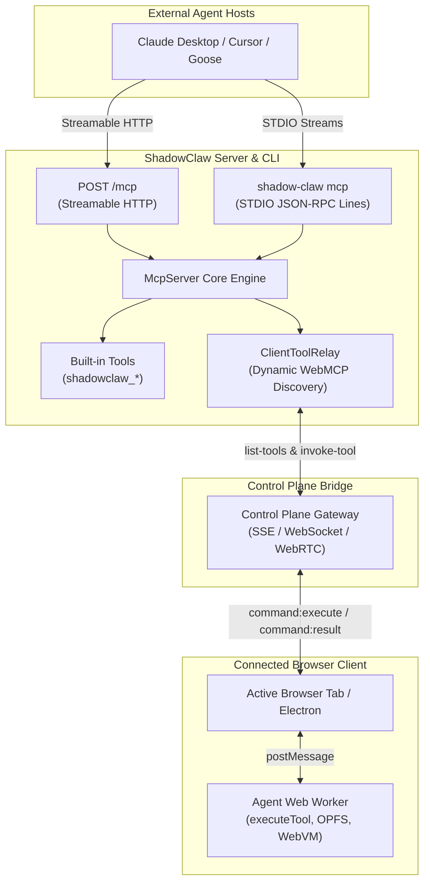

# Official Stateless MCP Server (2026-07-28)

> First-class Model Context Protocol (MCP) server exposing ShadowClaw CLI capabilities, server endpoints, and live browser WebMCP tools to external agent hosts.

**Source:** `src/server/mcp/` · `src/server/routes/mcp.ts` · `bin/commands/mcp.mjs` · `bin/cli.mjs`

---

## Overview

ShadowClaw's core orchestration and tool-use loop run client-side in the browser. To allow external AI coding agents, desktop clients, and autonomous frameworks (e.g. Claude Desktop, Cursor, Goose, Hermes) to participate in this ecosystem, ShadowClaw provides a Stateless Model Context Protocol server adhering to the **[Stateless MCP Specification (2026-07-28)](https://modelcontextprotocol.io/specification/2026-07-28)** across both the Node.js server and CLI:

1. **Query and Drive Connected Clients**: List connected browser and Electron clients, inspect active conversation state, and dispatch prompts into the orchestrator queue.
2. **Execute In-Browser Workspace Tools**: Dynamically discover and execute tools running inside a connected browser tab (such as `read_file`, `write_file`, `bash`, and `git_*` against OPFS and IndexedDB).
3. **Interactive Human-in-the-Loop via MRTR**: Handle interactive prompts (such as `ask_user`) using 2026-07-28 **Multi Round-Trip Requests (MRTR)** with `resultType: "input_required"`.

---

## Architecture & Data Flow



---

## Transports

### 1. STDIO Transport (`shadow-claw mcp`)

Ideal for local desktop integrations (e.g. Claude Desktop, Cursor). Messages are framed as newline-delimited JSON-RPC objects over standard input and standard output. Diagnostic logs are strictly piped to `stderr` to preserve stdout framing.

```bash
npx shadow-claw mcp
```

### 2. Streamable HTTP Transport (`POST /mcp`)

Runs as part of the Express server (available automatically during `npx shadow-claw dev`, `npx shadow-claw serve`, or headless services mode via `npx shadow-claw server` / `services` / `api`).

- **Endpoint**: `http://127.0.0.1:8888/mcp`
- **Headers**:
  - `MCP-Protocol-Version: 2026-07-28` (required)
  - `Mcp-Method: <method>` (optional routing validation)
  - `Mcp-Name: <toolName>` (optional tool name validation)
  - `x-control-token: <token>` or `Authorization: Bearer <token>`

---

## Protocol Details

### No Required Handshake & `server/discover`

The 2026-07-28 specification eliminates mandatory `initialize` / `initialized` stateful handshakes. External clients query server capabilities, protocol versions, and metadata via `server/discover`:

```json
{
  "jsonrpc": "2.0",
  "id": 1,
  "method": "server/discover"
}
```

Response:

```json
{
  "jsonrpc": "2.0",
  "id": 1,
  "result": {
    "protocolVersion": "2026-07-28",
    "supportedProtocolVersions": ["2026-07-28", "2025-11-25", "2024-11-05"],
    "capabilities": {
      "tools": { "listChanged": true },
      "extensions": { "io.modelcontextprotocol/tasks": {} }
    },
    "serverInfo": {
      "name": "shadow-claw",
      "version": "1.25.0"
    }
  }
}
```

_(Note: Legacy `initialize` handshakes from 2024-11-05 and 2025-11-25 clients remain fully supported for backward compatibility)._

### Cacheable Tool Listing (`tools/list`)

Returns tools deterministically sorted in alphabetical order, annotated with cache hints per SEP-2549:

```json
{
  "jsonrpc": "2.0",
  "id": 2,
  "result": {
    "resultType": "complete",
    "ttlMs": 5000,
    "cacheScope": "private",
    "tools": [ ... ]
  }
}
```

### Multi Round-Trip Requests (MRTR)

For interactive tools like `ask_user`, the server returns `resultType: "input_required"` with an array of `inputRequests`:

```json
{
  "jsonrpc": "2.0",
  "id": 3,
  "result": {
    "resultType": "input_required",
    "inputRequests": [
      {
        "id": "response",
        "type": "prompt",
        "message": "Proceed with Git merge?"
      }
    ]
  }
}
```

The host client fulfills the request by calling `tools/call` with `inputResponses: { "response": "yes" }`.

---

## Built-in Tools Reference

| Tool Name                  | Description                                                                            | Key Arguments                                                                 |
| :------------------------- | :------------------------------------------------------------------------------------- | :---------------------------------------------------------------------------- |
| `shadowclaw_list_clients`  | List all connected browser and Electron clients, status, and active capabilities.      | None                                                                          |
| `shadowclaw_send_message`  | Dispatch a prompt or message directly into a client's AI conversation queue.           | `text` (required), `clientId`, `groupId`                                      |
| `shadowclaw_read_state`    | Query orchestrator state (`idle`, `responding`), active conversation group, and model. | `clientId`                                                                    |
| `shadowclaw_list_tasks`    | List scheduled background tasks configured on a connected client.                      | `clientId`, `groupId`                                                         |
| `shadowclaw_manage_backup` | Trigger, list, or delete OPFS workspace snapshots on a client.                         | `action` (`trigger` \| `list` \| `delete`), `clientId`, `backupId`, `groupId` |
| `shadowclaw_server_status` | Query Node server status, version, and connected client count.                         | None                                                                          |

---

## Dynamic In-Browser Tool Relaying

When an external host invokes a tool that belongs to a connected browser client (e.g. `read_file`, `write_file`, `bash`, `git_*`):

1. The MCP server dispatches an `invoke-tool` command across the Control Plane (SSE, WebSocket, or WebRTC).
2. The browser tab receives the payload and routes execution:
   - First through WebMCP (`document.modelContext.executeTool`).
   - If WebMCP is unavailable, directly to the Agent Web Worker via `executeTool()`.
3. The result is returned and formatted as standard MCP content blocks (`type: "text"`).

---

## Client Configuration Examples

### Claude Desktop (`claude_desktop_config.json`)

```json
{
  "mcpServers": {
    "shadowclaw": {
      "command": "npx",
      "args": ["shadow-claw", "mcp"]
    }
  }
}
```

### Cursor (`~/.cursor/mcp.json`)

```json
{
  "mcpServers": {
    "shadowclaw": {
      "command": "npx",
      "args": ["shadow-claw", "mcp"]
    }
  }
}
```
