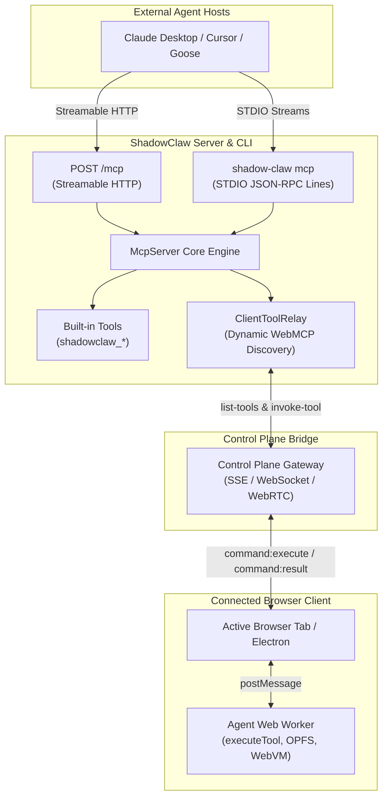

# Official Stateless MCP Server (2026-07-28)

> First-class Model Context Protocol (MCP) server exposing ShadowClaw CLI capabilities, server endpoints, and live browser WebMCP tools to external agent hosts.

**Source:** `src/server/mcp/` · `src/server/routes/mcp.ts` · `bin/commands/mcp.mjs` · `bin/cli.mjs`

---

## Overview

ShadowClaw's core orchestration and tool-use loop run client-side in the browser. To allow external AI coding agents, desktop clients, and autonomous frameworks (e.g. Claude Desktop, Cursor, Goose, Hermes) to participate in this ecosystem, ShadowClaw provides a Stateless Model Context Protocol server adhering to the **[Stateless MCP Specification (2026-07-28)](https://modelcontextprotocol.io/specification/2026-07-28)** across both the Node.js server and CLI:

1. **Query and Drive Connected Clients**: List connected browser and Electron clients, inspect active conversation state, and dispatch prompts into the orchestrator queue.
2. **Execute In-Browser Workspace Tools**: Dynamically discover and execute tools running inside a connected browser tab (such as `read_file`, `write_file`, `bash`, and `git_*` against OPFS and IndexedDB).
3. **Interactive Human-in-the-Loop via MRTR**: Handle interactive prompts (such as `ask_user`) using 2026-07-28 **Multi Round-Trip Requests (MRTR)** with `resultType: "input_required"`.

---

## Architecture & Data Flow



---

## Transports

### 1. STDIO Transport (`shadow-claw mcp`)

Ideal for local desktop integrations (e.g. Claude Desktop, Cursor). Messages are framed as newline-delimited JSON-RPC objects over standard input and standard output. Diagnostic logs are strictly piped to `stderr` to preserve stdout framing.

```bash
npx shadow-claw mcp
```

### 2. Streamable HTTP Transport (`POST /mcp`)

Runs as part of the Express server (available automatically during `npx shadow-claw dev`, `npx shadow-claw serve`, or headless services mode via `npx shadow-claw server` / `services` / `api`).

- **Endpoint**: `http://127.0.0.1:8888/mcp`
- **Headers**:
  - `MCP-Protocol-Version: 2026-07-28` (required)
  - `Mcp-Method: <method>` (optional routing validation)
  - `Mcp-Name: <toolName>` (optional tool name validation)
  - `x-control-token: <token>` or `Authorization: Bearer <token>`

---

## Protocol Details

### No Required Handshake & `server/discover`

The 2026-07-28 specification eliminates mandatory `initialize` / `initialized` stateful handshakes. External clients query server capabilities, protocol versions, and metadata via `server/discover`:

```json
{
  "jsonrpc": "2.0",
  "id": 1,
  "method": "server/discover"
}
```

Response:

```json
{
  "jsonrpc": "2.0",
  "id": 1,
  "result": {
    "protocolVersion": "2026-07-28",
    "supportedProtocolVersions": ["2026-07-28", "2025-11-25", "2024-11-05"],
    "capabilities": {
      "tools": { "listChanged": true },
      "extensions": { "io.modelcontextprotocol/tasks": {} }
    },
    "serverInfo": {
      "name": "shadow-claw",
      "version": "1.25.0"
    }
  }
}
```

_(Note: Legacy `initialize` handshakes from 2024-11-05 and 2025-11-25 clients remain fully supported for backward compatibility)._

### Cacheable Tool Listing (`tools/list`)

Returns tools deterministically sorted in alphabetical order, annotated with cache hints per SEP-2549:

```json
{
  "jsonrpc": "2.0",
  "id": 2,
  "result": {
    "resultType": "complete",
    "ttlMs": 5000,
    "cacheScope": "private",
    "tools": [ ... ]
  }
}
```

### Multi Round-Trip Requests (MRTR)

For interactive tools like `ask_user`, the server returns `resultType: "input_required"` with an array of `inputRequests`:

```json
{
  "jsonrpc": "2.0",
  "id": 3,
  "result": {
    "resultType": "input_required",
    "inputRequests": [
      {
        "id": "response",
        "type": "prompt",
        "message": "Proceed with Git merge?"
      }
    ]
  }
}
```

The host client fulfills the request by calling `tools/call` with `inputResponses: { "response": "yes" }`.

---

## Built-in Tools Reference

| Tool Name                      | Description                                                                            | Key Arguments                                                                 |
| :----------------------------- | :------------------------------------------------------------------------------------- | :---------------------------------------------------------------------------- |
| `shadowclaw_list_clients`      | List all connected browser and Electron clients, status, and active capabilities.      | None                                                                          |
| `shadowclaw_set_active_client` | Set the active default client for subsequent relayed tool executions and messages.     | `clientId` (required)                                                         |
| `shadowclaw_send_message`      | Dispatch a prompt or message directly into a client's AI conversation queue.           | `text` (required), `clientId`, `groupId`                                      |
| `shadowclaw_read_state`        | Query orchestrator state (`idle`, `responding`), active conversation group, and model. | `clientId`                                                                    |
| `shadowclaw_list_tasks`        | List scheduled background tasks configured on a connected client.                      | `clientId`, `groupId`                                                         |
| `shadowclaw_manage_backup`     | Trigger, list, or delete OPFS workspace snapshots on a client.                         | `action` (`trigger` \| `list` \| `delete`), `clientId`, `backupId`, `groupId` |
| `shadowclaw_send_notification` | Broadcast an OS push notification to all subscribed devices via Web Push (VAPID).      | `body` (required), `title` (optional)                                         |
| `shadowclaw_server_status`     | Query Node server status, version, and connected client count.                         | None                                                                          |

---

## Dynamic In-Browser Tool Relaying & Multi-Client Targeting

When external hosts call tools belonging to connected browser clients (e.g. `read_file`, `write_file`, `bash`, `git_*`, or interactive `ask_user`):

### 1. Multi-Client Tool Discovery & Capability Schema

- The MCP engine inspects all connected clients via the Control Plane (`list-tools`).
- Tools aggregate across clients; if multiple clients are connected, the tool's input schema includes an optional `clientId` parameter with an `enum` restricted to client IDs that actually support and have that tool enabled.
- Clients that disconnect are unregistered promptly, keeping tool listings and client target lists accurate.

### 2. Client Resolution & Targeting

Calls route using the following resolution precedence:

1. **Explicit `clientId`:** Resolved against full client ID, 0-based client index (`"0"`, `"1"`), ULID prefix match, or device label match (e.g. `"Pixel"`, `"Desktop"`).
2. **Active Client:** Set via `shadowclaw_set_active_client`. If the active client supports the tool, it receives the call.
3. **First Supporting Client:** If no explicit or active match applies, falls back to the first available client that supports the tool.

If the requested client does not support or have the tool enabled, the MCP server returns an immediate, descriptive error rejection.

### 3. Client-Side Execution Guards

When the browser tab receives an `invoke-tool` command:

- The Control Plane client validates that the tool is registered on the client and permitted within the active conversation (`group.toolTags` allowlist) or global tools configuration (`toolsStore.enabledToolNames`).
- Tools disabled in the active conversation are rejected with an explicit error.
- Permitted tools execute via WebMCP (`document.modelContext.executeTool`, passing the native tool object or testing fallback) or fall back to the Agent Web Worker via `executeTool(db, name, input, groupId, { allowedTools })`.

### 4. Interactive Human-in-the-Loop Tools (`ask_user`)

- `ask_user` tool invocations are relayed to the client with an extended execution timeout (up to 300 seconds) to permit user review and response.
- When invoked by external hosts supporting 2026-07-28 MRTR, `inputResponses` can supply the response directly to complete the call without hanging.

---

## Client Configuration Examples

### Claude Desktop (`claude_desktop_config.json`)

```json
{
  "mcpServers": {
    "shadowclaw": {
      "command": "npx",
      "args": ["shadow-claw", "mcp"]
    }
  }
}
```

### Cursor (`~/.cursor/mcp.json`)

```json
{
  "mcpServers": {
    "shadowclaw": {
      "command": "npx",
      "args": ["shadow-claw", "mcp"]
    }
  }
}
```
