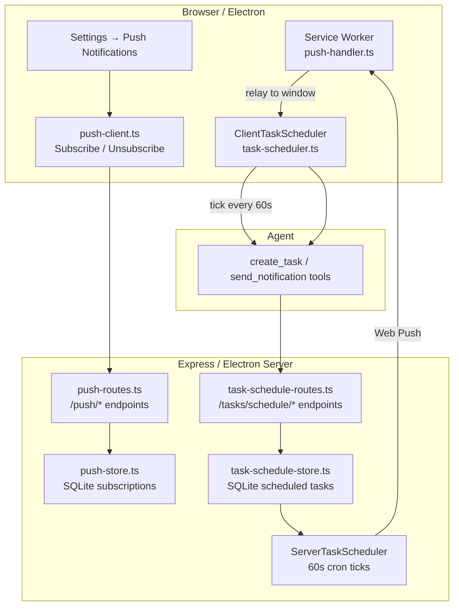
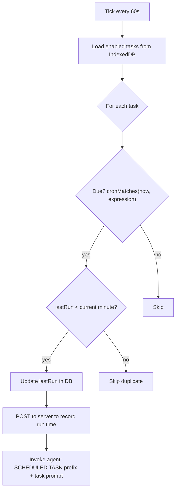

# Notifications & Scheduling

> Web Push notifications delivered via VAPID, a server-side SQLite task scheduler,
> and a client-side cron evaluator — so tasks fire even when no browser tab is open.

**Source:** `src/notifications/` · `src/task-scheduler.ts` · `src/cron.ts` · `src/service-worker/push-handler.ts`

## System Overview



## Push Notifications

### VAPID setup

On server start, `push-store.ts` generates a VAPID key pair (if none exists) and stores it in SQLite. The public key is exposed at `/push/vapid-public-key`.

The client subscribes via:

```text
POST /push/subscribe    { subscription: PushSubscription }
DELETE /push/subscribe  { endpoint }
GET /push/status        { subscribed: bool, endpoint? }
```

### send_notification tool

When the agent calls `send_notification({ title, body, groupId })`:

1. **Recursion guard check** — if this is a scheduled task context, blocked with warning toast
2. Worker posts `send-notification` message to main thread
3. Orchestrator POSTs to `/push/broadcast`
4. Server sends push to all subscribed clients via `web-push.sendNotification()`

### Service worker (push-handler.ts)

On `push` event:

- Extract notification data from push payload
- Show OS notification via `self.registration.showNotification()`
- On notification click: relay to open windows via `BroadcastChannel`, then `clients.openWindow()`

### Relay to open tabs

The service worker uses a `BroadcastChannel("shadowclaw-push")` to relay push events to any open windows. The orchestrator listens on this channel and triggers the agent invocation for scheduled tasks.

## Client-Side Task Scheduler

**File:** `src/task-scheduler.ts`

Evaluates cron expressions every 60 seconds and invokes the agent for due tasks:



**Cron matching** (`src/cron.ts`) — shared module evaluating standard 5-field cron expressions:

```text
min   hour  dom   month  dow
  *    *     *     *      *      (every minute)
  0    9     *     *      1-5    (9am weekdays)
  */5  *     *     *      *      (every 5 minutes)
```

Supports: `*`, `*/n` (step), `n-m` (range), `n,m` (list).

## Server-Side Task Scheduler

**File:** `src/notifications/task-scheduler-server.ts`

Runs on the Express/Electron server and fires even when no browser tab is open:

1. Ticks every 60 seconds
2. Queries SQLite for enabled tasks with due cron expressions
3. For each due task: sends a Web Push notification to all subscribers
4. Service worker receives push, relays to open tabs, or shows OS notification
5. Open tab receives relay → triggers agent invocation with the task prompt

The server scheduler and client scheduler can both fire for the same task. The `lastRun` timestamp guard (rounded to the minute) prevents double-firing in the common case where a tab is open.

## Scheduled Task Store (Client)

Tasks are stored in IndexedDB via `src/db/`:

| Field            | Type          | Purpose                          |
| ---------------- | ------------- | -------------------------------- |
| `id`             | string (ULID) | Unique identifier                |
| `groupId`        | string        | Owning conversation              |
| `name`           | string        | Task display name                |
| `prompt`         | string        | Instruction sent to the agent    |
| `cronExpression` | string        | 5-field cron schedule            |
| `enabled`        | boolean       | Active/paused                    |
| `lastRun`        | number        | Unix timestamp of last execution |
| `createdAt`      | number        | Unix timestamp                   |

## Scheduled Task Store (Server)

Mirrored to SQLite on the Express/Electron server for server-side scheduling. Routes:

```text
POST   /tasks/schedule         Create task on server
PUT    /tasks/schedule/:id     Update task
DELETE /tasks/schedule/:id     Delete task
GET    /tasks/schedule         List all tasks
```

Tasks are synced to the server whenever the agent creates/updates/deletes a scheduled task (guarded by recursion check).

## Recursion Guard

To prevent task cascades:

- When `isScheduledTask === true` in the invoke payload, the orchestrator blocks:
  - `task-created`, `update-task`, `delete-task` worker messages → warning toast
  - `send-notification` → warning toast instead of push broadcast
- The guard set `_schedulerTriggeredGroups` tracks in-flight scheduled task groups
- Guard is cleared when the task invocation completes
