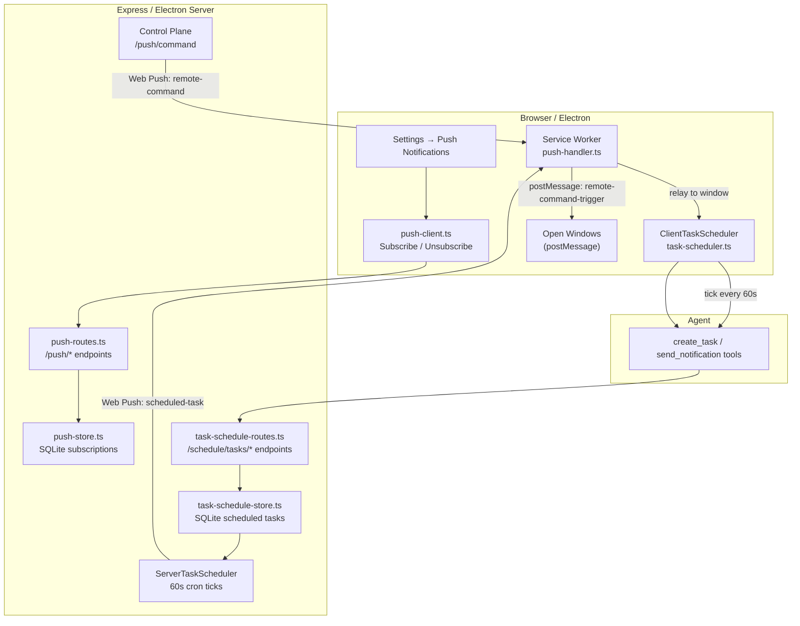
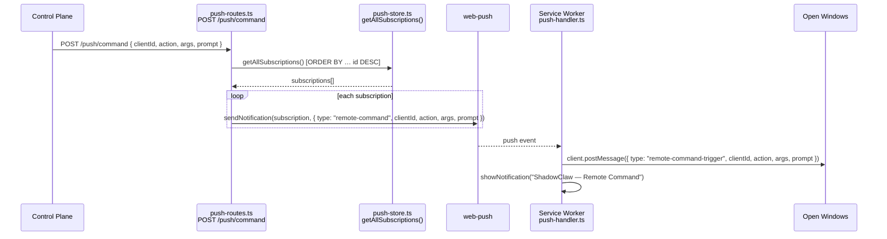
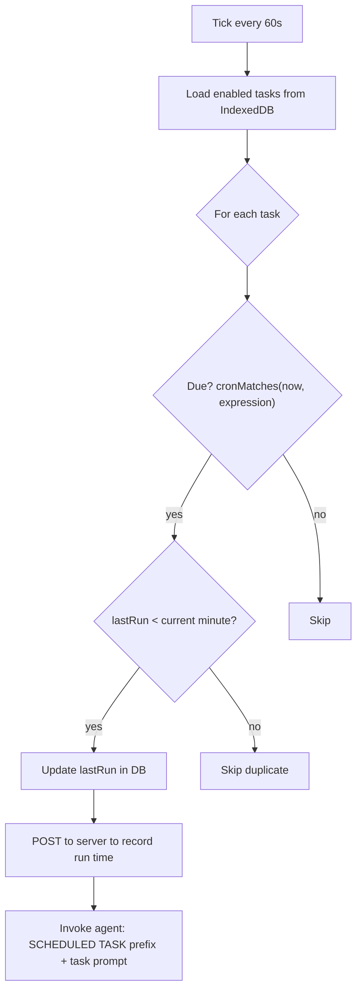

# Notifications & Scheduling

> Web Push notifications delivered via VAPID, a server-side SQLite task scheduler,
> and a client-side cron evaluator — so tasks fire even when no browser tab is open.

**Source:** `src/subsystems/notifications/` · `src/subsystems/notifications/push-routes.ts` · `src/subsystems/tools/task-scheduler.ts` · `src/subsystems/tools/cron.ts` · `src/service-worker/push-handler.ts`

## System Overview


```mermaid
graph TD
  subgraph Client ["Browser / Electron"]
    UI["Settings → Push Notifications"]
    SW["Service Worker<br>push-handler.ts"]
    CS["ClientTaskScheduler<br>task-scheduler.ts"]
    PC["push-client.ts<br>Subscribe / Unsubscribe"]
    OW["Open Windows<br>(postMessage)"]
  end

  subgraph Server ["Express / Electron Server"]
    PR["push-routes.ts<br>/push/* endpoints"]
    PS["push-store.ts<br>SQLite subscriptions"]
    TSR["task-schedule-routes.ts<br>/schedule/tasks/* endpoints"]
    TSS["task-schedule-store.ts<br>SQLite scheduled tasks"]
    Sched["ServerTaskScheduler<br>60s cron ticks"]
    CP["Control Plane<br>/push/command"]
  end

  subgraph Agent ["Agent"]
    TT["create_task / send_notification tools"]
  end

  UI --> PC
  PC --> PR
  PR --> PS
  CS -->|tick every 60s| TT
  TT --> TSR
  TSR --> TSS
  TSS --> Sched
  Sched -->|Web Push: scheduled-task| SW
  SW -->|relay to window| CS
  CS --> TT
  CP -->|Web Push: remote-command| SW
  SW -->|postMessage: remote-command-trigger| OW
```

## Push Notifications

### VAPID setup

On server start, `push-store.ts` generates a VAPID key pair (if none exists) and stores it in SQLite. The public key is exposed at `/push/vapid-public-key`.

The client subscribes via:

```text
POST /push/subscribe    { subscription: PushSubscription }
DELETE /push/subscribe  { endpoint }
GET /push/status        { subscribed: bool, endpoint? }
```

### send_notification tool

When the agent calls `send_notification({ title, body, groupId })`:

1. **Recursion guard check** — if this is a scheduled task context, blocked with warning toast
2. Worker posts `send-notification` message to main thread
3. Orchestrator POSTs to `/push/broadcast`
4. Server sends push to all subscribed clients via `web-push.sendNotification()`

### Service worker (push-handler.ts)

On `push` event:

- Extract notification data from push payload
- Show OS notification via `self.registration.showNotification()`
- On notification click: relay to open windows via `BroadcastChannel`, then `clients.openWindow()`

### Relay to open tabs

The service worker uses a `BroadcastChannel("shadowclaw-push")` to relay push events to any open windows. The orchestrator listens on this channel and triggers the agent invocation for scheduled tasks.

---

## Remote Command Push Wakeup

**Files:** `src/service-worker/push-handler.ts` · `src/subsystems/notifications/push-routes.ts`

### Purpose

The control plane may need to dispatch a command to a specific ShadowClaw client that is currently dormant — i.e. not connected to the WebSocket. Rather than dropping the command or waiting for the client to reconnect, the server sends a Web Push notification of type `remote-command` to wake the client up and relay the payload.

### How it works


```mermaid
sequenceDiagram
  participant CP as Control Plane
  participant PR as push-routes.ts<br>POST /push/command
  participant PS as push-store.ts<br>getAllSubscriptions()
  participant WP as web-push
  participant SW as Service Worker<br>push-handler.ts
  participant OW as Open Windows

  CP->>PR: POST /push/command { clientId, action, args, prompt }
  PR->>PS: getAllSubscriptions() [ORDER BY … id DESC]
  PS-->>PR: subscriptions[]
  loop each subscription
    PR->>WP: sendNotification(subscription, { type: "remote-command", clientId, action, args, prompt })
  end
  WP-->>SW: push event
  SW->>OW: client.postMessage({ type: "remote-command-trigger", clientId, action, args, prompt })
  SW->>SW: showNotification("ShadowClaw — Remote Command")
```

1. **Server:** The control plane POSTs to `/push/command` with `{ clientId, action, args, prompt }`.
2. **`push-routes.ts`:** Calls `getAllSubscriptions()` (results are stably ordered by `id DESC`) and fans out a Web Push to every subscribed endpoint with payload `{ type: "remote-command", clientId, action, args, prompt }`.
3. **Service worker (`push-handler.ts`):** On receiving a push whose `data.type === 'remote-command'`, the handler:
   - Iterates all open `WindowClient`s and calls `client.postMessage({ type: 'remote-command-trigger', clientId, action, args, prompt })`.
   - Shows an OS notification titled **`ShadowClaw — Remote Command`** so the user is informed even if no window catches the message.

### Client-side handling

Open windows listen for `message` events from the service worker. When a message of type `'remote-command-trigger'` arrives, the orchestrator can act on `action`, `args`, and `prompt` in the same way as a locally-initiated command. The `clientId` field lets the handler route the command only to the intended client and ignore it otherwise.

### Push subscription ordering

`push-store.ts`'s `getAllSubscriptions()` query now applies a secondary `ORDER BY … id DESC` clause, ensuring that subscriptions are returned in a stable, deterministic order. This prevents non-deterministic fan-out behaviour when multiple subscriptions exist for the same browser profile.

---

## Client-Side Task Scheduler

**File:** `src/subsystems/tools/task-scheduler.ts`

Evaluates cron expressions every 60 seconds and invokes the agent for due tasks:


```mermaid
flowchart TD
  A[Tick every 60s] --> B[Load enabled tasks from IndexedDB]
  B --> C{For each task}
  C --> D{"Due? cronMatches(now, expression)"}
  D -->|yes| E{"lastRun < current minute?"}
  E -->|yes| F[Update lastRun in DB]
  F --> G[POST to server to record run time]
  G --> H[Invoke agent: SCHEDULED TASK prefix + task prompt]
  D -->|no| I[Skip]
  E -->|no| J[Skip duplicate]
```

**Cron matching** (`src/subsystems/tools/cron.ts`) — shared module evaluating standard 5-field cron expressions:

```text
min   hour  dom   month  dow
  *    *     *     *      *      (every minute)
  0    9     *     *      1-5    (9am weekdays)
  */5  *     *     *      *      (every 5 minutes)
```

Supports: `*`, `*/n` (step), `n-m` (range), `n,m` (list).

## Server-Side Task Scheduler

**File:** `src/subsystems/notifications/task-scheduler-server.ts`

Runs on the Express/Electron server and fires even when no browser tab is open:

1. Ticks every 60 seconds
2. Queries SQLite for enabled tasks with due cron expressions
3. For each due task: sends a Web Push notification to all subscribers
4. Service worker receives push, relays to open tabs, or shows OS notification
5. Open tab receives relay → triggers agent invocation with the task prompt

The server scheduler and client scheduler can both fire for the same task. The `lastRun` timestamp guard (rounded to the minute) prevents double-firing in the common case where a tab is open.

## Scheduled Task Store (Client)

Tasks are stored in IndexedDB via `src/db/`:

| Field          | Type          | Purpose                              |
| -------------- | ------------- | ------------------------------------ |
| `id`           | string (ULID) | Unique identifier                    |
| `groupId`      | string        | Owning conversation                  |
| `name`         | string        | Task display name                    |
| `type`         | string        | `"prompt"` or `"tools"`              |
| `prompt`       | string        | Instruction sent to the agent        |
| `tools`        | string        | JSON serialized tool sequence        |
| `schedule`     | string        | 5-field cron schedule                |
| `enabled`      | boolean       | Active/paused                        |
| `lastRun`      | number        | Unix timestamp of last execution     |
| `createdAt`    | number        | Unix timestamp                       |
| `freshContext` | boolean       | Skip history (blank slate) execution |
| `subagent`     | boolean       | Isolated background execution        |
| `order`        | number        | Reorder index within the group       |

## Scheduled Task Store (Server)

Mirrored to SQLite on the Express/Electron server for server-side scheduling. Routes:

```text
POST   /schedule/tasks                 Create/Update task on server (accepts subscriberId)
POST   /schedule/tasks/reorder         Reorder tasks in a group (accepts subscriberId)
GET    /schedule/tasks                 List all tasks (accepts subscriberId)
GET    /schedule/tasks/:id             Get single task
DELETE /schedule/tasks/:id             Delete task (enforces subscriberId ownership)
PATCH  /schedule/tasks/:id/enable      Enable task
PATCH  /schedule/tasks/:id/disable     Disable task
```

Tasks are synced to the server whenever the agent creates/updates/deletes/reorders a scheduled task (guarded by recursion check). The server sync can be globally disabled via the `TASK_SERVER_ENABLED` config flag (managed in Settings). When disabled, tasks only execute locally when the browser tab is open.

## Recursion Guard

To prevent task cascades:

- When `isScheduledTask === true` in the invoke payload, the orchestrator blocks:
  - `task-created`, `update-task`, `delete-task` worker messages → warning toast
  - `send-notification` → warning toast instead of push broadcast
- The guard set `schedulerTriggeredGroups` tracks in-flight scheduled task groups
- Guard is cleared when the task invocation completes
