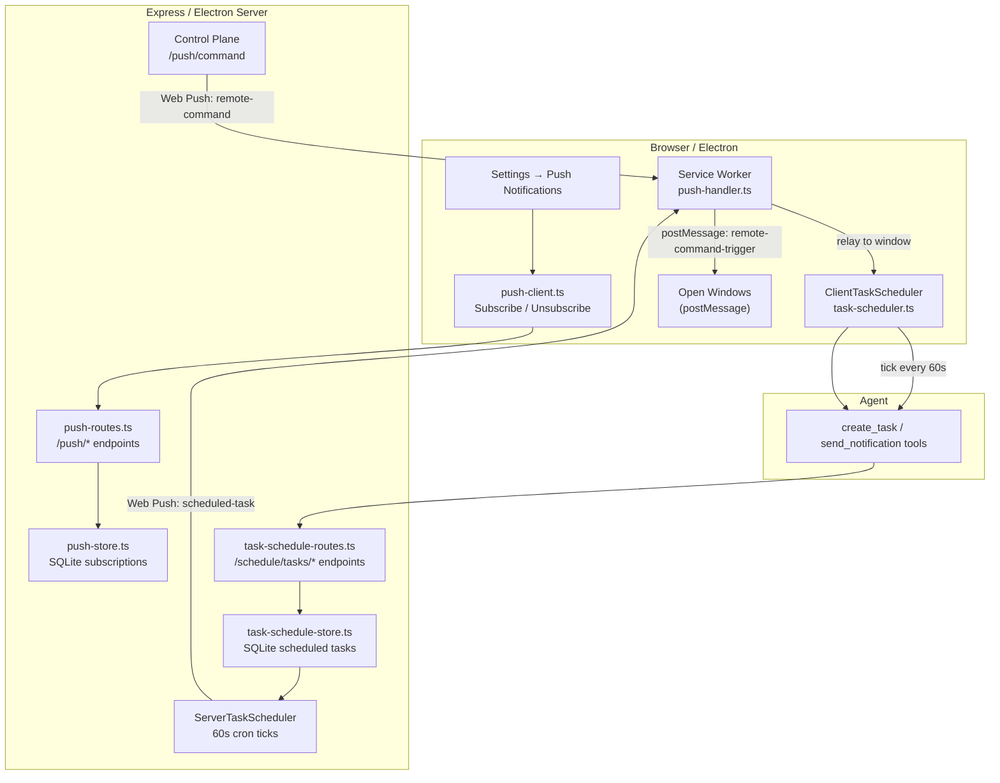
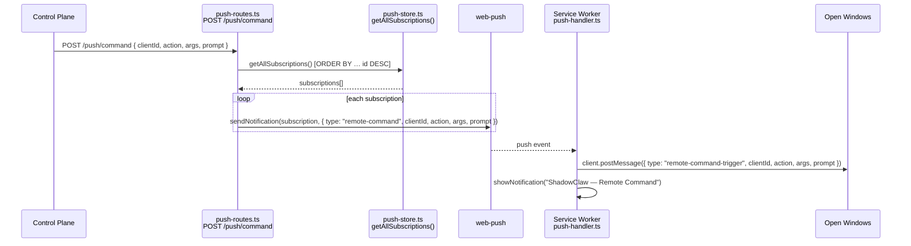
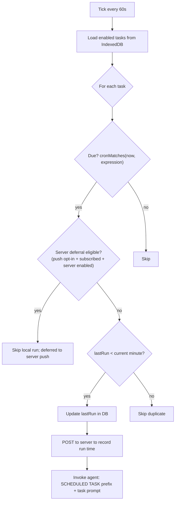

# Notifications & Scheduling

> Web Push notifications delivered via VAPID, a server-side SQLite task scheduler,
> and a client-side cron evaluator — so tasks fire even when no browser tab is open.

**Source:** `src/subsystems/notifications/` · `src/subsystems/notifications/push-routes.ts` · `src/subsystems/tools/task-scheduler.ts` · `src/subsystems/tools/cron.ts` · `src/service-worker/push-handler.ts`

## System Overview


```mermaid
graph TD
  subgraph Client ["Browser / Electron"]
    UI["Settings → Push Notifications"]
    SW["Service Worker<br>push-handler.ts"]
    CS["ClientTaskScheduler<br>task-scheduler.ts"]
    PC["push-client.ts<br>Subscribe / Unsubscribe"]
    OW["Open Windows<br>(postMessage)"]
  end

  subgraph Server ["Express / Electron Server"]
    PR["push-routes.ts<br>/push/* endpoints"]
    PS["push-store.ts<br>SQLite subscriptions"]
    TSR["task-schedule-routes.ts<br>/schedule/tasks/* endpoints"]
    TSS["task-schedule-store.ts<br>SQLite scheduled tasks"]
    Sched["ServerTaskScheduler<br>60s cron ticks"]
    CP["Control Plane<br>/push/command"]
  end

  subgraph Agent ["Agent"]
    TT["create_task / send_notification tools"]
  end

  UI --> PC
  PC --> PR
  PR --> PS
  CS -->|tick every 60s| TT
  TT --> TSR
  TSR --> TSS
  TSS --> Sched
  Sched -->|Web Push: scheduled-task| SW
  SW -->|relay to window| CS
  CS --> TT
  CP -->|Web Push: remote-command| SW
  SW -->|postMessage: remote-command-trigger| OW
```

## Push Notifications

### VAPID setup

On server start, `push-store.ts` generates a VAPID key pair (if none exists) and stores it in SQLite. The public key is exposed at `/push/vapid-public-key`.

The client subscribes via:

```text
POST /push/subscribe     { subscription: PushSubscription, subscriberId?: string, clientId?: string }
DELETE /push/subscribe   { endpoint }
POST /push/broadcast     { title, body, subscriberId?: string, clientId?: string }
GET /push/subscriptions  { Array<PushSubscriptionRow> }
GET /push/clients        { clients: Array<PushClientRecord> }
GET /push/status         { subscribed: bool, endpoint? }
```

### send_notification tool

When the agent calls `send_notification({ title, body, groupId })`:

1. **Recursion guard check** — if this is a scheduled task context, blocked with warning toast
2. Worker posts `send-notification` message to main thread
3. Orchestrator POSTs to `/push/broadcast`
4. Server sends push to all subscribed clients via `web-push.sendNotification()`

### shadowclaw_server_send_notification (MCP Tool)

External hosts, agents, and IDEs can invoke `shadowclaw_server_send_notification` (legacy alias `shadowclaw_send_notification`) via Model Context Protocol (MCP). Unlike in-browser tools, this tool executes **server-side** directly against the VAPID push subsystem:

- Accepts `body` (required), `title` (optional), and `clientId` (optional).
- When `clientId` is omitted, broadcasts to all subscribed devices.
- When `clientId` is provided, resolves the target client (by exact ID, prefix, or device label) against push subscriptions registered in the past and delivers the notification only to that client.
- Does **not** require an active client WebSocket/SSE connection.
- Bypasses client tool relaying, eliminating timeouts when client devices are asleep or in the background.
- Delivers push notifications across the vendor push network (FCM / APNs) directly to registered devices.

### Service worker (push-handler.ts)

On `push` event:

- Extract notification data from push payload
- Show OS notification via `self.registration.showNotification()`
- On notification click: relay to open windows via `BroadcastChannel`, then `clients.openWindow()`

### Relay to open tabs

The service worker uses a `BroadcastChannel("shadowclaw-push")` to relay push events to any open windows. The orchestrator listens on this channel and triggers the agent invocation for scheduled tasks.

---

## Remote Command Push Wakeup

**Files:** `src/service-worker/push-handler.ts` · `src/subsystems/notifications/push-routes.ts`

### Purpose

The control plane may need to dispatch a command to a specific ShadowClaw client that is currently dormant — i.e. not connected to the WebSocket. Rather than dropping the command or waiting for the client to reconnect, the server sends a Web Push notification of type `remote-command` to wake the client up and relay the payload.

### How it works


```mermaid
sequenceDiagram
  participant CP as Control Plane
  participant PR as push-routes.ts<br>POST /push/command
  participant PS as push-store.ts<br>getAllSubscriptions()
  participant WP as web-push
  participant SW as Service Worker<br>push-handler.ts
  participant OW as Open Windows

  CP->>PR: POST /push/command { clientId, action, args, prompt }
  PR->>PS: getAllSubscriptions() [ORDER BY … id DESC]
  PS-->>PR: subscriptions[]
  loop each subscription
    PR->>WP: sendNotification(subscription, { type: "remote-command", clientId, action, args, prompt })
  end
  WP-->>SW: push event
  SW->>OW: client.postMessage({ type: "remote-command-trigger", clientId, action, args, prompt })
  SW->>SW: showNotification("ShadowClaw — Remote Command")
```

1. **Server:** The control plane POSTs to `/push/command` with `{ clientId, action, args, prompt }`.
2. **`push-routes.ts`:** Calls `getAllSubscriptions()` (results are stably ordered by `id DESC`) and fans out a Web Push to every subscribed endpoint with payload `{ type: "remote-command", clientId, action, args, prompt }`.
3. **Service worker (`push-handler.ts`):** On receiving a push whose `data.type === 'remote-command'`, the handler:
   - Iterates all open `WindowClient`s and calls `client.postMessage({ type: 'remote-command-trigger', clientId, action, args, prompt })`.
   - Shows an OS notification titled **`ShadowClaw — Remote Command`** so the user is informed even if no window catches the message.

### Client-side handling

Open windows listen for `message` events from the service worker. When a message of type `'remote-command-trigger'` arrives, the orchestrator can act on `action`, `args`, and `prompt` in the same way as a locally-initiated command. The `clientId` field lets the handler route the command only to the intended client and ignore it otherwise.

### Push subscription ordering

`push-store.ts`'s `getAllSubscriptions()` query now applies a secondary `ORDER BY … id DESC` clause, ensuring that subscriptions are returned in a stable, deterministic order. This prevents non-deterministic fan-out behaviour when multiple subscriptions exist for the same browser profile.

---

## Client-Side Task Scheduler

**File:** `src/subsystems/tools/task-scheduler.ts`

Evaluates cron expressions every 60 seconds and invokes the agent for due tasks:


```mermaid
flowchart TD
  A[Tick every 60s] --> B[Load enabled tasks from IndexedDB]
  B --> C{For each task}
  C --> D{"Due? cronMatches(now, expression)"}
  D -->|yes| E{"Server deferral eligible?<br>(push opt-in + subscribed + server enabled)"}
  E -->|yes| F[Skip local run; deferred to server push]
  E -->|no| G{"lastRun < current minute?"}
  G -->|yes| H[Update lastRun in DB]
  H --> I[POST to server to record run time]
  I --> J[Invoke agent: SCHEDULED TASK prefix + task prompt]
  D -->|no| K[Skip]
  G -->|no| L[Skip duplicate]
```

**Cron matching** (`src/subsystems/tools/cron.ts`) — shared module evaluating standard 5-field cron expressions:

```text
min   hour  dom   month  dow
  *    *     *     *      *      (every minute)
  0    9     *     *      1-5    (9am weekdays)
  */5  *     *     *      *      (every 5 minutes)
```

Supports: `*`, `*/n` (step), `n-m` (range), `n,m` (list).

### Task Deferral to Server

The client scheduler runs continuously while the application is open. However, if a scheduled task has explicitly opted into push notifications (`pushNotifications === true`), the browser has an active push subscription, and Server Task Scheduling is enabled in Settings, the client scheduler defers execution of that task to the server scheduler to prevent duplicate local execution. Unchecked tasks (the default) always execute locally while the application or tab is open.

## Server-Side Task Scheduler

**File:** `src/subsystems/notifications/task-scheduler-server.ts`

Runs on the Express/Electron server and fires even when no browser tab is open:

1. Ticks every 60 seconds
2. Queries SQLite for enabled tasks with due cron expressions
3. Filters for tasks that have opted in to push notifications (`push_enabled === 1`). Tasks without push enabled are skipped from server broadcast (their `last_run` timestamp is updated to avoid re-evaluating in subsequent ticks).
4. For each due, opted-in task: sends a Web Push notification **scoped strictly to the task's owning `subscriber_id`** (never broadcast globally across all subscribers).
   - If a task has no `subscriber_id`, the scheduler skips dispatch and logs a warning.
   - If the task's subscriber has no active push subscription, the scheduler skips dispatch without broadcasting to other subscribers.
5. Service worker receives push, relays to open tabs with `subscriberId`, or shows OS notification
6. Open tab receives relay → validates that `subscriberId` matches its local subscriber identity, then triggers agent invocation with the task prompt

The server scheduler and client scheduler coordinate via task opt-in: tasks opted into push notifications run via the server, while standard scheduled tasks execute locally when a client session is active.

## Scheduled Task Store (Client)

Tasks are stored in IndexedDB via `src/db/`:

| Field               | Type          | Purpose                                                      |
| ------------------- | ------------- | ------------------------------------------------------------ |
| `id`                | string (ULID) | Unique identifier                                            |
| `groupId`           | string        | Owning conversation                                          |
| `name`              | string        | Task display name                                            |
| `type`              | string        | `"prompt"` or `"tools"`                                      |
| `prompt`            | string        | Instruction sent to the agent                                |
| `tools`             | string        | JSON serialized tool sequence                                |
| `schedule`          | string        | 5-field cron schedule                                        |
| `enabled`           | boolean       | Active/paused                                                |
| `lastRun`           | number        | Unix timestamp of last execution                             |
| `createdAt`         | number        | Unix timestamp                                               |
| `freshContext`      | boolean       | Skip history (blank slate) execution                         |
| `subagent`          | boolean       | Isolated background execution                                |
| `pushNotifications` | boolean       | Opt-in to receive scheduled task as Web Push (default false) |
| `order`             | number        | Reorder index within the group                               |

## Scheduled Task Store (Server)

Mirrored to SQLite on the Express/Electron server for server-side scheduling. Routes:

```text
POST   /schedule/tasks                 Create/Update task on server (accepts subscriberId, pushNotifications)
POST   /schedule/tasks/reorder         Reorder tasks in a group (accepts subscriberId)
GET    /schedule/tasks                 List all tasks (accepts subscriberId)
GET    /schedule/tasks/:id             Get single task
DELETE /schedule/tasks/:id             Delete task (enforces subscriberId ownership)
PATCH  /schedule/tasks/:id/enable      Enable task
PATCH  /schedule/tasks/:id/disable     Disable task
```

The server SQLite `scheduled_tasks` table includes a `push_enabled INTEGER NOT NULL DEFAULT 0` column.

Tasks are synced to the server whenever the agent creates/updates/deletes/reorders a scheduled task (guarded by recursion check). The server sync can be globally disabled via the `TASK_SERVER_ENABLED` config flag (managed in Settings). When disabled, tasks only execute locally when the browser tab is open.

## Recursion Guard

To prevent task cascades:

- When `isScheduledTask === true` in the invoke payload, the orchestrator blocks:
  - `task-created`, `update-task`, `delete-task` worker messages → warning toast
  - `send-notification` → warning toast instead of push broadcast
- The guard set `schedulerTriggeredGroups` tracks in-flight scheduled task groups
- Guard is cleared when the task invocation completes
