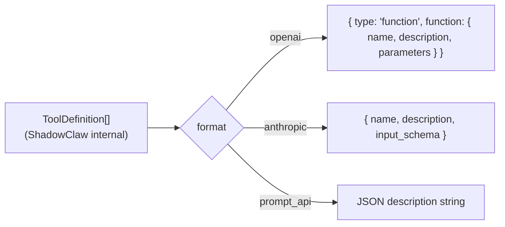

# Providers & Adapters

> The LLM provider registry — multiple API formats, streaming, key management,
> and the special browser Prompt API path.

**Source:** `src/config.ts` · `src/providers.ts` · `src/prompt-api-provider.ts` · `src/model-registry.ts`

## Provider Architecture

Providers are handled via an **adapter pattern** in `src/providers.ts`:

```text
Provider (config) → Adapter (format-specific) → Request/Response transformation
                      ↓
                  OpenAIAdapter or AnthropicAdapter
                      ↓
                  formatRequest() / parseResponse()
```

**Adapters:**

- `OpenAIAdapter` — Handles OpenAI and compatible endpoints (`/chat/completions`)
- `AnthropicAdapter` — Handles Anthropic format and Bedrock (`/messages`)
- Retrieved via `getAdapter(provider)` based on `provider.format`

## Provider Registry

All providers are declared in `src/config.ts` under `PROVIDERS`:

| Provider ID                  | Format            | Streaming | API Key Required       |
| ---------------------------- | ----------------- | --------- | ---------------------- |
| `openrouter`                 | `openai`          | ✅        | ✅                     |
| `huggingface`                | `openai`          | ✅        | ✅                     |
| `transformers_js_local`      | `openai`          | ✅        | ❌                     |
| `transformers_js_browser`    | `transformers_js` | ❌        | ❌                     |
| `ollama`                     | `openai`          | ✅        | ❌                     |
| `llamafile`                  | `openai`          | ✅        | ❌                     |
| `github_models`              | `openai`          | ✅        | ✅                     |
| `copilot_azure_openai_proxy` | `openai`          | ✅        | ✅                     |
| `bedrock_proxy`              | `anthropic`       | ✅        | ❌ (AWS SSO via proxy) |
| `gemini`                     | `openai`          | ✅        | ✅                     |
| `vertex_ai`                  | `openai`          | ✅        | ✅                     |
| `prompt_api`                 | `prompt_api`      | ❌        | ❌                     |

> **Llamafile Note:** The local proxy context size for Llamafile defaults to 8192 tokens but can be configured via the `LLAMAFILE_CTX_SIZE` environment variable (e.g., `LLAMAFILE_CTX_SIZE=32768`).

### Provider shape

```ts
interface Provider {
  id: string;
  name: string;
  format: "openai" | "anthropic" | "prompt_api";
  baseUrl: string;
  supportsStreaming?: boolean;
  requiresApiKey: boolean; // Must be set for UI gating
  supportsCompaction?: boolean;
}
```

> **Always set `requiresApiKey` explicitly** when adding a provider — it gates the API key UI and orchestrator behavior.

## Request Formats

### OpenAI Format (`OpenAIAdapter`)

Used by OpenRouter, Copilot Azure, GitHub Models, and compatible endpoints.

**Endpoint:** `${baseUrl}/chat/completions`

**Request transformation:**

- System messages combined into a single system role entry
- Messages reformatted to OpenAI structure
- Tool definitions wrapped as `{ type: "function", function: { name, description, parameters } }`
- Tool results placed in separate `tool` role messages with `tool_call_id`
- Special handling for legacy short model IDs (Azure gateway routing)
- Ollama context window auto-configuration via `num_ctx` option
- OpenRouter context compression plugin support

**Response parsing:**

- Extracts `choices[0].message` content (text + tool calls)
- Maps tool calls to internal `tool_use` format
- Returns stop reason and token usage

### Anthropic Format (`AnthropicAdapter`)

Used by AWS Bedrock and direct Anthropic calls.

**Endpoint:** `${baseUrl}/messages` (via proxy for Bedrock SigV4 signing)

**Request transformation:**

- System prompt passed separately
- Messages filtered to remove duplicate system entries
- Tool definitions in Anthropic native format: `{ name, description, input_schema }`

**Response parsing:**

- Content blocks already in internal format
- Stop reason and token usage extracted directly

### Google Format (`GoogleAdapter`)

Used by direct Gemini API and Vertex AI.

- **Endpoint**: `${baseUrl}/models/${model}:streamGenerateContent` (streaming) or `generateContent` (non-streaming)
- **Request transformation**:
  - Maps ShadowClaw messages to Gemini's `contents` and `parts` array.
  - Handles native PDF and image attachments.
  - Maps tool results to `functionResponse` blocks.
- **Response parsing**:
  - Extracts text and `functionCall` blocks from the response candidates.

### Prompt API format (`src/prompt-api-provider.ts`)

Browser's experimental Prompt API (`window.LanguageModel`). Runs entirely on-device.

- No network calls
- No API key
- Keyless, zero-cost (when available)
- Model downloads required (progress surfaced via `model-download-progress` events)
- Tool calls use JSON envelope parsed by `parseStructured()`:
  ```json
  { "type": "tool_use", "tool_calls": [...] }
  ```
- `responseConstraint` (JSON schema) may cause Gemini Nano to stall; the provider automatically **retries without the constraint** so the model can generate tool-call JSON freely

## Provider Help & UX

**Source:** `src/components/common/help/providers.ts`

ShadowClaw includes a contextual help system that intercepts provider errors and surfaces actionable resolution steps.

- **Detection**: `detectProviderHelpType()` parses error messages and status codes to categorize issues (e.g., `api-key-invalid`, `rate-limited`, `provider-unreachable`).
- **Dialogs**: `buildProviderHelpDialogOptions()` generates a user-friendly dialog with instructions tailored to the provider.
- **Local Runtimes**: Specific help builders exist for `llamafile` and `transformers_js_local` to guide users through local environment setup failures.
- **Links**: Dialogs include direct "Settings" links or external documentation links (e.g., HuggingFace token settings).

## Tool Formats by Provider

The `formatToolsForProvider(tools, format)` function in `src/providers.ts` converts the internal `TOOL_DEFINITIONS` into the provider's expected format:



## Adaptive Rate Limiting

**Source:** `src/worker/rate-limit.ts`

To prevent `429 Too Many Requests` errors, the worker uses an adaptive rate limiter that synchronizes with provider-level quotas.

### Logic Flow

1. **Pre-flight Check**: Before every provider call, `waitForRateLimitSlot()` checks if a slot is available.
2. **Header Sync**: After every call, `updateRateLimitFromHeaders()` parses response headers to update internal state.
3. **Adaptive Waiting**: If a limit is reached, the worker posts a `thinking-log` and pauses execution until the next slot opens.

### Supported Headers

- `x-ratelimit-limit`: Total requests allowed in the window.
- `x-ratelimit-remaining`: Remaining requests in the window.
- `x-ratelimit-reset`: Epoch (seconds or ms) when the window resets.
- `retry-after`: Delta seconds or UTC date until retry is allowed.

### Manual Configuration

For providers that do not emit rate limit headers, users can configure a fixed `callsPerMinute` limit in Settings.

## Model Registry

**File:** `src/model-registry.ts`

The `ModelRegistry` is a dynamic metadata store that caches model information fetched from provider APIs (e.g., OpenRouter's `/v1/models` or HuggingFace Router).

### Metadata Fields

- `contextWindow`: Total tokens (input + output) allowed.
- `maxOutput`: Provider-enforced completion token limit.
- `supportsTools`: Whether the model explicitly supports tool calling.
- `inputModalities` / `outputModalities`: Modalities supported (text, image, audio, video).
- `routesByRequestFeatures`: Whether the provider (like `openrouter/free`) adapts routing based on request content.

### Capability Detection

The registry provides the backbone for:

- **Context Limits**: `getContextLimit()` resolves limits by checking the registry first, then built-in family patterns, then generic fallbacks.
- **Tooling**: Adapter logic uses registry hints to decide whether to format and send tools.
- **Multimodal Routing**: The `AttachmentCapabilities` system relies on registry modalities to choose between native and fallback delivery.

### Dynamic Fetching

Registry info is fetched via `fetchModelInfo(provider, apiKey)`. For authenticated providers, the API key is forwarded to ensure access to the full model list.

## Streaming Gates

Three conditions must all be true for streaming to activate:

1. `CONFIG_KEYS.STREAMING_ENABLED` = `true` (user preference)
2. `provider.supportsStreaming = true` in provider config
3. `provider.format !== "prompt_api"` (Prompt API doesn't use SSE)

## AWS Bedrock Proxy

Bedrock requires AWS SigV4 request signing, which can't happen in the browser (no access to credentials). The Express server's proxy route signs requests server-side using AWS SSO credentials.

The Bedrock provider is configured as `format: "anthropic"` since Bedrock models expose Anthropic's API format. The proxy:

1. Accepts the request from the browser
2. Adds SigV4 signing headers using `@aws-sdk/credential-providers`
3. Forwards to the Bedrock endpoint
4. Passes the SSE response stream through (compression-excluded for real-time delivery)

When `BEDROCK_REGION`/`BEDROCK_PROFILE` environment variables are not set,
the runtime can provide fallback values via request headers (`x-bedrock-region`,
`x-bedrock-profile`) from Settings.

### Gemini and Vertex AI

ShadowClaw utilizes secure server-side proxy routes for Google Gemini and Vertex AI models. These proxies handle:

- **Security**: API keys and service account credentials (ADC) are managed server-side.
- **Robustness**: The proxies use the official `@google/genai` and Vertex AI SDKs to provide a stable, streaming-compliant interface.
- **Tooling**: Comprehensive support for function calling and native multimodal attachments.

### Attachment Support

Gemini models feature **Native PDF Support**. ShadowClaw automatically detects model capabilities and delivers PDFs as native binary blocks instead of falling back to text representations.

## Model Selection

Models are fetched dynamically via the provider API (e.g., `GET /models`). The model list is loaded in Settings and persisted as `CONFIG_KEYS.MODEL`.

**Context limits** are resolved per model family via `getContextLimit(model)` — see the [Context Management](../architecture/context-management.md#context-limits-by-model) doc.

**Local Model Ranking:** For browser-based local inference (like `transformers_js_browser`), models are ranked and sorted based on specific heuristics. Smaller, instruction-tuned ONNX models (e.g., <4B parameters) and models with explicit tool support are prioritized to ensure the best performance and compatibility within the browser's constrained execution environment.

**Auto-profile activation:** When a model is selected, the orchestrator checks if any saved tool profile specifies that model. If a match is found, the profile is automatically activated (e.g., the `NANO_BUILTIN_PROFILE` activates when Gemini Nano / Prompt API is selected).

## Adding a New Provider

See the [Adding a Provider](../guides/adding-a-provider.md) guide.
