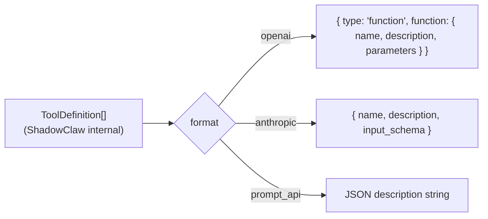

# Providers & Adapters

> The LLM provider registry — multiple API formats, streaming, key management,
> and the special browser Prompt API path.

**Source:** `src/config.ts` · `src/providers.ts` · `src/prompt-api-provider.ts` · `src/model-registry.ts`

## Provider Architecture

Providers are handled via an **adapter pattern** in `src/providers.ts`:

```
Provider (config) → Adapter (format-specific) → Request/Response transformation
                      ↓
                  OpenAIAdapter or AnthropicAdapter
                      ↓
                  formatRequest() / parseResponse()
```

**Adapters:**

- `OpenAIAdapter` — Handles OpenAI and compatible endpoints (`/chat/completions`)
- `AnthropicAdapter` — Handles Anthropic format and Bedrock (`/messages`)
- Retrieved via `getAdapter(provider)` based on `provider.format`

## Provider Registry

All providers are declared in `src/config.ts` under `PROVIDERS`:

| Provider ID           | Format       | Streaming | API Key Required    |
| --------------------- | ------------ | --------- | ------------------- |
| `openrouter`          | `openai`     | ✅        | ✅                  |
| `copilot_azure`       | `openai`     | ✅        | ✅                  |
| `copilot_azure_proxy` | `openai`     | ✅        | via proxy           |
| `bedrock`             | `anthropic`  | ✅        | via proxy (AWS SSO) |
| `prompt_api`          | `prompt_api` | ❌        | ❌                  |

### Provider shape

```ts
interface Provider {
  id: string;
  name: string;
  format: "openai" | "anthropic" | "prompt_api";
  baseUrl: string;
  supportsStreaming?: boolean;
  requiresApiKey: boolean; // Must be set for UI gating
  supportsCompaction?: boolean;
}
```

> **Always set `requiresApiKey` explicitly** when adding a provider — it gates the API key UI and orchestrator behavior.

## Request Formats

### OpenAI Format (`OpenAIAdapter`)

Used by OpenRouter, Copilot Azure, GitHub Models, and compatible endpoints.

**Endpoint:** `${baseUrl}/chat/completions`

**Request transformation:**

- System messages combined into a single system role entry
- Messages reformatted to OpenAI structure
- Tool definitions wrapped as `{ type: "function", function: { name, description, parameters } }`
- Tool results placed in separate `tool` role messages with `tool_call_id`
- Special handling for legacy short model IDs (Azure gateway routing)
- Ollama context window auto-configuration via `num_ctx` option
- OpenRouter context compression plugin support

**Response parsing:**

- Extracts `choices[0].message` content (text + tool calls)
- Maps tool calls to internal `tool_use` format
- Returns stop reason and token usage

### Anthropic Format (`AnthropicAdapter`)

Used by AWS Bedrock and direct Anthropic calls.

**Endpoint:** `${baseUrl}/messages` (via proxy for Bedrock SigV4 signing)

**Request transformation:**

- System prompt passed separately
- Messages filtered to remove duplicate system entries
- Tool definitions in Anthropic native format: `{ name, description, input_schema }`

**Response parsing:**

- Content blocks already in internal format
- Stop reason and token usage extracted directly

### Prompt API format (`src/prompt-api-provider.ts`)

Browser's experimental Prompt API (`window.LanguageModel`). Runs entirely on-device.

- No network calls
- No API key
- Keyless, zero-cost (when available)
- Model downloads required (progress surfaced via `model-download-progress` events)
- Tool calls use JSON envelope parsed by `parseStructured()`:
  ```json
  { "type": "tool_use", "tool_calls": [...] }
  ```
- `responseConstraint` (JSON schema) may cause Gemini Nano to stall; the provider automatically **retries without the constraint** so the model can generate tool-call JSON freely

## Tool Formats by Provider

The `formatToolsForProvider(tools, format)` function in `src/providers.ts` converts the internal `TOOL_DEFINITIONS` into the provider's expected format:



## Model Registry

**File:** `src/model-registry.ts`

Dynamic model metadata registry that caches model info:

```ts
getModelInfo(model: string): ModelInfo | undefined
```

Returns context window, tool support status, and other capability hints. Used by:

- `getContextLimit()` to resolve context windows (registry → built-in patterns → fallback)
- Adapter logic to decide whether to send tools to a model

## Streaming Gates

Three conditions must all be true for streaming to activate:

1. `CONFIG_KEYS.STREAMING_ENABLED` = `true` (user preference)
2. `provider.supportsStreaming = true` in provider config
3. `provider.format !== "prompt_api"` (Prompt API doesn't use SSE)

## AWS Bedrock Proxy

Bedrock requires AWS SigV4 request signing, which can't happen in the browser (no access to credentials). The Express server's proxy route signs requests server-side using AWS SSO credentials.

The Bedrock provider is configured as `format: "anthropic"` since Bedrock models expose Anthropic's API format. The proxy:

1. Accepts the request from the browser
2. Adds SigV4 signing headers using `@aws-sdk/credential-providers`
3. Forwards to the Bedrock endpoint
4. Passes the SSE response stream through (compression-excluded for real-time delivery)

## Model Selection

Models are fetched dynamically via the provider API (e.g., `GET /models`). The model list is loaded in Settings and persisted as `CONFIG_KEYS.MODEL`.

**Context limits** are resolved per model family via `getContextLimit(model)` — see the [Context Management](../architecture/context-management.md#context-limits-by-model) doc.

**Auto-profile activation:** When a model is selected, the orchestrator checks if any saved tool profile specifies that model. If a match is found, the profile is automatically activated (e.g., the `NANO_BUILTIN_PROFILE` activates when Gemini Nano / Prompt API is selected).

## Adding a New Provider

See the [Adding a Provider](../guides/adding-a-provider.md) guide.
