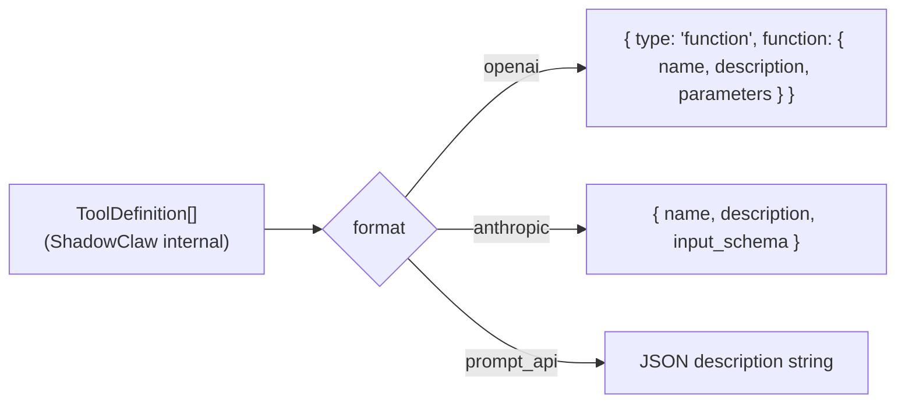

# Providers & Adapters

> The LLM provider registry — multiple API formats, streaming, key management,
> and the special browser Prompt API path.

**Source:** `src/config/config.ts` · `src/subsystems/providers/providers.ts` · `src/subsystems/providers/prompt-api-provider.ts` · `src/subsystems/providers/model-registry.ts`

## Provider Architecture

Providers are handled via an **adapter pattern** in `src/subsystems/providers/providers.ts`:

```text
Provider (config) → Adapter (format-specific) → Request/Response transformation
                      ↓
                  OpenAIAdapter or AnthropicAdapter
                      ↓
                  formatRequest() / parseResponse()
```

**Adapters:**

- `OpenAIAdapter` — Handles OpenAI and compatible endpoints (`/chat/completions`)
- `AnthropicAdapter` — Handles Anthropic format and Bedrock (`/messages`)
- Retrieved via `getAdapter(provider)` based on `provider.format`

## Provider Registry

All providers are declared in `src/config/config.ts` under `PROVIDERS`:

| Provider ID               | Format            | Streaming | API Key Required |
| ------------------------- | ----------------- | --------- | ---------------- |
| `prompt_api`              | `prompt_api`      | ❌        | ❌ (Default)     |
| `litert_lm_browser`       | `litert_lm`       | ❌        | ❌               |
| `transformers_js_browser` | `transformers_js` | ❌        | ❌               |
| `transformers_js_local`   | `openai`          | ✅        | ❌               |
| `openrouter`              | `openai`          | ✅        | ✅               |
| `huggingface`             | `openai`          | ✅        | ✅               |
| `vertex_ai`               | `openai`          | ✅        | ✅               |
| `gemini_proxy`            | `openai`          | ✅        | ✅               |
| `bedrock_proxy`           | `anthropic`       | ✅        | ❌               |
| `ollama`                  | `openai`          | ✅        | ❌               |
| `llamafile`               | `openai`          | ✅        | ❌               |
| `mesh-llm`                | `mesh-llm`        | ✅        | ❌               |

> **Llamafile Note:** The local proxy context size for Llamafile defaults to 8192 tokens but can be configured via the `LLAMAFILE_CTX_SIZE` environment variable (e.g., `LLAMAFILE_CTX_SIZE=32768`).

### Provider shape

```ts
interface Provider {
  id: string;
  name: string;
  format: "openai" | "anthropic" | "prompt_api";
  baseUrl: string;
  supportsStreaming?: boolean;
  requiresApiKey: boolean; // Must be set for UI gating
  supportsCompaction?: boolean;
}
```

> **Always set `requiresApiKey` explicitly** when adding a provider — it gates the API key UI and orchestrator behavior.

## Request Formats

### OpenAI Format (`OpenAIAdapter`)

Used by OpenRouter, HuggingFace, Gemini Proxy, Ollama, Llamafile, and compatible endpoints.

**Endpoint:** `${baseUrl}/chat/completions`

**Request transformation:**

- System messages combined into a single system role entry
- Messages reformatted to OpenAI structure
- Tool definitions wrapped as `{ type: "function", function: { name, description, parameters } }`
- Tool results placed in separate `tool` role messages with `tool_call_id`
- Ollama context window auto-configuration via `num_ctx` option
- OpenRouter context compression plugin support

**Response parsing:**

- Extracts `choices[0].message` content (text + tool calls)
- Maps tool calls to internal `tool_use` format
- Returns stop reason and token usage

### Anthropic Format (`AnthropicAdapter`)

Used by AWS Bedrock and direct Anthropic calls.

**Endpoint:** `${baseUrl}/messages` (via proxy for Bedrock SigV4 signing)

**Request transformation:**

- System prompt passed separately
- Messages filtered to remove duplicate system entries
- Tool definitions in Anthropic native format: `{ name, description, input_schema }`
- Automatically injects `cache_control: { type: "ephemeral" }` on system prompts and tools for supported models when `promptCaching` is enabled
- Drops empty or whitespace-only text blocks to satisfy strict Converse API requirements

**Response parsing:**

- Content blocks already in internal format
- Stop reason and token usage extracted directly, including `cache_read_input_tokens` and `cache_creation_input_tokens`

### Google Format (`GoogleAdapter`)

Used by direct Google Gemini API integrations (`format: "google"`). Note that the local proxies `gemini_proxy` and `vertex_ai` are currently configured with `format: "openai"` for standard endpoint compatibility over the local proxies, while the underlying proxy handlers handle any Google API specific mapping.

- **Endpoint**: `${baseUrl}/models/${model}:streamGenerateContent` (streaming) or `generateContent` (non-streaming)
- **Request transformation**:
  - Maps ShadowClaw messages to Gemini's `contents` and `parts` array.
  - Handles native PDF and image attachments.
  - Maps tool results to `functionResponse` blocks.
- **Response parsing**:
  - Extracts text and `functionCall` blocks from the response candidates.

### Prompt API format (`src/subsystems/providers/prompt-api-provider.ts`)

Backed by the `builtin-ai-tasks` subsystem with dynamic polyfill loading and a Main-Thread RPC bridge (`request-native-ai-task`) to execute native browser Task APIs (`window.ai.*` / `window.translation.*` and global constructors for Summarizer, Writer, Rewriter, Proofreader, Language Detector, and Translator) off the Web Worker thread. Polyfill fallback for `prompt_api` is transparently enabled for provider invocations and context compaction.

- **Default Provider**: `prompt_api` ("Prompt API (Browser)") is the default provider in ShadowClaw.
- **Zero Configuration**: Keyless, zero-cost execution with zero network requirements once models are cached.
- **Dynamic Fallback Architecture**:
  - Automatically probes hardware acceleration via **WebNN** (`navigator.ml`) and asynchronous WebGPU feature probing (`isWebGpuAdapterAvailable()`). Software-emulated WebGPU adapters and those lacking `shader-f16` support are rejected to ensure optimal performance.
  - When accelerated backends encounter unsupported kernels, memory-allocation failures, or software-only adapters (`ORT_NOT_IMPLEMENTED`, `ERROR_CODE: 9`, `bad_alloc`, `out of memory`, `ERROR_CODE: 6`), `createTaskInstanceWithFallback()` transparently switches execution to WebAssembly CPU (`device: "wasm"`, `dtype: "q4"`) without interrupting the user with modal prompts.
  - Default polyfill model is `onnx-community/Qwen3-0.6B-ONNX`. Users can configure their preferred Prompt API fallback model in Settings (`CONFIG_KEYS.PROMPT_API_FALLBACK_MODEL`, including `onnx-community/gemma-3-1b-it-ONNX-GQA`, `onnx-community/Llama-3.2-1B-Instruct-ONNX`, and `onnx-community/SmolLM2-360M-Instruct-ONNX`).
  - **Hardware Preferences**: Transformers.js inference defaults to `q4f16` quantization across browser-native paths. Users can explicitly configure preferred device and dtype overrides in Settings.
- **Dynamic Chat Templates & XML Tool Calling**:
  - Dynamically fetches and parses `tokenizer_config.json` for ONNX models to detect model-native tool calling syntax (such as Qwen/Llama XML `<tool_call>` tags).
  - Generation loop supports multi-turn session cloning and warm session reuse.
  - Supports native `tools` parameter option (`inputSchema` / `parameters`) on session creation alongside JSON envelope and XML tool call parsing.
  - `responseConstraint` (JSON schema) may cause Gemini Nano to stall; the provider automatically **retries without the constraint** so the model can generate tool-call JSON freely.
- **Chunked Model Download & CacheStorage Engine**:
  - Shared model caching engine in `src/subsystems/providers/utils/` (`createModelCacheFetch`, `downloadModelToCache`, `loadModelStream`, `assembleChunkedStream`, `flushChunkToCache`).
  - Downloads are stored directly in `CacheStorage` (`shadow-claw-browser-models` and `shadow-claw-litertlm-models`) with HTTP Range resume and exponential backoff retry.
  - `Transformers.js` native cache is disabled (`env.useBrowserCache = false`) to avoid redundant double-caching, intercepting fetches via `createModelCacheFetch`.
  - Service Worker runtime caching bypasses model weights and CDN domains (`*.onnx`, `*.onnx_data`, `huggingface.co`, `hf.co`, `hf-mirror.com`, `litertlm`, etc.) so they are managed directly and reliably by CacheStorage / native fetch.
  - Model download progress is aggregated via `promptApiProgressAggregator`, dynamically calculating model sizes and suppressing initial false 0% states.
- **Configurable Task Tools Backend**:
  - `BUILTIN_AI_TOOLS_BACKEND` setting defaults to **Active Conversation LLM** (`active_provider`) so native tasks (summarize, rewrite, translate) route to the main LLM provider, with option to select local browser WebGPU/WASM polyfills (`local`).
- **Sampling Parameters**:
  - Supports sampling parameters (`samplingMode`, `temperature`, `topK`) passed to model session initialization per Chrome Built-in AI / W3C Prompt API explainer.

### Subagent provider dispatch

Main-thread invocation paths route subagent execution through `dispatchSubagentInvoke` (`src/core/orchestrator/utils/dispatchSubagentInvoke.ts`) instead of hard-coding provider-specific branches in each provider implementation.

- Browser providers are routed explicitly by provider ID (`prompt_api`, `litert_lm_browser`, `transformers_js_browser`).
- Prompt API and LiteRT browser providers perform environment support checks before invocation.
- Worker-backed providers are dispatched through the standard worker `handleInvoke` path.

## Provider Help & UX

**Source:** `src/components/common/help/providers.ts`

ShadowClaw includes a contextual help system that intercepts provider errors and surfaces actionable resolution steps.

- **Detection**: `detectProviderHelpType()` parses error messages and status codes to categorize issues (e.g., `api-key-invalid`, `rate-limited`, `provider-unreachable`).
- **Dialogs**: `buildProviderHelpDialogOptions()` generates a user-friendly dialog with instructions tailored to the provider.
- **Auto-Close Countdown**: Provider help and fatal API error dialogs specify `autoCloseSeconds: 30`, showing an accessible countdown on the confirmation button and an `aria-live="polite"` status region (`role="status"`, `aria-atomic="true"`) to prevent unattended workflows from blocking indefinitely.
- **Local Runtimes**: Specific help builders exist for `llamafile`, `transformers_js_local`, and `prompt_api` to guide users through local environment setup failures with automatic 30s countdowns.
- **Links**: Dialogs include direct "Settings" links or external documentation links (e.g., HuggingFace token settings, OpenRouter API keys).

## Tool Formats by Provider

The `formatToolsForProvider(tools, format)` function in `src/subsystems/providers/providers.ts` converts the internal `TOOL_DEFINITIONS` into the provider's expected format:


```mermaid
graph LR
  A["ToolDefinition[]<br>(ShadowClaw internal)"] --> B{format}
  B -->|openai| C["{ type: 'function', function: { name, description, parameters } }"]
  B -->|anthropic| D["{ name, description, input_schema }"]
  B -->|prompt_api| E["JSON description string"]
```

## Adaptive Rate Limiting

**Source:** `src/worker/rate-limit.ts`

To prevent `429 Too Many Requests` errors, the worker uses an adaptive rate limiter that synchronizes with provider-level quotas.

### Logic Flow

1. **Pre-flight Check**: Before every provider call, `waitForRateLimitSlot()` checks if a slot is available.
2. **Header Sync**: After every call, `updateRateLimitFromHeaders()` parses response headers to update internal state.
3. **Adaptive Waiting**: If a limit is reached, the worker posts a `thinking-log` and pauses execution until the next slot opens.

### Supported Headers

- `x-ratelimit-limit`: Total requests allowed in the window.
- `x-ratelimit-remaining`: Remaining requests in the window.
- `x-ratelimit-reset`: Epoch (seconds or ms) when the window resets.
- `retry-after`: Delta seconds or UTC date until retry is allowed.

### Manual Configuration

For providers that do not emit rate limit headers, users can configure a fixed `callsPerMinute` limit in Settings.

## Model Registry

**File:** `src/subsystems/providers/model-registry.ts`

The `ModelRegistry` is a dynamic metadata store that caches model information fetched from provider APIs (e.g., OpenRouter's `/v1/models` or HuggingFace Router).

### Metadata Fields

- `contextWindow`: Total tokens (input + output) allowed.
- `maxOutput`: Provider-enforced completion token limit.
- `supportsTools`: Whether the model explicitly supports tool calling.
- `inputModalities` / `outputModalities`: Modalities supported (text, image, audio, video).
- `routesByRequestFeatures`: Whether the provider (like `openrouter/free`) adapts routing based on request content.

### Capability Detection

The registry provides the backbone for:

- **Context Limits**: `getContextLimit()` resolves limits by checking the registry first, then built-in family patterns, then generic fallbacks.
- **Tooling**: Adapter logic uses registry hints to decide whether to format and send tools.
- **Multimodal Routing**: The `AttachmentCapabilities` system relies on registry modalities to choose between native and fallback delivery.

### Dynamic Fetching

Registry info is fetched via `fetchModelInfo(provider, apiKey)`. For authenticated providers, the API key is forwarded to ensure access to the full model list. Non-critical model registry fetching during initial boot is deferred via `requestIdleCallback` (or `setTimeout` fallback after window load) to prevent blocking the main thread during initial UI paint.

## Streaming Gates

Three conditions must all be true for streaming to activate:

1. `CONFIG_KEYS.STREAMING_ENABLED` = `true` (user preference)
2. `provider.supportsStreaming = true` in provider config
3. `provider.format !== "prompt_api"` (Prompt API doesn't use SSE)

## AWS Bedrock Proxy

Bedrock requires AWS SigV4 request signing, which can't happen in the browser (no access to credentials). The Express server's proxy route signs requests server-side using AWS credentials.

The Bedrock provider is configured as `format: "anthropic"` since the client sends Anthropic-formatted messages. The proxy:

1. Accepts the Anthropic-formatted request from the browser
2. Sanitizes messages (`sanitizeConverseMessages`) to guarantee strictly alternating roles, strip leading assistant turns, merge adjacent same-role messages, and append a user `(continue)` turn if history ends on an assistant response.
3. Translates Anthropic `cache_control` blocks into Converse `cachePoint` blocks (capping total checkpoints at 4 across tools, system, and messages while preserving TTL options).
4. Invokes Bedrock using `@aws-sdk/client-bedrock-runtime` (`ConverseCommand` / `ConverseStreamCommand`)
5. Streams the response back to the client in Anthropic SSE format, including cache read/write token usage metrics.

When `BEDROCK_REGION`/`BEDROCK_PROFILE` environment variables are not set,
the runtime can provide fallback values via request headers (`x-bedrock-region`,
`x-bedrock-profile`) from Settings.

### Cross-region inference prefixes

The proxy accepts **any** cross-region inference prefix — not just two-letter geo codes. Bedrock's `/models` endpoint returns profiles such as `global.anthropic.*`, and those are now routed correctly alongside the standard `us.*`, `eu.*`, and `apac.*` prefixes.

### Retry and throttling

The Bedrock client is initialized with:

- `maxAttempts: 3` and `retryMode: "adaptive"` — automatic backoff on transient failures.
- `requestTimeout: 60 000 ms` — prevents hanging on slow inference.

On `ThrottlingException` (HTTP 429) the proxy returns `429` to the browser so the client-side rate limiter can apply `retry-after` back-off rather than treating the response as a generic `502`.

### Gemini and Vertex AI

ShadowClaw utilizes secure server-side proxy routes for Google Gemini and Vertex AI models. These proxies handle:

- **Security**: API keys and service account credentials (ADC) are managed server-side.
- **Robustness**: The proxies use the official `@google/genai` and Vertex AI SDKs to provide a stable, streaming-compliant interface.
- **Tooling**: Comprehensive support for function calling and native multimodal attachments.

### Attachment Support

Gemini models feature **Native PDF Support**. ShadowClaw automatically detects model capabilities and delivers PDFs as native binary blocks instead of falling back to text representations.

## Model Selection

Models are fetched dynamically via the provider API (e.g., `GET /models`). The model list is loaded in Settings and persisted as `CONFIG_KEYS.MODEL`.

**Context limits** are resolved per model family via `getContextLimit(model)` — see the [Context Management](../architecture/context-management.md#context-limits-by-model) doc.

**Local Model Ranking:** For browser-based local inference (like `transformers_js_browser` and `prompt_api`), models are ranked and sorted based on specific heuristics. Smaller, instruction-tuned ONNX models (e.g., <4B parameters) and models with explicit tool support are prioritized to ensure the best performance and compatibility within the browser's constrained execution environment.

**Hardware-Aware Token Recommendations:** Token recommendations (`getRecommendedMaxTokens`) scale dynamically based on device memory (`navigator.deviceMemory`), CPU threads (`navigator.hardwareConcurrency`), reasoning model flags, and provider output ceilings for all browser-local providers (`prompt_api`, `transformers_js_browser`, `litert_lm_browser`, and `ollama`).

**Auto-profile activation:** When a model is selected, the orchestrator checks if any saved tool profile specifies that model. If a match is found, the profile is automatically activated (e.g., the `DEFAULT_BUILTIN_PROFILE` activates with safe built-in defaults).

## Adding a New Provider

See the [Adding a Provider](../guides/adding-a-provider.md) guide.
