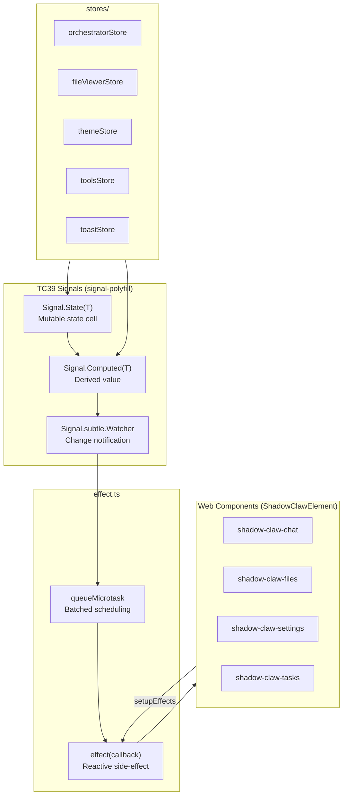

# Reactive UI System

> TC39 Signals, `effect()`, stores, `ShadowClawElement`, and Web Components — no framework, no virtual DOM.

**Source:** `src/effect.ts` · `src/stores/` · `src/components/` · `src/components/shadow-claw-element.ts`

## Architecture



## The `effect()` Primitive

The entire UI reactivity is built on one function:

```ts
import { effect } from "./effect.js";

const dispose = effect(() => {
  // Re-runs whenever any Signal read inside it changes
  console.log(orchestratorStore.state);

  // Optional: return a cleanup function
  return () => console.log("cleaning up");
});

// Later: dispose() to stop observing
```

### How it works

1. `effect(callback)` wraps the callback in a `Signal.Computed`
2. First `.get()` call executes the callback — all `Signal.State` reads during execution are automatically tracked as dependencies
3. A `Signal.subtle.Watcher` observes the `Computed` for invalidation
4. When any dependency changes, the watcher fires `queueMicrotask(processPending)`
5. `processPending()` re-executes `.get()` on all dirty `Computed` signals
6. If the callback returned a cleanup function, it's called before re-execution

**Batching:** Multiple signal changes in the same microtask only trigger one re-execution.

**Cleanup:** `effect()` returns a `dispose` function. Calling it removes the watcher and calls any pending cleanup.

## `ShadowClawElement` Base Class

**File:** `src/components/shadow-claw-element.ts`

All Web Components extend `ShadowClawElement`, which handles fetching and attaching co-located templates and stylesheets:

```ts
export default class ShadowClawElement extends HTMLElement {
  static component: string; // e.g., "shadow-claw-chat"
  static styles: URL | string; // path to .css file
  static template: URL | string; // path to .html file

  onStylesReady: Promise<void>;
  onTemplateReady: Promise<void>;
  // ...
}
```

In `constructor()`, `ShadowClawElement`:

1. Calls `attachShadow({ mode: "open" })`
2. Fetches the `.html` template via `fetch()` and appends content to the shadow root
3. Fetches the `.css` via `fetch()` and applies via `adoptedStyleSheets`

Both operations are async and exposed as `onStylesReady` / `onTemplateReady` promises. Components `await` both in `connectedCallback()` before calling `render()`.

### Component file structure

Every component lives in its own subdirectory:

```text
src/components/shadow-claw-chat/
├── shadow-claw-chat.ts     # Component class
├── shadow-claw-chat.html   # Shadow DOM template (fetched at runtime)
└── shadow-claw-chat.css    # Shadow DOM styles (adopted at runtime)
```

Rollup's `copy` plugin mirrors `.css` and `.html` files to `dist/public/` preserving the `src/`-relative path, so `fetch("components/shadow-claw-chat/shadow-claw-chat.css")` resolves correctly at runtime.

## Store Pattern

Each store wraps `Signal.State` and `Signal.Computed` fields:

```ts
class ExampleStore {
  private _count = new Signal.State(0);
  private _doubled = new Signal.Computed(() => this._count.get() * 2);

  get count() {
    return this._count.get();
  }
  get doubled() {
    return this._doubled.get();
  }

  increment() {
    this._count.set(this._count.get() + 1);
  }
}
```

### Store inventory

| Store               | File                     | Key State                                                          | Singleton?                |
| ------------------- | ------------------------ | ------------------------------------------------------------------ | ------------------------- |
| `OrchestratorStore` | `stores/orchestrator.ts` | messages, state, groups, contextUsage, streamingText, toolActivity | No                        |
| `FileViewerStore`   | `stores/file-viewer.ts`  | current file info (name, content, kind, mimeType)                  | No (created in component) |
| `ThemeStore`        | `stores/theme.ts`        | theme preference, resolved theme                                   | Yes (`themeStore`)        |
| `ToolsStore`        | `stores/tools.ts`        | enabled tools, profiles, custom tools, system prompt override      | No                        |
| `ToastStore`        | `stores/toast.ts`        | toast queue, timers, pause state                                   | Yes (`toastStore`)        |

### OrchestratorStore — central state

The largest store, aggregating:

- **Conversation state:** `messages`, `state` (idle/thinking/responding/error), `activeGroupId`
- **UI state:** `streamingText`, `isTyping`, `toolActivity`, `activityLog`, `tokenUsage`
- **Context:** `contextUsage` (token budget stats)
- **Groups:** CRUD operations, unread indicators, drag-and-drop reorder
- **Files:** `files` list, `currentPath` for file browser
- **Worker:** owns the Worker instance, routes all messages

**Conversation isolation:** All per-conversation UI state is scoped to `activeGroupId`. Event handlers compare `groupId` against `_activeGroupId` and discard mismatches. `setActiveGroup()` resets all transient state when switching conversations.

### ThemeStore — synchronous load

Theme is applied **synchronously at module load** (before DOM ready) to prevent flash of wrong theme:

1. Read from `localStorage` (`shadow-claw-theme`)
2. Resolve system preference via `matchMedia('(prefers-color-scheme: dark)')`
3. Apply CSS classes to `document.documentElement` + `<shadow-claw>` element
4. `init()` listens for OS theme changes and cross-tab sync via `storage` event

### ToastStore — timer management

Toast notifications with max 5 visible, auto-dismiss, and pause/resume on hover.

### ToolsStore — computed derivations

Three `Signal.Computed` fields derived from `Signal.State`:

```text
_enabledToolNames (State) ──┐
                             ├──→ _enabledTools (Computed)
_customTools (State) ───────→ _allTools (Computed) ──┘
_activeProfileId (State) ──→ _activeProfile (Computed)
_profiles (State) ──────────┘
```

## Web Components

### Component inventory

| Component                | Element                                | Purpose                                              |
| ------------------------ | -------------------------------------- | ---------------------------------------------------- |
| Main app                 | `<shadow-claw>`                        | Shell, navigation, page routing                      |
| Chat                     | `<shadow-claw-chat>`                   | Message display, smart auto-scroll, streaming bubble |
| Files                    | `<shadow-claw-files>`                  | File browser for group workspace                     |
| Tasks                    | `<shadow-claw-tasks>`                  | Task list with cron scheduling                       |
| Settings                 | `<shadow-claw-settings>`               | Provider config, tool profiles                       |
| Conversations            | `<shadow-claw-conversations>`          | Sidebar list with CRUD, drag-and-drop                |
| File Viewer              | `<shadow-claw-file-viewer>`            | Code editor + MIME-aware preview                     |
| PDF Viewer               | `<shadow-claw-pdf-viewer>`             | PDF preview (pdf.js)                                 |
| Terminal                 | `<shadow-claw-terminal>`               | Interactive WebVM terminal                           |
| Toast                    | `<shadow-claw-toast>`                  | Notification overlay                                 |
| Page Header              | `<shadow-claw-page-header>`            | Reusable mobile-first header                         |
| Settings — LLM           | `<shadow-claw-settings-llm>`           | Provider and model settings                          |
| Settings — Git           | `<shadow-claw-settings-git>`           | Git token and proxy settings                         |
| Settings — Storage       | `<shadow-claw-settings-storage>`       | Storage backend and quota                            |
| Settings — WebVM         | `<shadow-claw-settings-webvm>`         | VM boot mode and configuration                       |
| Settings — Notifications | `<shadow-claw-settings-notifications>` | Push notification management                         |
| Tools                    | `<shadow-claw-tools>`                  | Tool management and profiles UI                      |

### Rendering strategy

- **Shadow DOM** for style isolation (each component has its own adopted stylesheet)
- **Co-located HTML templates** fetched via `ShadowClawElement.getTemplate()` at connect time
- **`effect()` callbacks** in `setupEffects()` drive reactive re-renders on signal changes
- **`dispose()`** in `disconnectedCallback()` prevents memory leaks

### Smart auto-scroll (chat)

The chat component tracks scroll position relative to the bottom:

- Only auto-scrolls when user is near the bottom (within `AUTO_SCROLL_THRESHOLD` px)
- When user scrolls up to read, DOM rebuilds restore scroll position
- Sending a new message resets auto-scroll
- `ResizeObserver` re-scrolls when sibling elements appear/resize

### Markdown rendering

`src/markdown.ts` uses `marked` with `breaks: true`:

- Single newlines → `<br>` tags
- Double newlines → `<p>` paragraphs
- DOMPurify sanitizes all HTML output
