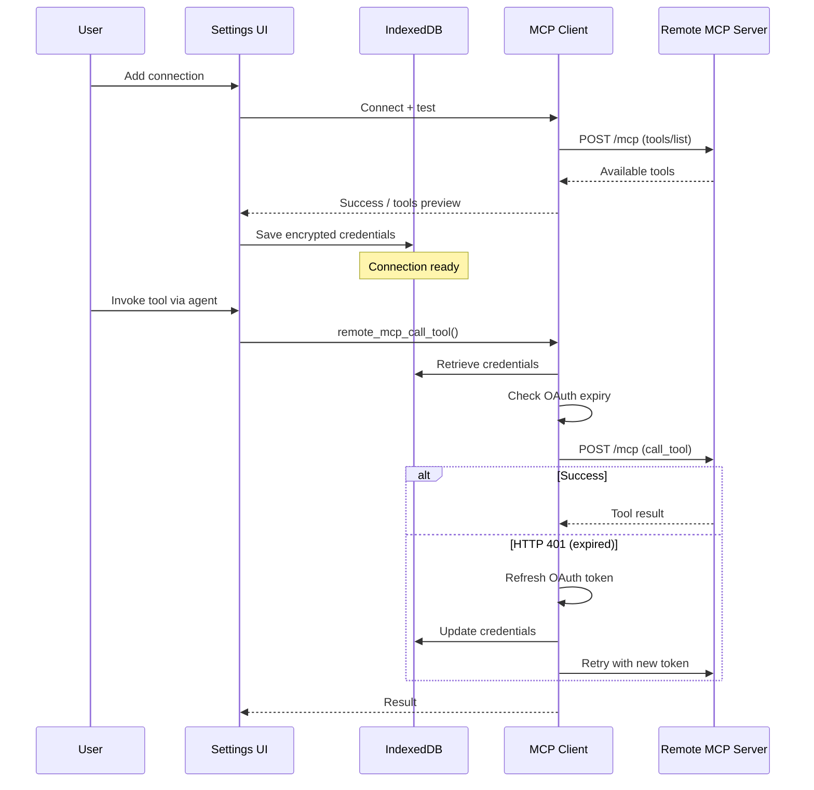

# Remote MCP Integration

> Remote Model Context Protocol (MCP) servers enable agents to discover and execute tools from external services without bundling them into the core application.

**Source:** `src/mcp-connections.ts` · `src/remote-mcp-client.ts` · Settings → Remote MCP

## Overview

ShadowClaw integrates with external MCP servers using:

- **Streamable HTTP transports** for browser-based communication
- **Session-based JSON-RPC exchanges** for stateful interactions
- **Automatic tool registration** — discovered tools appear in the agent's available toolset
- **Multiple authentication schemes** — Bearer, Basic, and custom headers via the credential store

When configured, Remote MCP tools are registered alongside built-in tools, allowing the agent to invoke them with `remote_mcp_call_tool`.

## Configuration

### Settings UI

Remote MCP connections are configured in **Settings → Remote MCP**:

1. **Add Connection**: Provide connection name, base URL, and authentication method.
2. **Choose Auth**: Bearer token, Basic credentials, or custom header.
3. **Test Connection**: Verify the connection works before saving.
4. **Save**: Connection is persisted to IndexedDB (encrypted like API keys).

### Credentials Storage

Connections use the credential store (same vault as API keys):

- Credentials are **AES-256-GCM encrypted** at rest in IndexedDB
- Retrieved on-demand when invoking remote tools
- OAuth-backed connections are auto-refreshed before use
- Expired or invalid subscriptions are cleaned up on HTTP 401/410 responses

## Transport & Protocol

### Supported Transports

| Transport | How it works                                | Use case                    |
| --------- | ------------------------------------------- | --------------------------- |
| `stdio`   | Subprocess execution via `bash` tool        | Local CLI-based MCP servers |
| `sse`     | Native browser `fetch()` with SSE streaming | HTTP-accessible MCP servers |

### JSON-RPC Flow

```
Client Request:
→ POST /mcp
→ Content-Type: application/json
→ { "jsonrpc": "2.0", "method": "tools/list", "id": "..." }

Server Response:
← { "jsonrpc": "2.0", "result": { "tools": [...] }, "id": "..." }
```

### Tool Discovery

When a connection is established, ShadowClaw automatically calls `tools/list` to discover available tools:

```json
{
  "name": "example_tool",
  "description": "Does something useful",
  "inputSchema": {
    "type": "object",
    "properties": { "param1": { "type": "string" } },
    "required": ["param1"]
  }
}
```

Discovered tools are registered with the agent's tool registry and appear in `remote_mcp_list_tools` results.

## Agent Integration

### `remote_mcp_list_tools`

Lists all tools from all connected Remote MCP servers.

**Usage:**

```
remote_mcp_list_tools(connection_id_or_name?)
```

**Returns:**

```json
{
  "tools": [
    {
      "connection": "my-server",
      "name": "example_tool",
      "description": "Does something useful"
    }
  ]
}
```

### `remote_mcp_call_tool`

Invokes a specific tool on a Remote MCP server.

**Usage:**

```
remote_mcp_call_tool(connection_id_or_label, tool_name, arguments)
```

**Example:**

```
remote_mcp_call_tool("weather-api", "get_forecast", { "location": "NYC" })
```

**Returns:**

```json
{
  "result": { ... },
  "connection": "weather-api"
}
```

## Authentication Schemes

### Bearer Token

**In Settings:**

```
Auth Method: Bearer
Token: your-token-here
```

**Sent as:**

```
Authorization: Bearer your-token-here
```

### Basic Auth

**In Settings:**

```
Auth Method: Basic
Username: user
Password: pass
```

**Sent as:**

```
Authorization: Basic dXNlcjpwYXNz
```

### Custom Header

**In Settings:**

```
Auth Method: Custom Header
Header Name: X-API-Key
Header Value: my-secret-key
```

**Sent as:**

```
X-API-Key: my-secret-key
```

## OAuth & Re-authorization

Remote MCP connections support OAuth-based authentication with both silent and interactive re-authorization flows:

- **Silent Refresh**: Credentials are automatically refreshed using stored refresh tokens when an HTTP 401 response is received.
- **Interactive Re-authorization**: When silent refresh fails or is not supported, the orchestrator triggers an interactive re-auth flow:
  - **Auto-reconnect**: If enabled in connection settings, the app automatically attempts to open the OAuth popup.
  - **Manual Fallback**: If auto-reconnect is disabled or the popup is blocked by the browser, a toast notification surfaces a "Reconnect Now" action.
  - **Popup Detection**: The system detects blocked popups and alerts the user to click the action button manually to ensure a valid user gesture.
- **Cleanup**: Persistent 401/410 (Gone) responses that cannot be resolved via re-auth will eventually mark the connection as offline.
- **Deduplication**: Multiple simultaneous 401s for the same connection are coalesced into a single re-auth request to avoid UI spam.

## Connection Lifecycle



## Connection Naming & References

Connections can be referenced in tools by either:

- **Connection ID** (UUID) — unique, machine-generated
- **Human-readable label** — easier to use, user-assigned

**Example:**

```
# By label
remote_mcp_call_tool("my-weather-service", "forecast", {...})

# By ID
remote_mcp_call_tool("550e8400-e29b-41d4-a716-446655440000", "forecast", {...})
```

## Connection Status & Diagnostics

The Settings panel shows:

- **Connection status**: Online, offline, last verified
- **Tool count**: Number of tools discovered
- **Last error**: If a connection failed, shows the error message
- **Credentials**: Whether auth is configured (not shown in plaintext)

## Adding a Remote MCP Server

There is currently no dedicated "add remote MCP" guide.

For setup and integration:

- Use this document for transport/auth/tooling architecture and troubleshooting.
- Configure connections from **Settings → Remote MCP** in the app.
- If you are implementing credential flows, see [Accounts & Credentials](accounts.md).

## Troubleshooting

### Connection fails with "Network error"

- Verify the server URL is accessible from your browser
- Check CORS headers — server must allow requests from ShadowClaw origin
- For local servers, ensure they're running on the expected port

### Tools don't appear after connecting

- Check the Settings panel for connection status
- Verify the server responds to `tools/list` with valid MCP format
- Try re-adding the connection with the test feature

### "Unauthorized" errors on tool invocation

- Check if credentials are expired (especially OAuth tokens)
- Verify Bearer token or Basic auth credentials in Settings
- For OAuth, ensure refresh token is stored and hasn't revoked

### Server is slow or unresponsive

- Remote MCP calls are subject to browser request timeouts (typically 30-60 seconds)
- Optimize tool execution on the server side or add connection-level caching
- Consider `stdio` transport for local servers (faster than HTTP)
