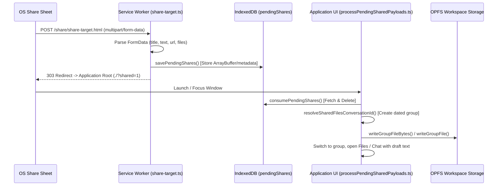

# Web Share Target

> Seamless OS-level share sheet integration receiving files, URLs, and text directly into ShadowClaw conversations and workspace storage.

**Source:** `manifest.json` · `src/service-worker/share-target.ts` · `src/share-target/pending-shares.ts` · `src/components/shadow-claw/utils/processPendingSharedPayloads.ts`

---

## Overview

ShadowClaw implements the **W3C Web Share Target API**, allowing installed Progressive Web Apps (on Android, ChromeOS, macOS, and Windows) to act as a system share target. When users share text, URLs, or files from another application (such as a web browser, file manager, or camera), ShadowClaw captures the incoming payload, saves the content into the conversation's OPFS workspace, and opens an isolated conversation ready for AI interaction.

---

## Architecture & Data Flow



---

## Configuration & Manifest Declaration

The share target capability is registered declaratively in [`manifest.json`](../../manifest.json):

```json
{
  "share_target": {
    "action": "share/share-target.html",
    "method": "POST",
    "enctype": "multipart/form-data",
    "params": {
      "title": "title",
      "text": "text",
      "url": "url",
      "files": [
        {
          "name": "file",
          "accept": [
            "*/*",
            "application/*",
            "text/*",
            "image/*",
            "audio/*",
            "video/*",
            "application/octet-stream"
          ]
        }
      ]
    }
  }
}
```

---

## Service Worker Handling (`src/service-worker/share-target.ts`)

When an external app shares data, the browser dispatches a `fetch` event targeting `share/share-target.html`:

1. **Request Interception**: `isShareTargetRequest(event.request)` identifies matching POST requests.
2. **Form Data Extraction**: The Service Worker reads `event.request.formData()`, extracting `title`, `text`, `url`, and any attached `File` entries.
3. **ArrayBuffer Conversion**: Binary file streams are buffered into `ArrayBuffer` instances to safely cross into persistent storage.
4. **Transient Storage in IndexedDB**: Records are stored in the `pendingShares` object store under the `shadowclaw` database:
   ```ts
   interface PendingShareRecord {
     id: string;
     createdAt: number;
     title: string;
     text: string;
     url: string;
     fileName: string;
     fileType: string;
     fileBytes: ArrayBuffer | null;
   }
   ```
5. **Redirect**: Responds with an HTTP 303 redirect to the application root (`/?shared=1`), prompting the browser to focus or launch the UI window.

---

## Ingestion & Workspace Persistence

Once the main application window loads:

1. **Consumption (`consumePendingShares`)**: The UI queries the `pendingShares` object store, retrieves all pending records, and clears them in a single transaction to prevent duplicate processing across reloads.
2. **Conversation Resolution**: `resolveSharedFilesConversationId()` creates or locates a dedicated conversation group (e.g. `br:shared-YYYY-MM-DD`) with an isolated workspace.
3. **Workspace File Writing**:
   - Files are sanitized via `sanitizeSharedFileName()`.
   - Binary files are written directly into OPFS storage via `writeGroupFileBytes()`.
   - Text/URL content is written as Markdown/text documents via `writeGroupFile()`.
4. **UI Navigation**: The application activates the target conversation, adds the imported files to the Files list, and updates the Chat input with shared text or file references.
