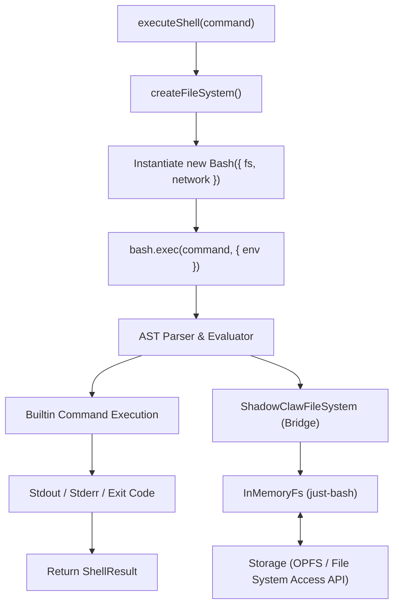

# Shell Subsystem

> A sandboxed POSIX-compliant shell environment powered by `just-bash`,
> providing an AST-based interpreter and over 100 Unix-style commands.

**Source:** `src/shell/shell.ts` · `src/shell/fs.ts`

## Architecture



## Entry Point

`executeShell` is the primary entry point for running shell commands against the workspace:

```ts
export async function executeShell(
  db: ShadowClawDatabase,
  command: string,
  groupId: string,
  env: Record<string, string> = {},
  timeoutSec = 30,
): Promise<ShellResult> {
  const fs = await createFileSystem(db, groupId);
  const bash = new Bash({
    fs,
    network: { dangerouslyAllowFullInternetAccess: true },
  });

  const result = await bash.exec(command, {
    env: { HOME: "/home/user", PATH: "/usr/bin", PWD: "/home/user", ...env },
  });

  return {
    stdout: result.stdout || "",
    stderr: result.stderr || "",
    exitCode: result.exitCode ?? 0,
  };
}
```

## Virtual Filesystem Bridge

ShadowClaw uses a custom `ShadowClawFileSystem` (`src/shell/fs.ts`) that extends `just-bash`'s `InMemoryFs`. This bridge ensures modifications to the virtual filesystem are synchronized back to persistent OPFS storage.

- **Read strategy:** On initialization, `createFileSystem` traverses the workspace and prepares file handles. Files are loaded into memory lazily when first accessed.
- **Write strategy:** Mutating methods like `writeFile`, `appendFile`, `mkdir`, `rm`, `cp`, and `mv` are hooked. Whenever a file is modified in memory, or a directory is created, the bridge flushes the change to the storage backend.

### Directory persistence (`mkdir`)

`ShadowClawFileSystem.mkdir()` mirrors `just-bash` directory creation into workspace storage when the target path resolves under `/home/user`. This keeps JS-shell-created folders visible in the Files page without requiring a separate sync step.

## Supported Commands

`just-bash` implements over 100 Unix-style commands, including:

- **File operations:** `cat`, `cp`, `ls`, `mkdir`, `mv`, `rm`, `rmdir`, `touch`, `tree`, `basename`, `dirname`, `stat`, `chmod`, `du`, `pwd`
- **Text processing:** `awk`, `column`, `comm`, `cut`, `diff`, `expand`, `fold`, `grep` (inc. `egrep`, `fgrep`), `head`, `join`, `md5sum`, `nl`, `od`, `paste`, `printf`, `rev`, `rg` (ripgrep), `sed`, `sort`, `strings`, `tac`, `tail`, `tr`, `uniq`, `wc`, `xargs`
- **Data & runtime:** `jq` (JSON), `sqlite3`, `yq` (YAML/XML), `js-exec` (JavaScript runtime)

## Key Capabilities

### Pipes and redirection

Supports standard POSIX piping (`|`) and redirection (`>`, `>>`, `2>&1`).

### Environment variables

Supports variable expansion (`$VAR`, `${VAR}`) and environment management via `export` and `env`.

### Recursive search

`rg` (ripgrep) is available for high-performance recursive text searching within the workspace.

### Operators

`|` `>` `>>` `&&` `||` `;` `\n` `$()` `` ` ` `` `$VAR` `"interpolation"` `# comments`

Real AST POSIX parsing with loops (`for`, `while`), string manipulations, and conditional statements.

## What Does NOT Work

| Feature             | Alternative                                      |
| ------------------- | ------------------------------------------------ |
| `curl`, `wget`      | `fetch_url` tool                                 |
| `apt`, `npm`, `pip` | No package management                            |
| `git` commands      | `git_*` tools                                    |
| `find -exec`        | Use `find ... \| xargs` or the `javascript` tool |
| Background jobs `&` | Not implemented                                  |
| Direct host access  | Strictly sandboxed to the virtual FS             |

## Timeout

Commands are constrained by `timeoutSec` (default 30 seconds). For long-running operations via WebVM, the `VM_BASH_TIMEOUT_SEC` config key controls the timeout (default 900s / 15 minutes).

## Adding a Shell Command

See the [Adding a Shell Command](../guides/adding-a-shell-command.md) guide.
