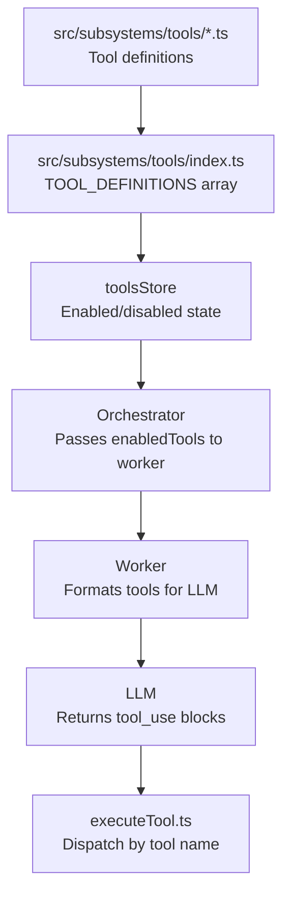

# Tools & Profiles

> Modular tool definitions giving the agent capabilities, with profiles for per-provider/model customization.

**Source:** `src/subsystems/tools/` · `src/worker/executeTool.ts` · `src/stores/tools.ts`

## Tool Architecture



## Tool Definition Format

Each tool is defined as a typed JSON schema object:

```ts
// src/subsystems/tools/types.ts
export interface ToolDefinition {
  name: string; // Unique tool name (snake_case)
  description: string; // LLM-facing description
  input_schema: object; // JSON Schema for parameters
}
```

## Tool Files

Tool definitions live in modular files under `src/subsystems/tools/` and are assembled in `src/subsystems/tools/index.ts`:

| File               | Tools                                                                                                                                                                                                                                                                                                                                                  |
| ------------------ | ------------------------------------------------------------------------------------------------------------------------------------------------------------------------------------------------------------------------------------------------------------------------------------------------------------------------------------------------------ |
| `files.ts`         | `read_file`, `write_file`, `patch_file`, `list_files`, `open_file`, `attach_file_to_chat`, `send_file`, `search_files`, `diff_files`                                                                                                                                                                                                                   |
| `bash.ts`          | `bash`                                                                                                                                                                                                                                                                                                                                                 |
| `javascript.ts`    | `javascript`                                                                                                                                                                                                                                                                                                                                           |
| `fetch.ts`         | `fetch_url`, `fetch_file`, `web_search`                                                                                                                                                                                                                                                                                                                |
| `memory.ts`        | `update_memory`                                                                                                                                                                                                                                                                                                                                        |
| `tasks.ts`         | `create_task`, `list_tasks`, `update_task`, `delete_task`, `enable_task`, `disable_task`, `run_task`                                                                                                                                                                                                                                                   |
| `chat.ts`          | `clear_chat`, `ask_user`                                                                                                                                                                                                                                                                                                                               |
| `notifications.ts` | `show_toast`, `send_notification`                                                                                                                                                                                                                                                                                                                      |
| `time.ts`          | `get_current_time`                                                                                                                                                                                                                                                                                                                                     |
| `git.ts`           | `git_clone`, `git_init`, `git_checkout`, `git_branch`, `git_delete_branch`, `git_branches`, `git_status`, `git_add`, `git_unstage`, `git_log`, `git_diff`, `git_show`, `git_read_file_at_ref`, `git_commit`, `git_fetch`, `git_pull`, `git_push`, `git_merge`, `git_reset`, `git_tag`, `git_remote`, `git_config`, `git_list_repos`, `git_delete_repo` |
| `subagent.ts`      | `spawn_subagent`                                                                                                                                                                                                                                                                                                                                       |
| `manage_tools.ts`  | `manage_tools`, `list_tool_profiles`                                                                                                                                                                                                                                                                                                                   |
| `mcp.ts`           | `remote_mcp_list_tools`, `remote_mcp_call_tool`                                                                                                                                                                                                                                                                                                        |
| `email.ts`         | `manage_email`, `email_read_messages`, `email_send_message`                                                                                                                                                                                                                                                                                            |
| `rooms.ts`         | `create_room`, `invite_to_room`, `leave_room`, `list_room_members`                                                                                                                                                                                                                                                                                     |
| `a2ui.ts`          | `list_components`, `render_component`                                                                                                                                                                                                                                                                                                                  |

All are re-exported from `src/subsystems/tools/index.ts` as the `TOOL_DEFINITIONS` array.

## Agent-Driven Tool Management

ShadowClaw allows agents to dynamically manage their own toolset via the `manage_tools` tool. This is particularly useful for optimizing the context window or focusing the agent on specific capabilities.

### `manage_tools`

- **Action: `enable` / `disable`**: Toggle specific tools by name.
- **Action: `activate_profile`**: Switch to a predefined set of tools.
- Changes are applied on the **next** turn after the orchestrator syncs updated tool state back to the worker.

### `list_tool_profiles`

- Returns the available profile IDs, names, and enabled tool lists so the agent can pick a profile before calling `manage_tools`.

### Tool Profiles

Predefined sets of tools optimized for specific use cases.

- **`git-ops`**: Optimized for repository management.
- **`minimal`**: Only essential file and shell tools.
- **`full`**: All available tools enabled.
- **`__builtin_nano`**: Specialized profile for Gemini Nano (`prompt_api`) that minimizes context consumption.

### Auto-Activation

Saved profiles can specify a `providerId`. When the orchestrator switches to a model from that provider, the associated profile is automatically activated. For example, selecting Gemini Nano automatically triggers the Nano Optimized profile.

## Tool Execution Dispatch

`executeTool(db, name, input, groupId, options)` in `src/worker/executeTool.ts` is the single dispatcher. It:

1. Checks recursion guard (scheduled task restrictions)
2. Switches on tool `name`
3. Calls the appropriate handler
4. Returns result as string or JSON

### File tools

- **`read_file`** — Supports single `path` or `paths` array for batch reads (parallel `Promise.all`)
- **`write_file`** — Creates intermediate directories automatically
- **`patch_file`** — In-place string replacement (safer than sed for targeted edits)
- **`list_files`** — Returns directory listing with `/` suffix for directories
- **`open_file`** — Posts `open-file` message to main thread for UI viewer
- **`send_file`** — Transfers a workspace file to the current peer over PeerJS WebRTC; only works in `peer:` conversations
- **`search_files`** — Recursively searches file content for a literal string or regex across the workspace, with optional `path` and `file_glob` filters; returns `file:line: content` matches (capped at 500)
- **`diff_files`** — Compares two workspace files line-by-line and returns a `- [Line N]` / `+ [Line N]` diff (capped at 100 differences)

### Execution tools

- **`bash`** — Prefers WebVM, falls back to JS shell (see [WebVM](vm.md) and [Shell](shell.md))
- **`javascript`** — Sandboxed strict-mode via `sandboxedEval()` (`src/worker/sandboxedEval.ts`). Code **must use `return`** to produce output. No DOM, `eval`, or `Function`. Network `fetch` is enabled/disabled by the shared Tool Configuration -> Internet Access toggle.

### Web tools

- **`fetch_url`** — HTTP requests with:
  - Git auth injection (`use_git_auth: true`)
  - 3-attempt retry with exponential backoff (via `withRetry()`)
  - HTML stripping (auto-detects `text/html`)
  - Response truncation (max 100KB)
  - Git host login page detection
  - Response headers are captured and returned
- **`fetch_file`** — Fetches a URL and saves the body directly to the workspace in one atomic step; supports the same auth options as `fetch_url`; binary content (images, PDFs, audio, video) is saved as raw bytes
- **`web_search`** — Performs a DuckDuckGo HTML search via the configured CORS proxy and returns the top 10 results (title, URL, snippet) as plain text

### Agentic tools

- **`get_current_time`** — Returns the current time as an ISO 8601 string (UTC) or formatted for an IANA `timezone` (e.g. `America/New_York`) via `Intl.DateTimeFormat`; use this instead of relying on `bash`
- **`ask_user`** — Halts the agent and sends an `ask-user` postMessage to the UI, where the user answers (optionally choosing from predefined `options`). The worker blocks until the main thread sends back an `ask-user-response` message that resolves the pending promise via `globalThis.pendingAskUserResolvers`
- **`spawn_subagent`** — Delegates a task to a parallel, isolated agent invocation; subject to `SUBAGENT_MAX_PARALLEL` concurrency limit

### Git tools

All git tools use lazy `import()` to load `src/subsystems/git/git.ts` only when needed. See [Git Integration](git.md) for details.

### Recursion guard

When `isScheduledTask === true`, these tools are blocked:

- `create_task`, `update_task`, `delete_task`, `enable_task`, `disable_task`
- `send_notification`
- `create_room`, `invite_to_room`, `leave_room`

This prevents scheduled tasks from creating cascading tasks or infinite push notification loops.

## Tool Profiles

Profiles allow per-provider/model tool customization and system prompt overrides.

### Profile definition

```ts
// From src/types.ts
interface ToolProfile {
  id: string; // Unique identifier
  name: string; // Display name
  enabledToolNames: string[]; // Which tools the LLM sees
  customTools?: ToolDefinition[]; // Modified tool definitions
  systemPromptOverride?: string; // Optional prompt replacement
}
```

Managed via `CONFIG_KEYS.TOOL_PROFILES` and `CONFIG_KEYS.ACTIVE_TOOL_PROFILE`.

### Built-in profile

`NANO_BUILTIN_PROFILE` — optimized for Gemini Nano (small model):

- Constrained tool set (safe subset for small models)
- Auto-activated when Prompt API provider is selected

### Manual selection vs profiles

When a user manually toggles individual tools:

- The active profile is **automatically deactivated**
- Manual selection takes precedence
- User can re-activate a profile from dropdown
- User can save current selection as a new profile

### WebMCP integration

When the browser WebMCP API is available (`document.modelContext`, with `navigator.modelContext` fallback), tools are also registered via `src/subsystems/mcp/webmcp.ts` so browser-side model contexts can invoke the same tool surface through `registerWebMcpTools()`.

ShadowClaw registers tools with explicit annotations for current WebMCP implementations:

- `readOnlyHint: false`
- `untrustedContentHint: true` (tool output may contain untrusted/user or external data)

Tool registration is managed with `AbortController` signals passed to `registerTool(...)`, and shutdown aborts those signals while also attempting legacy `unregisterTool` when available.

To test the WebMCP integration in Google Chrome, you can use the [Model Context Tool Inspector](https://chromewebstore.google.com/detail/model-context-tool-inspec/gbpdfapgefenggkahomfgkhfehlcenpd) extension.

## Adding a New Tool

See the [Adding a Tool](../guides/adding-a-tool.md) guide.
