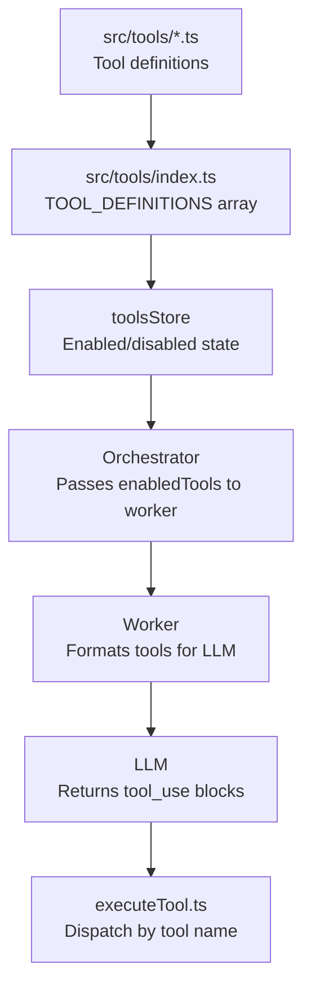

# Tools & Profiles

> Modular tool definitions giving the agent capabilities, with profiles for per-provider/model customization.

**Source:** `src/tools/` · `src/worker/executeTool.ts` · `src/stores/tools.ts`

## Tool Architecture



## Tool Definition Format

Each tool is defined as a typed JSON schema object:

```ts
// src/tools/types.ts
export interface ToolDefinition {
  name: string; // Unique tool name (snake_case)
  description: string; // LLM-facing description
  input_schema: object; // JSON Schema for parameters
}
```

## Tool Files

Tool definitions live in modular files under `src/tools/` and are assembled in `src/tools/index.ts`:

| File               | Tools                                                                                                                                                                                                                      |
| ------------------ | -------------------------------------------------------------------------------------------------------------------------------------------------------------------------------------------------------------------------- |
| `files.ts`         | `read_file`, `write_file`, `patch_file`, `list_files`, `open_file`, `attach_file_to_chat`                                                                                                                                  |
| `bash.ts`          | `bash`                                                                                                                                                                                                                     |
| `javascript.ts`    | `javascript`                                                                                                                                                                                                               |
| `fetch.ts`         | `fetch_url`                                                                                                                                                                                                                |
| `memory.ts`        | `update_memory`                                                                                                                                                                                                            |
| `tasks.ts`         | `create_task`, `list_tasks`, `update_task`, `delete_task`, `enable_task`, `disable_task`                                                                                                                                   |
| `chat.ts`          | `clear_chat`                                                                                                                                                                                                               |
| `notifications.ts` | `show_toast`, `send_notification`                                                                                                                                                                                          |
| `git.ts`           | `git_clone`, `git_sync`, `git_checkout`, `git_branch`, `git_status`, `git_add`, `git_log`, `git_diff`, `git_branches`, `git_list_repos`, `git_delete_repo`, `git_commit`, `git_pull`, `git_push`, `git_merge`, `git_reset` |
| `mcp.ts`           | `remote_mcp_list_tools`, `remote_mcp_call_tool`                                                                                                                                                                            |

All are re-exported from `src/tools/index.ts` as the `TOOL_DEFINITIONS` array.

## Tool Execution

`executeTool(db, name, input, groupId, options)` in `src/worker/executeTool.ts` is the single dispatcher. It:

1. Checks recursion guard (scheduled task restrictions)
2. Switches on tool `name`
3. Calls the appropriate handler
4. Returns result as string or JSON

### File tools

- **`read_file`** — Supports single `path` or `paths` array for batch reads (parallel `Promise.all`)
- **`write_file`** — Creates intermediate directories automatically
- **`patch_file`** — In-place string replacement (safer than sed for targeted edits)
- **`list_files`** — Returns directory listing with `/` suffix for directories
- **`open_file`** — Posts `open-file` message to main thread for UI viewer

### Execution tools

- **`bash`** — Prefers WebVM, falls back to JS shell (see [WebVM](vm.md) and [Shell](shell.md))
- **`javascript`** — Sandboxed strict-mode via `sandboxedEval()` (`src/worker/sandboxedEval.ts`). Code **must use `return`** to produce output. No DOM, network, `eval`, or `Function`.

### Web tools

- **`fetch_url`** — HTTP requests with:
  - Git auth injection (`use_git_auth: true`)
  - 3-attempt retry with exponential backoff (via `withRetry()`)
  - HTML stripping (auto-detects `text/html`)
  - Response truncation (max 100KB)
  - Git host login page detection
  - Response headers are captured and returned

### Git tools

All git tools use lazy `import()` to load `src/git/git.ts` only when needed. See [Git Integration](git.md) for details.

### Recursion guard

When `isScheduledTask === true`, these tools are blocked:

- `create_task`, `update_task`, `delete_task`, `enable_task`, `disable_task`
- `send_notification`

This prevents scheduled tasks from creating cascading tasks or infinite push notification loops.

## Tool Profiles

Profiles allow per-provider/model tool customization and system prompt overrides.

### Profile definition

```ts
// From src/types.ts
interface ToolProfile {
  id: string; // Unique identifier
  name: string; // Display name
  enabledToolNames: string[]; // Which tools the LLM sees
  customTools?: ToolDefinition[]; // Modified tool definitions
  systemPromptOverride?: string; // Optional prompt replacement
}
```

Managed via `CONFIG_KEYS.TOOL_PROFILES` and `CONFIG_KEYS.ACTIVE_TOOL_PROFILE`.

### Built-in profile

`NANO_BUILTIN_PROFILE` — optimized for Gemini Nano (small model):

- Constrained tool set (safe subset for small models)
- Auto-activated when Prompt API provider is selected

### Manual selection vs profiles

When a user manually toggles individual tools:

- The active profile is **automatically deactivated**
- Manual selection takes precedence
- User can re-activate a profile from dropdown
- User can save current selection as a new profile

### WebMCP integration

When the browser WebMCP API is available (`navigator.modelContext`), tools are also registered via `src/webmcp.ts` so browser-side model contexts can invoke the same tool surface through `registerWebMcpTools()`.

ShadowClaw registers tools with explicit annotations for current WebMCP implementations:

- `readOnlyHint: false`
- `untrustedContentHint: true` (tool output may contain untrusted/user or external data)

Tool registration is managed with `AbortController` signals passed to `registerTool(...)`, and shutdown aborts those signals while also attempting legacy `unregisterTool` when available.

To test the WebMCP integration in Google Chrome, you can use the [Model Context Tool Inspector](https://chromewebstore.google.com/detail/model-context-tool-inspec/gbpdfapgefenggkahomfgkhfehlcenpd) extension.

## Adding a New Tool

See the [Adding a Tool](../guides/adding-a-tool.md) guide.
