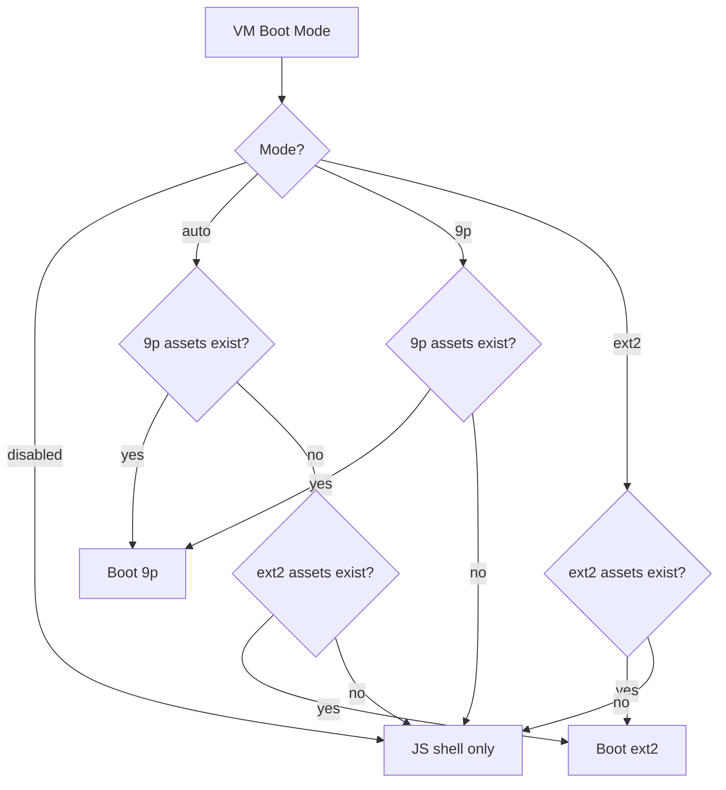
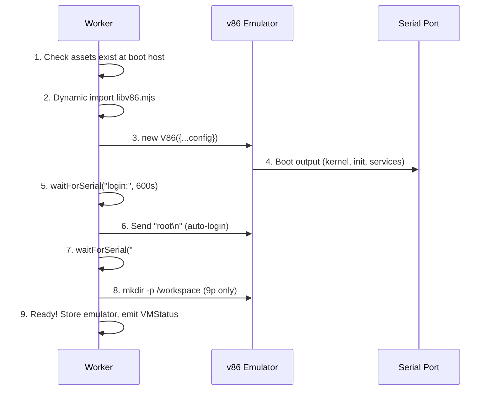
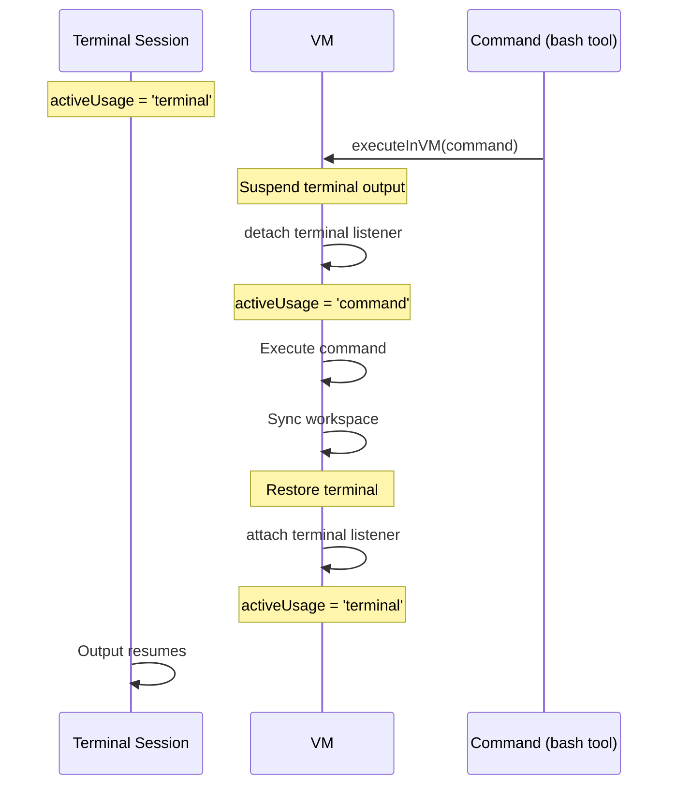

# WebVM

> An optional v86-based Alpine Linux VM running in the Web Worker, providing a real
> bash environment when the just-bash JS shell emulator isn't sufficient.

**Source:** `src/vm.ts`

## Boot Modes



### ext2 Mode

Full filesystem image on disk. Requires 7 asset files served from `${bootHost}/assets/v86.ext2/`:

| File                 | Description                  |
| -------------------- | ---------------------------- |
| `alpine-rootfs.ext2` | Alpine Linux root filesystem |
| `bzImage`            | Linux kernel                 |
| `initrd`             | Initial RAM disk             |
| `v86.wasm`           | v86 WebAssembly binary       |
| `libv86.mjs`         | v86 JavaScript glue          |
| `seabios.bin`        | BIOS firmware                |
| `vgabios.bin`        | VGA BIOS firmware            |

### 9p Mode

Flat manifest + virtio filesystem bridge. Lighter-weight, faster iteration during development. Uses a JSON manifest (`alpine-fs.json`) and flat directory of root filesystem files.

Assets served from `${bootHost}/assets/v86.9pfs/`.

**Auto mode** prefers 9p if available, falls back to ext2.

## Boot Lifecycle



## Exclusivity Guard

The VM coordinates access between interactive terminal sessions and `bash` tool execution via an `activeUsage` lock:

```text
activeUsage: 'command' | 'terminal' | null
```

### Command execution during terminal session



### Lock states

| Current `activeUsage` | Tool `bash` call                    | Terminal `open`        |
| --------------------- | ----------------------------------- | ---------------------- |
| `null`                | Execute normally                    | Open normally          |
| `'command'`           | Error: "VM busy"                    | Error: "VM busy"       |
| `'terminal'`          | Suspend terminal → execute → resume | Reuse existing session |

## Terminal Bridge

Interactive terminal sessions connect the UI terminal component to the VM's serial port.

### Creating a session

```ts
createTerminalSession(onOutput: (chunk: string) => void) → { close() }
```

1. Check no conflicting `activeUsage`
2. Replay `pendingBootTranscript` (shows boot output on attach)
3. Set `activeUsage = 'terminal'`
4. Attach serial output listener → calls `onOutput(chunk)` per byte

### Sending input

```ts
sendTerminalInput(data: string): void
```

Writes stdin bytes to the VM's serial port.

### Closing

```ts
closeTerminalSession(): void
```

Detach listener, set `activeUsage = null`, flush workspace back to host.

## 9p Workspace Sync

In 9p mode, the VM's `/workspace` directory is a virtio mount point. Sync operations bridge files between the OPFS workspace and the VM filesystem:

| Direction | Operation                                 | Worker Message       |
| --------- | ----------------------------------------- | -------------------- |
| Host → VM | Push OPFS files into VM `/workspace`      | `vm-workspace-sync`  |
| VM → Host | Pull VM `/workspace` changes back to OPFS | `vm-workspace-flush` |

**Auto-sync:** Terminal-driven 9p auto-sync only flushes when workspace-affecting commands complete (detected by tracking terminal output for command prompts). Idle background write events are ignored.

The Files page exposes manual sync controls when VM mode is `9p`:

- **Host → VM** button: requests `vm-workspace-sync`
- **VM → Host** button: requests `vm-workspace-flush`

## Configuration

| Config Key             | Default                       | Range                            | Purpose                   |
| ---------------------- | ----------------------------- | -------------------------------- | ------------------------- |
| `VM_BOOT_MODE`         | `"disabled"`                  | `disabled`, `auto`, `9p`, `ext2` | Boot mode selection       |
| `VM_BOOT_HOST`         | `"http://localhost:8888"`     | URL                              | Asset server root         |
| `VM_BASH_TIMEOUT_SEC`  | `900` (15 min)                | 1–1800                           | Command execution timeout |
| `VM_NETWORK_RELAY_URL` | `"wss://relay.widgetry.org/"` | WebSocket URL                    | VM network relay          |

## Eager Boot

`src/worker/worker.ts` eagerly boots the VM on startup using persisted preferences. This means the VM is ready by the time the user sends their first bash command. Boot failures are logged but don't block the worker message loop.

## Fallback to JS Shell

When the VM is unavailable (disabled, failed to boot, busy), the `bash` tool falls back to the just-bash shell evaluation engine. A warning toast is shown to the user. The next command attempt will try the VM again.
