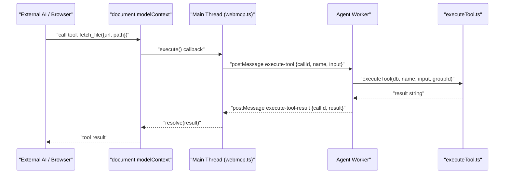

# WebMCP Integration

> Browser's Model Context Protocol integration and tool execution.

**Source:** `src/subsystems/mcp/webmcp.ts`

## Overview

WebMCP allows the agent to execute tools registered through the browser's Model Context
Protocol. It bridges the gap between the isolated worker environment and the main thread
`document.modelContext`.

ShadowClaw registers its full built-in tool surface with the browser's ModelContext API,
making every tool — `bash`, `fetch_file`, `read_file`, `write_file`, git tools, and more —
callable by any external AI model that has access to the page's model context.

For details on remote MCP servers (the inverse direction: agent calling external MCP
servers), see [Remote MCP](remote-mcp.md).

---

## Modes

WebMCP operates in one of two modes, controlled by `setWebMcpMode()`:

| Mode                   | API surface                                                                      | Notes                                                                            |
| ---------------------- | -------------------------------------------------------------------------------- | -------------------------------------------------------------------------------- |
| `"polyfill"` (default) | `@mcp-b/webmcp-polyfill` — surfaces `document.modelContext`                      | Works in all browsers. Safe.                                                     |
| `"native"`             | Chrome's native `document.modelContext` (with `navigator.modelContext` fallback) | Requires `chrome://flags/#enable-webmcp-testing`. May crash early Canary builds. |

> **`navigator.modelContext` deprecation:** Chrome deprecated `navigator.modelContext` in Chrome 150 and removed it in Chrome 152.0.7943.0. Feature detection follows Chrome's recommended compat pattern: `document.modelContext || navigator.modelContext`. The fallback is retained in ShadowClaw for clients on older Canary builds.

The active mode is readable via `getWebMcpMode()`.

---

## Architecture


```mermaid
sequenceDiagram
  participant Browser as "External AI / Browser"
  participant MC as "document.modelContext"
  participant Main as "Main Thread (webmcp.ts)"
  participant Worker as "Agent Worker"
  participant Exec as "executeTool.ts"

  Browser->>MC: "call tool: fetch_file({url, path})"
  MC->>Main: "execute() callback"
  Main->>Worker: "postMessage execute-tool {callId, name, input}"
  Worker->>Exec: "executeTool(db, name, input, groupId)"
  Exec-->>Worker: "result string"
  Worker-->>Main: "postMessage execute-tool-result {callId, result}"
  Main-->>MC: "resolve(result)"
  MC-->>Browser: "tool result"
```

When `registerWebMcpTools()` is called, each tool in `TOOL_DEFINITIONS` is registered with
the ModelContext API. The `execute` handler for each tool:

1. Generates a unique `callId` (timestamp + random suffix)
2. Posts an `execute-tool` message to the agent worker
3. Awaits an `execute-tool-result` message matching that `callId`
4. Resolves or rejects the promise accordingly

The timeout per tool call is **10 minutes** (600,000 ms).

---

## API

### `isWebMcpSupported(): boolean`

Feature-detects whether the ModelContext API is available. Use this before attempting
registration.

```ts
import { isWebMcpSupported } from "./webmcp.js";

if (isWebMcpSupported()) {
  await registerWebMcpTools(agentWorker, emit, groupId);
}
```

To test WebMCP tool registration in Chrome, use the
[Model Context Tool Inspector](https://chromewebstore.google.com/detail/model-context-tool-inspec/gbpdfapgefenggkahomfgkhfehlcenpd)
extension.

### `registerWebMcpTools(agentWorker, emit, groupId?, tools?): Promise<boolean>`

Registers ShadowClaw tools with the ModelContext API.

| Parameter     | Type                | Description                                                                    |
| ------------- | ------------------- | ------------------------------------------------------------------------------ |
| `agentWorker` | `Worker \| null`    | The agent worker instance. Required for tool execution.                        |
| `emit`        | `(message) => void` | Message emitter (currently unused, reserved).                                  |
| `groupId`     | `string`            | Conversation group context for tool execution. Defaults to `DEFAULT_GROUP_ID`. |
| `tools`       | `ToolDefinition[]`  | Optional subset of tools to register. Defaults to all `TOOL_DEFINITIONS`.      |

Returns `true` on success, `false` if the ModelContext API is unavailable.

Registration is **idempotent** — tools already in `registeredToolNames` are skipped on
subsequent calls. The event loop is yielded between each registration to avoid blocking.

Each tool is registered with these annotations:

```ts
annotations: {
  readOnlyHint: false,       // tools may mutate state
  untrustedContentHint: true // outputs may contain untrusted content
}
```

### `parseWebMcpInputSchema(inputSchema: unknown): Record<string, unknown>`

Safely parses and normalizes WebMCP tool input schemas with backwards compatibility for Chrome spec evolution.

- **Chrome 154.0.8014.0+ (PR #241):** `RegisteredTool#inputSchema` is returned as a JavaScript object (a deep copy of the registration schema).
- **Chrome < 154.0.8014.0:** `RegisteredTool#inputSchema` was returned as a stringified JSON schema (`DOMString`).

`parseWebMcpInputSchema` handles both representations gracefully:

- If passed a string, attempts `JSON.parse`.
- If passed an object, returns the object directly.
- On invalid JSON or non-object input, gracefully falls back to `{ type: "object", properties: {} }`.

### `getWebMcpTools(): Promise<NormalizedWebMcpRegisteredTool[]>`

Queries tools registered on `document.modelContext.getTools()` while practicing graceful degradation:

1. Feature-detects `getTools()` on `modelContext`.
2. If `getTools()` is absent (older browser builds or basic polyfills), returns an empty array `[]` without throwing.
3. Normalizes `inputSchema` on every returned tool so callers receive a JavaScript object regardless of Chrome version or polyfill implementation.

### `unregisterWebMcpTools(): void`

Unregisters all previously registered tools.

- **Polyfill mode**: calls `modelContext.unregisterTool(name)` for each tool.
- **Native mode**: aborts the `AbortController` signal for each tool.

Clears both `registeredToolControllers` and `registeredToolNames`.

---

## Tool Surface

All tools in `TOOL_DEFINITIONS` (`src/subsystems/tools/index.ts`) are exposed via WebMCP. This
includes the full built-in set:

| Category      | Tools                                                                                     |
| ------------- | ----------------------------------------------------------------------------------------- |
| Files         | `read_file`, `write_file`, `patch_file`, `list_files`, `open_file`, `attach_file_to_chat` |
| Shell         | `bash`, `javascript`                                                                      |
| Web           | `fetch_url`, `fetch_file`                                                                 |
| Git           | `git_clone`, `git_status`, `git_commit`, `git_push`, `git_pull`, and more                 |
| Tasks         | `create_task`, `list_tasks`, `update_task`, `delete_task`, `enable_task`, `disable_task`  |
| Memory        | `update_memory`                                                                           |
| Notifications | `show_toast`, `send_notification`                                                         |
| Remote MCP    | `remote_mcp_list_tools`, `remote_mcp_call_tool`                                           |
| Email         | `manage_email`, `email_read_messages`, `email_send_message`                               |

---

## Composable Tool Chains

Because WebMCP tools and ShadowClaw's internal `TaskToolCall` surface are identical — both
dispatch through `executeTool(db, name, input, groupId)` — any sequence of tool calls can
be composed into a scheduled `Task` of `type: "tools"`.

### Dynamic LLM Composition vs. Static Task Chains

It's important to differentiate how tool composition happens depending on the context:

1. **Dynamic Real-Time Composition (Agent Loop):** An agent (via the standard `prompt` execution path) can evaluate the situation, call `fetch_file`, read the result into context, decide what to do next, and then call `bash`. The agent uses its temporary context window and the OPFS filesystem to bridge the steps dynamically.
2. **Static Task Chains (Task Scheduler):** A `Task` of `type: "tools"` defines a fixed, pre-determined sequence of tool calls that bypass the LLM entirely. Historically, the OPFS-backed workspace filesystem acted as the shared medium between steps: one tool wrote a file, the next read or transformed it blindly.

Agents can bridge these two paradigms: an agent can dynamically decide to automate a workflow by calling `create_task` with a `type: "tools"` payload, effectively writing a static WebMCP tool-chain program for the system to execute on a schedule.

### Piping Tool Outputs

Rather than using the filesystem (OPFS) as a "middleman" to pass data between sequential steps in a static tool chain, you can chain inputs and outputs directly using **pipe references**.

If a tool's `input` configuration contains a special `{ "$pipe": ... }` object, the task runner resolves this placeholder at runtime using the output of a previous step:

- `{ "$pipe": "prev" }` — Resolves to the raw output of the immediately preceding step.
- `{ "$pipe": <number> }` — Resolves to the raw output of a specific index (0-indexed).
- `{ "$pipe": "<toolName>" }` — Resolves to the raw output of the most recent step that ran a tool with name `<toolName>`.

#### Example — Piping URL contents to a command without using the filesystem:

```json
{
  "type": "tools",
  "tools": [
    {
      "name": "fetch_url",
      "input": {
        "url": "https://example.com"
      }
    },
    {
      "name": "show_toast",
      "input": {
        "message": { "$pipe": "prev" }
      }
    }
  ]
}
```

If a tool returns structured content (such as `ToolResultContentBlock[]`), the resolver automatically extracts the text fields and flattens them into a clean string, ensuring seamless Unix-like stdout-to-stdin compatibility.

#### Example — Piping to a JavaScript sandbox:

```json
{
  "type": "tools",
  "tools": [
    {
      "name": "fetch_url",
      "input": {
        "url": "https://api.github.com/repos/xt-ml/shadow-claw/issues"
      }
    },
    {
      "name": "javascript",
      "input": {
        "code": "const match = $PIPE_DATA.match(/--- BEGIN EXTERNAL CONTENT[\\s\\S]*?---\\n([\\s\\S]*?)\\n--- END EXTERNAL CONTENT ---/); const jsonStr = match ? match[1] : $PIPE_DATA; const issues = JSON.parse(jsonStr); return issues.map(i => `#${i.number}: ${i.title}`).join('\\n');",
        "data": { "$pipe": "prev" }
      }
    }
  ]
}
```

Any input passed to the `data` parameter of the `javascript` tool is injected and made available globally within the sandbox via the `$PIPE_DATA` constant.

**Example — Static tool chain to fetch a page and convert it to Markdown:**

```json
{
  "type": "tools",
  "schedule": "0 9 * * *",
  "tools": [
    {
      "name": "fetch_file",
      "input": {
        "url": "https://example.com",
        "path": "example.com.html",
        "method": "GET"
      }
    },
    {
      "name": "bash",
      "input": {
        "command": "/usr/bin/html-to-markdown /home/user/example.com.html > /home/user/example.com.md",
        "timeout": 0
      },
      "suppressOutput": true
    },
    {
      "name": "bash",
      "input": {
        "command": "/usr/bin/rm /home/user/example.com.html",
        "timeout": 0
      },
      "suppressOutput": true
    }
  ]
}
```

Steps execute **sequentially** in the agent worker. Each step's output is collected and
posted back as a single `response` message (unless `suppressOutput: true`). Errors in
individual steps are caught and reported without aborting the remaining steps.

The agent can create tool-chain tasks directly via `create_task` with `type: "tools"`.

### Recursion guard

Conceptually, since the task runner executes WebMCP tools, and there are WebMCP tools to create and manage tasks, one might imagine a scenario: a task composed of WebMCP tool calls that dynamically generates _other_ tasks, leading to cascading automation.

To ensure safety and prevent infinite execution loops (e.g., task → notification → task), the system enforces a strict recursion guard. When a task runs (`isScheduledTask: true`), the following tools are explicitly **blocked**:

- `create_task`, `update_task`, `delete_task`, `enable_task`, `disable_task`
- `send_notification`

Additionally, the `run_task` tool is explicitly blocked from within **any** task execution context (whether scheduled or triggered manually) to prevent runaway self-triggering loops.

This means while an _agent_ can create a task of composed WebMCP tools, a _task_ itself cannot spawn further tasks.

---

## Polyfill vs Native

|                    | Polyfill                  | Native                                                       |
| ------------------ | ------------------------- | ------------------------------------------------------------ |
| **Stability**      | Stable                    | Experimental (may crash Canary)                              |
| **Unregistration** | `AbortController.abort()` | `AbortController.abort()`                                    |
| **API location**   | `document.modelContext`   | `document.modelContext` (fallback: `navigator.modelContext`) |
| **Requirement**    | None                      | `chrome://flags/#enable-webmcp-testing`                      |

---

## Origin Trial Features (Tool Consumption)

With the introduction of the Chrome WebMCP Origin Trial (Chrome 149+), the API expanded to include new features:

- **Listing tools:** `document.modelContext.getTools()`
- **Executing tools:** `document.modelContext.executeTool(tool, input)`
- **Permissions Policy / Cross-origin iframes:** Support for WebMCP inside iframes via `allow="webmcp *"`.

### Schema Format Compatibility (PR #241 / Chrome 154+)

Starting in Chrome 154.0.8014.0 (PR #241), `RegisteredTool#inputSchema` returned from `getTools()` is a JavaScript object rather than a stringified JSON string (`DOMString`). ShadowClaw helper `parseWebMcpInputSchema` handles both schema formats seamlessly:

```ts
import { parseWebMcpInputSchema, getWebMcpTools } from "./webmcp.js";

// Normalize schema whether object (Chrome 154+) or JSON DOMString (Chrome < 154)
const schema = parseWebMcpInputSchema(tool.inputSchema);
```

### Execution Cancellation & AbortSignal (PR #247 / Chrome 153+)

Starting in Chrome 153.0.8009.0 (PR #247 / Issue 48), registered tool `execute` callbacks receive an execution context object containing an `AbortSignal` as their second argument: `execute(input, { signal })`.

ShadowClaw handles this gracefully with `extractAbortSignal(context)`:

- **Chrome 153+ (`{ signal }`):** Automatically registers an `abort` listener on `signal`. If the user or browser cancels tool execution mid-flight, ShadowClaw immediately cleans up worker message listeners and rejects the execution promise with an `AbortError`.
- **Pre-aborted signals:** Rejects immediately without posting to the agent worker.
- **Chrome < 153 & Legacy Callers (`execute(input)`):** Gracefully falls back to standard execution without signal context when no second argument is provided.

### Tool Querying & Graceful Degradation (`getWebMcpTools`)

ShadowClaw provides `getWebMcpTools()` to safely query registered WebMCP tools across different browser environments:

1. Feature-detects `getTools()` on `document.modelContext` / `navigator.modelContext`.
2. If `getTools()` is absent (older browser builds or polyfills lacking `getTools`), returns an empty array `[]` without throwing.
3. Normalizes `inputSchema` on every returned tool so callers receive a JavaScript object regardless of Chrome version or polyfill implementation.

### Native Execution Dispatch & Execution Guards

When dispatching tool calls from external hosts via the Control Plane (`invoke-tool`):

1. **Client-Side Gating:** Verifies whether the tool is active in the conversation group (`group.toolTags`) or enabled globally (`toolsStore.enabledToolNames`). Disabled tools are rejected before execution.
2. **Native Tool Resolution:** Queries `ctx.getTools()` to find the registered `ModelContextTool` object and passes it to `ctx.executeTool(matchedTool, input)` (required by native Chromium).
3. **Compatibility Fallbacks:** If the native call fails or `getTools()` does not yield a tool object, falls back through `{ name: toolName }`, string tool names, `navigator.modelContextTesting.executeTool`, extension `callTool`, or direct Web Worker execution via `executeTool(db, name, input, groupId, { allowedTools })`.
4. **Interactive Timeout:** Extends timeout up to 300 seconds for interactive tools (`ask_user`) to support user review.

**ShadowClaw's Role:**
ShadowClaw acts primarily as a **Tool Provider** via `registerTool()`, exposing built-in tools (Bash, Git, etc.) to the browser context for consumption by external AI agents. With `getWebMcpTools()`, ShadowClaw also supports tool discovery with backwards-compatible schema parsing and graceful degradation when running on older browsers or polyfill targets.
